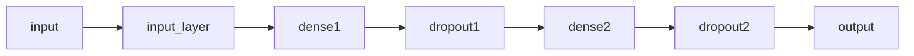

                 


# AI辅助的投资组合尾部风险度量

## 关键词：AI，投资组合，尾部风险，风险管理，机器学习，深度学习，金融

## 摘要：  
本文探讨如何利用人工智能技术辅助投资组合的尾部风险度量。通过分析尾部风险的定义、特征及传统度量方法的局限性，结合机器学习算法，提出了一种基于深度学习的投资组合尾部风险预测模型。文章详细讲解了该模型的算法原理、系统架构设计及实际应用案例，展示了AI在金融风险管理中的强大能力。

---

# 第一部分: AI辅助的投资组合尾部风险度量基础

---

## 第1章: 投资组合尾部风险概述

### 1.1 尾部风险的定义与特征  
尾部风险是指投资组合在极端市场条件下可能出现的、超出正常波动范围的损失。其主要特征包括：  
1. **罕见性**：尾部事件发生的概率较低，但影响巨大。  
2. **不可预测性**：尾部事件往往难以用传统统计方法预测。  
3. **非线性损失**：尾部风险可能导致投资组合的损失呈非线性增长。  

### 1.2 投资组合风险度量的背景  
传统风险度量方法（如VaR、CVaR）在处理尾部风险时存在以下问题：  
1. **假设不足**：传统方法假设资产回报分布是已知的，但在实际中，市场波动可能远超假设范围。  
2. **忽略尾部相关性**：传统方法难以捕捉不同资产之间的尾部相关性。  
3. **计算复杂性**：对于复杂的投资组合，尾部风险的计算需要强大的计算能力。  

### 1.3 AI辅助尾部风险度量的必要性  
AI技术，特别是机器学习，能够通过大数据分析发现非线性关系，捕捉尾部事件的潜在信号。结合深度学习和强化学习，AI可以为投资组合管理提供更精准的尾部风险预测和优化策略。

---

# 第二部分: 尾部风险度量的核心概念与联系

---

## 第2章: 尾部风险度量的核心概念

### 2.1 尾部风险的统计模型  
尾部风险的统计模型主要包括：  
1. **历史模拟法**：基于历史数据模拟极端事件的发生概率。  
2. **方差-协方差法**：假设资产回报分布为正态分布，计算投资组合的风险值。  
3. **蒙特卡罗模拟法**：通过随机抽样模拟极端市场条件下的投资组合表现。  

### 2.2 尾部风险的机器学习模型  
机器学习在尾部风险度量中的应用主要包括：  
1. **聚类分析**：识别具有相似风险特征的资产，捕捉尾部事件的潜在关联性。  
2. **深度学习模型**：利用神经网络提取高维特征，预测尾部事件的发生概率。  
3. **强化学习**：通过模拟投资组合在不同市场条件下的表现，优化风险控制策略。  

### 2.3 尾部风险与投资组合优化的关系  
尾部风险是投资组合优化的重要考量因素。通过识别和量化尾部风险，投资者可以调整资产配置策略，降低极端市场条件下的潜在损失。

---

## 第3章: 基于深度学习的尾部风险预测模型

### 3.1 模型原理  
深度学习模型通过多层神经网络提取资产回报的非线性特征，预测投资组合在极端市场条件下的表现。模型输入包括资产的历史回报数据、市场情绪指标等，输出为尾部风险的概率值。

### 3.2 模型实现  
#### 3.2.1 数据预处理  
- 数据清洗：去除异常值和缺失值。  
- 数据归一化：将资产回报数据归一化处理，确保模型输入一致。  

#### 3.2.2 神经网络架构  


#### 3.2.3 模型训练  
使用均方误差（MSE）作为损失函数，Adam优化器进行训练。  

#### 3.2.4 模型评估  
通过ROC-AUC曲线评估模型的分类性能，验证其在尾部风险预测中的准确性。  

---

## 第4章: 系统架构设计

### 4.1 系统功能模块  
- 数据采集模块：实时采集市场数据和资产回报信息。  
- 模型训练模块：基于历史数据训练深度学习模型。  
- 风险评估模块：根据模型预测结果生成投资组合的尾部风险报告。  

### 4.2 系统架构设计  


---

## 第5章: 项目实战

### 5.1 环境安装  
安装Python、TensorFlow、Pandas等必要的库。  

### 5.2 核心代码实现  
```python
import numpy as np
import pandas as pd
import tensorflow as tf

# 数据加载
data = pd.read_csv('portfolio_returns.csv')

# 数据预处理
X = data.iloc[:, 1:-1].values
y = data.iloc[:, -1].values

# 模型构建
model = tf.keras.Sequential([
    tf.keras.layers.Dense(64, activation='relu'),
    tf.keras.layers.Dropout(0.2),
    tf.keras.layers.Dense(32, activation='relu'),
    tf.keras.layers.Dropout(0.2),
    tf.keras.layers.Dense(1, activation='sigmoid')
])

# 模型训练
model.compile(optimizer='adam', loss='binary_crossentropy', metrics=['accuracy'])
model.fit(X, y, epochs=100, batch_size=32)
```

### 5.3 案例分析  
以某投资组合为例，使用上述模型预测其在极端市场条件下的尾部风险概率，并根据预测结果优化资产配置策略。  

---

## 第6章: 最佳实践与总结

### 6.1 最佳实践  
- 定期更新模型，确保其适应市场变化。  
- 结合多种模型进行风险评估，提高预测准确性。  

### 6.2 小结  
本文详细介绍了AI辅助的投资组合尾部风险度量方法，展示了如何利用深度学习技术提高风险预测的准确性。

---

## 第7章: 注意事项与拓展阅读

### 7.1 注意事项  
- 尾部风险预测模型的准确性依赖于历史数据的质量和模型的泛化能力。  
- 在实际应用中，需结合市场专家的判断，避免过度依赖模型。  

### 7.2 拓展阅读  
- 《机器学习在金融中的应用》  
- 《深度学习与投资组合优化》  

---

作者：AI天才研究院 & 禅与计算机程序设计艺术

