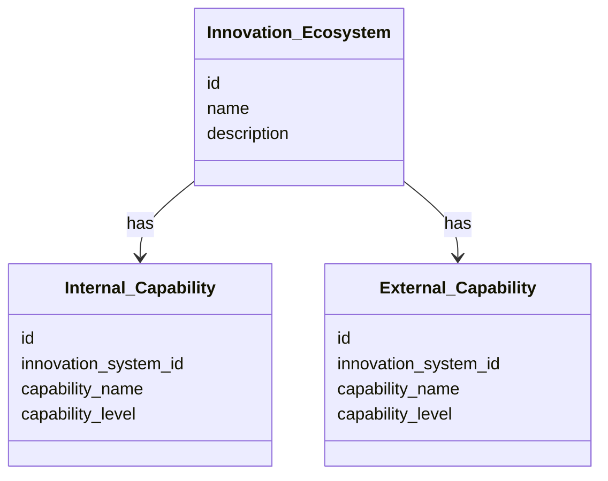
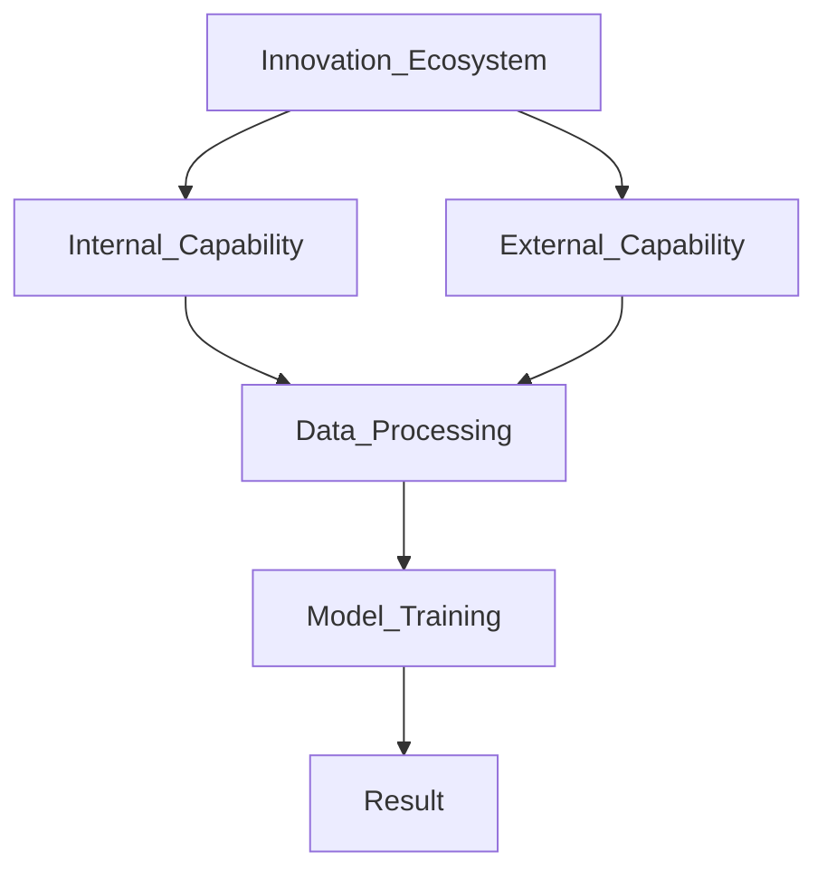

                 


# AI驱动的企业创新生态系统评估：内外部创新能力量化模型

## 关键词：人工智能，企业创新，创新能力量化，内外部能力，生态系统评估

## 摘要

本文提出了一种基于人工智能的企业创新生态系统评估模型，重点分析了企业内部和外部创新能力的量化方法。通过构建数学模型和算法，结合实际案例分析，展示了如何利用AI技术优化企业创新管理。文章详细探讨了模型的构建过程、系统架构设计以及项目实现，为企业管理者和技术人员提供了实践指导。

---

## 第一部分：背景介绍

### 第1章：企业创新生态系统概述

#### 1.1 问题背景

在数字化转型的推动下，企业创新已成为核心竞争力的关键。传统企业创新模式依赖经验判断，难以量化和优化。AI技术的引入为企业创新评估提供了新思路。

#### 1.2 问题描述

创新能力难以量化，导致企业难以系统性改进。内部创新能力受限于组织结构和资源分配，外部创新能力受到市场变化和合作伙伴的影响。传统评估方法缺乏动态性和数据支持。

#### 1.3 问题解决

通过AI技术，构建内外部创新能力量化模型，将创新活动转化为可量化的指标，为企业管理者提供数据支持，优化创新资源配置。

#### 1.4 边界与外延

模型适用于企业内部和外部创新活动评估，不涵盖企业其他非创新活动。模型边界明确，仅聚焦于创新生态系统的核心要素。

#### 1.5 概念结构与核心要素

创新生态系统由内部能力、外部能力、创新成果和创新环境构成。内部能力包括研发能力和组织能力，外部能力包括合作伙伴和市场环境，创新成果包括产品创新和服务创新。

---

## 第二部分：核心概念与联系

### 第2章：内外部创新能力量化

#### 2.1 核心概念原理

内外部创新能力量化模型通过数据采集、特征提取和模型训练，将创新活动转化为量化指标。模型涵盖内部数据和外部数据，结合AI技术进行分析。

#### 2.2 内外部能力对比

| 特征 | 内部能力 | 外部能力 |
|------|----------|----------|
| 数据来源 | 企业内部数据 | 市场数据、合作伙伴数据 |
| 影响因素 | 组织结构、资源分配 | 市场趋势、合作伙伴关系 |
| 评估指标 | R&D投入、员工创新性 | 合作伙伴数量、市场反馈 |

#### 2.3 ER实体关系图

```mermaid
er
actor Innovation_Ecosystem {
  schema this
}
class Innovation_Ecosystem {
  id
  name
  description
}
class Internal_Capability {
  id
  innovation_system_id
  capability_name
  capability_level
}
class External_Capability {
  id
  innovation_system_id
  capability_name
  capability_level
}
```

---

## 第三部分：算法原理讲解

### 第3章：算法原理与实现

#### 3.1 数据预处理

```python
import pandas as pd

# 加载数据
data = pd.read_csv('innovation.csv')

# 数据清洗
data.dropna(inplace=True)
data = pd.get_dummies(data)
```

#### 3.2 特征提取

```python
# 特征选择
features = data[['R&D_investment', 'employee_skills', 'market_share']]
target = data['innovation_score']
```

#### 3.3 模型训练

```python
from sklearn.ensemble import RandomForestRegressor
from sklearn.metrics import mean_squared_error

# 训练模型
model = RandomForestRegressor(n_estimators=100)
model.fit(features, target)

# 评估模型
预测 = model.predict(features)
print('均方误差:', mean_squared_error(target, 预测))
```

---

## 第四部分：系统分析与架构设计方案

### 第4章：系统架构设计

#### 4.1 领域模型



#### 4.2 系统架构图



---

## 第五部分：项目实战

### 第5章：项目实现与案例分析

#### 5.1 环境安装

安装Python和相关库，如scikit-learn、pandas、mermaid。

#### 5.2 核心代码实现

```python
import pandas as pd
from sklearn.ensemble import RandomForestRegressor
from sklearn.metrics import mean_squared_error

# 加载数据
data = pd.read_csv('innovation.csv')

# 数据预处理
data = data.dropna().drop_duplicates()
data = pd.get_dummies(data)

# 特征选择
features = data[['R&D_investment', 'employee_skills', 'market_share']]
target = data['innovation_score']

# 训练模型
model = RandomForestRegressor(n_estimators=100)
model.fit(features, target)

# 评估模型
预测 = model.predict(features)
print(f'均方误差: {mean_squared_error(target, 预测):.2f}')
```

#### 5.3 案例分析

以某科技公司为例，分析其内部和外部创新能力，应用模型进行预测和优化。

---

## 第六部分：最佳实践与总结

### 第6章：总结与展望

#### 6.1 最佳实践

数据质量是模型准确性的重要因素，建议企业收集高质量的内外部数据。模型定期更新以适应市场变化。

#### 6.2 小结

本文构建了一个基于AI的企业创新生态系统评估模型，提供了理论和实践指导，帮助企业优化创新能力。

#### 6.3 注意事项

模型结果仅供参考，需结合企业实际情况进行调整。数据隐私和安全问题需特别注意。

#### 6.4 拓展阅读

建议进一步研究动态评估模型和实时监测系统，探索AI在企业创新管理中的更多应用。

---

## 作者信息

作者：AI天才研究院 & 禅与计算机程序设计艺术

