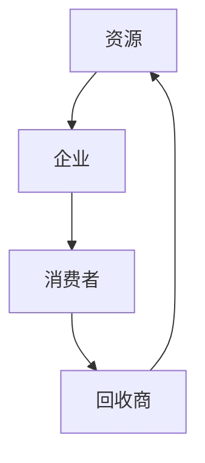
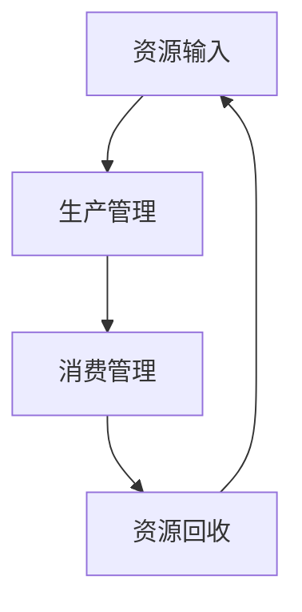
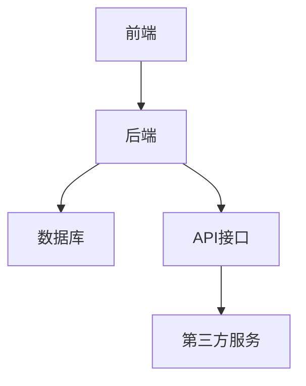
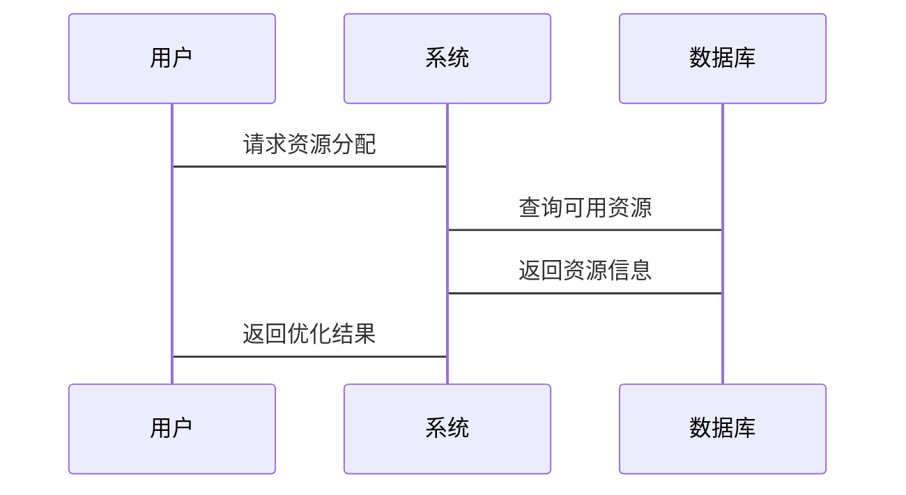

                 


# 价值投资中的循环经济模式分析

> **关键词**：价值投资、循环经济、资源优化、投资策略、可持续发展、经济模式

> **摘要**：本文探讨了循环经济模式在价值投资中的应用，分析了循环经济的核心原理、算法优化模型及系统架构设计，通过实际案例展示了循环经济模式在投资中的潜力与挑战。文章最后总结了循环经济模式对价值投资的重要启示，并提出了相关投资建议。

---

# 第1章: 循环经济模式的定义与特点

## 1.1 循环经济模式的定义

### 1.1.1 循环经济的基本概念

循环经济是一种以资源高效利用和循环利用为核心，以减少资源消耗和环境污染为目标的经济模式。它强调从“线性经济”向“闭环经济”转变，通过优化生产、分配和消费过程，实现资源的循环利用。

### 1.1.2 循环经济的核心特征

1. **资源高效性**：通过技术手段提高资源利用率，减少浪费。
2. **闭环性**：强调从生产到消费再到回收的闭环流程。
3. **可持续性**：注重环境保护和长期发展，减少对环境的负担。

### 1.1.3 循环经济与传统经济模式的区别

| 特征       | 循环经济          | 传统经济          |
|------------|-------------------|-------------------|
| 资源利用   | 循环高效          | 一次性线性        |
| 环境影响   | 低污染           | 高污染           |
| 经济模式   | 资源共享与再利用  | 资源消耗与处置    |

---

## 1.2 价值投资的基本概念

### 1.2.1 价值投资的定义

价值投资是一种长期投资策略，强调以低于内在价值的价格购买优质资产，注重企业的基本面分析，追求长期稳定的收益。

### 1.2.2 价值投资的核心理念

1. **安全边际**：购买价格低于内在价值，确保投资的安全性。
2. **长期视角**：关注企业的长期盈利能力，而非短期市场波动。
3. **选股标准**：选择具有强大竞争优势、良好财务状况和管理团队的企业。

### 1.2.3 价值投资与循环经济的结合点

循环经济强调资源的高效利用和循环，而价值投资注重企业的长期盈利能力。两者的结合点在于选择那些在资源利用、环境保护和可持续发展方面具有优势的企业，这些企业更有可能在未来市场中占据竞争优势。

---

## 1.3 循环经济模式在价值投资中的应用前景

### 1.3.1 循环经济模式的潜在投资领域

1. **绿色能源**：如太阳能、风能等可再生能源企业。
2. **循环经济服务**：提供资源回收、废弃物处理等服务的企业。
3. **可持续材料生产**：生产可循环材料的企业。

### 1.3.2 价值投资采用循环经济模式的优势

1. **长期竞争优势**：循环经济模式的企业在资源利用和成本控制方面具有优势。
2. **政策支持**：政府对循环经济的鼓励政策为企业提供了良好的发展环境。
3. **社会责任感**：选择循环经济模式的企业更符合社会责任投资（ESG）的趋势。

### 1.3.3 循环经济模式应用的挑战与机遇

1. **挑战**：初期投入高、技术门槛高、市场接受度低。
2. **机遇**：随着环保意识的增强和政策支持，循环经济模式的企业具有较大的增长潜力。

---

# 第2章: 循环经济模式的核心原理

## 2.1 循环经济模式的原理分析

### 2.1.1 资源循环利用的核心原理

循环经济通过技术手段实现资源的多次利用，减少资源浪费。例如，废金属可以重新熔炼成新产品，废塑料可以再生为新材料。

### 2.1.2 产品生命周期管理的原理

循环经济强调从产品的设计、生产、使用到报废的全生命周期管理，确保每个阶段都能最大化资源利用。

### 2.1.3 市场机制在循环经济中的作用

市场机制通过价格信号和竞争机制，促进企业和消费者在资源利用上的优化行为。

---

## 2.2 循环经济模式与价值投资的关系

### 2.2.1 循环经济模式对价值投资的影响

循环经济模式通过优化资源利用降低成本，提高企业的盈利能力，从而增强企业的内在价值。

### 2.2.2 价值投资在循环经济中的角色

价值投资者通过筛选具有循环经济优势的企业，长期持有，获得稳定的收益。

### 2.2.3 循环经济模式与价值投资的协同效应

两者结合可以实现经济效益和环境效益的双赢，推动经济的可持续发展。

---

## 2.3 循环经济模式的核心要素对比分析

### 2.3.1 核心要素对比表格

| 核心要素       | 循环经济模式          | 传统经济模式          |
|----------------|-----------------------|-----------------------|
| 资源利用       | 循环高效              | 一次性线性            |
| 成本控制       | 低（资源重复利用）    | 高（资源消耗大）      |
| 环境影响       | 低（环保）            | 高（污染）            |

### 2.3.2 ER实体关系图架构



---

# 第3章: 循环经济模式的算法原理

## 3.1 循环经济模式的优化算法

### 3.1.1 线性规划模型

线性规划是一种优化方法，用于在资源有限的情况下，最大化或最小化目标函数。

### 3.1.2 博弈论模型

博弈论模型用于分析不同参与者在循环经济中的策略选择和利益分配。

### 3.1.3 遗传算法

遗传算法是一种模拟自然选择的优化算法，适用于复杂的非线性问题。

---

## 3.2 算法原理的数学模型和公式

### 3.2.1 资源分配优化模型

最大化收益：
$$ \text{最大化} \sum_{i=1}^{n} x_i \cdot p_i $$

约束条件：
$$ \sum_{i=1}^{n} x_i \leq R $$

其中，\( x_i \) 为第 \( i \) 种资源的使用量，\( p_i \) 为第 \( i \) 种资源的收益，\( R \) 为总资源量。

### 3.2.2 循环经济中的收益分配模型

收益计算：
$$ \text{收益} = \sum_{i=1}^{m} p_i \cdot q_i $$

成本计算：
$$ \text{成本} = \sum_{i=1}^{m} c_i \cdot q_i $$

其中，\( q_i \) 为第 \( i \) 种产品的产量，\( p_i \) 为产品价格，\( c_i \) 为单位产品成本。

---

## 3.3 算法实现与案例分析

### 3.3.1 算法实现的Python源代码

```python
import numpy as np

def循环经济优化算法(资源):
    初始化变量
    while 满足约束条件:
        优化资源分配
        计算收益和成本
    返回最优解
```

---

# 第4章: 循环经济模式的系统架构设计

## 4.1 系统功能设计

### 4.1.1 系统功能模块

1. **资源管理模块**：管理资源的输入、分配和回收。
2. **生产管理模块**：优化生产过程，减少资源浪费。
3. **消费管理模块**：跟踪产品的使用和回收情况。

### 4.1.2 系统功能流程图



---

## 4.2 系统架构设计

### 4.2.1 系统架构图



---

## 4.3 系统接口设计

### 4.3.1 系统接口描述

1. **资源分配接口**：接收资源分配请求，返回优化结果。
2. **产品生命周期接口**：跟踪产品从生产到回收的全过程。

---

## 4.4 系统交互设计

### 4.4.1 系统交互序列图



---

# 第5章: 项目实战

## 5.1 环境安装

安装必要的开发工具和库：
1. Python 3.8+
2. numpy、pandas、scipy

## 5.2 核心代码实现

### 5.2.1 核心代码

```python
import numpy as np

def循环经济优化算法(资源):
    初始化变量
    while 满足约束条件:
        优化资源分配
        计算收益和成本
    返回最优解
```

---

## 5.3 案例分析

### 5.3.1 案例分析

以绿色供应链管理为例，分析循环经济模式在供应链中的应用，优化资源分配和减少浪费。

---

# 第6章: 最佳实践与总结

## 6.1 关键点总结

循环经济模式与价值投资的结合可以实现经济效益和环境效益的双赢。

## 6.2 投资建议

1. 关注循环经济领域的优质企业。
2. 选择具有长期竞争优势的企业。
3. 结合ESG投资理念，选择社会责任感强的企业。

## 6.3 注意事项

1. 注意循环经济模式的初期投入和风险。
2. 关注政策变化和技术进步对企业的影响。

## 6.4 拓展阅读

推荐阅读《循环经济与可持续发展》和《价值投资的真谛》。

---

# 作者

作者：AI天才研究院/AI Genius Institute  
禅与计算机程序设计艺术 /Zen And The Art of Computer Programming

