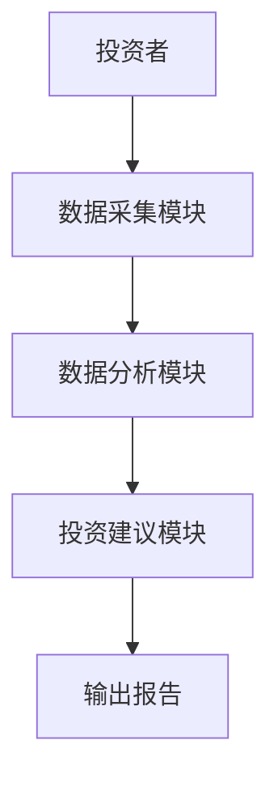
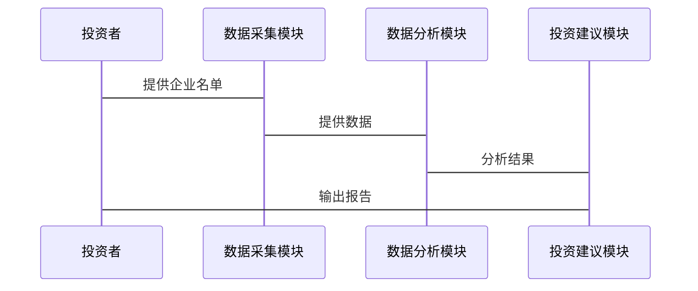

                 


# 价值投资中的新一代柔性显示技术前景

---

## 关键词
- 价值投资、柔性显示技术、OLED、投资分析、技术趋势

---

## 摘要
本文探讨了价值投资在新一代柔性显示技术领域的应用前景，分析了柔性显示技术的核心原理、市场趋势、投资策略及其与价值投资的关联。通过技术分析、数学建模和实际案例，本文揭示了柔性显示技术的投资价值，并为投资者提供了系统的分析方法和决策支持。

---

## 第一部分：背景介绍

### 第1章：价值投资与柔性显示技术的融合

#### 1.1 价值投资的核心概念
- 1.1.1 价值投资的定义与核心理念
  - 价值投资：通过分析企业的基本面，寻找市场价格低于内在价值的投资机会。
  - 核心理念：安全边际、长期持有、优质企业。
- 1.1.2 柔性显示技术的定义与基本原理
  - 柔性显示技术：指显示屏幕具有柔韧性的显示技术，如OLED、LCD的柔性化改造。

#### 1.2 价值投资与柔性显示技术的融合背景
- 1.2.1 科技投资的兴起
  - 科技创新推动经济发展，科技企业在资本市场中的重要性日益增加。
- 1.2.2 柔性显示技术在投资中的潜力
  - 柔性显示技术广泛应用于智能手机、可穿戴设备、汽车电子等领域，市场前景广阔。

#### 1.3 问题背景与问题描述
- 1.3.1 柔性显示技术的市场现状与挑战
  - 市场规模增长迅速，但技术壁垒高，竞争激烈。
- 1.3.2 价值投资在科技领域的应用难点
  - 技术更新快，企业风险高，如何准确评估企业价值是挑战。

#### 1.4 问题解决与边界
- 1.4.1 柔性显示技术的投资价值评估方法
  - 综合技术、市场、财务等因素，建立系统的评估框架。
- 1.4.2 价值投资与技术分析的结合边界
  - 以技术分析为基础，结合财务分析和市场分析，构建综合的投资策略。

---

## 第二部分：柔性显示技术的核心原理

### 第2章：柔性显示技术的核心原理

#### 2.1 柔性显示技术的分类与特点
- 2.1.1 OLED显示技术
  - 有机发光二极管（OLED）：自发光、响应快、柔性可弯折。
  - 优缺点：高对比度、广视角，但存在烧屏风险和寿命问题。
- 2.1.2 LCD显示技术的柔性化改造
  - 液晶显示器（LCD）：通过封装和基板改造实现柔性显示。
  - 优缺点：成本低，但柔性性能不如OLED。

#### 2.2 柔性显示技术的关键材料与工艺
- 2.2.1 柔性基板材料
  - 常用材料：聚酰亚胺（PI）、金属氧化物等。
  - 工艺特点：耐高温、柔韧性好、导电性佳。
- 2.2.2 OLED发光材料与工艺
  - 发光材料：有机材料（如聚芴类、金属有机化合物）。
  - 工艺特点：蒸镀、旋涂、印刷等。

#### 2.3 柔性显示技术的优缺点对比
- 2.3.1 与传统显示技术的对比分析
  - 表格对比：OLED vs LCD vs 柔性LCD。
  | 参数 | OLED | LCD | 柔性LCD |
  |------|------|------|---------|
  | 响应时间 | 快 | 中 | 快 |
  | 可视角 | 广 | 窄 | 广 |
  | 成本 | 高 | 中 | 高 |
  | 厚度 | 薄 | 厚 | 薄 |
- 2.3.2 柔性显示技术的成本与技术壁垒
  - 成本：材料昂贵，工艺复杂，设备投资大。
  - 技术壁垒：专利集中，技术门槛高。

---

## 第三部分：价值投资中的技术分析

### 第3章：柔性显示技术的市场趋势分析

#### 3.1 柔性显示技术的市场现状
- 3.1.1 全球柔性显示市场的规模与增长
  - 数据：2022年全球柔性显示市场规模约300亿美元，预计年增长率15%。
- 3.1.2 主要厂商的市场份额分析
  - 领先企业：三星、京东方、LG Display、华星光电。

#### 3.2 柔性显示技术的未来发展趋势
- 3.2.1 技术创新方向
  - 新材料：高迁移率氧化物半导体、新型 OLED 材料。
  - 工艺改进：提高柔韧性、降低功耗、延长寿命。
- 3.2.2 市场需求的驱动因素
  - 智能手机、可穿戴设备、汽车电子、折叠屏需求增长。

### 第4章：柔性显示技术的财务分析

#### 4.1 投资回报率分析
- 4.1.1 柔性显示技术的资本投入与回收期
  - 投资周期：5-7年，回报周期长，但市场潜力大。
- 4.1.2 企业的盈利能力和财务健康状况
  - 关键指标：毛利率、净利率、研发投入占比。

#### 4.2 行业竞争分析
- 4.2.1 行业集中度
  - 市场集中度高，头部企业占据主导地位。
- 4.2.2 企业的竞争优势
  - 技术创新、成本优势、客户资源。

---

## 第四部分：技术与投资的关联

### 第5章：技术成熟度与投资策略

#### 5.1 技术成熟度分析
- 5.1.1 OLED技术的成熟度
  - 应用成熟，但仍有技术瓶颈（如寿命、烧屏）。
- 5.1.2 柔性显示技术的成本优势
  - 规模效应降低成本，但前期投资大。

#### 5.2 投资策略与技术评估
- 5.2.1 基于技术成熟度的投资策略
  - 选择技术成熟、市场认可度高的企业。
- 5.2.2 基于成本结构的财务评估
  - 分析企业的成本控制能力，预测未来盈利能力。

---

## 第五部分：系统分析与架构设计

### 第6章：系统分析与架构设计

#### 6.1 系统功能设计
- 6.1.1 问题场景介绍
  - 投资者需要综合评估柔性显示技术企业的价值。
- 6.1.2 系统功能模块
  - 数据采集：市场数据、财务数据、技术数据。
  - 数据分析：技术评估、财务分析、市场预测。
  - 投资建议：基于分析结果，给出投资建议。

#### 6.2 系统架构设计
- 6.2.1 系统架构图（Mermaid）


#### 6.3 系统接口设计
- 6.3.1 数据接口
  - 数据来源：市场报告、企业财报、专利数据。
- 6.3.2 用户接口
  - 投资者输入需求，系统输出分析结果。

#### 6.4 系统交互设计
- 6.4.1 交互流程（Mermaid）


---

## 第六部分：项目实战

### 第7章：项目实战

#### 7.1 环境安装
- 7.1.1 开发环境
  - 数据分析工具：Python、Pandas、Matplotlib。
  - 投资分析工具：Excel、Financial models。

#### 7.2 核心实现源代码
- 7.2.1 数据分析代码（Python）
```python
import pandas as pd
import matplotlib.pyplot as plt

# 数据加载
df = pd.read_csv('flex_display_data.csv')

# 数据分析：计算企业毛利率
df['毛利率'] = (df['营业收入'] - df['营业成本']) / df['营业收入'] * 100

# 可视化：毛利率分布
plt.hist(df['毛利率'], bins=10, alpha=0.7)
plt.title('毛利率分布')
plt.show()
```

#### 7.3 代码应用解读与分析
- 7.3.1 数据分析结果解读
  - 某企业的毛利率高于行业平均水平，说明其成本控制能力强。
- 7.3.2 技术分析与投资建议
  - 结合技术趋势和财务数据，建议关注该企业。

#### 7.4 实际案例分析
- 7.4.1 案例介绍
  - 以京东方为例，分析其柔性显示技术的投资价值。
- 7.4.2 分析结果与建议
  - 京东方技术领先，财务健康，具有投资潜力。

#### 7.5 项目小结
- 7.5.1 项目总结
  - 系统分析方法有效，为企业价值评估提供支持。
- 7.5.2 注意事项
  - 数据准确性、模型合理性、投资风险。

---

## 第七部分：结论

### 第8章：结论与展望

#### 8.1 总结
- 8.1.1 技术前景
  - 柔性显示技术将继续推动显示行业的变革，市场潜力巨大。
- 8.1.2 投资策略
  - 价值投资者应关注技术创新能力强、财务健康的企业。

#### 8.2 未来展望
- 8.2.1 技术趋势
  - 新材料和新工艺将推动柔性显示技术进一步发展。
- 8.2.2 投资机会
  - 新兴市场和技术创新企业将带来新的投资机会。

#### 8.3 最佳实践 tips
- 8.3.1 投资者建议
  - 结合技术分析和财务分析，制定长期投资策略。
- 8.3.2 风险提示
  - 技术风险、市场风险、政策风险需重点关注。

---

## 作者：AI天才研究院/AI Genius Institute & 禅与计算机程序设计艺术/Zen And The Art of Computer Programming

