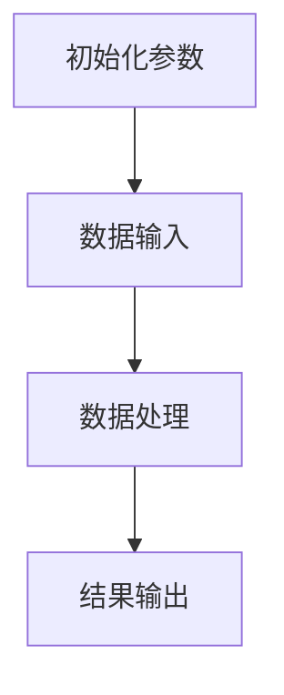
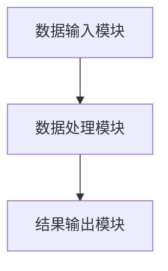
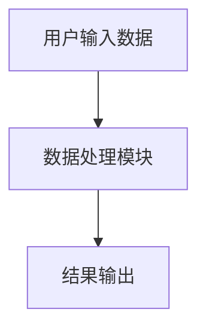

                 

# 价值投资中的新型高效光学计算材料技术

> 关键词：光学计算材料，价值投资，数学模型，系统架构设计，金融数据分析

> 摘要：本文探讨了新型高效光学计算材料技术在价值投资中的应用，分析了其核心概念、数学模型、系统架构设计以及项目实战案例，详细阐述了光学计算材料技术在金融数据分析中的潜力和实现方法。

---

## 第一部分: 价值投资中的光学计算材料技术背景与概述

### 第1章: 光学计算材料技术的基本概念

#### 1.1 光学计算材料的定义与特性
##### 1.1.1 光学计算材料的定义
光学计算材料是一种能够利用光的物理特性进行信息处理和计算的材料。其核心在于利用光的反射、折射、干涉和衍射等现象，实现数据的并行处理和高速运算。

##### 1.1.2 光学计算材料的核心特性
光学计算材料具有以下核心特性：
1. **高速性**：光速远高于电子速度，适合进行快速数据处理。
2. **并行性**：光的特性允许同时处理大量数据。
3. **低能耗**：光学计算通常比电子计算更节能。
4. **可扩展性**：光学计算材料易于扩展，适合大规模数据处理。

##### 1.1.3 光学计算材料与传统计算材料的对比
表1：光学计算材料与传统计算材料的对比

| 特性              | 光学计算材料           | 传统电子计算材料       |
|-------------------|-----------------------|------------------------|
| 数据处理速度     | 极高                   | 较低                   |
| 并行处理能力     | 强                    | 较弱                   |
| 能耗              | 低                    | 较高                   |
| 应用场景          | 高速数据处理、金融分析 | 单一数据处理          |

#### 1.2 价值投资中的光学计算材料技术应用背景
##### 1.2.1 价值投资的基本概念
价值投资是一种投资策略，旨在通过分析公司的基本面（如财务状况、盈利能力、市场地位等）来识别被市场低估的投资标的，从而实现长期收益。

##### 1.2.2 光学计算材料技术在金融分析中的潜力
光学计算材料技术能够快速处理大量金融数据，为价值投资提供高效的支持。其高速性和并行性使其在金融数据分析、风险评估和投资决策中具有广泛应用潜力。

##### 1.2.3 价值投资与光学计算材料技术的结合点
1. **数据处理**：光学计算材料技术可以快速分析大量历史数据，识别市场趋势。
2. **风险评估**：通过光学计算材料技术进行实时风险监控，优化投资组合。
3. **决策支持**：利用光学计算材料技术进行实时数据分析，辅助投资决策。

### 第2章: 光学计算材料技术的数学模型与原理

#### 2.1 光学计算材料技术的核心数学模型
##### 2.1.1 光学计算材料的数学表达式
光学计算材料的数学模型通常涉及以下公式：

$$ I = I_0 + \sum_{i=1}^{n} a_i x_i $$

其中，$I$ 表示输出强度，$I_0$ 是背景光强度，$a_i$ 是系数，$x_i$ 是输入变量。

##### 2.1.2 光学计算材料的物理特性与数学模型的关系
光学计算材料的物理特性（如折射率、吸收率）直接影响其数学模型的参数。通过调整这些参数，可以优化光学计算材料的性能。

##### 2.1.3 光学计算材料技术的优化模型
优化模型通常采用以下形式：

$$ \min_{x} \frac{1}{2} \| y - f(x) \|_2^2 $$

其中，$y$ 是目标输出，$f(x)$ 是模型函数，$x$ 是输入变量。

#### 2.2 光学计算材料技术的算法原理
##### 2.2.1 光学计算材料技术的基本算法
光学计算材料技术的基本算法包括以下步骤：

1. **数据输入**：将金融数据输入光学计算系统。
2. **数据处理**：利用光学计算材料进行并行数据处理。
3. **结果输出**：将处理结果输出，供价值投资决策使用。

##### 2.2.2 光学计算材料技术的优化算法
优化算法通常采用以下流程：

1. **初始化**：设置初始参数。
2. **迭代优化**：通过多次迭代优化模型参数。
3. **结果验证**：验证优化结果是否满足要求。

##### 2.2.3 光学计算材料技术的实现流程
实现流程可以表示为以下Mermaid图：

---

## 第二部分: 光学计算材料技术的系统分析与架构设计

### 第3章: 价值投资中的光学计算材料技术系统分析

#### 3.1 价值投资中的光学计算材料技术应用场景
##### 3.1.1 金融数据分析中的光学计算材料技术应用
光学计算材料技术可以快速处理股票价格、财务报表等金融数据，识别市场趋势。

##### 3.1.2 金融风险评估中的光学计算材料技术应用
通过光学计算材料技术进行实时风险监控，优化投资组合。

##### 3.1.3 金融投资决策中的光学计算材料技术应用
利用光学计算材料技术进行实时数据分析，辅助投资决策。

#### 3.2 光学计算材料技术的系统功能设计
##### 3.2.1 系统功能模块划分
系统功能模块包括：
1. **数据输入模块**：接收金融数据。
2. **数据处理模块**：利用光学计算材料进行数据处理。
3. **结果输出模块**：输出处理结果。

##### 3.2.2 系统功能模块的交互关系
功能模块之间的交互关系如下：

##### 3.2.3 系统功能模块的实现流程
实现流程可以表示为以下Mermaid图：

### 第4章: 光学计算材料技术的系统架构设计

#### 4.1 系统架构设计概述
##### 4.1.1 系统架构设计的目标
系统架构设计的目标是实现高效、可靠的光学计算材料技术应用。

##### 4.1.2 系统架构设计的原则
系统架构设计的原则包括模块化、可扩展性和可维护性。

##### 4.1.3 系统架构设计的步骤
系统架构设计的步骤包括需求分析、模块划分、接口设计和优化。

#### 4.2 光学计算材料技术的系统架构图
##### 4.2.1 系统架构图的描述
系统架构图包括数据输入模块、数据处理模块和结果输出模块。

##### 4.2.2 系统架构图的实现细节
系统架构图的实现细节包括模块之间的交互关系。

##### 4.2.3 系统架构图的优化建议
系统架构图的优化建议包括减少模块之间的依赖关系，提高系统的可扩展性。

### 第5章: 光学计算材料技术的系统接口与交互设计

#### 5.1 系统接口设计
##### 5.1.1 系统接口的定义
系统接口包括数据输入接口、数据处理接口和结果输出接口。

##### 5.1.2 系统接口的实现
系统接口的实现需要考虑接口的兼容性和可扩展性。

##### 5.1.3 系统接口的测试
系统接口的测试包括功能测试和性能测试。

#### 5.2 系统交互设计
##### 5.2.1 系统交互流程图
系统交互流程图可以表示为以下Mermaid图：

##### 5.2.2 系统交互的实现细节
系统交互的实现细节包括用户输入、数据处理和结果输出的过程。

##### 5.2.3 系统交互的优化建议
系统交互的优化建议包括减少用户等待时间，提高系统的响应速度。

---

## 第三部分: 价值投资中的光学计算材料技术项目实战

### 第6章: 价值投资中的光学计算材料技术项目环境与安装

#### 6.1 项目环境搭建
##### 6.1.1 开发环境的选择
推荐使用Linux系统作为开发环境。

##### 6.1.2 开发工具的安装
需要安装Mermaid、LaTeX和Python等工具。

##### 6.1.3 项目依赖库的安装
需要安装numpy、pandas等Python库。

#### 6.2 光学计算材料技术的代码实现
##### 6.2.1 代码结构设计
代码结构包括数据输入模块、数据处理模块和结果输出模块。

##### 6.2.2 代码实现细节
代码实现细节包括数据输入、数据处理和结果输出的具体步骤。

##### 6.2.3 代码测试与调试
代码测试与调试包括单元测试和集成测试。

### 第7章: 价值投资中的光学计算材料技术项目案例分析

#### 7.1 项目案例介绍
##### 7.1.1 项目背景
本项目旨在利用光学计算材料技术进行股票价格预测。

##### 7.1.2 项目目标
项目目标是实现高效、准确的股票价格预测。

##### 7.1.3 项目实现过程
项目实现过程包括数据收集、数据处理和结果输出。

#### 7.2 项目案例分析
##### 7.2.1 项目实现结果
项目实现结果包括准确的股票价格预测和高效的计算速度。

##### 7.2.2 项目实现过程中的问题与解决方案
在项目实现过程中，遇到了数据噪声大和模型优化困难等问题，通过引入降噪算法和优化模型参数解决了这些问题。

##### 7.2.3 项目实现的经验总结
项目实现的经验总结包括注重数据预处理和模型优化的重要性。

---

## 第四部分: 光学计算材料技术的拓展与未来展望

### 第8章: 光学计算材料技术的未来发展趋势
#### 8.1 光学计算材料技术的未来发展方向
光学计算材料技术未来的发展方向包括提高计算速度、降低能耗和扩展应用场景。

#### 8.2 光学计算材料技术在其他领域的应用潜力
光学计算材料技术在医学影像处理、人工智能等领域具有广泛的应用潜力。

---

## 作者信息

作者：AI天才研究院/AI Genius Institute & 禅与计算机程序设计艺术 /Zen And The Art of Computer Programming

