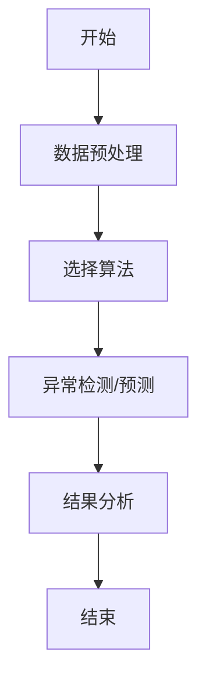
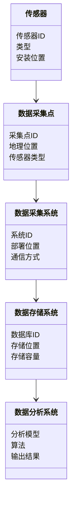
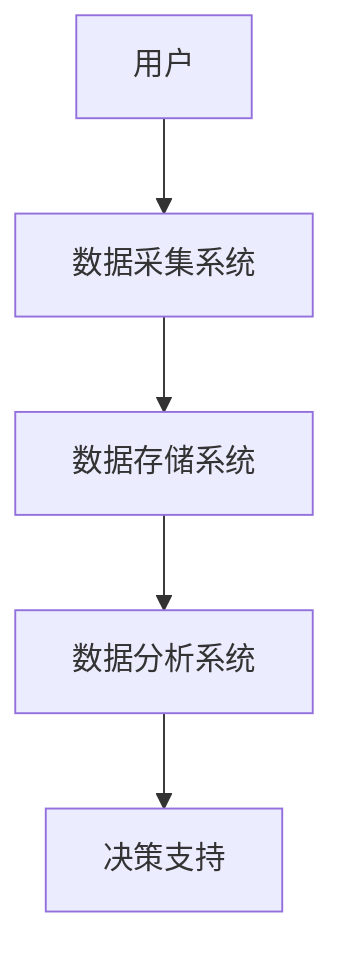

                 


# 价值投资中的智能城市地下管网监测系统分析

> 关键词：智能城市，地下管网监测系统，价值投资，传感器网络，数据驱动决策

> 摘要：智能城市地下管网监测系统作为智慧城市的重要组成部分，其建设和运营具有重要的投资价值。本文通过分析系统的构建、数据处理、算法原理和投资回报，探讨其在价值投资中的潜力和应用。

---

# 第一部分：智能城市地下管网监测系统背景与价值投资概述

## 第1章：智能城市地下管网监测系统概述

### 1.1 问题背景与现状

#### 1.1.1 城市地下管网的重要性
城市地下管网是城市的“生命线”，包括供水、供气、供电、通信等设施，支撑着城市的正常运行和居民的生活质量。然而，随着城市化进程的加快，地下管网的老化、损坏等问题日益突出，导致泄漏、断水、断电等事故频发，造成巨大的经济损失和安全隐患。

#### 1.1.2 当前管网监测中的问题与挑战
传统的地下管网监测主要依赖人工巡检和被动响应，存在以下问题：
- 数据采集不及时，无法实时监控管网状态；
- 缺乏数据分析能力，难以预测潜在风险；
- 维护成本高，效率低。

#### 1.1.3 智能监测系统的必要性
智能监测系统通过物联网、大数据和人工智能技术，实现对地下管网的实时监测、智能预警和优化管理，能够显著提高管网维护效率，降低运营成本，延长设施寿命。

---

## 第2章：价值投资与智能监测系统的结合

### 2.1 价值投资的基本原理
价值投资是一种投资策略，强调以低于内在价值的价格购买优质资产，长期持有，获得稳定的收益。在智能城市地下管网监测系统中，价值投资的核心在于识别具有长期增长潜力的项目，评估其经济效益和社会效益。

### 2.2 系统的核心目标
智能监测系统的建设目标包括：
- 实现管网状态的实时监测和异常预警；
- 提供数据驱动的决策支持，优化管网维护和运营；
- 提高城市防灾减灾能力，保障城市安全运行。

### 2.3 价值投资中的关键指标
在价值投资中，投资者需要关注以下几个关键指标：
- 投资回报率（ROI）：系统的建设和运营成本与预期收益的对比；
- 项目周期：从建设到收回投资所需的时间；
- 社会效益：对城市居民生活质量的提升和城市可持续发展的贡献。

---

# 第二部分：智能城市地下管网监测系统的核心概念与联系

## 第3章：系统核心概念与联系

### 3.1 系统的关键组成部分

#### 3.1.1 传感器网络
传感器网络是监测系统的感知层，负责采集管网中的各种数据，如压力、流量、温度、振动等。传感器节点通过无线通信技术（如LoRa、NB-IoT）将数据传输到数据采集中心。

#### 3.1.2 数据采集与传输系统
数据采集与传输系统（DCS）是监测系统的数据采集层，负责接收传感器数据，进行初步处理和存储，并将数据传输到云端或数据中心。

#### 3.1.3 数据存储与管理
数据存储与管理系统负责对海量监测数据进行存储、管理和查询。常用的技术包括关系型数据库（如MySQL）、NoSQL数据库（如MongoDB）和云存储（如AWS S3）。

#### 3.1.4 数据分析与决策支持
数据分析与决策支持系统是监测系统的智能层，利用大数据分析、机器学习等技术，对监测数据进行深度分析，生成预警信息和优化建议。

---

### 3.2 实体关系分析

#### 3.2.1 实体关系表格
| 实体 | 属性 | 关系 |
|------|------|------|
| 传感器 | 传感器ID、类型、安装位置 | 关联-属于 | 数据采集点 |
| 数据采集点 | 采集点ID、地理位置、传感器类型 | 关联-包含 | 数据采集系统 |
| 数据采集系统 | 系统ID、部署位置、通信方式 | 关联-管理 | 数据采集点 |
| 数据存储系统 | 数据库ID、存储位置、存储容量 | 关联-存储 | 数据 |
| 数据分析系统 | 分析模型、算法、输出结果 | 关联-处理 | 数据 |

---

## 第4章：算法原理与数学模型

### 4.1 监测数据的分析方法

#### 4.1.1 时间序列分析
时间序列分析用于预测管网状态的变化趋势，帮助投资者评估系统的长期价值。

#### 4.1.2 异常检测
异常检测算法（如基于统计的方法、基于机器学习的Isolation Forest）用于识别管网中的异常情况，提前预警潜在风险。

### 4.2 算法流程图



---

### 4.3 数学模型与公式

#### 4.3.1 时间序列预测模型
时间序列预测模型常用ARIMA（AutoRegressive Integrated Moving Average）模型：

$$ ARIMA(p, d, q) $$

其中，p为自回归阶数，d为差分阶数，q为移动平均阶数。

#### 4.3.2 异常检测模型
基于统计的异常检测方法：

$$ Z = \frac{x - \mu}{\sigma} $$

其中，Z为标准化分数，$\mu$为均值，$\sigma$为标准差。

---

## 第5章：系统分析与架构设计

### 5.1 系统架构设计

#### 5.1.1 领域模型类图



#### 5.1.2 系统架构图



---

## 第6章：项目实战与最佳实践

### 6.1 环境安装与系统实现

#### 6.1.1 环境安装
- 操作系统：Linux/Windows/MacOS
- 数据库：MySQL/PostgreSQL
- 开发工具：Python（版本3.8及以上）
- 依赖库：pandas, numpy, scikit-learn, matplotlib

#### 6.1.2 系统核心实现代码

```python
import pandas as pd
from sklearn.ensemble import IsolationForest
import matplotlib.pyplot as plt

# 数据加载
data = pd.read_csv('管网数据.csv')

# 数据预处理
data = data.dropna()

# 异常检测
model = IsolationForest(n_estimators=100, random_state=42)
model.fit(data[['压力', '流量']])
data['异常'] = model.predict(data[['压力', '流量']])

# 可视化
plt.scatter(data['时间'], data['压力'], c=data['异常'], cmap='viridis')
plt.xlabel('时间')
plt.ylabel('压力')
plt.show()
```

---

## 第7章：总结与展望

### 7.1 项目小结
智能城市地下管网监测系统通过实时监测、数据分析和智能决策，显著提升了管网维护效率，降低了运营成本，具有较高的投资价值。

### 7.2 投资建议
- 关注技术成熟、市场前景广阔的监测系统项目；
- 评估项目的 ROI 和回收周期；
- 结合社会效益，选择具有可持续发展价值的项目。

### 7.3 展望
未来，随着人工智能和大数据技术的不断发展，智能监测系统将更加智能化、自动化，为价值投资提供更多的机会和挑战。

---

作者：AI天才研究院/AI Genius Institute & 禅与计算机程序设计艺术 /Zen And The Art of Computer Programming

