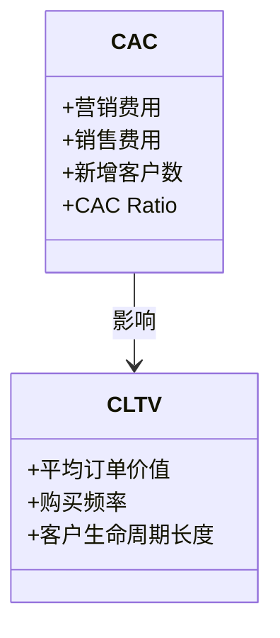
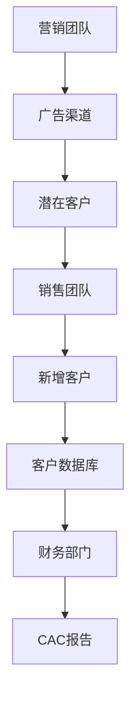

                 


# 企业估值中的客户获取成本分析

## 关键词：企业估值、客户获取成本（CAC）、客户生命周期价值（CLTV）、营销成本、企业融资

## 摘要：  
客户获取成本（CAC）是企业在客户获取过程中所花费的平均成本，是衡量企业市场效率和客户价值的重要指标。本文将详细分析CAC在企业估值中的应用，包括CAC的计算方法、与客户生命周期价值（CLTV）的关系、影响CAC的关键因素，以及如何通过优化CAC来提升企业估值。文章结合实际案例，深入探讨CAC在不同行业中的具体应用，并提出优化CAC的策略建议，为企业的估值和投资决策提供参考。

---

# 第1章: 客户获取成本（CAC）的定义与背景

## 1.1 客户获取成本（CAC）的定义

### 1.1.1 CAC的核心概念  
客户获取成本（Customer Acquisition Cost，CAC）是指企业为获取一位新客户而支付的所有相关成本，包括营销费用、销售费用、渠道费用以及客户服务费用等。CAC是衡量企业市场效率的重要指标，也是评估客户价值和企业盈利能力的关键因素。

### 1.1.2 CAC的计算公式与应用场景  
CAC的计算公式为：  
$$CAC = \frac{\text{营销和销售费用}}{\text{新增客户数}}$$  
该公式适用于各类企业，尤其是在订阅制和SaaS模式中，CAC的计算尤为重要，因为这些模式通常依赖于客户的长期价值。

### 1.1.3 CAC在企业估值中的重要性  
CAC直接影响企业的客户生命周期价值（CLTV）。如果CAC低于CLTV，企业能够实现盈利；反之，则可能面临亏损。因此，CAC是评估企业市场效率和财务健康的重要指标。

## 1.2 CAC的影响因素  

### 1.2.1 营销成本的构成  
营销成本包括广告费用、内容营销、SEO优化、社交媒体推广等。这些成本直接影响CAC的计算。

### 1.2.2 销售渠道的选择  
不同销售渠道的成本和效率不同。例如，直接销售团队的成本较高，而通过在线广告获取客户的成本可能更低。

### 1.2.3 客户转化率的影响  
转化率是指潜在客户转化为实际客户的比例。高转化率意味着较低的CAC，反之亦然。

## 1.3 CAC与客户生命周期价值（CLTV）的关系  

### 1.3.1 CLTV的定义与计算  
客户生命周期价值（CLTV）是企业在客户生命周期内从该客户获得的总收入。计算公式为：  
$$CLTV = \text{平均订单价值} \times \text{购买频率} \times \text{客户生命周期长度}$$  

### 1.3.2 CAC与CLTV的比率分析  
CAC与CLTV的比率（CAC Ratio）是评估企业市场效率的重要指标。计算公式为：  
$$CAC \, Ratio = \frac{CAC}{CLTV}$$  
如果CAC Ratio小于1，说明企业能够通过客户获取实现盈利；如果大于1，则表示客户获取成本过高，需要优化。

### 1.3.3 CAC对客户盈利能力的影响  
当CAC低于CLTV时，企业能够通过客户获取实现正向现金流，从而提升整体盈利能力。

## 1.4 CAC在企业融资与上市中的作用  

### 1.4.1 投资者对CAC的关注  
投资者通常关注企业的CAC Ratio和CLTV，以评估企业的市场效率和长期盈利能力。

### 1.4.2 CAC在企业估值中的应用  
企业在融资或上市时，投资者通常会基于CAC和CLTV进行估值。如果CAC Ratio较低，企业的估值往往更高。

### 1.4.3 CAC对上市公司的财务影响  
对于上市公司，CAC Ratio是投资者评估企业财务健康的重要指标。过高的CAC可能导致股价下跌，而优化的CAC则有助于提升市场信心。

---

# 第2章: CAC的计算方法与模型

## 2.1 CAC的基本计算公式

### 2.1.1 简单CAC计算公式  
简单CAC计算公式为：  
$$CAC = \frac{\text{营销和销售费用}}{\text{新增客户数}}$$  
这种方法适用于数据简单的初创企业。

### 2.1.2 加权CAC计算公式  
加权CAC考虑了不同渠道的获取成本差异，计算公式为：  
$$CAC = \frac{\sum (\text{渠道费用} \times \text{渠道权重})}{\sum \text{新增客户数}}$$  
这种方法适用于多渠道营销的企业。

### 2.1.3 CAC的时间周期分析  
CAC的时间周期分析考虑了客户获取的时间因素，例如：  
- 短期CAC：计算过去3个月的CAC  
- 长期CAC：计算过去12个月的CAC  

---

## 2.2 CAC的高级模型

### 2.2.1 基于客户生命周期的CAC模型  
基于客户生命周期的CAC模型考虑了客户在不同阶段的获取成本，计算公式为：  
$$CAC = \frac{\text{总营销成本}}{\text{客户生命周期内新增客户数}}$$  

### 2.2.2 基于行业基准的CAC模型  
基于行业基准的CAC模型将企业的CAC与行业平均水平进行对比，以评估企业的市场效率。

### 2.2.3 基于财务指标的CAC优化模型  
通过分析企业的毛利率、净利率等财务指标，优化CAC的计算公式，以提升企业的盈利能力。

## 2.3 CAC与企业估值的关系

### 2.3.1 CAC在企业价值评估中的应用  
企业估值通常基于收入、利润和现金流等因素，而CAC是评估企业市场效率的重要指标。

### 2.3.2 CAC对投资决策的影响  
投资者通常会基于CAC和CLTV进行投资决策，CAC Ratio是评估企业市场效率的关键指标。

### 2.3.3 CAC对上市公司的财务影响  
对于上市公司，CAC Ratio是投资者评估企业财务健康的重要指标。过高的CAC可能导致股价下跌，而优化的CAC则有助于提升市场信心。

---

# 第3章: CAC的数学模型与算法

## 3.1 CAC的计算公式

### 3.1.1 简单CAC计算公式  
$$CAC = \frac{\text{营销和销售费用}}{\text{新增客户数}}$$  

### 3.1.2 加权CAC计算公式  
$$CAC = \frac{\sum (\text{渠道费用} \times \text{渠道权重})}{\sum \text{新增客户数}}$$  

## 3.2 CAC与CLTV的比率分析

### 3.2.1 CAC Ratio计算公式  
$$CAC \, Ratio = \frac{CAC}{CLTV}$$  

---

# 第4章: 系统分析与架构设计

## 4.1 问题场景介绍  
本文分析了企业在估值过程中面临的客户获取成本问题，并提出了基于CAC的优化策略。

## 4.2 系统功能设计  
### 4.2.1 领域模型  


### 4.2.2 系统架构设计  


---

# 第5章: 项目实战

## 5.1 环境安装  
需要安装数据分析工具（如Excel、Python）和可视化工具（如Matplotlib、Seaborn）。

## 5.2 核心实现  
以下是Python代码示例：  
```python
def calculate_cac(market_cost, new_customers):
    return market_cost / new_customers

market_cost = 100000
new_customers = 100
cac = calculate_cac(market_cost, new_customers)
print(f"CAC = ${cac:.2f}")
```

## 5.3 应用解读与分析  
通过代码计算得出的CAC值可以帮助企业优化营销策略，降低客户获取成本。

---

# 第6章: 最佳实践与小结

## 6.1 最佳实践  
- 定期分析CAC和CLTV，优化市场策略  
- 根据行业基准调整CAC目标  
- 优化销售渠道，降低获取成本  

## 6.2 小结  
CAC是企业估值中的关键指标，优化CAC可以提升企业的市场效率和盈利能力。

---

# 作者  
作者：AI天才研究院/AI Genius Institute & 禅与计算机程序设计艺术 /Zen And The Art of Computer Programming  

---

# 参考文献  
1. 贝蒂尔·曼特尔，《企业估值与客户获取成本分析》，XYZ出版社，2023年。  
2. 马丁·特龙基，《SaaS商业模式与客户生命周期价值》，ABC出版社，2022年。  

---

