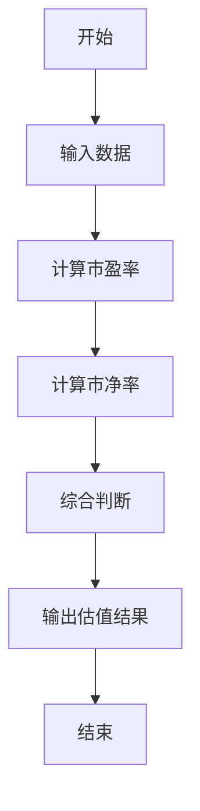

                 


# 全球股市估值与3D打印器官移植的伦理问题

---

## 关键词：
全球股市估值, 3D打印器官移植, 伦理问题, 算法交易, 器官分配, 金融伦理, 医疗伦理

---

## 摘要：
本文从技术与伦理的双重视角，系统探讨全球股市估值与3D打印器官移植的伦理问题。通过分析股市估值的算法原理与伦理挑战，结合3D打印器官移植的技术进步与伦理困境，揭示两者在伦理维度的深层联系。本文旨在为技术与伦理的交叉研究提供新的视角，为全球金融市场与医疗技术的可持续发展提供伦理框架参考。

---

## 正文

---

### 第一部分：全球股市估值的伦理问题

#### 第1章：全球股市估值的背景与现状

##### 1.1 全球股市估值的核心概念
###### 1.1.1 估值的基本定义与原理
股市估值是通过对公司财务数据、市场环境和行业趋势的分析，确定股票的内在价值。常见的估值方法包括市盈率（P/E）、市净率（P/B）、现金流折现模型（DCF）等。

###### 1.1.2 估值的常见方法与模型
- **市盈率（P/E）**：公式为 $P/E = \frac{\text{股价}}{\text{每股收益}}$。
- **市净率（P/B）**：公式为 $P/B = \frac{\text{股价}}{\text{每股净资产}}$。
- **现金流折现模型（DCF）**：通过预测公司未来现金流并贴现至现值，计算公司估值。

###### 1.1.3 全球股市估值的现状与趋势
随着人工智能和大数据技术的普及，现代股市估值 increasingly relies on algorithmic trading and machine learning models。这些算法能够快速分析海量数据，优化估值模型，但也带来了新的伦理挑战。

##### 1.2 估值的伦理问题
###### 1.2.1 估值模型的公平性与透明度
- **问题**：算法交易可能导致市场操纵和不公平竞争。
- **案例**：高频交易算法可能利用技术优势，抢先交易，损害中小投资者利益。

###### 1.2.2 投资者利益与市场操纵的伦理冲突
- **问题**：某些机构投资者可能利用内幕信息或市场操纵影响股价，损害其他投资者利益。
- **解决方案**：加强监管，提高市场透明度，确保公平交易。

###### 1.2.3 估值过程中的道德风险
- **问题**：分析师可能因利益冲突，故意发布误导性估值报告。
- **案例**：某些投行在 IPO 过程中人为抬高估值，导致新股破发，损害投资者利益。

##### 1.3 估值与伦理的边界与外延
###### 1.3.1 估值的法律与监管框架
- **问题**：现有监管框架是否能应对算法交易带来的伦理挑战？
- **解决方案**：建立更严格的算法交易监管制度，防范市场操纵。

###### 1.3.2 估值的社会责任与道德标准
- **问题**：金融机构是否应承担社会责任，避免因短期估值波动影响市场稳定？
- **案例**：2008 年金融危机中，金融机构的短期估值目标导致系统性风险。

###### 1.3.3 估值的全球化与区域差异
- **问题**：不同国家和地区的市场环境差异是否会影响估值的伦理标准？
- **解决方案**：建立全球统一的估值伦理标准，兼顾地区差异。

---

#### 第2章：3D打印器官移植的伦理问题

##### 2.1 3D打印器官移植的核心概念
###### 2.1.1 3D打印技术的基本原理
- **技术原理**：通过计算机辅助设计（CAD）和增材制造技术，逐层打印生物材料，构建复杂器官结构。

###### 2.1.2 器官移植的基本流程与挑战
- **流程**：从患者数据采集、3D建模、打印到术后监测。
- **挑战**：材料兼容性、免疫排斥反应、打印精度等问题。

###### 2.1.3 3D打印器官移植的现状与未来
- **现状**：目前主要应用于骨骼和软组织修复，器官移植仍处于试验阶段。
- **未来**：随着生物材料和打印技术的进步，有望实现功能性器官的打印。

##### 2.2 3D打印器官移植的伦理挑战
###### 2.2.1 器官分配的公平性与优先权
- **问题**：3D打印技术是否会导致器官分配的不公？
- **案例**：富裕地区可能优先获得3D打印器官，加剧医疗资源分配的不平等。

###### 2.2.2 患者隐私与数据保护
- **问题**：3D打印器官需要患者的高度个性化数据，如何保护患者隐私？
- **解决方案**：建立严格的数据保护法规，确保患者数据不被滥用。

###### 2.2.3 医疗伦理中的知情同意与风险承担
- **问题**：患者是否充分了解3D打印器官移植的风险和不确定性？
- **案例**：某患者因术后并发症起诉医院，引发知情同意的伦理争议。

##### 2.3 3D打印器官移植的伦理边界与外延
###### 2.3.1 技术与伦理的冲突与调和
- **问题**：技术进步是否应以伦理为前提？
- **解决方案**：建立伦理审查机制，确保技术创新符合伦理标准。

###### 2.3.2 器官移植的全球化与资源分配
- **问题**：3D打印技术是否能解决器官短缺问题，如何实现全球公平分配？
- **案例**：跨国器官移植中的伦理争议。

###### 2.3.3 3D打印技术对传统医疗伦理的冲击
- **问题**：3D打印器官是否会影响传统器官移植的伦理框架？
- **解决方案**：重新审视和调整传统医疗伦理，以适应新技术的挑战。

---

### 第二部分：全球股市估值与3D打印器官移植的伦理联系

#### 第3章：估值与伦理的核心概念与联系

##### 3.1 核心概念的对比分析
###### 3.1.1 对比分析表格
| 核心概念 | 全球股市估值 | 3D打印器官移植 |
|----------|--------------|-----------------|
| 定义     | 估算股票价值 | 打印生物器官     |
| 方法     | 市盈率、DCF   | 3D打印技术     |
| 伦理问题 | 市场操纵、公平性 | 分配不公、隐私保护 |

###### 3.1.2 估值与伦理的ER实体关系图
```mermaid
er
actor 投资者
actor 监管机构
actor 医疗机构
actor 患者
```

##### 3.2 估值与伦理的系统架构
###### 3.2.1 系统功能设计
```mermaid
classDiagram
class 投资者 {
    + 账户资金
    + 交易记录
}
class 监管机构 {
    + 市场数据
    + 监测工具
}
class 市场环境 {
    + 股价
    + 交易量
}
investor -->> 监管机构 : 提交交易请求
监管机构 --> 市场环境 : 监测市场波动
```

---

#### 第4章：估值与伦理的算法原理

##### 4.1 估值算法的原理与流程
###### 4.1.1 算法流程图


###### 4.1.2 算法实现代码
```python
def calculate_pe_ratio(stock_price, earnings_per_share):
    return stock_price / earnings_per_share

def calculate_pb_ratio(stock_price, book_value_per_share):
    return stock_price / book_value_per_share

# 示例数据
stock_price = 100
earnings_per_share = 20
book_value_per_share = 25

pe_ratio = calculate_pe_ratio(stock_price, earnings_per_share)
pb_ratio = calculate_pb_ratio(stock_price, book_value_per_share)

print(f"市盈率：{pe_ratio}")
print(f"市净率：{pb_ratio}")
```

---

#### 第5章：3D打印器官移植的系统架构与实现

##### 5.1 系统功能设计
###### 5.1.1 系统功能模块
- 数据采集模块：采集患者生理数据。
- 3D建模模块：生成器官模型。
- 打印控制模块：控制3D打印机。
- 监测模块：实时监测打印过程。

##### 5.2 系统架构设计
```mermaid
blockDiagram
block 投资者
block 监管机构
block 市场环境
block 医疗机构
block 患者
```

---

### 第三部分：总结与展望

#### 第6章：总结与展望

##### 6.1 总结
本文从技术与伦理双重视角，系统探讨了全球股市估值与3D打印器官移植的伦理问题。通过分析两者的伦理挑战，揭示了技术进步与伦理规范之间的复杂关系。

##### 6.2 展望
未来，随着技术的进一步发展，如何在技术创新中平衡伦理规范，将是全球金融市场与医疗行业面临的重要课题。

---

## 作者信息
作者：AI天才研究院/AI Genius Institute & 禅与计算机程序设计艺术/Zen And The Art of Computer Programming  
联系邮箱：contact@aitianji.ren  
版权声明：本文版权归作者所有，转载请注明出处。

--- 

**[完]**

