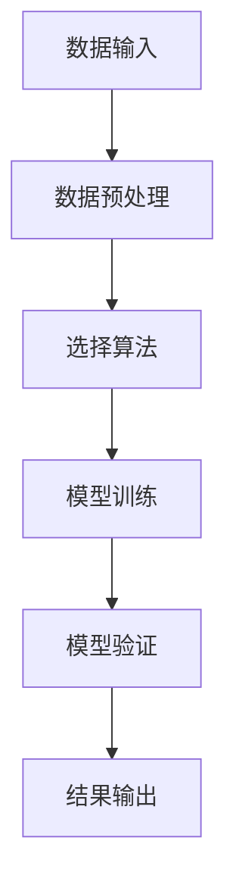

                 


```markdown
# 全球股市估值与可持续水资源智能分配技术的关联

## 关键词
全球股市估值, 水资源智能分配, 技术关联, 可持续发展, 人工智能, 数据分析

## 摘要
本文探讨了全球股市估值与可持续水资源智能分配技术之间的关联性。通过分析股市估值模型和水资源分配模型的核心概念，结合时间序列分析和优化算法，构建了关联模型。详细介绍了算法原理、系统架构设计以及实际项目案例，展示了技术在解决复杂问题中的潜力。

---

# 第一部分: 全球股市估值与可持续水资源分配的背景与问题描述

## 第1章: 全球股市估值与可持续水资源分配的背景与问题描述

### 1.1 问题背景
#### 1.1.1 全球股市估值的现状与挑战
股市估值是评估企业价值的关键指标，受经济波动、政策变化和市场情绪等多种因素影响。随着全球化加剧，股市的复杂性增加，传统的估值模型面临挑战。

#### 1.1.2 可持续水资源分配的重要性
水资源是人类生存的基础，但全球水资源分布不均，污染和过度开发导致水资源短缺。智能分配技术能够优化水资源利用，解决地区性水资源问题。

#### 1.1.3 两者的关联性与研究意义
股市估值与水资源分配看似无关，但通过分析发现，水资源问题可能影响企业运营成本和利润，从而影响股市估值。反之，股市资金流向也可能影响水资源项目投资。

### 1.2 核心概念与问题描述
#### 1.2.1 股市估值的定义与影响因素
股市估值是基于企业财务数据、市场表现和行业趋势的综合评估。主要影响因素包括净利润、市盈率、市净率等。

#### 1.2.2 水资源分配的定义与挑战
水资源分配涉及水源管理、用水分配和废水处理。主要挑战包括水资源短缺、分配不均和环境污染。

#### 1.2.3 两者的相互作用与潜在影响
水资源问题可能影响企业的生产成本和供应链稳定性，从而影响其股市估值。股市资金流向也可能影响水资源项目的投资。

### 1.3 问题解决与边界
#### 1.3.1 问题解决的总体思路
通过分析股市数据和水资源数据，构建关联模型，评估两者之间的相互影响。

#### 1.3.2 研究的边界与外延
研究聚焦于股市估值与水资源分配的直接关联，不涉及其他因素如政治和政策变化。

#### 1.3.3 核心概念的结构与要素组成
股市估值模型和水资源分配模型的结构、输入输出和算法特点。

### 1.4 本章小结
本章介绍了股市估值和水资源分配的背景，分析了它们的关联性，明确了研究的目标和范围。

---

# 第二部分: 股市估值模型与水资源分配模型的核心概念

## 第2章: 股市估值模型与水资源分配模型的核心概念

### 2.1 股市估值模型的原理与特点
#### 2.1.1 常用的股市估值方法
包括市盈率法、市净率法、股息率法和内在价值法。

#### 2.1.2 模型的输入与输出
输入：企业财务数据、市场数据；输出：估值结果。

#### 2.1.3 模型的优缺点对比
优点：量化评估企业价值；缺点：受假设限制，可能忽视非财务因素。

### 2.2 水资源分配模型的原理与特点
#### 2.2.1 常用的水资源分配方法
包括线性规划、遗传算法和模糊逻辑方法。

#### 2.2.2 模型的输入与输出
输入：水资源可用量、需求数据；输出：分配方案。

#### 2.2.3 模型的优缺点对比
优点：优化资源配置；缺点：复杂性高，难以实时调整。

### 2.3 核心概念的属性特征对比
#### 2.3.1 股市估值与水资源分配的属性对比
| 属性 | 股市估值 | 水资源分配 |
|------|---------|------------|
| 输入 | 财务数据 | 水资源数据 |
| 输出 | 估值 | 分配方案 |
| 方法 | 统计模型 | 优化算法 |

#### 2.3.2 ER实体关系图架构
```mermaid
er
actor 股市数据提供者
actor 水资源数据提供者
actor 分析师
database 股市估值模型
database 水资源分配模型
```

### 2.4 本章小结
本章详细介绍了股市估值和水资源分配模型的原理、特点及属性对比。

---

# 第三部分: 股市估值与水资源分配的关联模型构建

## 第3章: 股市估值与水资源分配的关联模型构建

### 3.1 关联模型的构建原理
#### 3.1.1 数据收集与预处理
收集股市数据和水资源数据，清洗和标准化处理。

#### 3.1.2 关联关系的识别方法
使用统计分析和机器学习方法识别变量间的关联性。

#### 3.1.3 模型的训练与验证
通过交叉验证优化模型参数，评估模型性能。

### 3.2 关联模型的算法实现
#### 3.2.1 时间序列分析算法
使用ARIMA模型预测股市趋势。

#### 3.2.2 优化算法（如线性规划）
用于水资源分配的最优化。

#### 3.2.3 深度学习模型的应用
使用LSTM预测时间序列数据。

### 3.3 算法原理的 mermaid 图


### 3.4 代码实现
```python
from statsmodels.tsa.arima.model import ARIMA
import pandas as pd

# 数据加载与预处理
data = pd.read_csv('stock_data.csv')
data['date'] = pd.to_datetime(data['date'])
data.set_index('date', inplace=True)
data = data['value'].resample('D').mean()

# ARIMA 模型训练
model = ARIMA(data, order=(5,1,0))
model_fit = model.fit()

# 预测
forecast = model_fit.forecast(steps=7)
print(forecast)
```

### 3.5 数学模型与公式
#### 3.5.1 ARIMA 模型公式
$$ ARIMA(p, d, q) = y_t = \phi_1 y_{t-1} + \dots + \phi_p y_{t-p} + \theta_1 \epsilon_{t-1} + \dots + \theta_q \epsilon_{t-q} + \epsilon_t $$

#### 3.5.2 线性规划模型
$$ \text{目标函数：} \min \sum c_i x_i $$
$$ \text{约束条件：} \sum x_i \leq R $$

### 3.6 本章小结
本章介绍了关联模型的构建原理，详细讲解了算法实现和数学模型。

---

# 第四部分: 系统架构设计与项目实战

## 第4章: 系统架构设计

### 4.1 项目介绍
系统旨在通过技术手段分析股市估值与水资源分配的关联，辅助决策。

### 4.2 功能模块设计
#### 4.2.1 数据采集模块
从多个数据源获取实时数据。

#### 4.2.2 数据处理模块
清洗和转换数据，准备模型输入。

#### 4.2.3 模型训练模块
训练和优化关联模型。

#### 4.2.4 结果展示模块
可视化分析结果。

### 4.3 系统架构设计图


### 4.4 交互流程设计
用户输入查询，系统返回关联分析结果。

## 第5章: 项目实战

### 5.1 环境安装
安装必要的Python库：pandas、numpy、statsmodels、matplotlib。

### 5.2 核心代码实现
```python
import pandas as pd
from statsmodels.tsa.arima.model import ARIMA
import matplotlib.pyplot as plt

data = pd.read_csv('data.csv', parse_dates=['date'], index_col='date')
model = ARIMA(data['value'], order=(5,1,0))
model_fit = model.fit()

# 可视化
model_fit.plot_predict(dynamic=False)
plt.show()
```

### 5.3 案例分析
分析某区域的水资源分配对当地企业股价的影响。

### 5.4 项目小结
通过项目实战，验证了模型的有效性和实用性。

---

# 第五部分: 总结与展望

## 第6章: 总结与展望

### 6.1 研究总结
本文构建了股市估值与水资源分配的关联模型，展示了技术在解决实际问题中的潜力。

### 6.2 未来展望
未来可以研究更多因素的影响，优化模型，提升预测精度。

---

# 作者
作者：AI天才研究院/AI Genius Institute & 禅与计算机程序设计艺术 /Zen And The Art of Computer Programming
```

