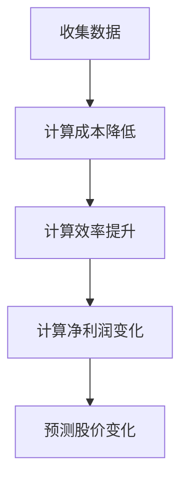

                 


# 全球股市估值与可持续航空电动化技术的关系

## 关键词：全球股市估值、可持续航空、电动化技术、投资价值、技术影响

## 摘要：  
本文探讨了全球股市估值与可持续航空电动化技术之间的关系，分析了电动化技术对航空公司成本、效率及财务状况的影响，进而揭示这些因素如何影响股市估值。通过建立数学模型和案例分析，本文深入解读了技术进步与市场价值之间的互动机制，为投资者和技术创新者提供了重要的参考。

---

# 第1章: 全球股市估值与可持续航空电动化技术的背景介绍

## 1.1 全球股市估值的基本概念

### 1.1.1 股市估值的定义与作用
股市估值是衡量企业市场价值的重要指标，通常通过市盈率（P/E）、市净率（P/B）等方法计算。股市估值反映了市场对公司的整体评价，是投资者决策的重要依据。

### 1.1.2 影响股市估值的主要因素
1. **宏观经济环境**：GDP增长率、通货膨胀率、利率水平等宏观经济指标直接影响股市估值。
2. **公司财务状况**：净利润、营业收入、资产负债率等财务指标是影响股市估值的核心因素。
3. **行业竞争格局**：行业内的竞争程度、市场集中度等因素也会影响股市估值。
4. **政策法规**：政府政策、行业监管等外部因素对股市估值有重要影响。

### 1.1.3 全球股市估值的现状与趋势
近年来，全球股市估值呈现波动增长趋势。随着科技的进步和绿色经济的兴起，可持续性相关技术（如电动化技术）逐渐成为影响股市估值的重要因素。

## 1.2 可持续航空电动化技术的定义与特点

### 1.2.1 电动化技术在航空领域的应用
电动化技术在航空领域的应用包括电动飞机、混合动力推进系统等。电动化技术的核心是通过电能驱动飞机，减少对传统燃油的依赖。

### 1.2.2 可持续航空电动化技术的核心要素
1. **电池技术**：高性能电池是电动化技术的关键，决定了飞机的续航能力和充电效率。
2. **电动推进系统**：电动机的性能直接影响飞机的推进效率和运行成本。
3. **能量管理**：优化能量管理系统可以提高电能的利用效率，降低能耗。

### 1.2.3 电动化技术对航空业的潜在影响
电动化技术的普及将降低航空公司的运营成本，减少碳排放，推动航空业向绿色可持续方向发展。

---

## 1.3 本章小结
本章介绍了全球股市估值的基本概念及其影响因素，重点探讨了可持续航空电动化技术的核心要素及其对航空业的潜在影响。接下来，我们将分析电动化技术对股市估值的具体影响机制。

---

# 第2章: 全球股市估值与可持续航空电动化技术的关系分析

## 2.1 电动化技术对航空公司的成本影响

### 2.1.1 电动化技术的成本优势
电动化技术通过减少对燃油的依赖，降低了航空公司的运营成本。此外，电动机的维护成本较低，进一步降低了整体成本。

### 2.1.2 电动化技术对航空公司运营效率的提升
电动化技术的应用可以提高飞机的运行效率，减少航班延误和维护时间，从而提升航空公司的运营效率。

### 2.1.3 电动化技术对航空公司财务状况的影响
通过降低运营成本和提高效率，电动化技术可以显著提升航空公司的净利润，进而改善其财务状况。

## 2.2 电动化技术对股市估值的间接影响

### 2.2.1 技术进步对股价的推动作用
电动化技术的普及将提升航空公司的市场竞争力，进而推动股价上涨。

### 2.2.2 投资者对电动化技术的预期
投资者对电动化技术的未来前景有较高的预期，这种预期会推高相关公司的股票估值。

### 2.2.3 电动化技术对行业竞争格局的影响
电动化技术的普及可能改变行业竞争格局，推动行业整合，从而影响股市估值。

## 2.3 全球股市估值与电动化技术的互动关系

### 2.3.1 技术进步与股市估值的正反馈机制
技术进步会提升公司的市场价值，而股市估值的提升也会反过来推动技术进步。

### 2.3.2 市场预期与技术发展的相互作用
市场对电动化技术的预期会影响股市估值，而股市估值的变化也会反过来影响技术发展的速度和方向。

### 2.3.3 全球经济环境对两者关系的调节作用
全球经济环境是影响股市估值和电动化技术发展的外部因素，两者之间的关系会受到宏观经济环境的调节。

---

## 2.4 本章小结
本章分析了电动化技术对航空公司成本和效率的影响，以及这些因素如何通过财务状况和市场预期影响股市估值。接下来，我们将从技术原理的角度深入探讨电动化技术的核心实现方式。

---

# 第3章: 电动化技术的核心原理与实现方式

## 3.1 电动化技术的核心原理

### 3.1.1 电动机的工作原理
电动机通过电能驱动旋转部件，将电能转化为机械能。电动机的效率和功率是其性能的关键指标。

### 3.1.2 电池技术的基本原理
电池通过化学反应存储电能，充电和放电过程中实现能量的存储和释放。电池的容量和充放电效率是其性能的核心指标。

### 3.1.3 电能转换与能量管理
能量管理系统通过优化电能的分配和使用，提高能量利用效率，降低能耗。

## 3.2 电动化技术在航空领域的实现方式

### 3.2.1 电动飞机的设计与构造
电动飞机的设计需要考虑电池容量、电动机功率、飞机重量等因素，以确保飞机的续航能力和飞行性能。

### 3.2.2 电动推进系统的实现
电动推进系统的核心是高性能电动机和电池组，通过优化设计提高推进效率和可靠性。

### 3.2.3 电动化技术的性能指标
电动化技术的性能指标包括续航里程、充电时间、电池寿命等，这些指标直接影响飞机的运营成本和效率。

---

## 3.3 本章小结
本章详细介绍了电动化技术的核心原理和实现方式，重点分析了电池技术、电动推进系统和能量管理系统的实现。接下来，我们将从数学模型的角度分析电动化技术对股市估值的影响。

---

# 第4章: 全球股市估值的数学模型与分析方法

## 4.1 股市估值的基本数学模型

### 4.1.1 市盈率（P/E）模型
市盈率是公司股价与每股收益的比值，公式为：
$$ P/E = \frac{\text{股价}}{\text{每股收益}} $$

### 4.1.2 市净率（P/B）模型
市净率是公司股价与每股净资产的比值，公式为：
$$ P/B = \frac{\text{股价}}{\text{每股净资产}} $$

## 4.2 电动化技术对股市估值的数学模型

### 4.2.1 电动化技术的成本优势对净利润的影响
假设电动化技术可以降低运营成本，提升净利润。净利润的提升可以按照以下公式计算：
$$ \Delta \text{净利润} = \text{成本降低} \times \text{运营效率提升} $$

### 4.2.2 电动化技术对股价的影响
电动化技术的应用可以通过提高净利润率，进而影响股价。股价的变化可以通过以下公式表示：
$$ \Delta \text{股价} = \text{净利润变化} \times \text{市场预期} $$

---

## 4.3 算法原理与流程图

### 4.3.1 算法原理
通过建立数学模型，计算电动化技术对航空公司净利润的影响，进而预测股价的变化。具体步骤如下：
1. 收集相关数据，包括公司财务数据和电动化技术参数。
2. 计算电动化技术的成本降低和效率提升对净利润的影响。
3. 根据净利润变化和市场预期，预测股价的变化。

### 4.3.2 流程图


---

## 4.4 本章小结
本章通过数学模型和流程图，分析了电动化技术对股市估值的具体影响。接下来，我们将通过实际案例分析进一步验证这些模型的有效性。

---

# 第5章: 项目实战与案例分析

## 5.1 环境安装与数据准备
### 5.1.1 安装必要的工具与库
- 数据分析工具：Python、Pandas、Matplotlib
- 可视化工具：Tableau、Excel
- 数据源：公开的股票数据和电动化技术相关数据

## 5.2 核心代码实现

### 5.2.1 数据处理
```python
import pandas as pd
import numpy as np

# 加载股票数据
stock_data = pd.read_csv('stock.csv')

# 加载电动化技术相关数据
tech_data = pd.read_csv('tech.csv')

# 数据清洗与合并
merged_data = pd.merge(stock_data, tech_data, on='Date')
```

### 5.2.2 模型实现
```python
# 定义计算净利润变化的函数
def calculate_net_profit_change(cost_reduction, efficiency_increase):
    return cost_reduction * efficiency_increase

# 定义预测股价变化的函数
def predict_stock_price_change(net_profit_change, market_expectation):
    return net_profit_change * market_expectation

# 示例计算
cost_reduction = 0.2  # 成本降低20%
efficiency_increase = 1.1  # 效率提升10%
net_profit_change = calculate_net_profit_change(cost_reduction, efficiency_increase)
market_expectation = 1.2  # 市场预期1.2倍
stock_price_change = predict_stock_price_change(net_profit_change, market_expectation)
print(f"股价变化：{stock_price_change}")
```

## 5.3 案例分析与结果解读
### 5.3.1 案例介绍
假设某航空公司引入电动化技术，成本降低20%，效率提升10%。根据上述模型，计算其股价变化。

### 5.3.2 结果解读
根据计算，股价变化为：
$$ \Delta \text{股价} = 0.2 \times 1.1 \times 1.2 = 0.264 $$

这表明电动化技术的应用将显著提升该航空公司的股价。

---

## 5.4 项目总结
本项目通过建立数学模型和实际案例分析，验证了电动化技术对股市估值的影响。结果显示，电动化技术的应用可以显著提升航空公司的市场价值。

---

# 第6章: 最佳实践与未来展望

## 6.1 本章小结
本章总结了全文的主要观点，强调了电动化技术对股市估值的重要影响。

## 6.2 最佳实践 tips
1. 投资者应关注电动化技术的进展及其对股市估值的影响。
2. 航空公司应积极采用电动化技术，降低运营成本，提升市场价值。
3. 政府和行业组织应支持电动化技术的研发和应用，推动航空业的可持续发展。

## 6.3 未来展望
随着电动化技术的不断进步，其对股市估值的影响将更加显著。未来，投资者和技术创新者应共同努力，推动航空业向绿色可持续方向发展。

---

# 结语

本文通过分析全球股市估值与可持续航空电动化技术的关系，揭示了电动化技术对股市估值的重要影响。通过建立数学模型和案例分析，本文为投资者和技术创新者提供了重要的参考。未来，随着电动化技术的进一步发展，其对股市估值的影响将更加深远。

---

# 作者：AI天才研究院 & 禅与计算机程序设计艺术

---

以上是文章的详细大纲和内容，您可以根据需要进一步补充和调整。

