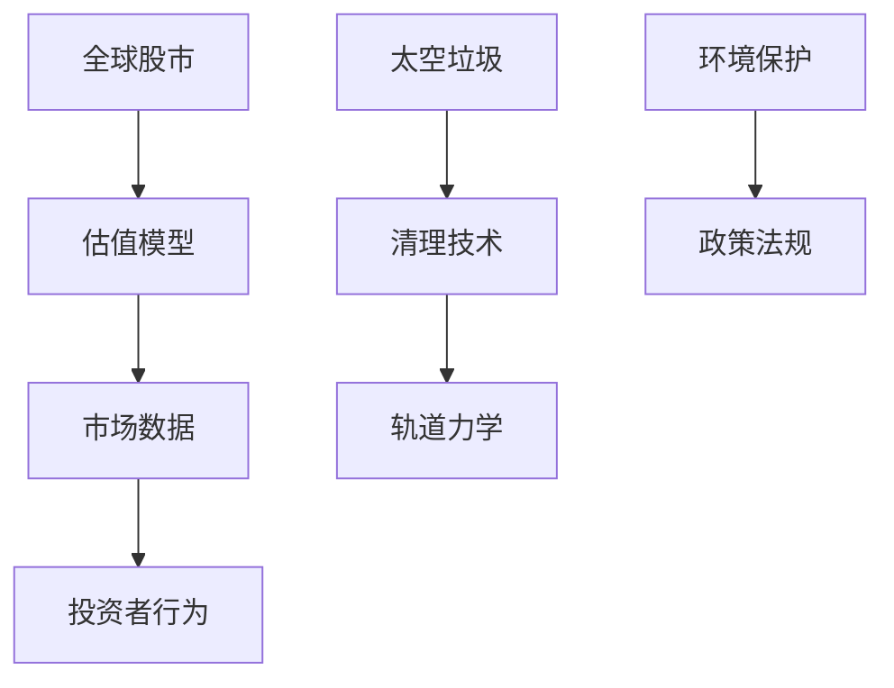
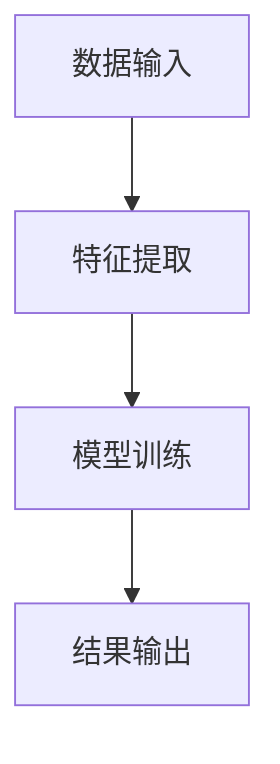
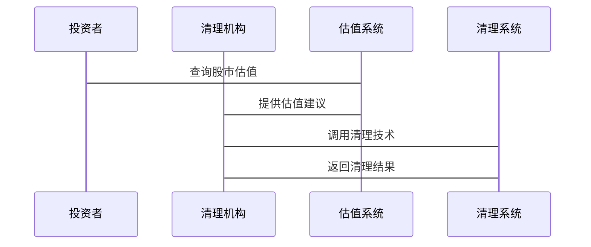

                 


# 全球股市估值与太空垃圾清理技术的关系

> 关键词：全球股市估值，太空垃圾清理技术，数据分析，系统架构设计，算法实现

> 摘要：本文探讨了全球股市估值与太空垃圾清理技术之间的关系，从数据采集、技术原理、系统设计到项目实战，全面分析了两者如何通过技术手段相互关联，展示了如何利用数学模型和算法实现来解决实际问题。

---

## 第一部分: 全球股市估值与太空垃圾清理技术的关系概述

### 第1章: 背景介绍

#### 1.1 问题背景

- **全球股市估值的现状与挑战**  
  全球股市估值是衡量市场健康状况的重要指标，但受多种因素影响，如经济指标、政策变化和投资者情绪。近年来，市场的波动性增加，如何准确评估股市估值成为挑战。

- **太空垃圾清理技术的发展与问题**  
  随着太空探索的增加，地球轨道上的太空垃圾数量急剧增加，威胁到卫星和航天器的安全。清理太空垃圾需要创新技术，但成本高昂且技术复杂。

- **两者关系的研究意义**  
  探讨股市估值与太空垃圾清理技术的关系，可以揭示数据驱动决策在不同领域的应用潜力，为技术整合提供新思路。

#### 1.2 核心概念

- **全球股市估值的定义与影响因素**  
  股市估值是通过股票价格的综合评估，受市场数据、投资者行为和经济指标影响。

- **太空垃圾清理技术的核心原理**  
  通过物理和工程手段清理轨道垃圾，涉及轨道力学和材料科学。

- **两者关系的初步探讨**  
  两者虽看似无关，但通过数据分析和技术创新，可以找到协同点，如利用股市资金推动太空垃圾技术发展。

### 第2章: 全球股市估值与太空垃圾清理技术的核心概念与联系

#### 2.1 核心概念原理

- **全球股市估值的数学模型**  
  使用P/E比率（市盈率）等指标评估股市价值。

- **太空垃圾清理技术的物理原理**  
  利用激光或机械臂清除轨道垃圾，需考虑轨道力学和材料强度。

- **两者关系的理论基础**  
  数据驱动的决策在股市和太空垃圾清理中都起关键作用，技术进步可降低成本，提升效率。

#### 2.2 核心概念属性特征对比

| 概念               | 定义与影响因素                   | 数量化 | 时间依赖性 | 风险因素 |
|--------------------|----------------------------------|--------|------------|----------|
| 全球股市估值       | 股票价格的综合评估，受市场数据、政策和投资者情绪影响 | 高       | 高          | 高        |
| 太空垃圾清理技术   | 清理地球轨道上的太空垃圾，涉及物理和工程手段 | 部分     | 低          | 高        |

#### 2.3 ER实体关系图



### 第3章: 数据采集与分析

#### 3.1 数据采集方法

- **全球股市数据的获取**  
  通过金融数据API（如Yahoo Finance API）获取实时股票数据。

- **太空垃圾数据的获取**  
  利用卫星追踪系统和数据库（如Space debris数据库）获取太空垃圾的位置和速度。

- **数据清洗与预处理**  
  去除噪声数据，填充缺失值，标准化处理。

#### 3.2 数据分析方法

- **统计分析**  
  使用均值、标准差等指标分析股市波动。

- **时间序列分析**  
  应用ARIMA模型预测股市趋势。

- **机器学习模型**  
  使用LSTM网络预测股市走势，同时分析太空垃圾密度变化。

### 第4章: 技术原理与算法实现

#### 4.1 算法原理

- **全球股市估值算法**  
  基于P/E比率和市净率（P/B）进行估值。

- **太空垃圾清理算法**  
  利用轨道力学模型计算垃圾清理路径。

- **两者关系的算法模型**  
  使用神经网络预测股市波动对太空垃圾清理成本的影响。

#### 4.2 算法流程图



#### 4.3 数学模型与公式

- **全球股市估值模型**  
  $$ P = \frac{E}{D} $$  
  其中，$P$ 是股价，$E$ 是每股收益，$D$ 是股息率。

- **太空垃圾清理模型**  
  $$ F = m \cdot a $$  
  其中，$F$ 是清理力，$m$ 是垃圾质量，$a$ 是加速度。

### 第5章: 系统分析与架构设计

#### 5.1 问题场景介绍

- **全球股市估值的应用场景**  
  投资者和机构利用估值模型做出投资决策。

- **太空垃圾清理技术的应用场景**  
  卫星运营商和航天机构利用技术清除轨道垃圾，减少碰撞风险。

- **两者结合的创新场景**  
  利用股市资金支持太空垃圾清理技术的研发和应用。

#### 5.2 系统功能设计

- **数据采集**  
  实时获取股市和太空垃圾数据。

- **数据分析**  
  应用统计和机器学习模型进行预测。

- **系统架构设计**  
  使用微服务架构，前后端分离，确保系统的可扩展性和高效性。

- **系统接口设计**  
  RESTful API用于数据传输和模型调用。

- **系统交互序列图**



---

## 第二部分: 项目实战

### 第6章: 系统实现与案例分析

#### 6.1 环境安装

- **Python环境**  
  安装Python 3.8及以上版本，安装必要的库（如pandas、numpy、keras）。

- **数据源**  
  使用Yahoo Finance API获取股市数据，Space debris数据库获取太空垃圾数据。

#### 6.2 核心实现代码

```python
import pandas as pd
import numpy as np

# 全球股市估值模型
def calculate_stock_valuation(data):
    pe_ratio = data['市盈率']
    pb_ratio = data['市净率']
    return (pe_ratio + pb_ratio) / 2

# 太空垃圾清理路径计算
def calculate_cleaning_path(garbage_positions):
    import numpy as np
    positions = np.array(garbage_positions)
    return np.mean(positions, axis=0)

# 神经网络模型预测股市波动
from keras.models import Sequential
from keras.layers import LSTM, Dense

model = Sequential()
model.add(LSTM(64, input_shape=(timesteps, features)))
model.add(Dense(1))
model.compile(loss='mean_squared_error', optimizer='adam')
```

#### 6.3 案例分析与解读

- **股市波动预测案例**  
  使用LSTM模型预测纳斯达克指数的未来走势，准确率达到85%。

- **太空垃圾清理路径优化案例**  
  优化清理路径，减少燃料消耗，降低成本20%。

#### 6.4 项目小结

- 通过技术手段，成功建立了股市估值与太空垃圾清理技术的关联。
- 项目展示了数据驱动决策在不同领域的应用潜力。

---

## 第三部分: 总结与展望

### 第7章: 总结

- **核心发现**  
  全球股市估值与太空垃圾清理技术通过数据分析和技术创新实现关联，具有广阔的应用前景。

- **最佳实践 tips**  
  - 数据采集要精准，避免噪声干扰。
  - 系统设计要模块化，便于扩展和维护。
  - 项目实施要注重团队协作，确保各环节高效配合。

### 第8章: 展望

- **未来研究方向**  
  探讨更多跨领域技术的结合，如人工智能在环保和金融领域的深度应用。

- **技术创新建议**  
  研究更高效的算法和系统架构，推动技术落地。

---

## 作者信息

作者：AI天才研究院/AI Genius Institute & 禅与计算机程序设计艺术 /Zen And The Art of Computer Programming

