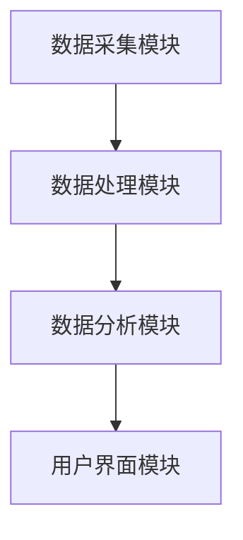

                 


# 全球股市估值与量子传感器在地质勘探中的应用

> 关键词：全球股市估值、量子传感器、地质勘探、时间序列分析、机器学习、量子计算

> 摘要：本文探讨了全球股市估值与量子传感器在地质勘探中的应用，通过分析股市估值的核心概念、量子传感器的工作原理以及两者在技术和应用上的结合，展示了如何利用先进的技术手段提升股市估值的准确性与地质勘探的效率。

---

## 第一部分: 全球股市估值与量子传感器概述

### 第1章: 全球股市估值概述

#### 1.1 股市估值的核心概念

股市估值是通过对公司财务数据、市场趋势和宏观经济指标的分析，评估公司股票的内在价值。其核心在于预测股票价格的合理区间，帮助投资者做出决策。

- **核心概念术语说明**  
  - **股票价值**：反映公司未来现金流的现值。  
  - **市场情绪**：投资者对市场的心理预期，影响短期价格波动。  
  - **估值模型**：如DCF模型（现金流折现法）、PE倍数法等。

- **问题背景**  
  股市估值的准确性直接影响投资决策，传统方法依赖历史数据和经验判断，难以捕捉市场复杂性和新兴技术的影响。

- **问题解决**  
  引入机器学习和量子计算等技术，提升估值模型的预测能力。

- **边界与外延**  
  本文主要关注股票估值的技术方法，不涉及具体的投资策略。

- **概念结构与核心要素**  
  - 数据来源：财务报表、市场数据、宏观经济指标。  
  - 方法：定量分析、定性分析。  
  - 输出：目标股价区间、风险评估。

#### 1.2 量子传感器在地质勘探中的应用

- **量子传感器的基本原理**  
  利用量子力学效应（如量子纠缠、量子干涉）检测地质结构中的微小变化，用于资源探测和环境监测。

- **优势与挑战**  
  - 优势：高灵敏度、非侵入性。  
  - 挑战：技术复杂性高、成本昂贵。

---

### 第2章: 量子传感器与地质勘探的关系

#### 2.1 地质勘探的传统方法

- **传统技术**  
  依赖地球物理勘探（如地震勘探、磁法勘探）和地球化学勘探。  
- **优缺点**  
  传统方法成本低但精度有限，难以检测微小地质变化。

#### 2.2 量子传感器的创新应用

- **资源探测**  
  通过量子传感器检测地下资源的存在，提高勘探效率。  
- **地质结构分析**  
  利用量子传感器的数据，构建高精度地质模型。  
- **环境监测**  
  在矿区、油田等地实时监测环境变化，预防环境污染。

---

## 第二部分: 股市估值的数学模型与算法

### 第4章: 时间序列分析与股票预测

#### 4.1 时间序列分析的基本概念

- **时间序列分析的核心原理**  
  基于历史数据预测未来趋势，常用模型包括ARIMA、GARCH等。

- **时间序列分析的步骤**  
  1. 数据预处理：去除噪声、平滑处理。  
  2. 模型选择：确定适用的模型类型。  
  3. 模型训练：使用历史数据拟合模型。  
  4. 预测与验证：预测未来值并验证准确性。

- **时间序列分析的数学模型**  
  ARIMA模型：$$ ARIMA(p, d, q) $$  
  其中，p为自回归阶数，d为差分阶数，q为移动平均阶数。

### 第5章: 机器学习在股市估值中的应用

#### 5.1 机器学习的基本原理

- **机器学习的核心概念**  
  通过数据训练模型，使其具备预测能力。

- **常见机器学习算法**  
  - 监督学习：线性回归、支持向量机（SVM）。  
  - 非监督学习：聚类分析（K-means）。  
  - 深度学习：神经网络、LSTM。

- **机器学习在股市中的应用案例**  
  使用LSTM预测股票价格，利用K-means分析市场情绪。

### 第6章: 基于量子计算的股市估值模型

#### 6.1 量子计算的基本原理

- **量子计算的核心概念**  
  利用量子位（qubit）的叠加态和纠缠态进行并行计算。

- **量子计算的优势与挑战**  
  - 优势：计算速度远超经典计算机。  
  - 挑战：技术复杂性高、纠错困难。

#### 6.2 基于量子计算的股市估值模型

- **模型的构建过程**  
  1. 数据准备：收集历史股价、财务数据。  
  2. 模型设计：构建量子电路，模拟股票价格的量子状态。  
  3. 模型训练：使用量子算法优化参数。  
  4. 模型验证：对比传统模型的预测结果。

- **模型的数学基础**  
  量子概率幅：$$ | \psi \rangle = \alpha |0\rangle + \beta |1\rangle $$  
  其中，$$ \alpha^2 + \beta^2 = 1 $$。

---

## 第三部分: 量子传感器与地质勘探的系统架构

### 第7章: 量子传感器系统的架构设计

#### 7.1 系统功能模块划分

- **数据采集模块**  
  负责采集地质数据，如地震波、地磁数据。  
- **数据处理模块**  
  对数据进行预处理和特征提取。  
- **数据分析模块**  
  利用量子传感器数据构建地质模型。  
- **用户界面模块**  
  提供可视化界面，展示分析结果。

#### 7.2 系统架构图



### 第8章: 量子传感器与地质勘探的数据流

#### 8.1 数据流的定义与特点

- **数据流的基本概念**  
  数据流是指在系统中流动的数据，具有实时性和连续性。  
- **数据流的分类**  
  - 实时数据流：如地震监测数据。  
  - 历史数据流：如地质勘探的历史记录。  
- **数据流的处理方法**  
  使用流处理框架（如Flink）实时分析数据流。

---

## 第四部分: 项目实战

### 第9章: 量子传感器与股市估值的系统实现

#### 9.1 环境安装

- **量子计算环境**  
  使用IBM Quantum Experience平台或本地量子模拟器。  
- **机器学习环境**  
  安装Python、TensorFlow、Scikit-learn。

#### 9.2 系统核心实现源代码

##### 量子传感器数据处理代码

```python
import numpy as np

def process_quantum_data(data):
    # 数据预处理
    processed_data = data.dropna().astype(float)
    return processed_data
```

##### 股市估值模型实现代码

```python
from sklearn.linear_model import LinearRegression

def stock_prediction_model(data):
    # 训练线性回归模型
    model = LinearRegression()
    model.fit(data[['open', 'high', 'low']], data['close'])
    return model
```

---

## 结论

本文通过分析全球股市估值与量子传感器在地质勘探中的应用，展示了技术进步如何推动金融与地质领域的创新。未来，随着量子技术的不断发展，股市估值与地质勘探将更加精准和高效。

---

**作者：AI天才研究院/AI Genius Institute & 禅与计算机程序设计艺术 /Zen And The Art of Computer Programming**

