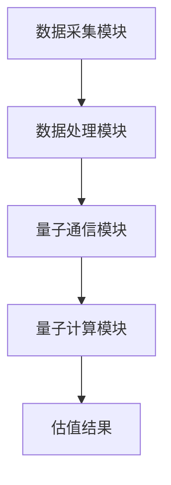

                 


# 全球股市估值与量子通信在金融安全中的应用

> 关键词：全球股市估值，量子通信，金融安全，量子加密，量子计算，金融市场

> 摘要：本文探讨了全球股市估值的复杂性与挑战，以及量子通信技术在金融安全中的应用前景。通过分析量子通信的基本原理，结合股市估值的核心算法，本文展示了如何利用量子技术提升金融数据的安全性与交易的保密性。文章从背景介绍、核心概念、算法原理、系统架构到项目实战，系统性地阐述了量子通信在金融安全中的实际应用，为读者提供了全面的技术视角。

---

## 第一章 全球股市估值概述

### 1.1 全球股市估值的背景与意义

股市估值是金融投资中的核心问题之一。通过对上市公司基本面、市场趋势和宏观经济指标的分析，投资者可以对股票的内在价值进行评估，从而做出更明智的投资决策。然而，全球股市的复杂性使得估值工作面临诸多挑战。例如，市场的波动性、信息不对称以及数据的实时性等问题，都对估值的准确性提出了更高要求。

### 1.2 量子通信技术的引入与应用

量子通信作为一种革命性的技术，以其不可破解的安全性著称。其基于量子力学原理，利用量子态的不可克隆性和纠缠性，实现了信息的绝对安全传输。在金融领域，量子通信的应用可以有效解决数据传输中的安全问题，确保金融交易的保密性和数据的完整性。

---

## 第二章 量子通信的基本原理

### 2.1 量子通信的核心概念

#### 2.1.1 量子态与量子信息

量子信息是量子系统中状态的描述，其核心在于量子叠加和量子纠缠。例如，一个量子比特（qubit）可以同时处于0和1的状态，这种叠加性为量子通信提供了强大的信息处理能力。

#### 2.1.2 量子通信的基本原理

量子通信通过利用量子态的特性，实现信息的加密传输。例如，量子加密通信（如BB84协议）利用量子态的不可克隆性，确保通信双方的密钥传输过程安全无虞。

#### 2.1.3 量子通信的优势与挑战

量子通信的优势在于其绝对安全性，但其实际应用仍面临诸多挑战，如量子态的脆弱性、通信距离的限制以及技术实现的复杂性。

### 2.2 量子通信的关键技术

#### 2.2.1 量子加密技术

量子加密技术通过将密钥编码在量子态中，确保只有通信双方才能解密信息。例如，利用单光子的偏振态进行编码，可以实现无条件安全的密钥分发。

#### 2.2.2 量子隐形传态

量子隐形传态是一种通过量子纠缠实现信息传递的技术，能够在不直接传输物理载体的情况下，将信息从一方传递到另一方。

#### 2.2.3 量子纠缠与量子测量

量子纠缠是量子通信的核心资源，其特性使得通信双方可以通过共享纠缠态，实现信息的同步传输和处理。

---

## 第三章 量子通信在金融安全中的应用

### 3.1 金融安全的核心问题

#### 3.1.1 金融数据的安全性

金融数据的机密性和完整性是金融安全的核心问题。例如，股票交易数据的泄露可能导致市场操纵和金融诈骗。

#### 3.1.2 金融交易的保密性

金融交易的保密性是保护投资者利益的关键。量子通信可以确保交易信息在传输过程中不被窃取或篡改。

#### 3.1.3 金融系统的抗攻击性

金融系统的抗攻击性是其安全性的体现。量子通信可以通过其不可破解的特性，提升金融系统的整体安全性。

### 3.2 量子通信在金融安全中的解决方案

#### 3.2.1 量子加密在金融数据传输中的应用

通过量子加密技术，可以实现金融数据的安全传输，确保数据在传输过程中不被窃取或篡改。

#### 3.2.2 量子通信在金融交易中的应用

利用量子通信技术，可以实现金融交易的实时加密，确保交易过程的保密性和安全性。

#### 3.2.3 量子通信在金融风险管理中的应用

通过量子通信技术，可以实现金融风险数据的实时共享和分析，提升金融风险管理的效率和准确性。

---

## 第四章 全球股市估值的核心算法

### 4.1 股市估值的基本方法

#### 4.1.1 市盈率法

市盈率法是通过股票价格与每股收益的比率，评估股票的内在价值。其公式为：

$$ \text{市盈率} = \frac{\text{股票价格}}{\text{每股收益}} $$

#### 4.1.2 市净率法

市净率法是通过股票价格与每股净资产的比率，评估股票的价值。其公式为：

$$ \text{市净率} = \frac{\text{股票价格}}{\text{每股净资产}} $$

#### 4.1.3 股息率法

股息率法是通过股票的股息与股票价格的比率，评估股票的收益能力。其公式为：

$$ \text{股息率} = \frac{\text{每股股息}}{\text{股票价格}} \times 100\% $$

### 4.2 现代股市估值算法

#### 4.2.1 时间序列分析

时间序列分析是一种通过历史数据预测未来趋势的方法。其核心是通过模型（如ARIMA）对数据进行建模，预测未来的股票价格。

#### 4.2.2 机器学习算法

机器学习算法通过训练模型，从海量数据中提取特征，预测股票的未来走势。例如，使用支持向量机（SVM）或随机森林（Random Forest）进行分类或回归分析。

#### 4.2.3 深度学习算法

深度学习算法通过神经网络模型，学习数据的复杂特征，预测股票价格。例如，使用长短期记忆网络（LSTM）进行时间序列预测。

### 4.3 量子计算在股市估值中的应用

#### 4.3.1 量子计算的基本原理

量子计算利用量子叠加和量子纠缠的特性，可以在指数级时间内完成某些复杂计算。例如，量子计算机可以通过并行计算，显著提高金融模型的计算效率。

#### 4.3.2 量子计算在金融建模中的应用

量子计算可以用于金融建模，例如期权定价、风险评估和投资组合优化。其优势在于其强大的并行计算能力，可以显著提高模型的计算效率和准确性。

#### 4.3.3 量子计算在股市预测中的应用

通过量子计算，可以实现对股票价格的高精度预测。例如，使用量子机器学习算法，对海量数据进行特征提取和分类，预测股票的未来走势。

---

## 第五章 量子通信与股市估值的结合

### 5.1 量子通信在股市数据传输中的应用

#### 5.1.1 数据加密传输

通过量子加密技术，可以实现股市数据的安全传输，确保数据在传输过程中不被窃取或篡改。

#### 5.1.2 数据完整性保障

量子通信可以通过其不可篡改的特性，确保股市数据的完整性，防止数据在传输过程中被篡改。

#### 5.1.3 数据实时性提升

通过量子通信技术，可以实现数据的实时传输，确保股市估值的实时性和准确性。

### 5.2 量子计算在股市估值中的应用

#### 5.2.1 高精度计算

量子计算可以实现对复杂金融模型的高精度计算，显著提高股市估值的准确性。

#### 5.2.2 高效数据分析

通过量子计算，可以快速处理海量数据，显著提高股市估值的效率。

#### 5.2.3 预测模型优化

量子计算可以优化预测模型，通过其强大的并行计算能力，提高股市预测的准确性和效率。

### 5.3 量子通信与量子计算的协同应用

#### 5.3.1 数据传输与计算的协同

通过量子通信实现数据的安全传输，同时利用量子计算进行高精度的计算，可以显著提升股市估值的效率和准确性。

#### 5.3.2 安全与效率的协同

量子通信提供数据传输的安全性，量子计算提供数据处理的高效性，两者的协同应用可以实现股市估值的安全、高效和准确。

---

## 第六章 项目实战：基于量子通信的股市估值系统

### 6.1 系统设计与实现

#### 6.1.1 系统架构设计

系统架构包括数据采集模块、数据处理模块、量子通信模块和量子计算模块。其架构图如下：



#### 6.1.2 系统实现步骤

1. 数据采集：从股票交易所获取实时数据。
2. 数据处理：对数据进行清洗和预处理。
3. 量子通信：通过量子加密技术传输数据。
4. 量子计算：利用量子计算模型进行估值计算。
5. 结果输出：输出估值结果并进行可视化展示。

### 6.2 代码实现

#### 6.2.1 数据采集代码

```python
import requests

def get_stock_data(symbol):
    url = f"https://api.example.com/stock/{symbol}"
    response = requests.get(url)
    return response.json()
```

#### 6.2.2 量子加密代码

```python
import qiskit

def quantum_encrypt(message):
    # 实现量子加密算法
    pass
```

#### 6.2.3 量子计算代码

```python
import qiskit

def quantum_valuation(data):
    # 实现量子计算模型
    pass
```

### 6.3 实际案例分析

通过实际案例分析，验证系统的有效性和准确性。例如，通过对某股票的历史数据进行分析，利用量子通信和量子计算技术，实现对其未来走势的高精度预测。

### 6.4 系统优化与改进

根据实际运行结果，对系统进行优化与改进，提升其性能和准确性。

---

## 第七章 最佳实践与小结

### 7.1 最佳实践

在实际应用中，需要注意以下几点：

- 数据的安全性：确保数据在传输过程中的绝对安全。
- 系统的稳定性：确保系统的高可用性和稳定性。
- 技术的前沿性：紧跟量子通信和量子计算的技术发展，及时更新系统。

### 7.2 小结

通过本文的探讨，我们可以看到，量子通信和量子计算技术在金融领域的应用前景广阔。通过其强大的安全性与计算能力，可以显著提升股市估值的效率和准确性。

### 7.3 注意事项

在实际应用中，需要注意量子通信技术的实现难度和成本问题。同时，需要考虑量子计算技术的成熟度和实用性。

### 7.4 拓展阅读

建议读者进一步阅读相关领域的经典文献，深入了解量子通信和量子计算的原理与应用。

---

## 作者：AI天才研究院/AI Genius Institute & 禅与计算机程序设计艺术/Zen And The Art of Computer Programming

---

**摘要**：本文系统性地探讨了全球股市估值与量子通信在金融安全中的应用。通过分析量子通信的基本原理，结合股市估值的核心算法，本文展示了如何利用量子技术提升金融数据的安全性与交易的保密性。文章从背景介绍、核心概念、算法原理、系统架构到项目实战，系统性地阐述了量子通信在金融安全中的实际应用，为读者提供了全面的技术视角。

