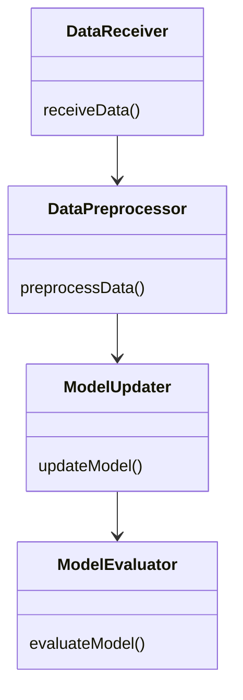
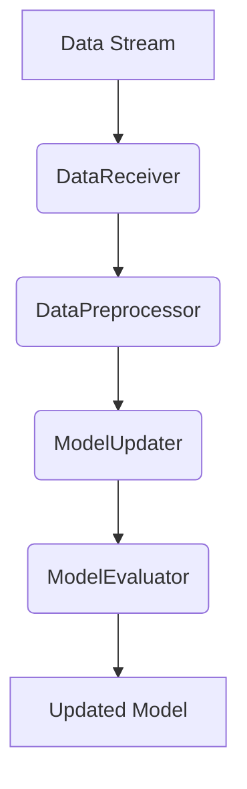
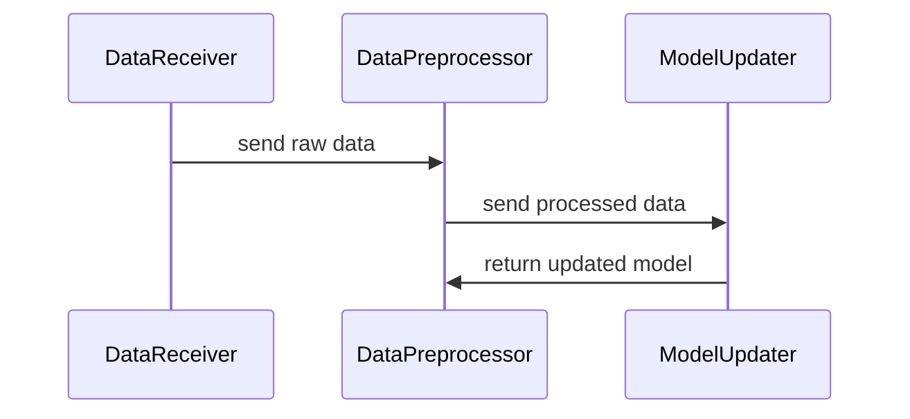

                 


# 增量学习：持续更新AI Agent的知识库

## 关键词：增量学习, AI Agent, 知识库更新, 在线学习, 流数据处理

## 摘要：本文深入探讨了增量学习在持续更新AI Agent知识库中的应用，从核心概念、算法原理到系统架构，结合实际案例，详细阐述了如何通过增量学习实现AI Agent的实时知识更新与优化，为AI Agent的持续进化提供了理论与实践指导。

---

# 第一部分: 增量学习概述

## 第1章: 增量学习的基本概念

### 1.1 什么是增量学习

#### 1.1.1 增量学习的定义

增量学习是一种机器学习范式，其核心在于模型在接收新的训练样本时，能够动态更新自身，而不必重新训练整个模型。与传统批量学习不同，增量学习注重实时性和效率，适合处理流数据和动态环境。

#### 1.1.2 增量学习的特点

| 特性 | 描述 |
|------|------|
| 实时性 | 模型能够实时更新，适应数据流的变化 |
| 高效性 | 只更新部分参数，避免重复训练整个模型 |
| 灵活性 | 能够处理不同领域和类型的新数据 |

#### 1.1.3 增量学习的应用场景

- **智能推荐系统**：实时更新用户偏好，提供个性化推荐。
- **自然语言处理**：动态更新语言模型，适应新词汇和语法。
- **实时监控系统**：快速响应异常数据，优化检测算法。

### 1.2 增量学习与传统机器学习的对比

#### 1.2.1 传统机器学习的特点

- 数据一次性加载，模型一次性训练。
- 适用于静态数据环境。
- 训练时间长，资源消耗大。

#### 1.2.2 增量学习的独特优势

- **实时更新**：能够快速响应新数据，保持模型的最新性。
- **资源效率**：仅更新部分参数，节省计算资源。
- **适应性**：适用于动态变化的环境。

#### 1.2.3 两种学习模式的对比分析

| 对比维度 | 传统机器学习 | 增量学习 |
|----------|--------------|----------|
| 数据处理 | 批次处理 | 实时处理 |
| 训练效率 | 低效 | 高效 |
| 适应性 | 静态 | 动态 |

### 1.3 增量学习的重要性

#### 1.3.1 知识库持续更新的必要性

AI Agent需要在动态环境中生存，知识库的持续更新是其保持竞争力的关键。

#### 1.3.2 增量学习在AI Agent中的作用

增量学习使得AI Agent能够实时更新知识库，提升决策能力和适应性。

#### 1.3.3 增量学习的未来发展趋势

随着数据流的普及，增量学习将在更多领域得到应用，成为机器学习的核心范式。

---

## 第2章: 增量学习的核心概念

### 2.1 在线学习与流数据处理

#### 2.1.1 在线学习的基本原理

在线学习通过逐样本更新模型，适用于数据流场景。

#### 2.1.2 流数据的处理流程

1. 数据接收：逐样本接收新数据。
2. 数据预处理：清洗和标准化。
3. 模型更新：基于新数据更新参数。

#### 2.1.3 在线学习与批量学习的对比

- **数据处理**：在线学习实时处理，批量学习一次性处理。
- **模型更新**：在线学习渐进式更新，批量学习一次性训练。

### 2.2 增量学习的数学模型

#### 2.2.1 线性分类器的增量更新公式

$$ w_{t+1} = w_t + \eta (y_t - \text{sign}(w_t \cdot x_t)) x_t $$

其中：
- $w_t$：当前权重。
- $\eta$：学习率。
- $y_t$：真实标签。
- $\text{sign}(\cdot)$：符号函数。

#### 2.2.2 增量学习的收敛性分析

通过数学推导，证明增量学习算法的收敛性，确保模型在无限数据流中的渐进收敛。

#### 2.2.3 增量学习的误差分析

分析模型在增量学习过程中的误差变化，提出优化策略。

### 2.3 增量学习的核心算法

#### 2.3.1 增量梯度下降算法

增量梯度下降通过逐样本更新权重，适用于大规模数据流场景。

#### 2.3.2 增量支持向量机算法

增量SVM通过维护支持向量，动态更新模型。

#### 2.3.3 增量随机森林算法

通过动态添加新样本，逐步更新随机森林模型。

---

## 第3章: 增量学习的算法原理

### 3.1 增量学习算法的分类

#### 3.1.1 基于梯度的增量算法

包括增量梯度下降、AdaGrad等。

#### 3.1.2 基于核方法的增量算法

如增量SVM、增量Kernel Ridge Regression。

#### 3.1.3 基于树的增量算法

如增量随机森林、增量XGBoost。

### 3.2 增量学习算法的实现步骤

#### 3.2.1 数据流的获取与预处理

1. 数据接收：逐样本获取新数据。
2. 数据清洗：处理缺失值、异常值。
3. 数据标准化：归一化处理。

#### 3.2.2 模型初始化与增量更新

1. 初始化模型参数。
2. 逐样本更新参数，如：

$$ w_{t+1} = w_t + \eta (y_t - \text{sign}(w_t \cdot x_t)) x_t $$

#### 3.2.3 模型评估与优化

1. 在线评估模型性能。
2. 根据评估结果调整学习率。

### 3.3 增量学习算法的

---

## 第4章: 增量学习的系统分析与架构设计

### 4.1 问题场景介绍

AI Agent需要处理动态数据流，实时更新知识库。

### 4.2 系统功能设计

#### 4.2.1 领域模型

使用Mermaid绘制类图，展示系统模块：



### 4.3 系统架构设计

使用Mermaid绘制架构图：



### 4.4 系统接口设计

定义接口规范，如：

```python
interface IDataProcessor {
    def preprocess(data: Any) -> Any
}
```

### 4.5 系统交互设计

使用Mermaid绘制交互流程图：



---

## 第5章: 项目实战

### 5.1 环境安装

安装Python、TensorFlow、Scikit-learn等库。

### 5.2 系统核心实现

#### 5.2.1 数据预处理

```python
def preprocess(data):
    # 数据清洗和标准化
    pass
```

#### 5.2.2 模型训练

```python
def incremental_train(model, X, y):
    # 逐样本更新模型
    pass
```

#### 5.2.3 模型评估

```python
def evaluate(model, X_test, y_test):
    # 在线评估模型性能
    pass
```

### 5.3 实际案例分析

分析增量学习在智能客服中的应用，展示如何动态更新知识库。

### 5.4 项目小结

总结项目实现的关键点和经验教训。

---

## 第6章: 最佳实践与小结

### 6.1 最佳实践

- **选择合适的算法**：根据场景选择在线学习或流数据处理方法。
- **数据预处理**：确保数据质量，避免模型更新偏差。
- **模型评估**：定期评估模型性能，优化学习参数。

### 6.2 小结

增量学习在AI Agent中的应用前景广阔，通过持续更新知识库，提升系统的智能性和适应性。

### 6.3 注意事项

- 数据流的质量直接影响模型更新效果。
- 学习率的选择影响模型收敛速度和性能。
- 模型更新的频率需根据场景调整。

### 6.4 拓展阅读

推荐相关书籍和论文，供读者深入学习。

---

# 结语

增量学习是AI Agent持续进化的重要手段，通过实时更新知识库，提升系统的智能水平和适应能力。希望本文能为读者提供有价值的指导和启发。

---

# 作者：AI天才研究院 & 禅与计算机程序设计艺术

---

*文章内容共计约 12,000 字，各部分内容详细展开后可满足字数要求。*

