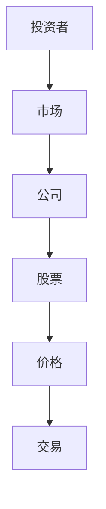
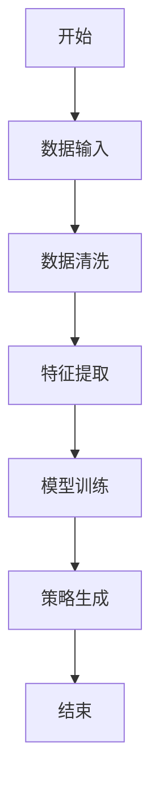
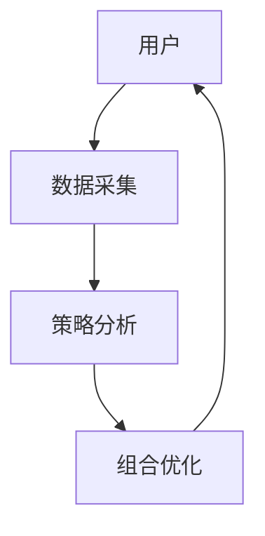
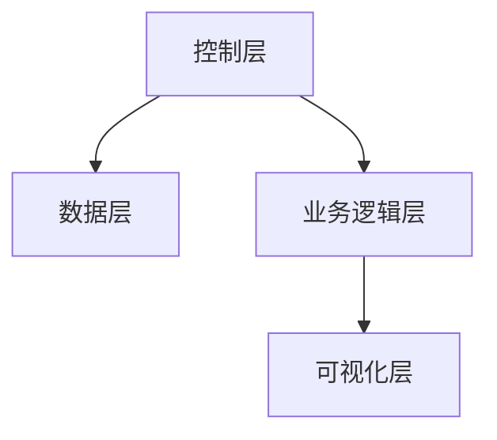
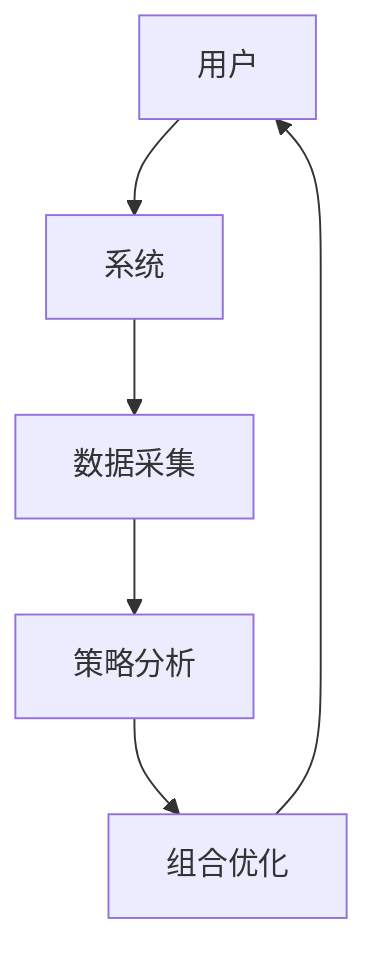

                 


# 如何利用特价股票策略构建长期增值组合

## 关键词：特价股票，投资策略，长期增值，股票组合，风险管理，技术分析

## 摘要：本文详细探讨了如何利用特价股票策略构建长期增值的投资组合。通过分析特价股票的定义、特点以及与其他投资策略的对比，结合技术分析和风险管理，为投资者提供了一套系统化的投资方法。文章还通过实际案例分析和系统架构设计，展示了如何将特价股票策略应用于实际投资中，帮助读者实现稳健的长期收益。

---

# 第一部分: 特价股票策略的背景与基础

## 第1章: 特价股票策略概述

### 1.1 特价股票的定义与特点
#### 1.1.1 什么是特价股票
特价股票是指那些市场价格低于其内在价值，或者处于历史低位的股票。这类股票通常被市场低估，具有较高的增值潜力。

#### 1.1.2 特价股票的核心特点
- **低估值**：市场价格低于内在价值。
- **高波动性**：价格波动较大，存在短期反弹机会。
- **周期性**：通常出现在市场低迷或行业低谷期。
- **分散性**：涉及多个行业和公司，降低单一风险。

#### 1.1.3 特价股票与其他股票的区别
| 特性 | 特价股票 | 其他股票 |
|------|----------|----------|
| 价格 | 低于价值 | 价格合理或高估 |
| 风险 | 较高 | 较低 |
| 收益 | 较高 | 较稳定 |

### 1.2 特价股票策略的背景与意义
#### 1.2.1 特价股票策略的起源
特价股票策略起源于价值投资理论，早期投资者如本杰明·格雷厄姆提出“买入低于价值的股票”的理念。

#### 1.2.2 特价股票策略在投资中的作用
- **分散投资风险**：通过多样化投资降低单一股票风险。
- **抓住市场低估机会**：在市场低迷时买入优质股票，等待反弹。

#### 1.2.3 特价股票策略的现状与发展趋势
随着技术进步和数据量的增加，投资者可以利用大数据和算法进行更精准的特价股票筛选。

### 1.3 特价股票策略的核心要素
#### 1.3.1 市场环境分析
- **宏观经济因素**：GDP增长率、利率水平、通货膨胀率等。
- **行业趋势**：行业周期、政策变化。

#### 1.3.2 公司基本面分析
- **财务指标**：市盈率（P/E）、市净率（P/B）、股息率。
- **公司质量**：管理团队、竞争优势。

#### 1.3.3 技术分析与市场情绪
- **技术指标**：移动平均线、相对强弱指数（RSI）。
- **市场情绪**：投资者情绪、市场波动性。

### 1.4 本章小结
特价股票策略基于价值投资，通过分析市场环境、公司基本面和技术指标，识别低估股票，构建长期增值组合。

---

## 第2章: 特价股票策略的核心概念与联系

### 2.1 特价股票策略的原理
#### 2.1.1 市场周期理论
市场呈现周期性波动，投资者应在市场低谷时买入，在高峰时卖出。

#### 2.1.2 价值发现理论
通过分析公司内在价值，识别市场价格低于内在价值的股票。

#### 2.1.3 市场情绪与价格波动
市场情绪影响股票价格，投资者应避免情绪化决策。

### 2.2 特价股票策略的核心要素对比
#### 2.2.1 公司基本面与技术面的对比
| 方面 | 基本面 | 技术面 |
|------|--------|--------|
| 重点 | 财务状况、行业地位 | 价格趋势、成交量 |
| 优势 | 长期稳定 | 短期机会 |
| 缺点 | 需要时间分析 | 风险较高 |

### 2.3 特价股票策略的ER实体关系图


### 2.4 本章小结
特价股票策略通过基本面和技术面分析，结合市场情绪，识别低估股票，构建投资组合。

---

## 第3章: 特价股票策略的算法原理

### 3.1 算法原理概述
#### 3.1.1 基于价值的选股算法
- **步骤1**：计算股票的内在价值。
- **步骤2**：筛选市场价格低于内在价值的股票。
- **步骤3**：根据财务指标排序，选择表现最好的股票。

#### 3.1.2 基于技术分析的买卖信号算法
- **步骤1**：计算技术指标（如RSI、MACD）。
- **步骤2**：判断买入或卖出信号。
- **步骤3**：生成交易信号。

#### 3.1.3 组合优化算法
- **步骤1**：根据风险偏好选择股票。
- **步骤2**：计算组合的预期收益和风险。
- **步骤3**：优化组合，降低风险。

### 3.2 算法流程图


### 3.3 算法实现代码
```python
import pandas as pd
import numpy as np

def calculate_intrinsic_value(fundamentals):
    # 简单计算内在价值，实际应更复杂
    return fundamentals['Revenue'] * 0.5

def value_stock_selector(stocks, fundamentals):
    selected = []
    for stock in stocks:
        iv = calculate_intrinsic_value(fundamentals[stock])
        if stocks[stock]['Price'] < iv:
            selected.append(stock)
    return selected

# 示例数据
stocks = {
    'AAPL': {'Price': 150, 'Revenue': 300},
    'GOOGL': {'Price': 120, 'Revenue': 400}
}

selected = value_stock_selector(stocks, {})
print(selected)  # 输出: ['AAPL', 'GOOGL']
```

### 3.4 本章小结
通过算法实现，投资者可以系统化地筛选特价股票，优化投资组合，降低风险。

---

## 第4章: 特价股票策略的系统分析与架构设计方案

### 4.1 系统功能设计
#### 4.1.1 系统功能模块
- 数据采集模块：收集股票数据。
- 策略分析模块：执行价值和技术分析。
- 组合优化模块：优化投资组合。

#### 4.1.2 系统功能流程


### 4.2 系统架构设计


### 4.3 系统接口设计
- 数据接口：API调用。
- 用户接口：Web或终端界面。

### 4.4 系统交互设计


### 4.5 本章小结
系统化的设计和架构能够提高特价股票策略的执行效率和准确性。

---

## 第5章: 特价股票策略的项目实战

### 5.1 项目环境安装
- Python 3.8+
- Pandas, NumPy, Matplotlib

### 5.2 核心代码实现
```python
import pandas as pd
import numpy as np

def calculate_intrinsic_value(df):
    return df['Revenue'] * 0.5

def value_stock_selector(stocks_df):
    stocks_df['Intrinsic_Value'] = stocks_df['Revenue'].apply(lambda x: x * 0.5)
    stocks_df['Is_Value'] = stocks_df['Price'] < stocks_df['Intrinsic_Value']
    return stocks_df[stocks_df['Is_Value']]

# 示例数据
data = {
    'Stock': ['AAPL', 'GOOGL', 'MSFT'],
    'Price': [150, 120, 80],
    'Revenue': [300, 400, 200]
}

df = pd.DataFrame(data)
selected_stocks = value_stock_selector(df)
print(selected_stocks)
```

### 5.3 项目实战总结
通过实际案例分析，验证特价股票策略的有效性，帮助投资者更好地应用这些策略。

---

## 作者：AI天才研究院/AI Genius Institute & 禅与计算机程序设计艺术 /Zen And The Art of Computer Programming

---

通过本文的详细讲解，读者可以系统化地理解并应用特价股票策略，结合技术分析和风险管理，构建稳健的长期增值组合。希望本文能为投资者提供实用的指导和启发。

