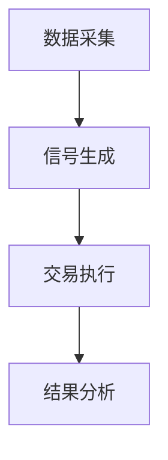

                 


# 如何利用特价股票策略进行反周期投资

> 关键词：特价股票，反周期投资，股票策略，投资组合，风险管理

> 摘要：本文详细探讨了如何利用特价股票策略进行反周期投资，结合数学模型、系统设计和实战案例，分析了在经济低谷期通过特价股票投资以期在经济复苏时获得超额收益的方法，同时提供了风险管理策略和系统架构设计。

---

## 第一章: 特价股票与反周期投资概述

### 1.1 特价股票的基本概念

#### 1.1.1 什么是特价股票
特价股票是指那些市场价格低于其内在价值的股票。这些股票通常被认为被市场低估，具有较大的上涨潜力。投资者通过识别这些股票，可以在市场低估时买入，等待其价值回归时卖出。

#### 1.1.2 特价股票的特点
- **低估性**：市场价格低于内在价值。
- **周期性**：通常出现在经济低谷或市场恐慌时期。
- **高波动性**：价格波动较大，上涨潜力大。

#### 1.1.3 特价股票与普通股票的区别
| 属性       | 特价股票                | 普通股票                |
|------------|-------------------------|-------------------------|
| 价格       | 低于内在价值            | 反映市场供需情况        |
| 波动性      | 高                     | 中等或低               |
| 投资时机   | 经济低谷时买入           | 市场稳定或上涨时买入     |

### 1.2 反周期投资的基本概念

#### 1.2.1 什么是反周期投资
反周期投资是指在经济低迷时期进行投资，以期望在经济复苏时获得超额收益。这种策略利用了市场的非理性下跌，寻找那些在经济周期中表现不佳但具有恢复潜力的资产。

#### 1.2.2 反周期投资的原理
反周期投资的核心在于识别市场底部和低估资产，利用经济周期的波动，在低谷时买入，高点时卖出。这种策略需要对经济周期有深刻的理解，并具备长期持有的耐心。

#### 1.2.3 反周期投资的适用场景
- 经济衰退或低谷时期
- 市场恐慌或抛售时期
- 特定行业或公司的周期性低谷

---

## 第二章: 特价股票的特性与市场分析

### 2.1 特价股票的市场特性

#### 2.1.1 特价股票的市场波动性
特价股票的价格波动较大，容易受到市场情绪和宏观经济因素的影响。在经济低谷时，这些股票可能会出现大幅下跌，但在经济复苏时可能迅速反弹。

#### 2.1.2 特价股票的周期性分析
特价股票的周期性与整体经济周期密切相关。在经济衰退时，许多公司股票可能被低估，而在经济复苏时，这些股票可能恢复其真实价值。

#### 2.1.3 特价股票与宏观经济的关系
宏观经济指标（如GDP增长率、失业率、消费者信心指数）对特价股票的价格有直接影响。在经济低迷时期，投资者可能更倾向于寻找被低估的股票进行投资。

### 2.2 特价股票的市场分析方法

#### 2.2.1 市场趋势分析
通过分析历史价格走势，识别市场的周期性波动，判断当前市场所处的阶段（如熊市或牛市）。

#### 2.2.2 市场情绪分析
利用投资者情绪指标（如恐慌指数VIX）来判断市场的非理性波动，寻找买入机会。

#### 2.2.3 市场周期分析
通过分析经济周期的不同阶段（衰退、复苏、增长、过热），判断哪些行业或股票在特定阶段表现最佳。

---

## 第三章: 反周期投资的基本原理

### 3.1 反周期投资的原理

#### 3.1.1 经济周期与投资的关系
经济周期的波动为投资者提供了在不同阶段进行投资的机会。在衰退期，反周期投资可以捕捉低估资产；在复苏期，投资组合的价值可能迅速回升。

#### 3.1.2 反周期投资的时机选择
- 在市场恐慌时买入：利用市场的非理性下跌，寻找被低估的股票。
- 在经济低谷时持有：耐心等待经济复苏，避免过早卖出。

#### 3.1.3 反周期投资的风险与收益
- **风险**：市场可能长期低迷，导致投资回报延迟。
- **收益**：在经济复苏时获得超额收益，特别是当市场情绪好转时。

### 3.2 特价股票在反周期投资中的作用

#### 3.2.1 特价股票作为反周期投资工具
在经济低谷时，特价股票提供了以低价买入优质资产的机会，为投资者在经济复苏时带来丰厚的回报。

#### 3.2.2 特价股票在经济低谷期的投资机会
- 识别具有强大基本面但被市场低估的公司。
- 投资那些在行业周期中处于底部的公司。

#### 3.2.3 特价股票在经济复苏期的策略调整
- 逐步卖出已升值的股票，锁定利润。
- 调整投资组合，转向更具增长潜力的行业。

---

## 第四章: 特价股票策略的核心概念

### 4.1 特价股票策略的类型与特点

#### 4.1.1 价值型策略
- **定义**：寻找市场价格低于内在价值的股票。
- **特点**：注重公司基本面，如低市盈率、低市净率。
- **实施步骤**：
  1. 计算公司内在价值。
  2. 比较市场价格与内在价值。
  3. 买入低于内在价值的股票。

#### 4.1.2 成长型策略
- **定义**：投资于具有高增长潜力但当前市场价格可能偏高的股票。
- **特点**：注重未来收益，而非当前价值。
- **实施步骤**：
  1. 分析公司未来增长潜力。
  2. 评估市场对其未来增长的预期。
  3. 判断是否市场价格合理。

#### 4.1.3 持股型策略
- **定义**：长期持有优质股票，不论市场波动。
- **特点**：注重公司长期价值，忽略短期波动。
- **实施步骤**：
  1. 选择具有强大竞争优势的公司。
  2. 长期持有，定期再平衡。

---

## 第五章: 反周期投资的核心策略

### 5.1 反周期投资的核心策略

#### 5.1.1 逆向投资策略
- **定义**：在市场恐慌时买入，在市场狂热时卖出。
- **实施步骤**：
  1. 监测市场情绪。
  2. 在市场恐慌时寻找被低估的股票。
  3. 在市场狂热时逐步卖出。

#### 5.1.2 价值发现策略
- **定义**：寻找那些在经济低谷时被市场忽视或低估的优质公司。
- **实施步骤**：
  1. 分析公司财务报表。
  2. 评估公司内在价值。
  3. 买入低于内在价值的股票。

#### 5.1.3 风险控制策略
- **定义**：通过分散投资、设定止损等方式控制投资风险。
- **实施步骤**：
  1. 分散投资于不同行业和资产类别。
  2. 设定止损点，避免重大损失。
  3. 定期评估和调整投资组合。

### 5.2 特价股票在反周期投资中的应用

#### 5.2.1 在经济低谷期的策略
- 选择那些在经济衰退中表现不佳但具有恢复潜力的行业。
- 投资那些具有强大财务状况和低估值的公司。

#### 5.2.2 在经济复苏期的策略
- 逐步卖出已升值的特价股票，锁定利润。
- 调整投资组合，转向增长型股票。

---

## 第六章: 特价股票策略的数学模型与分析

### 6.1 特价股票的数学模型

#### 6.1.1 均值回归模型
- **公式**：$$ P_{未来} = \alpha + \beta P_{当前} + \epsilon $$
- **解释**：模型假设价格会回归其长期均值，其中α为截距，β为回归系数，ε为误差项。

#### 6.1.2 风险调整回报模型
- **公式**：$$ Sharpe Ratio = \frac{E[r_p - r_f]}{\sigma_p} $$
- **解释**：衡量投资回报的风险调整后收益，帮助选择风险效率较高的投资策略。

### 6.2 特价股票策略的分析步骤

#### 6.2.1 数据收集
- 收集历史价格数据、财务报表数据、宏观经济指标等。

#### 6.2.2 模型构建
- 使用回归分析、聚类分析等方法识别被低估的股票。

#### 6.2.3 策略回测
- 使用历史数据验证策略的有效性，计算收益、风险等指标。

---

## 第七章: 反周期投资的系统设计与实现

### 7.1 系统架构设计

#### 7.1.1 系统功能模块
- 数据采集模块：收集股票数据、宏观经济指标等。
- 信号生成模块：根据模型生成买入/卖出信号。
- 交易执行模块：根据信号执行交易。

#### 7.1.2 系统流程图


### 7.2 系统实现

#### 7.2.1 环境配置
- 安装Python、Pandas、NumPy等工具。
- 使用Yahoo Finance API获取数据。

#### 7.2.2 核心代码实现
```python
import pandas as pd
import numpy as np

# 数据获取
data = pd.read_csv('stock_data.csv')

# 计算内在价值
def calculate_intrinsic_value(company_data):
    # 示例：使用股息贴现模型计算内在价值
    return company_data[' dividends'] / (0.1 - company_data[' growth_rate'])

# 筛选特价股票
intrinsic = data.apply(calculate_intrinsic_value)
selected_stocks = data[intrinsic < data['price']]
```

---

## 第八章: 特价股票策略的实战案例

### 8.1 案例分析

#### 8.1.1 项目背景
- 选择2008年金融危机期间的股票市场作为案例。
- 选取金融行业中的代表性公司。

#### 8.1.2 数据分析
- 计算内在价值，比较与市场价格的差异。
- 识别被低估的公司。

#### 8.1.3 策略实施
- 在市场底部买入被低估的股票。
- 在市场复苏时卖出。

---

## 第九章: 总结与展望

### 9.1 总结
- 特价股票策略结合反周期投资，能够在经济低谷时捕捉低估资产，经济复苏时获得超额收益。
- 需要结合数学模型和系统设计，确保策略的有效性和可操作性。

### 9.2 展望
- 进一步优化数学模型，提高策略的准确性。
- 开发自动化交易系统，提升执行效率。
- 拓展至其他资产类别，如房地产、债券等。

---

## 附录: 工具与资源

### 10.1 数据来源
- Yahoo Finance API
- Bloomberg Terminal

### 10.2 工具推荐
- Python编程语言
- Pandas、NumPy等数据处理库
- Matplotlib、Seaborn等可视化工具

### 10.3 进一步阅读
- 《The Intelligent Investor》
- 《The Power of Dividend Growth》

---

## 作者：AI天才研究院 & 禅与计算机程序设计艺术

---

通过本文的详细分析，读者可以系统地了解如何利用特价股票策略进行反周期投资，从理论到实践，结合数学模型和系统设计，为投资者提供了一套可行的操作指南。希望本文能为投资者在复杂多变的市场中提供有价值的参考和指导。

