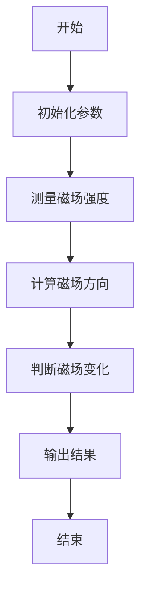
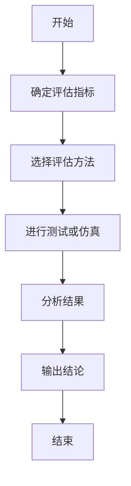
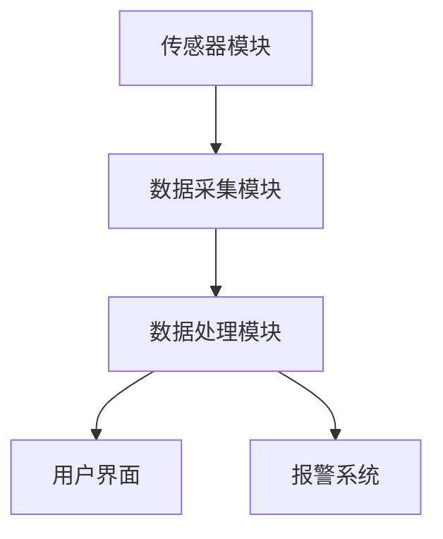

                 


# 如何评估企业的量子传感器磁场探测应用

## 关键词：量子传感器，磁场探测，企业应用，技术评估，系统架构

## 摘要：量子传感器在磁场探测中的应用为企业提供了精确、高效的解决方案，本文将从原理、评估指标、系统架构等方面详细分析，帮助企业有效评估和部署量子传感器技术。

---

## 第1章: 量子传感器与磁场探测基础

### 1.1 量子传感器的基本概念

#### 1.1.1 量子传感器的定义
量子传感器是一种利用量子效应检测物理量（如磁场、重力等）的装置，其灵敏度和精度远超传统传感器。

#### 1.1.2 量子传感器的工作原理
量子传感器通过测量量子系统的状态变化来检测外部磁场。例如，利用自旋量子数的变化或干涉效应。

#### 1.1.3 磁场探测的基本概念
磁场探测是通过传感器检测磁场的强度、方向和变化速率，广泛应用于导航、勘探和医疗等领域。

### 1.2 量子传感器的应用场景

#### 1.2.1 磁场探测在物理学中的应用
用于量子计算、粒子探测等领域，帮助科学家更精确地研究微观世界。

#### 1.2.2 磁场探测在工程中的应用
在制造、能源等领域，用于设备状态监测和缺陷检测。

#### 1.2.3 磁场探测在企业中的实际应用
企业利用量子传感器进行物流追踪、环境监测等，提升生产效率和安全性。

### 1.3 量子传感器磁场探测的核心要素

#### 1.3.1 磁场强度的测量
通过量子干涉效应测量磁场强度，公式为：$$B = \frac{\hbar}{\mu} \cdot \text{相位差}$$。

#### 1.3.2 磁场方向的测量
利用矢量叠加原理，计算磁场方向，公式为：$$\theta = \arctan\left(\frac{B_z}{B_x}\right)$$。

#### 1.3.3 磁场变化的检测
通过时间序列分析，检测磁场变化速率，公式为：$$\frac{dB}{dt} = \frac{\Delta B}{\Delta t}$$。

### 1.4 本章小结
量子传感器在磁场探测中的应用为企业提供了高效解决方案，理解其基本概念和应用场景是评估的第一步。

---

## 第2章: 量子传感器磁场探测的原理与数学模型

### 2.1 量子传感器磁场探测的原理

#### 2.1.1 量子力学基础
量子力学中的自旋和干涉效应是磁场探测的核心原理。

#### 2.1.2 磁场探测的量子效应
利用量子叠加和纠缠效应，实现高灵敏度的磁场测量。

#### 2.1.3 传感器与磁场的相互作用
传感器通过量子位的变化响应磁场变化，公式：$$|\psi\rangle = \alpha|0\rangle + \beta|1\rangle$$。

### 2.2 磁场探测的数学模型

#### 2.2.1 磁场强度的数学表达
磁场强度通过量子传感器的输出信号建模，公式：$$B = k \cdot \text{信号强度}$$。

#### 2.2.2 磁场方向的数学描述
使用三维向量表示磁场方向，公式：$$\mathbf{B} = (B_x, B_y, B_z)$$。

#### 2.2.3 磁场变化的数学模型
通过微分方程建模磁场变化，公式：$$\frac{dB}{dt} = f(t)$$。

### 2.3 算法原理与流程图

#### 2.3.1 算法原理
量子传感器测量磁场的步骤：初始化、测量、计算、输出。

#### 2.3.2 算法流程图


### 2.4 本章小结
数学模型和算法是评估量子传感器性能的核心，理解这些原理有助于制定评估策略。

---

## 第3章: 量子传感器磁场探测的评估指标与方法

### 3.1 评估指标

#### 3.1.1 灵敏度
传感器能检测到的最小磁场变化，单位为特斯拉。

#### 3.1.2 精度
测量值与真实值的接近程度，通常以百分比表示。

#### 3.1.3 响应时间
传感器从检测到信号到输出结果的时间，单位为毫秒。

### 3.2 评估方法

#### 3.2.1 理论分析法
通过数学模型预测传感器性能，适用于初步评估。

#### 3.2.2 实验测试法
在实际环境中测试传感器的性能，验证理论分析。

#### 3.2.3 模拟仿真法
使用仿真软件模拟各种场景，评估传感器表现。

### 3.3 评估流程图



### 3.4 本章小结
科学的评估方法和指标是确保量子传感器在企业中有效应用的关键。

---

## 第4章: 量子传感器磁场探测的系统架构设计

### 4.1 系统组成

#### 4.1.1 传感器模块
负责采集磁场数据，通常包括量子传感器芯片和前置放大器。

#### 4.1.2 数据采集模块
处理传感器输出的信号，转换为数字信号。

#### 4.1.3 数据处理模块
对数字信号进行分析，计算磁场参数。

#### 4.1.4 用户界面
展示测量结果，供用户查看和操作。

### 4.2 系统功能设计

#### 4.2.1 实时监测
连续采集和显示磁场数据，支持实时监控。

#### 4.2.2 数据记录
将测量数据存储为文件，便于后续分析。

#### 4.2.3 报警功能
当磁场强度超过阈值时，触发报警。

### 4.3 系统架构图



### 4.4 本章小结
合理的系统架构设计是确保量子传感器磁场探测应用稳定运行的基础。

---

## 第5章: 量子传感器磁场探测的项目实战

### 5.1 环境搭建

#### 5.1.1 硬件安装
安装量子传感器和相关设备，确保其正常工作。

#### 5.1.2 软件安装
安装数据采集和处理软件，配置系统参数。

### 5.2 核心实现

#### 5.2.1 数据采集代码
使用Python编写数据采集脚本，代码如下：
```python
import serial

ser = serial.Serial('COM3', 9600)
while True:
    data = ser.readline()
    print(data)
```

#### 5.2.2 数据处理代码
对采集到的数据进行处理，计算磁场参数：
```python
import numpy as np

data = np.array([...])
B = np.mean(data)
print(f"磁场强度: {B} Tesla")
```

### 5.3 实际案例分析

#### 5.3.1 案例背景
在制造业中，使用量子传感器监测设备状态，预防故障。

#### 5.3.2 数据分析
通过分析磁场变化，发现潜在问题，优化生产流程。

### 5.4 本章小结
项目实战验证了量子传感器的应用价值，帮助企业提升效率和安全性。

---

## 第6章: 总结与展望

### 6.1 总结
量子传感器在磁场探测中的应用为企业提供了高效、精确的解决方案，理解其原理和评估方法是成功应用的关键。

### 6.2 展望
未来，量子传感器技术将进一步发展，应用领域将更加广泛，帮助企业实现更智能化的管理。

### 6.3 最佳实践 tips
- 选择合适的传感器类型，根据需求调整参数。
- 定期校准传感器，确保测量精度。
- 建立完善的系统架构，确保数据安全和稳定运行。

### 6.4 注意事项
- 避免传感器受到外部干扰，影响测量结果。
- 系统设计中考虑扩展性，便于后续升级和维护。

### 6.5 拓展阅读
推荐阅读《量子传感器技术与应用》和《磁场探测的理论与实践》，深入了解相关知识。

---

## 作者：AI天才研究院/AI Genius Institute & 禅与计算机程序设计艺术 /Zen And The Art of Computer Programming

---

以上内容涵盖了量子传感器磁场探测应用的各个方面，从基本概念到系统设计，再到项目实战，帮助企业在评估和部署量子传感器技术时做出明智决策。

