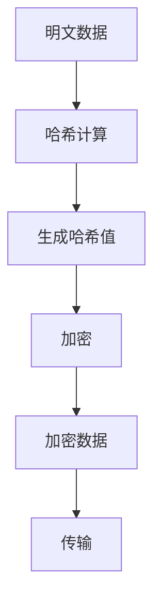
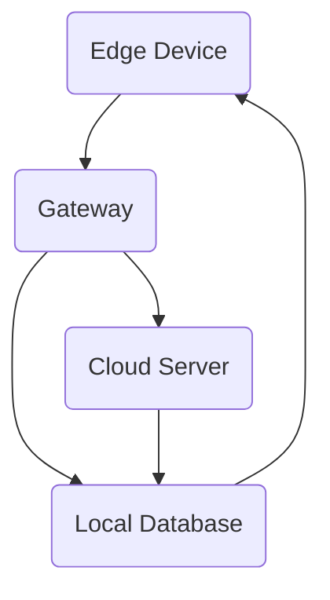

                 


# 如何识别企业的边缘计算安全优势

---

## 关键词：边缘计算，安全优势，企业安全，算法原理，系统架构，安全解决方案

---

## 摘要

边缘计算作为一种新兴的计算范式，正在改变企业的数字化转型方式。随着边缘设备的普及和物联网技术的发展，边缘计算在企业中的应用越来越广泛。然而，边缘计算的安全性问题也随之凸显。本文将从边缘计算的背景与概念出发，深入分析其安全优势的核心要素，探讨相关算法原理与系统架构设计，并通过实际案例展示如何识别和利用边缘计算的安全优势，为企业提供可行的安全解决方案。

---

## 第一部分：边缘计算安全的背景与概念

### 第1章：边缘计算与安全概述

#### 1.1 边缘计算的定义与特点

边缘计算是一种分布式计算范式，将计算能力从中心服务器迁移到靠近数据源的边缘设备。其特点包括：

- **分布式架构**：数据在边缘设备上进行处理，减少对中心服务器的依赖。
- **低延迟**：边缘计算能够实时处理数据，降低延迟，提高响应速度。
- **数据隐私**：数据在边缘设备上进行处理，减少了数据传输到云端的可能性，提高了数据隐私性。

#### 1.2 边缘计算的安全挑战

尽管边缘计算具有诸多优势，但也面临诸多安全挑战：

- **设备安全性**：边缘设备可能面临物理攻击或恶意软件的威胁。
- **数据隐私**：边缘计算需要处理大量敏感数据，如何确保数据隐私是一个难题。
- **通信安全**：边缘设备与云端或其它设备之间的通信可能面临中间人攻击或数据篡改的风险。

#### 1.3 企业边缘计算安全的重要性

在企业数字化转型中，边缘计算的应用越来越广泛，其安全性对企业的发展至关重要：

- **企业竞争力**：安全的边缘计算能够提高企业的数据处理效率和决策能力。
- **合规性**：企业需要满足数据隐私和合规性的要求，确保其业务的合法性。
- **未来趋势**：随着物联网和人工智能的发展，边缘计算将成为企业数字化转型的重要组成部分。

---

## 第二部分：边缘计算安全的核心概念与原理

### 第2章：边缘计算安全的核心概念

#### 2.1 边缘计算安全的关键要素

边缘计算安全的关键要素包括：

- **边缘设备的安全性**：确保边缘设备免受恶意攻击和未经授权的访问。
- **数据完整性与机密性**：确保数据在传输和存储过程中不被篡改或泄露。
- **身份认证**：确保只有授权的用户或设备能够访问边缘设备和数据。

#### 2.2 边缘计算安全的属性对比

以下是边缘计算安全属性的对比分析：

- **数据隐私与数据可用性**：数据隐私优先于数据可用性，但两者需要在一定程度上进行平衡。
- **信任模型**：边缘计算的信任模型需要考虑设备之间的互信和数据共享的授权。
- **安全性与性能的权衡**：为了提高安全性，可能需要在性能上进行一定的妥协，反之亦然。

#### 2.3 边缘计算安全的ER实体关系图

以下是边缘计算安全的ER实体关系图：

```mermaid
erDiagram
   设备(Edge Device) --> 用户(User): 访问
    用户(User) --> 数据(Data): 拥有
    数据(Data) --> 设备(Edge Device): 存储于
    设备(Edge Device) --> 云端(Cloud): 通信
```

---

## 第三部分：边缘计算安全的算法原理

### 第3章：边缘计算安全的核心算法

#### 3.1 加密算法在边缘计算中的应用

边缘计算中常用的加密算法包括对称加密和非对称加密：

- **对称加密算法（如AES）**：适用于数据加密，速度快，适合大规模数据加密。
- **非对称加密算法（如RSA）**：适用于身份认证和数字签名，安全性高，但速度较慢。

#### 3.2 哈希函数与数字签名

哈希函数用于将数据转换为固定长度的哈希值，数字签名用于验证数据的完整性和真实性。

- **哈希函数**：$$H(m) = s$$，其中$$H$$是哈希函数，$$m$$是消息，$$s$$是哈希值。
- **数字签名**：$$S = Sign_{\text{私钥}}(m)$$，$$\text{验证}：Verify_{\text{公钥}}(S, m)$$

#### 3.3 加密流程图

以下是加密流程图：



---

## 第四部分：系统分析与架构设计方案

### 第4章：边缘计算安全的系统架构设计

#### 4.1 问题场景介绍

企业边缘计算环境中，设备需要与云端进行通信，数据需要在设备间共享。为了确保数据的安全性，需要设计一个安全的系统架构。

#### 4.2 系统功能设计

系统功能包括设备管理、数据加密、身份认证和入侵检测。

#### 4.3 系统架构设计

以下是系统架构设计：



---

## 第五部分：项目实战

### 第5章：边缘计算安全的项目实战

#### 5.1 环境安装

- 操作系统：Linux
- 工具：Python、OpenSSL

#### 5.2 核心代码实现

以下是加密算法的Python代码示例：

```python
import hashlib

def hash_function(message):
    # 计算哈希值
    hash_object = hashlib.sha256(message.encode())
    return hash_object.hexdigest()

# 示例
message = "Hello, World!"
print(hash_function(message))  # 输出哈希值
```

#### 5.3 代码解读与分析

上述代码实现了哈希函数的计算，适用于边缘设备中的数据加密。代码简洁高效，适用于大规模数据加密。

---

## 第六部分：最佳实践与总结

### 第6章：边缘计算安全的最佳实践

#### 6.1 小结

边缘计算的安全优势在于其分布式架构和低延迟特性，但同时也面临设备安全和数据隐私的挑战。

#### 6.2 注意事项

- 定期更新密钥和证书
- 监控边缘设备的日志
- 培训员工的安全意识

#### 6.3 拓展阅读

- 《网络安全实战指南》
- 《边缘计算与物联网安全》

---

## 作者：AI天才研究院 & 禅与计算机程序设计艺术

---

本文通过系统化的分析与实战，深入探讨了如何识别企业的边缘计算安全优势。希望本文能为企业在边缘计算的安全实践中提供有价值的参考与指导。

