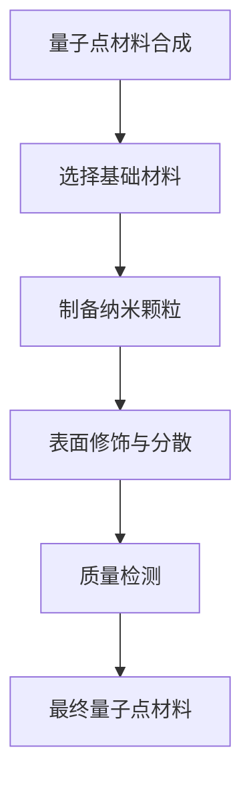
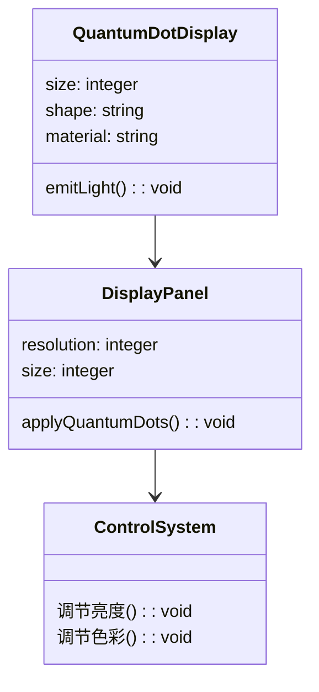
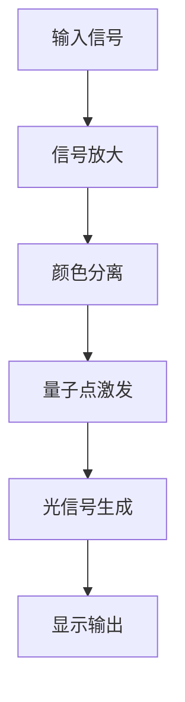
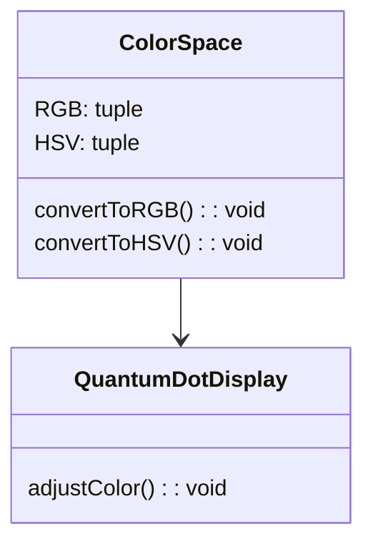
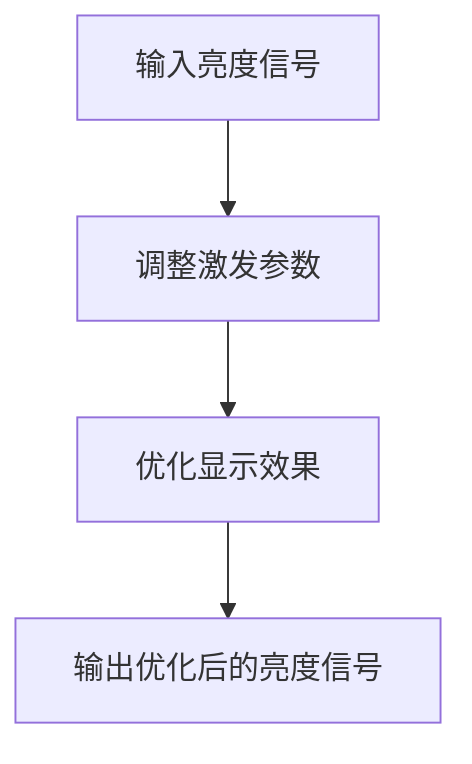
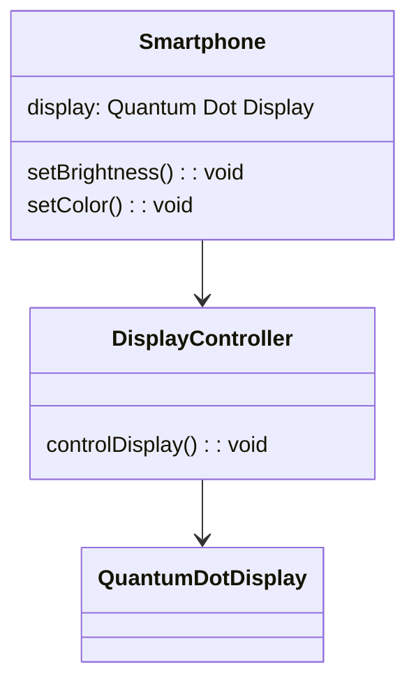
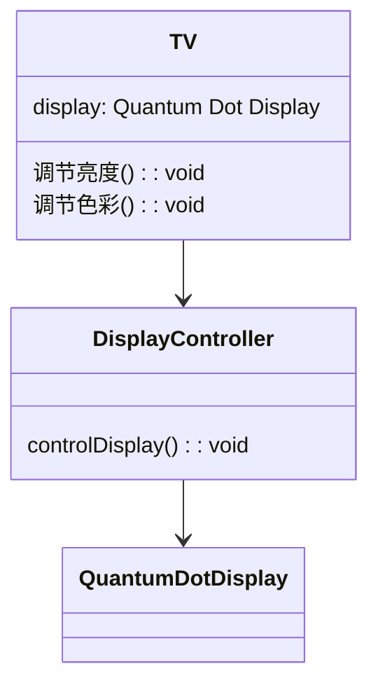

                 

# 如何识别企业的量子点显示技术优势

---

## 关键词：量子点显示技术、企业优势、显示技术、性能分析、市场竞争

---

## 摘要：本文深入分析了量子点显示技术的核心原理、优势特点及其在企业中的应用价值。通过对比传统显示技术，详细探讨了量子点显示技术在色彩表现、亮度、寿命等方面的性能优势，并结合实际案例，为企业识别和提升量子点显示技术优势提供了系统化的指导和建议。

---

## 第1章: 量子点显示技术概述

### 1.1 量子点显示技术的定义与背景

量子点显示技术是一种基于纳米级半导体材料的显示技术，通过精确控制纳米粒子的尺寸和形状，实现对颜色和亮度的精准调控。与传统显示技术相比，量子点显示技术具有更高的色域覆盖率、更长的使用寿命和更高的能效比。

#### 表1-1: 量子点显示技术与传统显示技术的对比

| 特性               | LCD           | OLED          | Quantum Dot Display |
|--------------------|---------------|---------------|---------------------|
| 色彩表现           | 较低          | 中等           | 高                  |
| 亮度               | 较低          | 较低           | 高                  |
| 寿命               | 较短          | 较短           | 长                  |
| 响应时间           | 较慢          | 中等           | 快                  |
| 能效               | 较低          | 中等           | 高                  |

### 1.2 量子点显示技术的核心优势

1. **高色域与广色域显示**：量子点显示技术能够实现超过100%的NTSC色域覆盖率，显著提升了显示效果的鲜艳度和真实感。
2. **高亮度与低能耗**：量子点材料具有更高的发光效率，能够在较低功耗下实现高亮度显示。
3. **长寿命与稳定性**：量子点材料具有较长的使用寿命，且在长时间使用后色彩保持度较高。

### 1.3 量子点显示技术的市场现状

1. **全球显示技术市场的竞争格局**：量子点显示技术在全球范围内逐步普及，主要应用于高端智能手机、平板电脑和电视等领域。
2. **量子点技术在市场中的应用案例**：例如，三星、LG等企业在高端电视产品中采用了量子点显示技术，显著提升了产品的市场竞争力。
3. **未来显示技术的发展趋势**：量子点显示技术有望在未来进一步与其他显示技术（如Micro-OLED和激光显示）结合，形成更加多样化的显示解决方案。

---

## 第2章: 量子点显示技术的核心原理

### 2.1 量子点的物理特性与发光机制

量子点是一种纳米级半导体材料，其发光原理基于量子限域效应。当电子受到激发后，量子点材料中的电子跃迁会释放特定波长的光，从而实现发光。

#### 图2-1: 量子点材料的合成过程（mermaid流程图）

量子点的发光波长可以通过调整纳米颗粒的尺寸和形状来实现调控。例如，较大的纳米颗粒发射较长的波长（红色），而较小的纳米颗粒发射较短的波长（蓝色）。

### 2.2 量子点显示技术的实现过程

#### 图2-2: 量子点显示系统的架构（mermaid类图）

量子点显示技术的核心实现过程包括量子点材料的合成、显示面板的设计和控制系统的优化。通过将量子点材料集成到显示面板中，并利用控制系统对亮度和色彩进行调节，从而实现高质量的显示效果。

### 2.3 量子点显示技术的系统架构

#### 图2-3: 量子点显示系统的信号处理流程（mermaid流程图）

量子点显示系统通过将输入信号进行处理，利用量子点材料的发光特性生成高质量的光信号，并最终实现显示输出。该过程包括信号放大、颜色分离、量子点激发和光信号生成等关键步骤。

---

## 第3章: 量子点显示技术的核心算法与数学模型

### 3.1 量子点显示技术的色彩空间模型

#### 图3-1: 色彩空间模型（mermaid类图）

量子点显示技术的色彩空间模型通过调整RGB和HSV参数，实现对显示色彩的精准控制。数学模型如下：

$$
\text{RGB}(R, G, B) = \text{convertToRGB}(\text{HSV}(H, S, V))
$$

### 3.2 量子点显示技术的亮度优化算法

亮度优化算法通过调整量子点材料的激发参数，实现高亮度和低能耗的显示效果。算法步骤如下：

1. **输入亮度信号**：接收原始亮度信号。
2. **调整激发参数**：根据亮度需求调整量子点材料的激发强度。
3. **优化显示效果**：通过反馈机制优化亮度输出，确保显示效果最佳。

#### 图3-2: 亮度优化算法流程图（mermaid流程图）

---

## 第4章: 量子点显示技术的性能分析与优化

### 4.1 量子点显示技术的性能指标

1. **色彩表现**：量子点显示技术能够实现高色域覆盖率，显著提升显示效果的鲜艳度和真实感。
2. **亮度**：量子点显示技术能够在较低功耗下实现高亮度显示，显著降低了能耗。
3. **寿命**：量子点显示技术具有较长的使用寿命，且在长时间使用后色彩保持度较高。
4. **响应时间**：量子点显示技术的响应时间较短，能够实现流畅的画面切换。

### 4.2 量子点显示技术的优化策略

1. **优化色彩空间模型**：通过调整RGB和HSV参数，实现对显示色彩的精准控制。
2. **优化亮度控制算法**：通过调整激发参数和反馈机制，实现高亮度和低能耗的显示效果。
3. **优化系统架构设计**：通过优化显示面板的设计和控制系统，提升整体显示效果和能效比。

---

## 第5章: 量子点显示技术的应用案例与市场分析

### 5.1 量子点显示技术在智能手机中的应用

#### 图5-1: 智能手机量子点显示技术的实现架构（mermaid类图）

量子点显示技术在智能手机中的应用主要体现在高色域显示、高亮度和低能耗等方面。例如，三星的Galaxy系列高端智能手机采用了量子点显示技术，显著提升了显示效果。

### 5.2 量子点显示技术在电视中的应用

#### 图5-2: 电视量子点显示技术的实现架构（mermaid类图）

量子点显示技术在电视中的应用主要体现在高色域显示和广视角等方面。例如，LG的高端电视产品采用了量子点显示技术，显著提升了显示效果。

---

## 第6章: 量子点显示技术的未来发展趋势与挑战

### 6.1 量子点显示技术的未来发展趋势

1. **技术融合**：量子点显示技术将进一步与其他显示技术（如Micro-OLED和激光显示）融合，形成更加多样化的显示解决方案。
2. **材料创新**：量子点材料的合成和制备技术将进一步优化，实现更高性能的显示效果。
3. **市场拓展**：量子点显示技术将在更多领域（如医疗显示和工业显示）得到应用，进一步拓展市场空间。

### 6.2 量子点显示技术面临的挑战

1. **技术瓶颈**：量子点显示技术的制造成本较高，且存在一定的技术壁垒。
2. **市场竞争**：量子点显示技术面临来自其他显示技术的激烈竞争，如何在市场竞争中保持优势是一个重要挑战。
3. **标准制定**：量子点显示技术的相关标准尚未完善，如何制定统一的标准是一个重要问题。

---

## 结语

量子点显示技术作为一种新兴的显示技术，具有广阔的应用前景和巨大的市场潜力。通过识别和提升量子点显示技术的优势，企业可以在激烈的市场竞争中占据优势地位。未来，随着技术的不断进步和市场的进一步拓展，量子点显示技术有望在更多领域得到应用，为显示技术的发展注入新的活力。

---

## 作者：AI天才研究院/AI Genius Institute & 禅与计算机程序设计艺术 /Zen And The Art of Computer Programming

