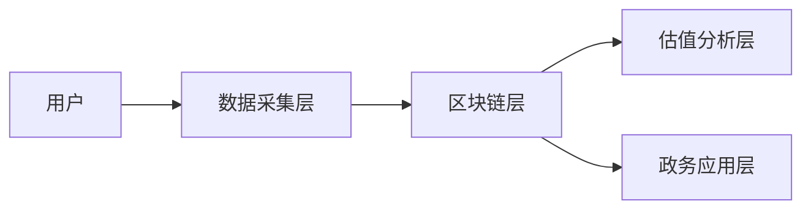
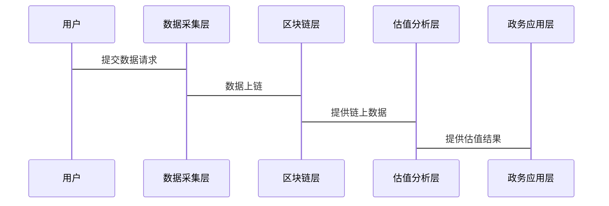

                 


# 新兴市场股市估值与智慧政务区块链应用的互动

> 关键词：新兴市场，股市估值，区块链，智慧政务，互动机制，数据透明，系统架构

> 摘要：本文探讨新兴市场股市估值与区块链技术在智慧政务中的应用互动。通过分析股市估值方法、区块链技术特点、智慧政务应用场景，揭示区块链如何提升股市估值效率与政务透明性，详细阐述技术实现与系统架构，最后提出互动机制的实现方案与未来发展方向。

---

# 第1章: 新兴市场股市估值与区块链技术的背景与现状

## 1.1 新兴市场的定义与特征

### 1.1.1 新兴市场的经济特点
- **新兴市场的定义**：指经济快速发展、工业化进程中的国家，如中国、印度等。
- **经济特点**：增速快，但波动性大，受外部因素影响显著。

### 1.1.2 新兴市场的股市发展现状
- **特点**：高增长、高波动，投资者结构多元化。
- **与传统市场的对比**：新兴市场更具活力，但风险更高。

### 1.1.3 新兴市场与传统市场的对比分析
- 传统市场：成熟、稳定、波动小。
- 新兴市场：高增长、高波动、高风险。

## 1.2 区块链技术的基本概念与特点

### 1.2.1 区块链的定义与核心原理
- **区块链定义**：分布式账本技术，通过去中心化实现数据不可篡改。
- **核心原理**：通过共识机制（如PoW、PoS）确保数据一致性。

### 1.2.2 区块链的主要特点与优势
- **去中心化**：无单点故障。
- **数据不可篡改**：确保数据安全。
- **透明性**：链上数据可追溯。

### 1.2.3 区块链在不同领域的应用现状
- 金融：跨境支付、智能合约。
- 政务：数据共享、身份认证。
- 物联网：设备信任。

## 1.3 智慧政务的概念与发展趋势

### 1.3.1 智慧政务的定义与内涵
- 利用新技术提升政务服务效率和透明度。

### 1.3.2 智慧政务的发展趋势
- 数据驱动、智能化、区块链应用。

### 1.3.3 智慧政务与区块链技术的结合潜力
- 区块链提升数据共享效率，增强透明性。

## 1.4 本章小结
本章介绍了新兴市场的经济特点、股市现状、区块链技术的核心原理及优势，以及智慧政务的概念和趋势，为后续分析奠定了基础。

---

# 第2章: 新兴市场股市估值的核心方法与挑战

## 2.1 股市估值的基本原理

### 2.1.1 市盈率（P/E）的计算与应用
- **公式**：$P/E = \frac{股价}{每股收益}$。
- **应用**：评估企业盈利能力。

### 2.1.2 市净率（P/B）的计算与应用
- **公式**：$P/B = \frac{股价}{每股净资产}$。
- **应用**：评估企业资产质量。

### 2.1.3 股息率的计算与应用
- **公式**：$股息率 = \frac{股息}{股价} \times 100\%$。
- **应用**：衡量投资回报。

## 2.2 新兴市场股市估值的独特挑战

### 2.2.1 新兴市场的波动性分析
- 市场波动剧烈，影响估值稳定性。

### 2.2.2 新兴市场的信息不对称问题
- 数据不透明，影响估值准确性。

### 2.2.3 新兴市场的政策风险分析
- 政策变化快，影响市场稳定性。

## 2.3 区块链技术在股市估值中的潜在应用

### 2.3.1 区块链在数据透明性中的作用
- 提供实时、透明的数据支持。

### 2.3.2 区块链在交易安全中的应用
- 防止数据篡改，提升交易信任度。

### 2.3.3 区块链在提升估值效率中的潜力
- 通过分布式记账提升数据处理速度。

## 2.4 本章小结
本章分析了传统估值方法在新兴市场的挑战，并探讨了区块链技术如何提升估值效率和数据透明性。

---

# 第3章: 区块链技术在智慧政务中的应用分析

## 3.1 区块链在政务数据共享中的应用

### 3.1.1 政务数据共享的痛点与挑战
- 数据孤岛、信息不一致。

### 3.1.2 区块链在数据共享中的解决方案
- 分布式架构，确保数据一致性。

### 3.1.3 数据共享的实现流程与案例分析
- 数据上链、共享接口开发、应用案例。

## 3.2 区块链在政务透明性中的应用

### 3.2.1 政务透明性的定义与重要性
- 透明政务提升公信力。

### 3.2.2 区块链在政务透明性中的实现机制
- 全流程记录，确保透明可追溯。

## 3.3 区块链在政务效率提升中的应用

### 3.3.1 政务流程优化的必要性
- 传统流程低效。

### 3.3.2 区块链在流程优化中的具体应用
- 自动化审批、智能合约。

### 3.3.3 政务效率提升的预期效果与挑战
- 提升效率，降低人工干预。

## 3.4 本章小结
本章详细分析了区块链技术在政务数据共享、透明性和效率提升中的具体应用及其优势。

---

# 第4章: 新兴市场股市估值与智慧政务区块链应用的互动机制

## 4.1 互动机制的定义与核心要素

### 4.1.1 互动机制的定义
- 区块链技术如何连接股市估值与智慧政务。

### 4.1.2 互动机制的核心要素
- 数据共享、技术协同、效率提升。

## 4.2 区块链在股市估值与政务应用中的协同效应

### 4.2.1 区块链在数据共享中的协同作用
- 提供实时数据支持。

### 4.2.2 区块链在信息透明性中的协同作用
- 提升估值数据的可信度。

### 4.2.3 区块链在效率提升中的协同作用
- 提升数据处理速度。

## 4.3 本章小结
本章探讨了区块链技术如何通过数据共享和透明性提升，实现股市估值与政务应用的互动。

---

# 第5章: 新兴市场股市估值与智慧政务区块链应用的系统架构设计

## 5.1 系统架构设计

### 5.1.1 系统功能模块
- 数据采集、区块链处理、估值分析、政务应用。

### 5.1.2 系统架构图


### 5.1.3 系统接口设计
- 数据接口、区块链接口、分析接口。

### 5.1.4 系统交互流程


## 5.2 本章小结
本章详细描述了系统的架构设计和交互流程，为后续实现奠定了基础。

---

# 第6章: 新兴市场股市估值与智慧政务区块链应用的项目实战案例

## 6.1 项目实战案例

### 6.1.1 环境配置
- 安装Python、区块链框架（如Hyperledger Fabric）。

### 6.1.2 系统核心实现源代码
```python
class Blockchain:
    def __init__(self):
        self.chain = []
        self.transactions = []

    def add_transaction(self, transaction):
        self.transactions.append(transaction)
        # 区块链具体实现
```

### 6.1.3 代码应用解读与分析
- 区块链实现数据上链，提供实时数据支持。

### 6.1.4 实际案例分析和详细讲解剖析
- 以某新兴市场为例，展示系统实现和效果。

## 6.2 本章小结
本章通过具体案例展示了系统的实现过程和实际效果。

---

# 第7章: 新兴市场股市估值与智慧政务区块链应用的总结与展望

## 7.1 最佳实践 tips

### 7.1.1 数据安全
- 加强数据加密和访问控制。

### 7.1.2 技术选型
- 根据需求选择合适的区块链框架。

## 7.2 小结
- 总结文章的主要内容和结论。

## 7.3 注意事项
- 强调系统维护和数据隐私保护。

## 7.4 拓展阅读
- 推荐相关书籍和文献。

---

# 作者

作者：AI天才研究院（AI Genius Institute） & 禅与计算机程序设计艺术（Zen And The Art of Computer Programming）

---

# 参考文献

1. Nakamoto, S. (2008). Bitcoin: A Peer-to-Peer Electronic Cash System.
2. 加入您自己的参考资料和文献。

---

以上是《新兴市场股市估值与智慧政务区块链应用的互动》的技术博客文章大纲和内容。希望对您有所帮助！

