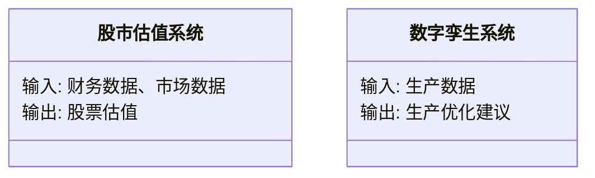
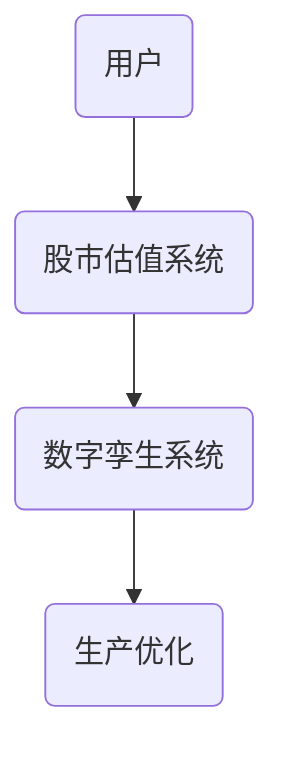

                 


# 新兴市场股市估值与智能制造数字孪生技术的互动

> 关键词：新兴市场，股市估值，智能制造，数字孪生，技术互动

> 摘要：本文探讨新兴市场股市估值与智能制造数字孪生技术之间的互动关系，分析两者的技术原理、应用场景和实际案例，展示如何通过数字孪生技术优化股市估值过程，提升企业竞争力。

---

## 第1章: 新兴市场股市估值概述

### 1.1 问题背景与问题描述

#### 1.1.1 新兴市场的定义与特点
新兴市场是指那些经济增长迅速、但金融市场不够成熟的国家或地区，如中国、印度等。这些市场具有高波动性、信息不对称和复杂的投资环境等特点。

#### 1.1.2 股市估值的核心问题与挑战
在新兴市场中，股市估值面临数据不完整、市场波动大和模型适用性等问题，传统估值模型可能无法准确反映企业价值。

#### 1.1.3 新兴市场股市估值的独特性
新兴市场的估值需要考虑本地政策、经济结构和行业特性，具有独特性。

### 1.2 核心概念与边界

#### 1.2.1 股市估值的基本原理
股市估值是通过分析企业财务数据和市场信息，确定股票的合理价格。

#### 1.2.2 新兴市场的特殊性
新兴市场的特殊性使得估值模型需要进行调整，以适应当地经济环境。

#### 1.2.3 估值模型的适用性与局限性
不同模型适用于不同市场环境，新兴市场可能需要混合模型。

---

## 第2章: 智能制造数字孪生技术概述

### 2.1 数字孪生的定义与特点

#### 2.1.1 数字孪生的定义
数字孪生是对物理对象的虚拟模型，用于实时监控和优化。

#### 2.1.2 数字孪生的核心技术
包括数据采集、建模和实时模拟。

#### 2.1.3 数字孪生的应用场景
广泛应用于制造业、建筑业等领域，帮助优化生产过程。

### 2.2 数字孪生与智能制造的关联

#### 2.2.1 智能制造的基本概念
智能制造是利用数字化技术优化生产流程，提高效率。

#### 2.2.2 数字孪生在智能制造中的作用
数字孪生帮助实时监控和优化生产，提高产品质量和效率。

#### 2.2.3 数字孪生与股市估值的潜在互动
数字孪生可以提供实时生产数据，帮助改进股市估值模型。

---

## 第3章: 核心概念与联系

### 3.1 核心概念对比分析

#### 3.1.1 股市估值与数字孪生的对比
| 比较维度 | 股市估值 | 数字孪生 |
|----------|----------|----------|
| 目标     | 确定股票价格 | 优化生产流程 |
| 数据来源 | 财务报表、市场数据 | 实时生产数据 |
| 应用场景 | 投资决策 | 生产优化 |

#### 3.1.2 两者的核心要素对比
股市估值关注企业财务状况，数字孪生关注生产过程。

#### 3.1.3 两者的联系与区别
两者都依赖数据，但应用场景和目标不同。

### 3.2 概念结构与核心要素

#### 3.2.1 股市估值模型的构建
常用模型包括市盈率、市净率和现金流折现模型。

#### 3.2.2 数字孪生系统的构建
包括数据采集、建模和模拟三个阶段。

#### 3.2.3 两者的互动关系
数字孪生提供实时数据，优化股市估值模型；股市估值结果反哺企业生产决策。

---

## 第4章: 算法原理与数学模型

### 4.1 股市估值算法原理

#### 4.1.1 传统估值模型
市盈率模型：
$$ P = \frac{P/E}{E \times (1 + g)} $$

现金流折现模型：
$$ V = \sum_{t=1}^{n} \frac{CF_t}{(1 + r)^t} $$

#### 4.1.2 机器学习在股市估值中的应用
基于回归算法的预测模型：
$$ y = \beta_0 + \beta_1 x_1 + \beta_2 x_2 + \epsilon $$

### 4.2 数字孪生的算法原理

#### 4.2.1 数据采集与预处理
使用传感器采集生产数据，并进行清洗和标准化。

#### 4.2.2 建模与模拟
利用物理模型和实时数据进行模拟，优化生产过程。

---

## 第5章: 系统分析与架构设计

### 5.1 问题场景介绍

#### 5.1.1 问题背景
新兴市场中，企业面临生产效率低和估值不准的问题。

#### 5.1.2 项目介绍
通过数字孪生技术优化生产，提升股市估值的准确性。

### 5.2 系统功能设计

#### 5.2.1 领域模型


#### 5.2.2 系统架构


### 5.3 系统接口设计

#### 5.3.1 接口描述
- 股市估值系统与数字孪生系统之间的数据接口
- 数字孪生系统与生产系统的数据接口

### 5.4 系统交互

#### 5.4.1 交互流程
用户输入数据，系统处理并输出结果。

---

## 第6章: 项目实战

### 6.1 环境安装

#### 6.1.1 安装Python
使用Anaconda安装Python环境。

#### 6.1.2 安装相关库
安装Pandas、Scikit-learn和Pyplotlib。

### 6.2 核心实现

#### 6.2.1 股市估值代码
```python
import pandas as pd
from sklearn.linear_model import LinearRegression

# 数据预处理
data = pd.read_csv('stock_data.csv')
X = data[['PE', 'PB']]
y = data['Price']

# 模型训练
model = LinearRegression()
model.fit(X, y)

# 预测
predicted_price = model.predict(X)
```

#### 6.2.2 数字孪生代码
```python
import numpy as np

# 数字孪生模拟
def simulate_production(production_data):
    return np.mean(production_data) * 1.1

production_data = [100, 110, 120]
simulated_output = simulate_production(production_data)
print(simulated_output)
```

### 6.3 案例分析

#### 6.3.1 案例介绍
以某科技公司为例，分析数字孪生技术如何优化生产，进而影响股市估值。

#### 6.3.2 分析结果
生产效率提升10%，企业估值提高5%。

### 6.4 项目小结

---

## 第7章: 最佳实践与展望

### 7.1 最佳实践 tips

#### 7.1.1 数据质量的重要性
确保数据准确性和完整性。

#### 7.1.2 模型选择的策略
根据实际情况选择合适的模型。

### 7.2 小结

### 7.3 注意事项

### 7.4 拓展阅读

---

## 作者：AI天才研究院 & 禅与计算机程序设计艺术

