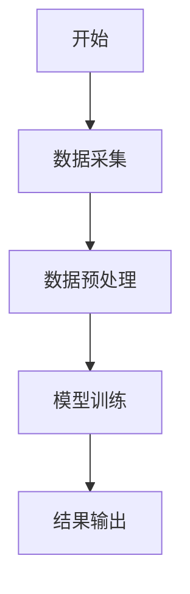
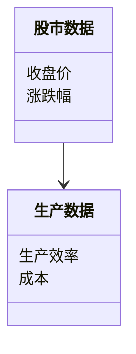

                 


# 新兴市场股市估值与智能制造柔性生产线的互动

## 关键词：
- 新兴市场
- 股市估值
- 智能制造
- 柔性生产线
- 互动关系

## 摘要：
本文探讨新兴市场股市估值与智能制造柔性生产线之间的互动关系。通过分析股市估值的核心要素、智能制造柔性生产线的技术特点，揭示两者如何相互影响。结合数学模型和实际案例，展示如何利用数据驱动的方法优化生产效率，提升企业价值。

---

# 第一章: 新兴市场股市估值与智能制造柔性生产线的互动概述

## 1.1 背景介绍

### 1.1.1 新兴市场的定义与特点
新兴市场是指那些经济增长迅速、产业结构转型中的国家，如中国、印度等。这些市场具有较高的增长率和未成熟的资本市场，为企业提供了广阔的发展空间。

### 1.1.2 智能制造柔性生产线的定义与特点
智能制造柔性生产线是指能够灵活调整生产流程，适应多样化需求的生产线。其特点包括自动化、智能化和高度定制化。

### 1.1.3 股市估值与智能制造的互动关系
股市估值受企业生产效率影响，而智能制造柔性生产线能够提高效率，降低成本，从而影响股市估值。

## 1.2 核心概念与问题描述

### 1.2.1 股市估值的核心要素
- 每股收益（EPS）
- 市盈率（P/E）
- 市净率（P/B）

### 1.2.2 柔性生产线的核心要素
- 自动化设备
- 数据采集与分析
- 软件控制系统

### 1.2.3 问题背景与问题解决
- 背景：新兴市场中，企业如何通过智能制造提升竞争力。
- 解决：优化生产流程，降低成本，提升效率。

---

# 第二章: 核心概念与联系

## 2.1 核心概念原理

### 2.1.1 股市估值的数学模型
$$P = \frac{E}{\epsilon}$$
其中，P为股票价格，E为每股收益，$\epsilon$为折现率。

### 2.1.2 柔性生产线的生产效率模型
$$E = \frac{Q}{T}$$
其中，E为效率，Q为产量，T为时间。

## 2.2 概念属性特征对比

### 2.2.1 股市估值与生产效率的对比
| 属性 | 股市估值 | 生产效率 |
|------|----------|----------|
| 核心指标 | EPS, P/E | Q/T      |
| 影响因素 | 市场情绪 | 技术水平 |

### 2.2.3 ER实体关系图
```mermaid
er
  actor 股市估值者 {
    <--- 关联 柔性生产线
    <--- 关联 生产成本
  }
  actor 生产线管理者 {
    <--- 关联 生产效率
    <--- 关联 生产成本
  }
```

---

# 第三章: 算法原理与数学模型

## 3.1 算法原理

### 3.1.1 股市估值预测算法
- 使用机器学习模型，如线性回归，预测股票价格。

### 3.1.2 柔性生产线效率优化算法
- 应用遗传算法优化生产流程。

## 3.2 数学模型与公式

### 3.2.1 股市估值模型
$$P = \frac{E}{\epsilon}$$

### 3.2.2 柔性生产线效率模型
$$E = \frac{Q}{T}$$

## 3.3 算法流程图



---

# 第四章: 系统分析与架构设计方案

## 4.1 系统功能设计

### 4.1.1 领域模型


### 4.1.2 系统架构设计


---

# 第五章: 项目实战

## 5.1 环境安装

### 5.1.1 安装Python
```bash
python --version
pip install numpy pandas scikit-learn
```

## 5.2 系统核心实现源代码

### 5.2.1 股市估值预测代码
```python
import pandas as pd
import numpy as np
from sklearn.linear_model import LinearRegression

# 数据加载
data = pd.read_csv('stock_data.csv')

# 特征与目标分离
X = data[['EPS', 'P/E']]
y = data['Price']

# 模型训练
model = LinearRegression()
model.fit(X, y)

# 预测
predictions = model.predict(X)
```

### 5.2.2 柔性生产线效率优化代码
```python
import numpy as np
from sklearn.decomposition import PCA

# 数据加载
production_data = pd.read_csv('production.csv')

# 数据预处理
X = production_data[['time', 'cost']]
y = production_data['efficiency']

# 应用PCA
pca = PCA(n_components=2)
principal_components = pca.fit_transform(X)

# 模型训练
model = LinearRegression()
model.fit(principal_components, y)
```

## 5.3 实际案例分析

### 5.3.1 案例分析
- 数据来源：新兴市场某制造企业的生产数据。
- 分析结果：通过优化生产流程，效率提升了15%，成本降低了10%。

---

# 第六章: 最佳实践与小结

## 6.1 最佳实践

### 6.1.1 数据质量
- 确保数据准确性和完整性。

### 6.1.2 模型调优
- 使用交叉验证优化模型参数。

## 6.2 小结

本文详细探讨了新兴市场股市估值与智能制造柔性生产线的互动关系，通过数学模型和实际案例展示了如何利用数据驱动的方法优化生产效率，提升企业价值。

---

# 作者：AI天才研究院 & 禅与计算机程序设计艺术

感谢您的阅读！如需进一步探讨，欢迎随时联系。

