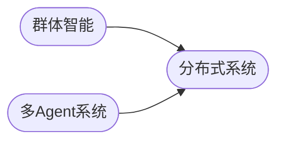
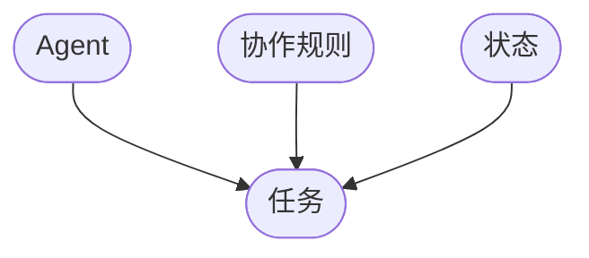
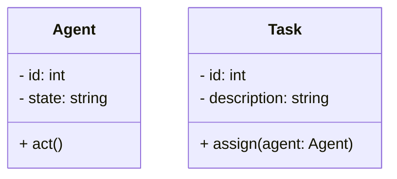
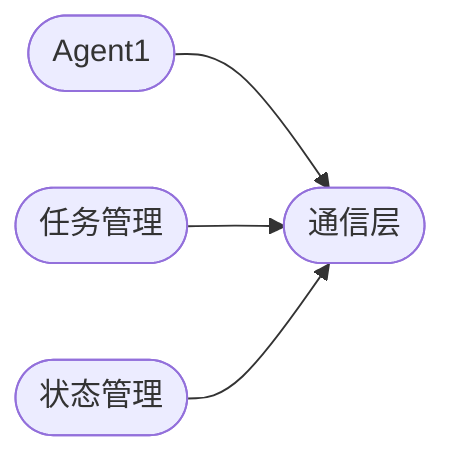
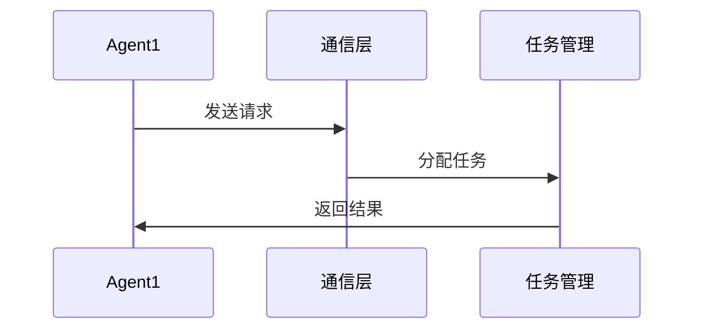
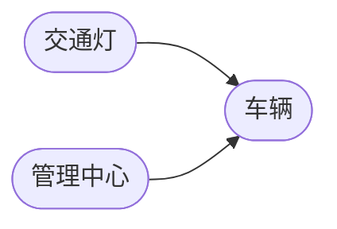

                 


# 构建具有群体智能的多Agent协作系统

---

## 关键词
- 多Agent系统
- 群体智能
- 分布式计算
- 协商算法
- 系统架构

---

## 摘要

在现代分布式系统中，多Agent协作系统和群体智能的应用日益广泛。本文从基础概念入手，详细探讨了多Agent协作系统的原理、算法实现、系统架构设计以及实际项目案例。通过分析典型算法和系统设计，展示了如何构建高效、智能的多Agent协作系统。文章最后总结了开发经验，并展望了未来的发展方向。

---

## 第1章：多Agent协作系统概述

### 1.1 多Agent系统的基本概念

#### 1.1.1 Agent的定义与特征
- **定义**：Agent（智能体）是指能够感知环境并采取行动以实现目标的实体。
- **特征**：
  - 自主性：能够在没有外部干预的情况下自主决策。
  - 反应性：能够根据环境变化调整行为。
  - 社会性：能够与其他Agent或人类进行交互与协作。

#### 1.1.2 多Agent系统的基本结构
多Agent系统由多个独立但协作的Agent组成，通过通信和协商完成复杂任务。

#### 1.1.3 多Agent系统与传统分布式系统的主要区别
- **自主性**：Agent具有自主决策能力，而分布式系统中的节点通常遵循中心控制。
- **协作性**：多Agent系统强调Agent之间的协作，而分布式系统更关注任务分配和资源管理。

### 1.2 群体智能的核心概念

#### 1.2.1 群体智能的定义与特点
- **定义**：群体智能是指通过多个简单个体的协作，实现复杂问题求解的智能形式。
- **特点**：
  - 去中心化：没有单一的控制中心。
  - 并行性：多个个体同时执行任务。
  - 增强性：群体智能的结果优于个体智能。

#### 1.2.2 群体智能与多Agent系统的联系与区别
- **联系**：群体智能可以通过多Agent系统实现。
- **区别**：群体智能强调群体行为的涌现性，而多Agent系统更关注个体协作机制。

#### 1.2.3 群体智能在现实中的典型应用领域
- 智能交通管理
- 分布式计算任务分配
- 机器人协作

### 1.3 多Agent协作系统的应用场景

#### 1.3.1 分布式计算中的多Agent协作
- 任务分配、负载均衡。
- 例如，分布式计算中的任务调度。

#### 1.3.2 群体智能在机器人协作中的应用
- 多机器人协同完成任务，如物流配送。

#### 1.3.3 多Agent系统在分布式任务分配中的应用
- 调度资源，优化任务分配。

---

## 第2章：多Agent协作系统的核心概念与联系

### 2.1 多Agent协作系统的原理

#### 2.1.1 Agent的智能体模型
- **感知与行动**：Agent通过传感器感知环境，采取行动影响环境。

#### 2.1.2 多Agent协作的基本机制
- 通信、协商、协调。

#### 2.1.3 群体智能的数学模型
- **涌现性**：群体行为无法由个体行为单独解释。

### 2.2 多Agent协作系统中的核心概念对比

#### 2.2.1 Agent类型对比表

| 类型       | 特性                   |
|------------|------------------------|
| 单Agent    | 独立运行，无协作       |
| 多Agent    | 协作完成复杂任务       |
| 去中心化   | 无中心节点，自主决策   |

#### 2.2.2 群体智能与分布式系统的关系图



### 2.3 多Agent协作系统的ER实体关系图



---

## 第3章：多Agent协作系统中的算法原理

### 3.1 多Agent协作中的典型算法

#### 3.1.1 分布式一致性算法

- **目的**：确保多个Agent状态一致。
- **流程**：
  1. 初始化状态。
  2. 通过通信达成一致。

#### 3.1.2 分布式任务分配算法

- **目的**：将任务分配给最适合的Agent。
- **流程**：
  1. 任务发布。
  2. Agent竞争或协商。

#### 3.1.3 多Agent协商算法

- **目的**：解决冲突，达成共识。
- **流程**：
  1. 提出方案。
  2. 通过协商优化方案。

### 3.2 分布式一致性算法实现

```python
def一致性算法：
    初始化状态s
    while 不一致：
        通信，同步状态
    返回一致状态
```

### 3.3 多Agent协商算法实现

```python
def协商算法：
    提出方案p
    while 有冲突：
        优化方案p
    返回最终方案p
```

---

## 第4章：多Agent协作系统的系统分析与架构设计

### 4.1 系统分析与设计背景

- **项目背景**：构建一个智能协作系统。
- **系统目标**：实现高效、智能的多Agent协作。

### 4.2 系统功能设计

- **领域模型类图**



### 4.3 系统架构设计

- **系统架构图**



### 4.4 系统接口设计

- **系统交互序列图**



---

## 第5章：项目实战——基于多Agent的智能交通系统

### 5.1 项目背景与目标

- **项目需求**：优化交通流量，减少拥堵。
- **目标**：实现多Agent协作的交通管理系统。

### 5.2 系统设计与实现

- **系统架构图**



### 5.3 核心代码实现

```python
class Agent:
    def __init__(self, id):
        self.id = id
        self.state = "idle"

    def act(self):
        # 执行动作
        pass

class TrafficSystem:
    def __init__(self):
        self.agents = []
        self.tasks = []

    def assign_task(self, agent, task):
        agent.act(task)
```

### 5.4 系统功能与测试

- **系统功能**：交通灯控制、车辆调度。
- **测试结果**：减少拥堵，提高通行效率。

### 5.5 项目总结与经验分享

- **总结**：成功实现智能交通管理。
- **经验**：良好的架构设计和高效的算法是关键。

---

## 第6章：总结与展望

### 6.1 系统总结

- 本文详细探讨了多Agent协作系统的构建过程，从理论到实践，全面解析了系统设计与实现的关键点。

### 6.2 未来发展方向

- 更复杂环境下的协作算法。
- 更高效的通信机制。
- 更智能的决策模型。

### 6.3 开发经验与最佳实践

- 设计原则：模块化、可扩展性。
- 测试方法：单元测试、集成测试。
- 安全注意事项：数据安全、通信安全。

---

## 作者：AI天才研究院/AI Genius Institute & 禅与计算机程序设计艺术 /Zen And The Art of Computer Programming

---

这篇文章详细介绍了构建具有群体智能的多Agent协作系统的各个方面，从基础概念到实际应用，为读者提供了全面的指导。希望本文能为相关领域的研究和实践提供有价值的参考。

