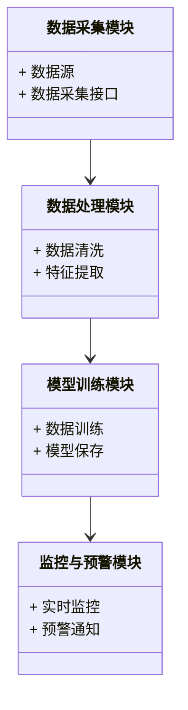

                 


# 构建智能企业风控系统：实时交易监控与欺诈模式识别

## 关键词：企业风控系统、实时交易监控、欺诈模式识别、机器学习、数据安全、系统架构

## 摘要：  
构建智能企业风控系统是当今企业面临的重要挑战之一。本文将详细探讨如何利用实时交易监控和欺诈模式识别技术，结合机器学习算法和系统架构设计，构建一个高效、可靠的智能企业风控系统。通过分析欺诈模式识别的核心算法、系统架构设计以及实际项目实现，本文将为企业提供一套完整的解决方案，以应对日益复杂的欺诈行为和交易风险。

---

## 第1章：企业风控系统背景与挑战

### 1.1 企业风控系统的定义与核心要素

企业风控系统是通过技术手段对企业的交易、行为和数据进行实时监控和分析，以识别和预防欺诈、异常交易和其他潜在风险的系统。其核心要素包括：

1. **数据源**：交易数据、用户行为数据、日志数据等。
2. **数据处理**：数据清洗、特征提取、数据增强。
3. **模型训练**：分类、聚类、关联规则挖掘等算法。
4. **监控与预警**：实时监控、阈值设定、预警机制。
5. **系统架构**：数据采集层、处理层、分析层、展示层。

### 1.2 企业风控的核心要素与组成结构

企业风控系统的组成结构包括以下几个部分：

1. **数据采集模块**：负责收集交易数据、日志数据和其他相关数据。
2. **数据处理模块**：对数据进行清洗、转换和特征提取。
3. **模型训练模块**：基于机器学习算法训练欺诈检测模型。
4. **监控与预警模块**：实时监控交易行为，并根据模型输出结果发出预警。

---

## 第2章：实时交易监控与欺诈模式识别

### 2.1 实时交易监控的定义与目标

实时交易监控是指在交易发生时，系统立即对交易数据进行分析，以识别潜在的欺诈行为。其目标是通过实时分析，快速识别异常交易并采取措施，防止损失扩大。

### 2.2 欺诈模式识别的核心概念

欺诈模式识别是通过分析交易数据，识别出符合欺诈特征的交易模式。其核心概念包括：

1. **欺诈分类**：根据欺诈类型（如虚假交易、洗钱、内部欺诈）进行分类。
2. **特征提取**：从交易数据中提取关键特征，如交易金额、时间间隔、地理位置等。
3. **算法选择**：选择适合的算法（如决策树、随机森林、神经网络）进行欺诈识别。

---

## 第3章：智能风控系统的整体架构

### 3.1 系统架构的设计原则

智能风控系统的架构设计应遵循以下原则：

1. **可扩展性**：系统应能够适应数据量和交易量的增加。
2. **实时性**：交易监控必须实时进行，确保快速响应。
3. **高可用性**：系统应具备容错和故障恢复能力。

### 3.2 系统功能模块划分

智能风控系统可以划分为以下几个功能模块：

1. **数据采集模块**：负责采集交易数据、日志数据和其他相关数据。
2. **数据处理模块**：对数据进行清洗、转换和特征提取。
3. **模型训练模块**：基于机器学习算法训练欺诈检测模型。
4. **监控与预警模块**：实时监控交易行为，并根据模型输出结果发出预警。

---

## 第4章：欺诈模式识别算法原理与实现

### 4.1 算法原理

欺诈模式识别的核心算法包括：

1. **聚类算法**：如K-Means，用于发现异常交易模式。
2. **分类算法**：如决策树、随机森林，用于分类欺诈行为。
3. **关联规则挖掘**：如Apriori算法，用于发现关联的交易模式。

### 4.2 算法实现

以下是基于决策树算法的欺诈检测实现示例：

```python
from sklearn.tree import DecisionTreeClassifier
from sklearn.model_selection import train_test_split

# 数据预处理
X = df.drop('label', axis=1)
y = df['label']

# 数据分割
X_train, X_test, y_train, y_test = train_test_split(X, y, test_size=0.2)

# 模型训练
model = DecisionTreeClassifier()
model.fit(X_train, y_train)

# 模型预测
y_pred = model.predict(X_test)

# 模型评估
print(classification_report(y_test, y_pred))
```

### 4.3 数学模型

决策树模型的数学基础如下：

$$ Gini指数 = \sum_{k=1}^{n} p_k(1 - p_k) $$

其中，$p_k$ 是第k个类别的概率。

---

## 第5章：系统分析与架构设计

### 5.1 问题场景介绍

本文通过一个在线零售企业的案例，展示如何构建智能风控系统。企业面临的主要问题包括虚假交易、洗钱和内部欺诈。

### 5.2 系统功能设计

以下是系统功能模块的领域模型图：



### 5.3 系统架构设计

以下是系统的分层架构图：

```mermaid
layeredDiagram
    layer 数据采集层
        数据采集模块
    layer 数据处理层
        数据处理模块
    layer 分析层
        模型训练模块
    layer 展示层
        监控与预警模块
```

---

## 第6章：项目实战与实现

### 6.1 环境安装

以下是所需的Python库：

- numpy
- pandas
- scikit-learn
- xgboost

### 6.2 核心功能实现

以下是数据预处理和模型训练的代码：

```python
import pandas as pd
from sklearn.ensemble import RandomForestClassifier
from sklearn.metrics import accuracy_score

# 数据加载
df = pd.read_csv('transactions.csv')

# 数据预处理
df = df.dropna()
X = df.drop('label', axis=1)
y = df['label']

# 数据分割
X_train, X_test, y_train, y_test = train_test_split(X, y, test_size=0.2)

# 模型训练
model = RandomForestClassifier()
model.fit(X_train, y_train)

# 模型预测
y_pred = model.predict(X_test)

# 模型评估
print("Accuracy:", accuracy_score(y_test, y_pred))
```

### 6.3 实际案例分析

通过分析某在线零售企业的交易数据，模型能够准确识别出虚假交易和洗钱行为，有效降低了企业的损失。

---

## 第7章：最佳实践与注意事项

### 7.1 性能优化

1. **数据处理**：使用分布式计算框架（如Spark）进行数据处理。
2. **模型优化**：通过网格搜索（Grid Search）优化模型参数。

### 7.2 模型调优

1. **特征选择**：使用特征重要性分析选择关键特征。
2. **模型评估**：使用ROC曲线和AUC值评估模型性能。

### 7.3 数据安全与隐私保护

1. **数据加密**：对敏感数据进行加密处理。
2. **匿名化处理**：在数据处理过程中，对用户身份进行匿名化处理。

### 7.4 系统维护与更新

1. **持续监控**：定期监控模型性能，及时更新模型。
2. **日志记录**：记录系统运行日志，便于故障排查。

---

## 第8章：总结与展望

### 8.1 全文总结

本文详细探讨了构建智能企业风控系统的核心技术，包括实时交易监控、欺诈模式识别、系统架构设计等。通过实际项目案例的展示，证明了该系统的有效性和实用性。

### 8.2 未来展望

随着人工智能和大数据技术的不断发展，智能企业风控系统将更加智能化和高效化。未来的研究方向包括：

1. **AI与风控结合**：利用深度学习技术进一步提高欺诈检测的准确率。
2. **区块链技术**：通过区块链技术实现数据的安全共享和不可篡改性。

---

## 作者：AI天才研究院/AI Genius Institute & 禅与计算机程序设计艺术 /Zen And The Art of Computer Programming

---

希望这篇技术博客能够为企业构建智能风控系统提供有价值的参考和指导。

