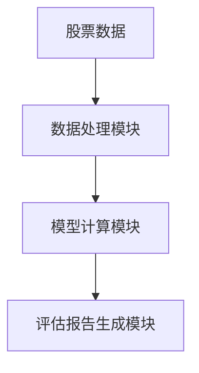

                 


# 特价股票投资中的可持续增长模型应用

> **关键词**：特价股票、可持续增长模型、股票投资、财务指标、投资策略

> **摘要**：本文深入探讨了可持续增长模型在特价股票投资中的应用。通过分析模型的核心概念、财务指标与模型的关系，以及在股票筛选和投资组合构建中的应用，本文为投资者提供了一套科学的投资方法。同时，通过系统架构设计和项目实战，展示了如何将模型应用于实际投资中，帮助投资者实现长期收益。

---

## 第1章: 特价股票投资概述

### 1.1 特价股票的概念与特点

#### 1.1.1 特价股票的定义
特价股票是指市场估值低于其内在价值的股票。通常，这类股票价格被市场低估，具有较高的投资潜力。

#### 1.1.2 特价股票的特点
- **低估性**：市场价格低于内在价值。
- **波动性**：价格波动较大，但长期趋势向上。
- **周期性**：通常出现在市场低迷或企业困境时期。

#### 1.1.3 特价股票的投资价值
- **高回报潜力**：低估的股票价格回升时，投资者可获得超额收益。
- **风险与机会并存**：需要谨慎选择，避免陷入价值陷阱。

### 1.2 可持续增长模型的背景

#### 1.2.1 可持续增长模型的定义
可持续增长模型（Sustainable Growth Model）用于评估企业未来的盈利增长潜力，基于财务指标分析。

#### 1.2.2 可持续增长模型的起源与演变
模型起源于金融学，用于评估企业的内在价值和增长潜力，经过多次优化，现广泛应用于股票分析。

#### 1.2.3 可持续增长模型在股票投资中的应用
通过分析企业财务数据，评估其可持续增长率，帮助投资者选择具有长期增长潜力的特价股票。

### 1.3 特价股票投资的核心目标

#### 1.3.1 特价股票投资的主要目标
- **资本增值**：通过股价上涨实现收益。
- **价值发现**：识别被低估的企业，长期持有。

#### 1.3.2 可持续增长模型在投资中的作用
- **筛选优质股票**：通过模型评估企业增长潜力。
- **优化投资组合**：降低风险，提高收益。

#### 1.3.3 特价股票投资的长期策略
- **长期持有**：耐心等待价值回归。
- **分散投资**：降低单一股票的风险。

---

## 第2章: 可持续增长模型的核心概念

### 2.1 可持续增长模型的定义与特点

#### 2.1.1 可持续增长模型的定义
模型通过分析财务指标，评估企业的可持续增长率，判断其长期增长潜力。

#### 2.1.2 可持续增长模型的核心特点
- **基于财务指标**：使用ROE、ROA等指标。
- **长期视角**：关注企业持续增长能力。

### 2.2 可持续增长模型的核心要素

#### 2.2.1 股东权益收益率（ROE）
- **定义**：净利润除以股东权益。
- **公式**：ROE = 净利润 / 股东权益。

#### 2.2.2 资产回报率（ROA）
- **定义**：净利润除以总资产。
- **公式**：ROA = 净利润 / 总资产。

#### 2.2.3 资本回报率（ROCE）
- **定义**：净利润除以总资本。
- **公式**：ROCE = 净利润 / 总资本。

### 2.3 可持续增长模型的数学表达式

#### 2.3.1 可持续增长率的公式推导
- **公式**：s = (ROE × b) / (1 - b × ROE)
- **解释**：s为可持续增长率，ROE为股东权益收益率，b为利润留存率。

#### 2.3.2 可持续增长率的计算方法
- **步骤**：
  1. 计算ROE。
  2. 确定利润留存率b。
  3. 代入公式计算s。

#### 2.3.3 可持续增长率与股票价值的关系
- **关系**：s影响股票的内在价值，进而影响市场价格。

---

## 第3章: 可持续增长模型与财务指标的关系

### 3.1 可持续增长模型与ROE的关系

#### 3.1.1 ROE的定义与计算
- **定义**：净利润除以股东权益。
- **公式**：ROE = 净利润 / 股东权益。

#### 3.1.2 可持续增长率与ROE的关系
- **关系**：ROE高，s高，企业增长潜力大。

### 3.2 可持续增长模型与ROA的关系

#### 3.2.1 ROA的定义与计算
- **定义**：净利润除以总资产。
- **公式**：ROA = 净利润 / 总资产。

#### 3.2.2 可持续增长率与ROA的关系
- **关系**：ROA高，s高，企业运营效率高。

### 3.3 可持续增长模型与ROCE的关系

#### 3.3.1 ROCE的定义与计算
- **定义**：净利润除以总资本。
- **公式**：ROCE = 净利润 / 总资本。

#### 3.3.2 可持续增长率与ROCE的关系
- **关系**：ROCE高，s高，企业资本回报率高。

---

## 第4章: 可持续增长模型的系统分析与架构设计

### 4.1 系统功能设计

#### 4.1.1 领域模型
- **实体**：股票、企业、财务指标。
- **关系**：股票关联企业，企业有财务指标。

#### 4.1.2 功能模块
- 数据采集：获取企业财务数据。
- 模型计算：计算ROE、ROA、ROCE。
- 评估报告：生成股票评估报告。

### 4.2 系统架构设计

#### 4.2.1 架构图


#### 4.2.2 接口设计
- 数据接口：获取财务数据。
- 计算接口：调用模型计算s。

#### 4.2.3 交互设计
- 用户输入股票代码。
- 系统返回评估报告。

---

## 第5章: 可持续增长模型的项目实战

### 5.1 环境安装

#### 5.1.1 Python环境
- 安装Python和相关库（pandas、numpy）。

#### 5.1.2 数据获取
- 使用Yahoo Finance API获取数据。

### 5.2 核心代码实现

#### 5.2.1 数据处理
```python
import pandas as pd

def get_financial_data(ticker):
    # 获取数据
    data = pd.read_csv(f'data/{ticker}.csv')
    return data
```

#### 5.2.2 模型计算
```python
def calculate_sustainable_growth(data):
    roe = data['ROE'].mean()
    b = data['Retain'].mean()
    s = (roe * b) / (1 - b * roe)
    return s
```

#### 5.2.3 评估报告生成
```python
def generate_report(ticker, s):
    print(f"股票{s}的可持续增长率为{s}%")
```

### 5.3 案例分析

#### 5.3.1 案例选择
- 选择一只特价股票，计算其s值。

#### 5.3.2 结果分析
- 如果s高，说明该股票具有较高的增长潜力。

---

## 第6章: 综合分析与最佳实践

### 6.1 模型优化建议

#### 6.1.1 引入更多指标
- 考虑收入增长率等指标。

#### 6.1.2 动态调整
- 根据市场变化动态调整模型参数。

### 6.2 投资风险管理

#### 6.2.1 分散投资
- 避免单一股票风险过高。

#### 6.2.2 定期评估
- 定期重新评估股票，及时调整投资组合。

### 6.3 小结

---

## 作者信息

作者：AI天才研究院 & 禅与计算机程序设计艺术

---

**小结**：通过本文的详细讲解，读者可以全面了解可持续增长模型在特价股票投资中的应用。从理论到实践，从模型构建到系统设计，再到项目实战，帮助投资者科学地进行股票分析和投资决策。

