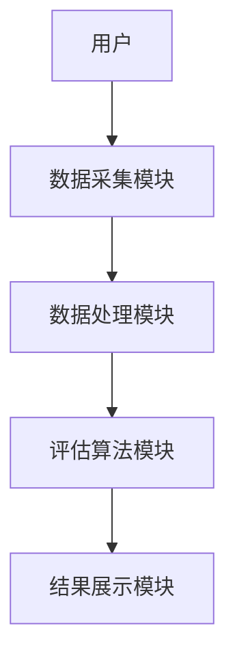
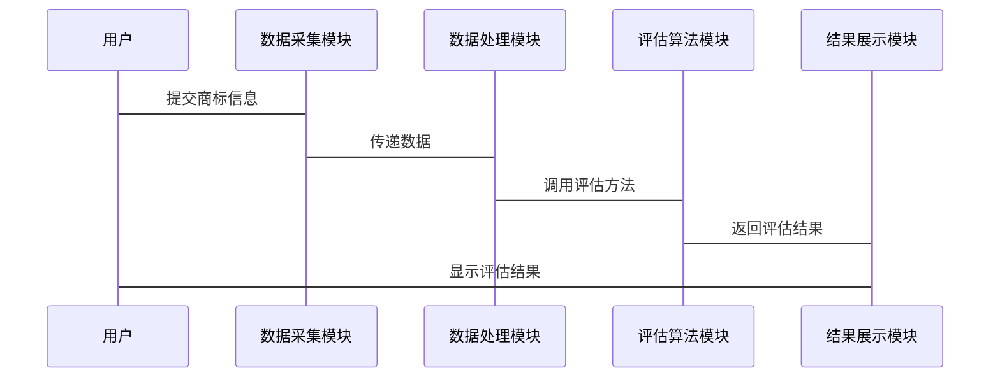

                 


# 股市估值在国际商标价值评估中的应用

> 关键词：股市估值，商标价值评估，国际商标，价值评估模型，金融算法，商标经济价值

> 摘要：本文探讨了如何将股市估值方法应用于国际商标价值评估，分析了股市估值的核心概念与商标评估的结合点，提出了基于市盈率、市净率和现金流折现模型的商标价值评估方法，并通过实际案例展示了如何构建商标价值评估系统。

---

# 第一部分: 股市估值与国际商标价值评估基础

## 第1章: 股市估值与国际商标价值评估概述

### 1.1 股市估值的基本概念
股市估值是通过对企业的财务数据和市场表现进行分析，以确定其股票的合理价格区间。常见的估值指标包括市盈率（P/E）、市净率（P/B）、股息率等。这些指标帮助企业投资者评估企业的内在价值，从而做出投资决策。

### 1.2 国际商标价值评估的背景与意义
商标作为企业的无形资产，其价值往往被低估。随着全球化的发展，商标在企业品牌建设、市场竞争中的作用日益凸显。国际商标价值评估能够帮助企业合理定价、优化资产管理和制定并购策略。

### 1.3 股市估值在商标价值评估中的应用前景
股市估值方法的可扩展性使其成为商标价值评估的重要工具。通过对比分析，可以发现股市估值的核心指标（如市盈率、市净率）与商标价值评估的关键因素（如品牌影响力、市场占有率）之间存在潜在关联。这种关联为跨领域应用提供了理论基础。

---

## 第2章: 国际商标价值评估的核心概念与联系

### 2.1 商标价值评估的核心要素
商标价值评估需要考虑多个维度，包括：
- **品牌知名度**：品牌在市场中的认知度和影响力。
- **市场占有率**：品牌在目标市场中的份额。
- **经济收益**：品牌为企业带来的直接或间接收益。
- **法律保护**：商标的法律状态和保护力度。

### 2.2 股市估值方法与商标评估的对比分析
| **评估方法** | **股市估值** | **商标评估** |
|--------------|--------------|--------------|
| **核心指标** | 市盈率（P/E） | 品牌影响力 |
| **适用场景** | 企业整体估值 | 品牌价值评估 |
| **数据来源** | 财务报表、市场数据 | 品牌调研、市场分析 |

### 2.3 商标价值评估的实体关系图
```mermaid
er
actor 1: 企业
actor 2: 市场监管机构
actor 3: 评估机构
database 1: 商标注册信息
database 2: 企业财务数据
database 3: 市场调研数据
```

---

## 第3章: 股市估值方法在商标价值评估中的应用原理

### 3.1 股市估值的核心算法与原理
- **市盈率（P/E）模型**：通过比较企业的市盈率与行业平均水平，评估企业的相对价值。
- **市净率（P/B）模型**：基于企业的账面价值进行估值。
- **现金流折现模型（DCF）**：通过预测企业未来现金流的现值来评估企业价值。

### 3.2 商标价值评估的数学模型构建
$$ V = k \times E $$
其中，$V$ 表示商标价值，$E$ 表示商标的经济收益，$k$ 表示收益折现率。

### 3.3 股市估值方法与商标评估的结合
- **基于市盈率的商标价值评估**：将企业的品牌影响力与行业平均市盈率进行对比。
- **基于市净率的商标价值评估**：结合企业的品牌资产和市场表现进行估值。
- **基于现金流的商标价值评估**：预测商标带来的未来现金流，并进行现值计算。

---

## 第4章: 股票估值算法在商标价值评估中的应用

### 4.1 基于市盈率的商标价值评估
- **公式**：$$ V = P/E \times EBIT $$
- **步骤**：
  1. 收集目标商标的EBIT数据。
  2. 确定行业平均市盈率。
  3. 计算商标价值。

### 4.2 基于市净率的商标价值评估
- **公式**：$$ V = P/B \times 资产总额 $$
- **步骤**：
  1. 收集目标商标的资产总额。
  2. 确定行业平均市净率。
  3. 计算商标价值。

### 4.3 基于现金流的商标价值评估
- **公式**：$$ V = \sum_{t=1}^{n} \frac{CF_t}{(1 + r)^t} $$
- **步骤**：
  1. 预测商标未来现金流。
  2. 确定合适的折现率。
  3. 计算现值。

### 4.4 算法实现与案例分析
```python
def stock_valuation(pe_ratio, ebit):
    return pe_ratio * ebit

def商标价值评估案例：
    pe_ratio = 15  # 假设行业平均市盈率为15
    ebit = 1000     # 假设商标EBIT为1000
    商标价值 = stock_valuation(pe_ratio, ebit)
    print("商标价值：", 商标价值)
```

---

## 第5章: 系统分析与架构设计方案

### 5.1 问题场景介绍
随着全球化的发展，企业对商标价值的评估需求日益增长。传统的方法往往依赖于主观判断，缺乏科学性和可操作性。因此，亟需一种基于股市估值的系统化解决方案。

### 5.2 系统功能设计
- **功能模块**：
  - 数据采集：收集商标相关数据。
  - 指标计算：计算商标的市盈率、市净率等核心指标。
  - 价值评估：基于算法模型计算商标价值。
  - 结果展示：以可视化方式呈现评估结果。

### 5.3 系统架构设计


### 5.4 系统接口设计
- **输入接口**：接收商标的财务数据和市场数据。
- **输出接口**：返回商标价值评估结果。

### 5.5 交互流程图


---

## 第6章: 项目实战

### 6.1 环境安装
- **工具**：Python、数据可视化库（如Matplotlib）、数据库（如MySQL）。

### 6.2 核心实现代码
```python
import pandas as pd
import numpy as np

def calculate_pe_ratio(ebit, net_income):
    return ebit / net_income

def calculate_market_cap(pe_ratio, net_income):
    return pe_ratio * net_income

# 示例数据
data = {
    '商标名称': ['A', 'B', 'C'],
    'EBIT': [1000, 1500, 2000],
    '净利润': [500, 750, 1000]
}

df = pd.DataFrame(data)

# 计算市盈率和市值
df['市盈率'] = df.apply(lambda x: calculate_pe_ratio(x['EBIT'], x['净利润']), axis=1)
df['市值'] = df.apply(lambda x: calculate_market_cap(x['市盈率'], x['净利润']), axis=1)

print(df)
```

### 6.3 代码解读与分析
- **数据加载**：使用Pandas加载商标相关数据。
- **市盈率计算**：基于EBIT和净利润计算市盈率。
- **市值计算**：基于市盈率和净利润计算市值。

### 6.4 实际案例分析
通过分析实际商标的财务数据，验证算法的有效性，并根据结果调整模型参数。

### 6.5 项目小结
总结项目实施过程中的经验与教训，提出改进建议。

---

## 第7章: 最佳实践、小结与展望

### 7.1 最佳实践
- 数据采集要全面、准确。
- 模型选择要结合具体场景。
- 结果验证要注重实际应用效果。

### 7.2 小结
本文系统探讨了股市估值在国际商标价值评估中的应用，提出了基于市盈率、市净率和现金流折现模型的评估方法，并通过实际案例验证了算法的可行性。

### 7.3 展望
未来的研究可以进一步优化评估模型，引入更多维度的数据，如消费者行为数据、社交媒体影响力等，以提高评估的准确性和全面性。

---

作者：AI天才研究院/AI Genius Institute & 禅与计算机程序设计艺术 /Zen And The Art of Computer Programming

