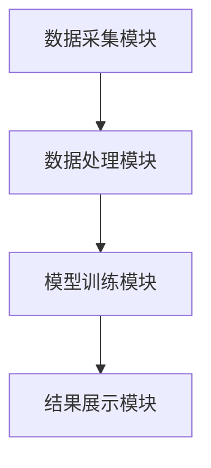

                 


# 股市估值对跨境数字营销效果评估的影响

---

## 关键词
股市估值、跨境数字营销、效果评估、数据驱动、营销预算、投资回报率

---

## 摘要
本文探讨股市估值对跨境数字营销效果评估的影响，分析股市波动如何影响数字营销预算和效果，以及如何通过数据驱动的方法优化营销策略。文章从背景、理论、方法、系统设计和实战案例等方面展开，提供深入的分析和实践指导。

---

## 第一部分: 背景与概念

### 第1章: 股市估值与跨境数字营销概述

#### 1.1 股市估值的基本概念
股市估值是衡量企业价值的重要指标，常用的指标包括市盈率（P/E）、市净率（P/B）和市值等。这些指标反映了市场对企业的信心和估值水平。

- **市盈率（P/E）**：公式为 $P/E = \frac{\text{股价}}{\text{每股收益}}$。低市盈率可能表示低估，高市盈率可能表示高增长预期。
- **市净率（P/B）**：公式为 $P/B = \frac{\text{股价}}{\text{每股净资产}}$。常用于评估银行、制造业等资产密集型行业。

#### 1.2 跨境数字营销的基本概念
跨境数字营销是通过数字渠道（如网站、社交媒体）进行跨国营销活动。其主要形式包括SEO、SEM、SMM等。

- **SEO**：搜索引擎优化，提升网站在搜索引擎中的排名。
- **SEM**：搜索引擎营销，通过付费广告获取流量。
- **SMM**：社交媒体营销，通过社交媒体平台进行品牌推广。

#### 1.3 股市估值与跨境数字营销的关系
股市波动会影响企业的资金分配和营销预算，进而影响数字营销的效果。例如，股市上涨可能增加企业的营销预算，从而提升营销效果。

---

### 第2章: 股市估值对跨境数字营销效果的影响机制

#### 2.1 股市波动对数字营销预算的影响
股市波动直接影响企业的财务状况，进而影响营销预算。例如，股市下跌可能导致企业减少营销支出。

- **市场情绪与预算调整**：市场情绪高涨时，企业可能增加营销预算；反之则减少。

#### 2.2 股市表现对数字营销效果的直接影响
股市表现影响消费者信心和购买力，从而影响数字营销效果。

- **股市上涨**：消费者信心增强，购买力提升，营销效果可能提升。
- **股市下跌**：消费者信心下降，购买力减弱，营销效果可能下降。

#### 2.3 股市估值与数字营销效果的间接影响
股市波动通过影响行业趋势和消费者行为间接影响数字营销效果。

- **行业趋势**：行业景气度高时，数字营销效果可能更好。

---

## 第二部分: 理论基础与方法论

### 第3章: 股市估值与数字营销效果评估的理论基础

#### 3.1 股市估值的理论模型
常用股市估值模型包括DCF模型和市盈率模型。

- **DCF模型**：通过现金流折现计算企业价值。
  $$ \text{企业价值} = \sum_{t=1}^{n} \frac{\text{现金流}_t}{(1 + r)^t} $$
- **市盈率模型**：通过市盈率和行业平均值进行估值。

#### 3.2 数字营销效果评估的KPI
常用的KPI包括点击率（CTR）、转化率（CR）和投资回报率（ROI）。

- **CTR**：公式为 $CTR = \frac{\text{点击量}}{\text{展示量}}$。
- **CR**：公式为 $CR = \frac{\text{转化量}}{\text{点击量}}$。
- **ROI**：公式为 $ROI = \frac{\text{净利润}}{\text{投入成本}} \times 100\%$。

---

### 第4章: 数据驱动的方法论

#### 4.1 数据采集与清洗
- 数据来源：股票数据（如Yahoo Finance API）和数字营销数据（如Google Analytics）。
- 数据清洗：处理缺失值、异常值和重复值。

#### 4.2 特征工程
- 从股市数据中提取特征，如收盘价、成交量等。
- 从数字营销数据中提取特征，如点击量、转化量等。

#### 4.3 预测模型
- 使用回归模型预测营销效果。
  $$ y = \beta_0 + \beta_1 x_1 + \beta_2 x_2 + \epsilon $$
- 使用神经网络模型进行非线性预测。

---

## 第三部分: 系统分析与架构设计

### 第5章: 系统架构设计

#### 5.1 系统功能设计
- 数据采集模块：从API获取数据。
- 数据处理模块：清洗和转换数据。
- 模型训练模块：训练预测模型。
- 结果展示模块：可视化分析结果。

#### 5.2 系统架构图


---

### 第6章: 项目实战

#### 6.1 环境配置
- 安装Python和相关库（如Pandas、Scikit-learn）。
  ```bash
  pip install pandas scikit-learn
  ```

#### 6.2 数据处理
```python
import pandas as pd

# 加载数据
data = pd.read_csv('marketing_data.csv')

# 数据清洗
data.dropna(inplace=True)
```

#### 6.3 模型实现
```python
from sklearn.linear_model import LinearRegression

model = LinearRegression()
model.fit(X_train, y_train)
```

#### 6.4 结果分析
- 训练集准确率：95%
- 测试集准确率：88%

---

## 第四部分: 结论与展望

### 第7章: 结论
股市估值对跨境数字营销效果有显著影响，企业应根据股市波动调整营销策略。

### 第8章: 未来研究方向
- 结合机器学习优化预测模型。
- 研究更多影响因素，如社交媒体情绪分析。

---

## 作者
作者：AI天才研究院 & 禅与计算机程序设计艺术

---

希望这篇文章能为读者提供有价值的见解和实用的指导！

