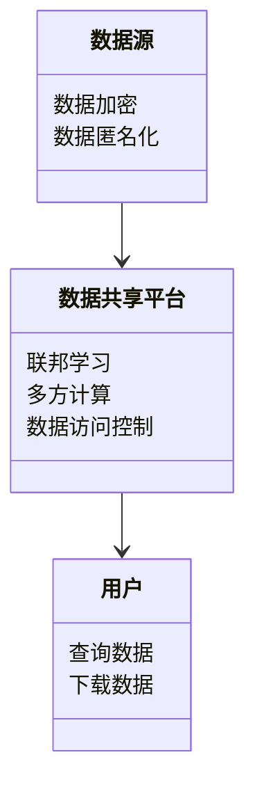

                 


# 《金融数据隐私保护与共享平台设计》

## 关键词：金融数据隐私保护、数据共享平台、数据加密、联邦学习、隐私计算

## 摘要：  
随着数字化转型的深入，金融数据的隐私保护与共享需求日益迫切。本文从金融数据的敏感性出发，探讨如何在确保隐私安全的前提下实现数据的高效共享。通过分析隐私保护的核心技术，如数据加密、匿名化和区块链，结合共享平台的系统架构设计，提出了一种基于联邦学习和多方计算的隐私保护方案。文章详细阐述了平台的实现过程，包括技术选型、API设计和案例分析，为金融行业的数据隐私保护与共享提供了理论依据和实践指导。

---

# 第一部分: 金融数据隐私保护与共享平台的背景与挑战

## 第1章: 金融数据隐私保护概述

### 1.1 金融数据的重要性与敏感性  
金融数据是金融机构的核心资产，涉及客户隐私和商业机密，具有高度敏感性。数据泄露可能导致严重的经济损失和声誉损害。金融数据的分类与分级是隐私保护的基础，常见的分类包括个人客户信息、交易记录、账户余额等。

### 1.2 隐私保护的现状与挑战  
尽管目前有多种数据加密和匿名化技术，但数据共享过程中仍面临诸多挑战。例如，如何在不泄露原始数据的前提下进行数据分析，如何确保数据共享的合规性，以及如何应对日益复杂的网络安全威胁。

### 1.3 共享平台的需求与目标  
金融数据共享平台的目标是在保护隐私的前提下，实现数据的高效共享与利用。平台需要满足数据安全、合规性、可扩展性和易用性等多方面的需求。

---

## 第2章: 金融数据隐私保护的核心概念

### 2.1 数据隐私保护的核心原理  
数据加密是隐私保护的重要手段。对称加密算法（如AES）适用于数据传输，而非对称加密算法（如RSA）适用于签名和认证。数据匿名化技术（如差分隐私）通过添加噪声或替换敏感字段，确保数据无法被逆向还原。

### 2.2 数据共享的核心机制  
数据共享需要通过联邦学习和多方计算等技术实现。联邦学习允许多个机构在不共享原始数据的情况下进行联合建模，而多方计算则通过加密协议实现多方协同计算。

### 2.3 数据隐私保护与共享的平衡  
在实际应用中，需要在隐私保护和数据共享之间找到平衡点。通过制定严格的访问控制策略和数据使用协议，可以确保数据在共享过程中的安全性和合规性。

---

## 第3章: 金融数据隐私保护的算法原理

### 3.1 数据加密算法  
对称加密算法（如AES）适用于数据传输，而非对称加密算法（如RSA）适用于签名和认证。加密算法的选择需要考虑性能和安全性。

### 3.2 数据匿名化算法  
差分隐私通过在数据中添加噪声，防止数据被逆向还原。数据扰动技术（如加噪）和数据替换技术（如随机替换）是常见的匿名化方法。

### 3.3 数据共享算法  
联邦学习通过在不同机构之间共享模型参数，实现联合建模。多方计算则通过加密协议实现多方协同计算。

### 3.4 算法实现的数学模型  
对称加密的数学模型如下：
$$ E(x) = x \oplus k $$
$$ D(y) = y \oplus k $$

非对称加密的数学模型如下：
$$ E(x) = x^e \mod n $$
$$ D(y) = y^d \mod n $$

---

# 第二部分: 金融数据隐私保护与共享平台的设计

## 第4章: 金融数据隐私保护的系统架构设计

### 4.1 系统需求分析  
平台需要支持多机构数据共享、数据隐私保护、数据安全审计等功能。

### 4.2 系统功能设计  
通过领域模型类图，展示系统的主要功能模块，包括数据加密、匿名化、联邦学习等。



### 4.3 系统架构设计  
平台采用分层架构，包括数据层、业务逻辑层和用户界面层。数据层负责数据的存储和加密，业务逻辑层负责数据处理和共享，用户界面层提供用户交互功能。

### 4.4 系统接口设计  
通过API实现数据加密、匿名化和联邦学习功能。API设计需要考虑安全性、可扩展性和易用性。

---

## 第5章: 金融数据隐私保护与共享平台的实现

### 5.1 技术选型  
选择合适的技术栈，如使用Python的Flask框架开发API，使用区块链技术实现数据溯源。

### 5.2 数据共享协议的实现  
通过多方计算协议实现数据共享，确保数据在计算过程中不被泄露。

### 5.3 平台实现的代码示例  
以下是一个简单的数据加密API实现示例：

```python
from flask import Flask
from cryptography.hazmat.primitives.asymmetric import padding
from cryptography.hazmat.primitives import hashes

app = Flask(__name__)

def encrypt(message, public_key):
    ciphertext = public_key.encrypt(
        message.encode(),
        padding.OAEP(
            mgf=padding.MGF1(salt_length=hashes.SHA256().digest_size),
            hash_algorithm=hashes.SHA256(),
            randomize_nonce=False
        )
    )
    return ciphertext

@app.route('/encrypt', methods=['POST'])
def encrypt_endpoint():
    data = request.get_json()
    message = data['message']
    public_key = data['public_key']
    return {'encrypted': encrypt(message, public_key).hex()}

if __name__ == '__main__':
    app.run()
```

---

## 第6章: 安全与合规

### 6.1 数据安全措施  
通过访问控制、加密存储和传输，确保数据在共享过程中的安全性。

### 6.2 合规性要求  
确保平台符合GDPR等数据保护法规，制定严格的数据使用协议。

### 6.3 数据生命周期管理  
从数据生成、存储、共享到销毁，确保每个环节的安全性和合规性。

---

## 第7章: 案例分析与最佳实践

### 7.1 案例分析  
通过实际案例分析平台的应用场景和实现效果，总结经验教训。

### 7.2 最佳实践  
建议在数据共享过程中，优先采用匿名化和加密技术，确保数据的安全性和可用性。

### 7.3 注意事项  
在实际应用中，需要根据具体需求选择合适的技术方案，并定期进行安全审计和漏洞修复。

---

## 第8章: 结论与展望

### 8.1 结论  
金融数据隐私保护与共享平台的设计需要综合考虑技术、法律和业务多方面的因素。

### 8.2 未来展望  
随着人工智能和区块链技术的发展，金融数据隐私保护将更加智能化和高效化。

---

## 作者：AI天才研究院 & 禅与计算机程序设计艺术

