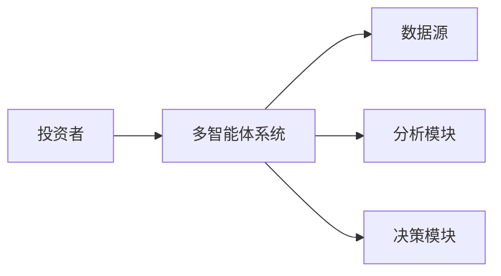

                 

# AI多智能体系统如何改进传统的价值投资尽职调查流程

## 关键词：AI多智能体系统，价值投资，尽职调查，金融，数据分析

## 摘要：本文探讨了AI多智能体系统如何优化传统价值投资的尽职调查流程。通过分析多智能体系统的核心原理、价值投资的关键要素以及二者的结合点，文章详细阐述了AI技术在金融领域的应用潜力，并通过系统架构设计和实际案例展示了如何利用多智能体系统提高尽职调查的效率和准确性。

---

## 第一部分: AI多智能体系统与价值投资尽职调查的背景

### 第1章: 问题背景与现状分析

#### 1.1 问题背景介绍

##### 1.1.1 传统价值投资的核心概念
价值投资是一种基于对公司基本面分析的投资策略，主要关注公司的内在价值。投资者通过分析财务报表、市场地位、竞争优势等因素，判断公司的长期投资价值。传统价值投资的尽职调查流程通常包括以下几个步骤：

1. 数据收集：从财务报表、行业报告、新闻媒体等多渠道收集公司相关信息。
2. 数据分析：对收集到的数据进行整理、清洗和分析，识别潜在的投资机会和风险。
3. 风险评估：评估公司的财务健康状况、市场风险、管理团队等，确定投资风险。
4. 决策支持：基于分析结果，为投资者提供投资建议。

##### 1.1.2 当前价值投资尽职调查的痛点与挑战
尽管价值投资是一种有效的投资策略，但传统尽职调查流程存在以下痛点：

- **数据量大**：现代企业涉及的数据量庞大，包括财务数据、行业数据、市场数据等，人工收集和分析效率低下。
- **信息不全**：传统尽职调查往往依赖于有限的数据来源，难以全面捕捉市场动态和潜在风险。
- **效率低下**：人工分析耗时耗力，且容易受到主观因素的影响，影响决策的准确性和客观性。
- **成本高昂**：需要投入大量的人力和时间，增加了企业的运营成本。

##### 1.1.3 AI多智能体系统在金融领域的应用潜力
AI多智能体系统是一种由多个智能体组成的分布式系统，每个智能体负责特定的任务，并通过通信和协作完成整体目标。在金融领域，AI多智能体系统可以应用于多个方面：

- **数据收集与处理**：利用分布式计算能力，快速收集和整理多来源数据。
- **实时分析**：通过协同工作，实时分析市场动态和公司信息，提供及时的投资建议。
- **风险控制**：基于多智能体的协作，建立复杂的模型，实时监控和评估投资风险。

#### 1.2 问题描述与目标设定

##### 1.2.1 传统尽职调查流程的关键环节
传统价值投资的尽职调查流程主要包括以下几个关键环节：

1. 数据收集与清洗
2. 数据分析与建模
3. 风险评估与管理
4. 投资决策支持

##### 1.2.2 AI多智能体系统如何优化尽职调查流程
AI多智能体系统可以通过以下方式优化传统尽职调查流程：

- **提高数据处理效率**：利用分布式计算能力，快速处理大量数据。
- **增强数据准确性**：通过多智能体协作，确保数据来源多样性和分析结果的准确性。
- **实时监控与反馈**：实时分析市场动态，提供及时的投资建议。

##### 1.2.3 本研究的目标与意义
本研究的目标是探讨如何利用AI多智能体系统优化传统价值投资的尽职调查流程。通过分析多智能体系统的核心原理和价值投资的关键要素，提出一种基于多智能体系统的尽职调查框架，以提高效率、准确性和决策质量。

---

### 第2章: 核心概念与联系

#### 2.1 AI多智能体系统的定义与特点

##### 2.1.1 多智能体系统的定义
多智能体系统（Multi-Agent System, MAS）是由多个智能体（Agent）组成的分布式系统，每个智能体负责特定的任务，并通过通信和协作完成整体目标。多智能体系统具有以下特点：

- **分布式性**：智能体独立运行，不存在中心化的控制节点。
- **协作性**：智能体之间通过通信和协作完成任务。
- **反应性**：智能体能够根据环境变化动态调整行为。

##### 2.1.2 AI多智能体系统的独特优势
AI多智能体系统结合了人工智能和分布式计算的优势，具有以下独特优势：

- **高效性**：通过分布式计算，提高数据处理和分析的效率。
- **智能性**：智能体具备学习和自适应能力，能够根据环境变化优化行为。
- **协作性**：通过协作机制，实现任务的高效完成。

##### 2.1.3 多智能体系统与传统单智能体系统的对比
与传统单智能体系统相比，多智能体系统在以下几个方面具有明显优势：

| 对比维度       | 单智能体系统         | 多智能体系统         |
|----------------|----------------------|----------------------|
| 系统结构       | 单一中心节点         | 分布式结构           |
| 处理能力       | 依赖单个节点的计算能力 | 通过分布式计算提高处理能力 |
| 协作能力       | 无协作               | 强协作               |
| 故障容错性     | 依赖单节点，容错性差  | 分布式结构，容错性高   |

#### 2.2 价值投资与尽职调查的核心要素

##### 2.2.1 价值投资的基本原理
价值投资的核心理念是寻找市场价低于内在价值的公司进行投资。内在价值的计算通常基于公司的财务状况、盈利能力、成长潜力等因素。价值投资者通过分析公司基本面，寻找被市场低估的投资机会。

##### 2.2.2 尽职调查的关键步骤
尽职调查是价值投资的重要环节，主要包括以下几个步骤：

1. **数据收集**：收集公司的财务报表、行业报告、新闻媒体等信息。
2. **数据分析**：对收集到的数据进行清洗、整理和分析，识别潜在的投资机会和风险。
3. **风险评估**：评估公司的财务健康状况、市场风险、管理团队等，确定投资风险。
4. **决策支持**：基于分析结果，为投资者提供投资建议。

##### 2.2.3 传统尽职调查的流程与挑战
传统尽职调查的流程通常包括以下几个步骤：

1. **确定调查目标**：明确调查的公司和目标。
2. **收集数据**：从多种渠道收集公司相关信息。
3. **分析数据**：对数据进行整理和分析，识别潜在问题。
4. **评估风险**：评估公司的财务风险、市场风险等。
5. **撰写报告**：撰写调查报告，提出投资建议。

传统尽职调查的主要挑战包括：

- **数据量大**：收集和分析大量数据耗时耗力。
- **信息不全**：难以覆盖所有相关数据源。
- **效率低下**：人工分析容易出错，且效率低下。
- **成本高昂**：需要投入大量的人力和时间。

#### 2.3 多智能体系统与价值投资的结合点

##### 2.3.1 多智能体系统在数据收集与分析中的应用
多智能体系统可以通过分布式计算能力，快速收集和整理多来源数据。例如，一个智能体负责从财务报表中提取数据，另一个智能体负责从新闻媒体中收集相关信息。通过协作，系统可以快速完成数据的收集和清洗。

##### 2.3.2 多智能体系统在风险评估中的优势
多智能体系统可以通过协作机制，实时监控公司的财务状况、市场动态等，评估投资风险。例如，一个智能体负责分析公司的财务数据，另一个智能体负责分析市场风险，通过协作，系统可以提供全面的风险评估。

##### 2.3.3 多智能体系统在决策支持中的作用
多智能体系统可以通过协作，综合分析多个因素，提供投资建议。例如，一个智能体负责分析公司的财务状况，另一个智能体负责分析行业趋势，通过协作，系统可以提供更准确的投资建议。

---

### 第3章: 核心概念的原理与联系

#### 3.1 多智能体系统的原理

##### 3.1.1 多智能体系统的组成结构
多智能体系统由多个智能体组成，每个智能体负责特定的任务。系统的组成结构通常包括以下几个部分：

- **智能体**：负责具体任务的独立实体。
- **通信机制**：智能体之间通过通信机制交换信息。
- **协作算法**：智能体通过协作算法完成任务。

##### 3.1.2 多智能体系统的通信机制
通信机制是多智能体系统的核心部分，负责智能体之间的信息交换。常见的通信机制包括：

- **发布-订阅模型**：智能体发布信息，其他智能体订阅感兴趣的信息。
- **点对点通信**：智能体之间直接交换信息。
- **中间件**：通过中间件实现智能体之间的通信。

##### 3.1.3 多智能体系统的协作算法
协作算法是多智能体系统的重要组成部分，负责协调智能体的行为。常见的协作算法包括：

- **分布式计算**：智能体通过分布式计算完成任务。
- **任务分配**：系统根据任务需求分配智能体的角色和任务。
- **协调机制**：通过协调机制确保智能体行为的一致性和高效性。

#### 3.2 价值投资的数学模型与公式

##### 3.2.1 价值投资的核心公式
价值投资的核心公式是内在价值公式：

$$
\text{内在价值} = \frac{\text{自由现金流}}{\text{折现率}}
$$

##### 3.2.2 投资价值的计算方法
投资价值的计算通常基于公司的财务数据和市场情况。例如，可以通过以下公式计算公司的市盈率：

$$
\text{市盈率} = \frac{\text{股价}}{\text{每股收益}}
$$

##### 3.2.3 风险评估的数学模型
风险评估通常基于概率论和统计学。例如，可以通过以下公式计算VaR（Value at Risk）：

$$
\text{VaR} = \text{分位数}(\text{损失分布}, \alpha)
$$

#### 3.3 多智能体系统与价值投资的实体关系图

---

## 总结

通过以上分析，我们可以看到，AI多智能体系统在优化传统价值投资尽职调查流程方面具有巨大潜力。通过分布式计算和协作机制，多智能体系统可以显著提高数据处理效率和分析准确性，为投资者提供更精准的投资建议。未来，随着技术的不断发展，AI多智能体系统将在金融领域发挥越来越重要的作用。

