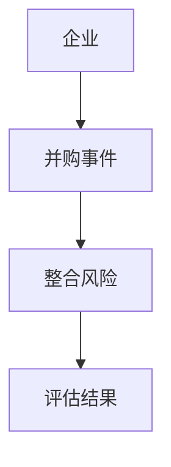
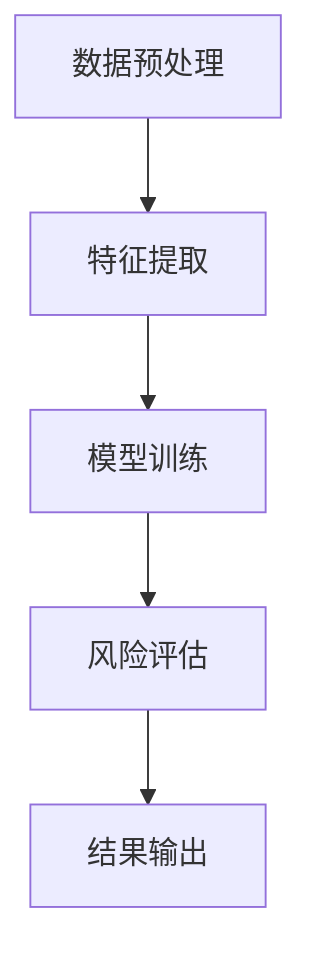
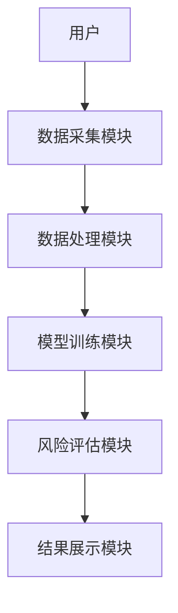
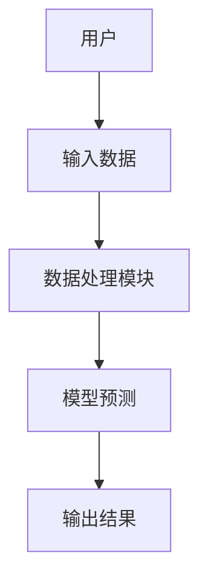

                 


# AI辅助的企业并购整合风险评估模型

## 关键词：AI，企业并购，风险评估，机器学习，企业整合

## 摘要：  
随着企业并购活动的日益频繁，整合过程中的风险评估变得至关重要。传统的风险评估方法往往依赖于主观判断和经验，存在数据不足、模型简单化和人为因素干扰的问题。本文提出了一种基于AI的企业并购整合风险评估模型，利用机器学习算法和大数据分析技术，从多维度对整合风险进行量化评估。文章详细探讨了模型的构建过程、算法原理和系统架构，并通过实际案例分析展示了模型的应用效果，为企业并购整合提供了科学的决策支持。

---

## 第一部分：企业并购整合风险评估的背景与挑战

### 第1章：企业并购整合概述

#### 1.1 企业并购的基本概念
企业并购（Mergers and Acquisitions, M&A）是指企业之间通过合并或收购的方式，实现资源优化配置和战略目标的过程。并购整合则是指在并购后，将两家企业的组织结构、文化、业务流程等进行融合，以实现协同效应的过程。

#### 1.2 并购整合中的主要风险
在企业并购整合过程中，常见的风险包括：
1. **战略风险**：并购后的战略目标不清晰，导致资源浪费。
2. **经营风险**：整合过程中出现管理混乱，影响业务运营。
3. **文化与组织风险**：企业文化差异导致员工抵触，组织结构难以融合。
4. **人力资源风险**：关键员工流失，影响团队稳定性。

#### 1.3 传统并购整合风险评估方法的局限性
传统的风险评估方法主要依赖于主观判断和经验分析，存在以下问题：
1. **数据不足**：传统方法通常只考虑有限的几个因素，难以全面捕捉整合风险。
2. **模型简单化**：传统模型往往假设条件过于简化，难以反映实际情况。
3. **人为因素干扰**：评估结果容易受到评估者主观判断的影响。

---

## 第二部分：AI辅助企业并购整合风险评估的核心概念

### 第2章：AI在企业并购整合中的应用

#### 2.1 AI技术在风险评估中的优势
1. **数据处理能力的提升**：AI能够处理海量数据，提取有价值的信息。
2. **智能预测与决策支持**：通过机器学习算法，AI可以预测整合风险并提供决策支持。
3. **实时监控与反馈机制**：AI系统能够实时监控整合过程中的异常情况，并及时反馈。

#### 2.2 AI辅助风险评估的关键技术
1. **机器学习算法**：包括决策树、随机森林、支持向量机（SVM）等，用于分类和预测。
2. **自然语言处理**：用于分析企业文化和文档信息。
3. **数据挖掘与分析**：用于从历史数据中发现模式和趋势。

#### 2.3 核心概念与联系
**核心概念对比表**：  
| 概念 | 传统方法 | AI方法 |  
|------|----------|--------|  
| 数据来源 | 少量样本 | 海量数据 |  
| 模型复杂度 | 简单线性 | 高维非线性 |  
| 可解释性 | 高 | 中等 |  

**实体关系图（ER图）**：  


---

## 第三部分：AI辅助企业并购整合风险评估的算法原理

### 第3章：算法原理与实现

#### 3.1 算法原理
1. **概率论基础**：  
   概率论是机器学习的基础，用于计算事件发生的可能性。例如，贝叶斯定理常用于分类问题：
   $$ P(A|B) = \frac{P(B|A)P(A)}{P(B)} $$
2. **统计学方法**：  
   使用回归分析、聚类分析等方法对数据进行建模。
3. **机器学习模型**：  
   - **决策树**：用于分类问题，通过信息增益选择特征。
   - **随机森林**：通过集成学习提升模型的准确性和稳定性。

#### 3.2 算法实现流程
1. **数据预处理**：  
   包括数据清洗、特征提取和标准化。
2. **模型训练**：  
   使用训练数据训练模型，调整参数以优化性能。
3. **模型评估与优化**：  
   通过交叉验证评估模型性能，并进行参数调优。

#### 3.3 算法流程图（Mermaid）


#### 3.4 数学模型与公式
**逻辑回归模型**：  
$$ P(Y=1) = \frac{1}{1 + e^{-\beta X}} $$

---

## 第四部分：AI辅助企业并购整合风险评估的系统架构

### 第4章：系统分析与架构设计

#### 4.1 系统功能设计
1. **数据采集模块**：采集企业并购数据。
2. **风险评估模块**：基于机器学习模型进行风险预测。
3. **结果展示模块**：可视化评估结果。

#### 4.2 系统架构设计（Mermaid）


#### 4.3 系统交互流程图（Mermaid）


---

## 第五部分：AI辅助企业并购整合风险评估的项目实战

### 第5章：项目实战

#### 5.1 环境安装
- **Python**：安装Python 3.8及以上版本。
- **库**：安装numpy、pandas、scikit-learn等库。

#### 5.2 核心实现代码
```python
import pandas as pd
from sklearn.tree import DecisionTreeClassifier
from sklearn.model_selection import train_test_split

# 数据加载
data = pd.read_csv('merger_data.csv')

# 特征与目标分离
X = data.drop('risk_level', axis=1)
y = data['risk_level']

# 数据分割
X_train, X_test, y_train, y_test = train_test_split(X, y, test_size=0.2)

# 模型训练
model = DecisionTreeClassifier()
model.fit(X_train, y_train)

# 模型预测
y_pred = model.predict(X_test)

# 结果输出
print("预测结果:", y_pred)
```

#### 5.3 代码解读与分析
1. **数据加载**：从CSV文件中加载并购数据。
2. **特征与目标分离**：将数据分为特征矩阵和目标向量。
3. **数据分割**：将数据分为训练集和测试集。
4. **模型训练**：使用决策树模型训练模型。
5. **模型预测**：在测试集上进行预测。
6. **结果输出**：打印预测结果。

#### 5.4 实际案例分析
以某次企业并购为例，展示模型的应用过程：
1. **数据输入**：输入企业的相关数据。
2. **模型预测**：模型输出风险等级。
3. **结果解读**：根据风险等级制定整合策略。

---

## 第六部分：总结与展望

### 第6章：总结与展望

#### 6.1 模型的优势
1. **高准确性**：基于机器学习算法，模型预测准确率高。
2. **实时性**：能够实时监控整合过程中的风险。

#### 6.2 应用前景
AI辅助的企业并购整合风险评估模型在企业战略决策、投资评估等领域具有广泛的应用前景。

#### 6.3 最佳实践 Tips
- 数据质量是模型性能的关键，需确保数据的完整性和准确性。
- 模型的可解释性需要进一步优化，以便更好地指导企业决策。
- 定期更新模型，以适应市场变化和企业需求。

---

## 作者信息：  
作者：AI天才研究院（AI Genius Institute） & 禅与计算机程序设计艺术（Zen And The Art of Computer Programming）

