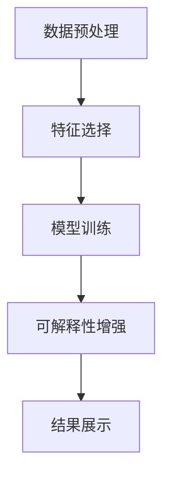

                 


# AI驱动的企业信用评级模型可解释性增强系统

> 关键词：企业信用评级，人工智能，可解释性，机器学习，信用风险

> 摘要：本文深入探讨了如何利用人工智能技术构建企业信用评级模型，并通过可解释性增强系统提升模型的透明度和可信度。文章从背景介绍、核心概念、算法原理、系统架构到项目实战，全面解析了AI驱动的企业信用评级模型的构建过程，重点阐述了如何通过可解释性技术增强模型的透明性和实用性。

---

## 第一部分：背景与概述

### 第1章：企业信用评级与AI驱动系统概述

#### 1.1 企业信用评级的背景与重要性

企业信用评级是评估企业信用状况的重要手段，广泛应用于金融、银行、投资等领域。传统的信用评级方法主要依赖于人工分析和经验判断，存在主观性强、效率低、风险高等问题。随着人工智能技术的快速发展，利用AI技术构建自动化、智能化的信用评级模型成为趋势。

传统信用评级的局限性：
- 数据依赖性强，人工分析耗时且易出错。
- 风险评估不够精确，难以捕捉复杂市场环境中的潜在风险。
- 可解释性不足，难以满足监管和决策需求。

AI技术的应用优势：
- 高效性：通过机器学习算法快速处理大量数据，提高评级效率。
- 精准性：能够捕捉数据中的非线性关系，提升风险评估的准确性。
- 可扩展性：支持大规模数据处理和实时更新。

#### 1.2 AI驱动信用评级系统的概念

AI驱动的信用评级系统是一种基于机器学习算法的智能系统，通过分析企业的财务数据、市场表现、行业趋势等多维度信息，自动评估企业的信用状况。该系统的核心目标是提供高效、准确的信用评级服务，同时增强模型的可解释性，满足监管和实际应用的需求。

系统的关键组成部分：
- 数据采集与预处理模块。
- 模型训练与优化模块。
- 可解释性增强模块。
- 结果展示与应用模块。

#### 1.3 可解释性增强的重要性

在企业信用评级中，可解释性是确保模型决策透明性和可信度的关键因素。AI模型的黑箱特性可能导致用户对模型结果的质疑，尤其是在金融领域，用户需要了解模型的决策依据，以便做出合理的投资和风险管理决策。

可解释性增强的目标：
- 提供直观的模型解释，帮助用户理解评级结果的依据。
- 增强用户对模型的信任，满足监管要求。
- 支持模型优化和迭代，提升模型的准确性和稳定性。

---

## 第二部分：核心概念与原理

### 第2章：信用评级模型的核心要素

#### 2.1 数据特征与处理

数据特征是信用评级模型的核心输入，直接影响模型的性能。以下是常见的企业信用评级数据特征：

- **财务数据**：收入、利润、资产负债率、流动比率等。
- **市场数据**：行业趋势、市场波动、竞争对手分析。
- **信用历史**：企业以往的信用记录、违约历史。
- **其他数据**：企业规模、地理位置、管理团队等。

数据预处理方法：
- 数据清洗：处理缺失值、异常值。
- 数据标准化：对不同特征进行归一化处理。
- 特征选择：通过相关性分析或降维方法筛选重要特征。

#### 2.2 机器学习算法的选择

在信用评级模型中，选择合适的算法是关键。以下是一些常见的机器学习算法及其适用场景：

- **逻辑回归（Logistic Regression）**：
  - 适用于二分类问题，输出概率值。
  - 优点：解释性强，易于实现。
  - 缺点：假设数据服从线性关系，可能无法捕捉复杂特征。

- **随机森林（Random Forest）**：
  - 适用于高维数据和非线性关系。
  - 优点：能够处理特征交互作用，鲁棒性强。
  - 缺点：解释性较弱，需要通过特征重要性分析提升透明度。

- **梯度提升树（Gradient Boosting Trees，如XGBoost、LightGBM）**：
  - 适用于高精度预测，支持多种数据类型。
  - 优点：性能优异，支持缺失值处理。
  - 缺点：模型复杂度高，解释性较差。

- **神经网络（Neural Networks）**：
  - 适用于复杂非线性关系，支持深度学习。
  - 优点：表达能力强，能够捕捉复杂的模式。
  - 缺点：模型复杂，解释性较差。

#### 2.3 可解释性技术的原理

可解释性技术是提升模型透明度的关键手段。以下是几种常用的可解释性技术：

- **特征重要性分析**：
  - 通过算法内置的特征权重（如随机森林的特征重要性）或后处理方法（如SHAP值）评估特征对模型输出的影响程度。

- **SHAP（SHapley Additive exPlanations）值**：
  - 基于博弈论的解释方法，计算每个特征对单个样本预测结果的贡献值。
  - 优点：解释性高，支持局部和整体解释。
  - 缺点：计算复杂，对大数据场景可能性能较低。

- **LIME（Local Interpretable Model-agnostic Explanations）**：
  - 通过局部近似生成可解释的规则。
  - 优点：适用于任何模型，支持局部解释。
  - 缺点：仅提供局部解释，无法反映全局特征。

- **可视化工具**：
  - 使用可视化方法（如热图、分箱图）展示特征对模型输出的影响。

---

## 第三部分：算法原理与数学模型

### 第3章：机器学习模型的算法原理

#### 3.1 逻辑回归模型

逻辑回归是一种经典的二分类算法，广泛应用于信用评级中。其核心思想是通过线性回归模型对样本进行分类概率的预测。

##### 3.1.1 模型公式推导

逻辑回归的输出公式为：
$$ P(y=1|x) = \frac{e^{\beta_0 + \beta_1 x_1 + \beta_2 x_2 + \dots + \beta_n x_n}}{1 + e^{\beta_0 + \beta_1 x_1 + \beta_2 x_2 + \dots + \beta_n x_n}} $$

其中：
- $y$ 是目标变量（0或1）。
- $x_i$ 是输入特征。
- $\beta_i$ 是模型参数。

##### 3.1.2 损失函数的数学表达

逻辑回归的损失函数为对数损失函数：
$$ L(y, \hat{y}) = -\sum_{i=1}^{n} [y_i \ln \hat{y}_i + (1 - y_i) \ln (1 - \hat{y}_i)] $$

其中：
- $y_i$ 是真实标签。
- $\hat{y}_i$ 是模型预测概率。

##### 3.1.3 示例分析

假设我们有一个简单的数据集，包含企业的收入和利润两个特征，目标是预测企业是否违约（1为违约，0为不违约）。

1. 数据预处理：
   - 收入和利润进行标准化处理。
2. 模型训练：
   - 使用逻辑回归算法训练模型。
3. 模型评估：
   - 计算准确率、召回率、F1分数。
4. 特征解释：
   - 使用SHAP值分析收入和利润对违约概率的影响。

#### 3.2 随机森林与梯度提升树

##### 3.2.1 随机森林

随机森林是一种基于决策树的集成算法，通过随机采样和特征随机选择生成多个决策树，并通过投票或平均的方式得出最终结果。

##### 3.2.2 梯度提升树

梯度提升树是一种通过不断优化损失函数生成弱分类器的算法，支持回归、分类和排序任务。

##### 3.2.3 特征重要性计算

通过随机森林或梯度提升树内置的特征重要性评估方法，可以得出每个特征对模型输出的贡献程度。

---

## 第四部分：系统分析与架构设计方案

### 第4章：系统架构设计

#### 4.1 问题场景介绍

企业信用评级系统需要处理以下问题：
- 数据来源多样，格式不统一。
- 数据量大，特征复杂。
- 模型可解释性要求高。

#### 4.2 项目介绍

本项目旨在构建一个基于机器学习的企业信用评级系统，并通过可解释性增强技术提升模型的透明度和可信度。

#### 4.3 系统功能设计

系统功能模块包括：
- 数据采集与预处理。
- 模型训练与优化。
- 可解释性增强。
- 结果展示与应用。

#### 4.4 系统架构设计

以下是系统的模块化架构图：



---

## 第五部分：项目实战

### 第5章：环境安装与核心实现

#### 5.1 环境安装

安装所需的库：
```bash
pip install numpy pandas scikit-learn xgboost shap
```

#### 5.2 核心实现

以下是实现逻辑回归和随机森林模型的代码示例：

```python
import numpy as np
import pandas as pd
from sklearn.model_selection import train_test_split
from sklearn.linear_model import LogisticRegression
from sklearn.ensemble import RandomForestClassifier
import shap

# 加载数据
data = pd.read_csv('credit.csv')
X = data.drop('target', axis=1)
y = data['target']

# 数据分割
X_train, X_test, y_train, y_test = train_test_split(X, y, test_size=0.2, random_state=42)

# 逻辑回归模型
lr_model = LogisticRegression()
lr_model.fit(X_train, y_train)

# 随机森林模型
rf_model = RandomForestClassifier()
rf_model.fit(X_train, y_train)

# SHAP解释
explainer = shap.TreeExplainer(rf_model)
shap_values = explainer.shap_values(X_test)

# 可视化
shap.summary_plot(shap_values, X_test, feature_names=X.columns)
```

#### 5.3 代码应用解读与分析

- 数据加载：读取企业信用数据，提取特征和目标变量。
- 数据分割：将数据分为训练集和测试集。
- 模型训练：分别训练逻辑回归和随机森林模型。
- 可解释性分析：使用SHAP值分析模型的特征重要性。

---

## 第六部分：总结与展望

### 第6章：总结与展望

#### 6.1 总结

本文详细介绍了如何利用AI技术构建企业信用评级模型，并通过可解释性增强技术提升模型的透明度和可信度。通过逻辑回归、随机森林和梯度提升树等算法的对比分析，结合SHAP值的解释方法，展示了如何在实际项目中实现可解释性增强。

#### 6.2 展望

未来，随着AI技术的不断发展，企业信用评级模型的可解释性需求将更加突出。可以通过以下方向进一步优化：
- 开发更高效的可解释性算法。
- 提升模型的实时性和动态适应性。
- 探索多模态数据的融合应用。

---

## 作者信息

作者：AI天才研究院（AI Genius Institute）  
联系邮箱：contact@aigeniusinstitute.com  
官方网站：https://www.aigeniusinstitute.com

