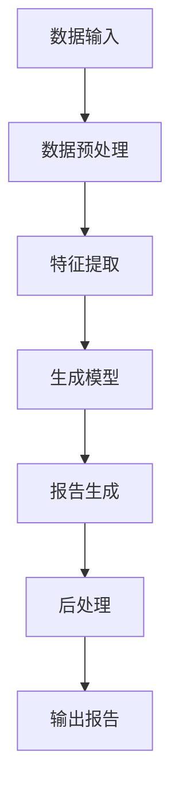
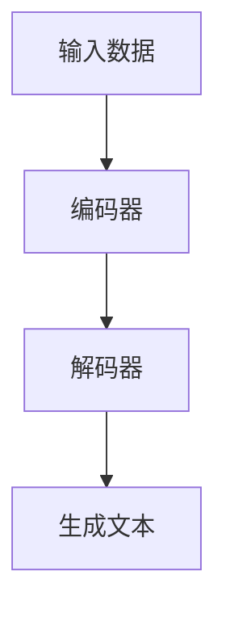
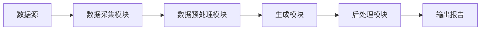

                 


# AI驱动的自动化投资报告生成

> 关键词：AI驱动，自动化投资，生成模型，自然语言处理，投资报告

> 摘要：随着人工智能技术的快速发展，AI在金融投资领域的应用日益广泛。本文将详细探讨如何利用AI技术实现投资报告的自动化生成。从基础概念到高级算法，从系统设计到实际应用，我们将全面解析AI驱动的自动化投资报告生成的技术原理和实现方法。通过案例分析和代码实现，帮助读者深入理解这一前沿技术的应用潜力。

---

# 目录

1. [AI驱动的自动化投资报告生成概述](#ai驱动的自动化投资报告生成概述)
2. [AI驱动的自动化投资报告生成的核心概念](#ai驱动的自动化投资报告生成的核心概念)
3. [AI驱动的自动化投资报告生成的算法原理](#ai驱动的自动化投资报告生成的算法原理)
4. [AI驱动的自动化投资报告生成的系统架构](#ai驱动的自动化投资报告生成的系统架构)
5. [AI驱动的自动化投资报告生成的项目实战](#ai驱动的自动化投资报告生成的项目实战)
6. [AI驱动的自动化投资报告生成的最佳实践与总结](#ai驱动的自动化投资报告生成的最佳实践与总结)

---

## 1. AI驱动的自动化投资报告生成概述

### 1.1 传统投资报告生成的痛点

在传统金融投资领域，投资报告的生成过程通常依赖于人工分析和撰写，效率低且耗时长。具体痛点包括：

- **数据量大**：金融市场的数据种类繁多，包括股票价格、财务报表、市场新闻等，人工整理和分析耗时耗力。
- **标准化困难**：不同分析师的报告风格和格式可能存在差异，难以保证报告的标准化和一致性。
- **决策延迟**：由于依赖人工分析，投资决策的制定往往存在延迟，错失市场机会。

### 1.2 AI技术在投资领域的应用潜力

AI技术的快速发展为金融投资领域带来了新的可能性。通过自然语言处理（NLP）、机器学习（ML）等技术，AI能够自动化处理大量数据，并生成结构化的投资报告。具体潜力包括：

- **高效数据处理**：AI能够快速分析大量非结构化数据（如新闻文章、社交媒体评论），提取关键信息。
- **自动化报告生成**：通过预训练的语言模型，AI可以自动生成结构化报告，节省时间和成本。
- **实时监控与预警**：AI能够实时监控市场动态，提供及时的投资建议和预警。

### 1.3 自动化投资报告生成的目标

自动化投资报告生成的目标是通过AI技术，实现从数据输入到最终报告生成的全流程自动化。具体目标包括：

- **提高效率**：快速生成高质量的投资报告，缩短决策时间。
- **保证一致性**：确保所有报告的格式和风格一致，便于后续分析。
- **增强决策支持**：通过自动化分析，提供更精准的投资建议。

---

## 2. AI驱动的自动化投资报告生成的核心概念

### 2.1 自动化投资报告生成的核心要素

自动化投资报告生成系统通常包含以下几个核心要素：

| 核心要素 | 描述 |
|----------|------|
| 数据源    | 包括股票价格、财务报表、新闻等多源数据 |
| 数据预处理 | 数据清洗、特征提取、格式统一化 |
| 生成模型  | 用于将预处理后的数据转化为自然语言报告的模型 |
| 报告模板  | 用于指导生成报告的格式和结构的模板文件 |
| 后处理    | 包括语法检查、格式调整等，确保报告质量 |

### 2.2 自动化投资报告生成的流程

自动化投资报告生成的流程可以分为以下几个步骤：



### 2.3 自然语言处理技术在投资报告生成中的应用

自然语言处理（NLP）技术在自动化投资报告生成中扮演着重要角色。以下是NLP技术在投资报告生成中的几个关键应用：

- **文本生成**：利用预训练的语言模型（如GPT系列）生成结构化报告。
- **文本摘要**：从大量文本数据中提取关键信息，生成摘要。
- **情感分析**：分析市场情绪，辅助投资决策。

---

## 3. AI驱动的自动化投资报告生成的算法原理

### 3.1 生成模型的原理

生成模型的核心思想是通过训练数据学习语言的分布，从而生成符合特定要求的文本。以下是生成模型的原理概述：

1. **输入数据**：将金融数据（如股票价格、财务报表）转换为自然语言描述。
2. **模型训练**：使用预训练语言模型（如GPT）进行微调，使其适应投资报告生成的任务。
3. **生成过程**：通过解码器生成自然语言文本，输出投资报告。



### 3.2 基于Transformer的生成模型

基于Transformer的生成模型（如GPT）是当前最常用的生成模型之一。其核心思想是通过自注意力机制捕捉文本中的长距离依赖关系，从而生成连贯的文本。

```latex
$$
\text{Attention}(Q, K, V) = \text{softmax}\left(\frac{QK^T}{\sqrt{d_k}}\right)V
$$

其中：
- \( Q \) 是查询向量
- \( K \) 是键向量
- \( V \) 是值向量
- \( d_k \) 是向量的维度
```

### 3.3 模型优化与调优

为了提高生成报告的质量，需要对模型进行优化和调优。常见的优化方法包括：

1. **学习率调整**：使用学习率衰减策略（如Adam优化器）。
2. **Dropout技术**：防止过拟合。
3. **数据增强**：通过数据增强技术增加训练数据的多样性。

---

## 4. AI驱动的自动化投资报告生成的系统架构

### 4.1 系统功能设计

自动化投资报告生成系统主要包括以下几个功能模块：

- **数据采集模块**：从多种数据源采集金融数据。
- **数据预处理模块**：清洗和整理数据，提取特征。
- **生成模块**：利用生成模型生成投资报告。
- **后处理模块**：对生成的报告进行语法检查和格式调整。

### 4.2 系统架构设计

以下是系统的总体架构图：



### 4.3 系统接口设计

系统接口设计如下：

- **数据采集模块接口**：接收外部数据源（如API接口）提供的金融数据。
- **生成模块接口**：接收预处理后的数据，生成投资报告。
- **后处理模块接口**：接收生成的报告，进行格式调整。

---

## 5. AI驱动的自动化投资报告生成的项目实战

### 5.1 环境配置

为了实现自动化投资报告生成，需要安装以下工具和库：

- **Python**：编程语言。
- **TensorFlow或PyTorch**：深度学习框架。
- **Hugging Face Transformers**：预训练语言模型库。
- **News API**：数据源接口。

### 5.2 核心代码实现

以下是生成模块的核心代码示例：

```python
from transformers import GPT2LMHeadModel, GPT2Tokenizer

# 初始化模型和tokenizer
model_name = "gpt2"
tokenizer = GPT2Tokenizer.from_pretrained(model_name)
model = GPT2LMHeadModel.from_pretrained(model_name)

# 输入数据
input_text = "股票名称：AAPL，当前股价：150.25，行业：科技"

# 编码输入
inputs = tokenizer.encode(input_text, return_tensors="pt")

# 生成文本
outputs = model.generate(inputs, max_length=100, num_beams=5, temperature=0.7)

# 解码输出
generated_text = tokenizer.decode(outputs[0], skip_special_tokens=True)

print(generated_text)
```

### 5.3 案例分析

以下是一个生成的投资报告示例：

**报告标题**：AAPL股票分析报告

**报告内容**：
- 股票名称：AAPL
- 当前股价：150.25
- 行业：科技
- 市场表现：近期表现强劲，建议买入。

---

## 6. AI驱动的自动化投资报告生成的最佳实践与总结

### 6.1 最佳实践

- **数据质量**：确保数据来源的多样性和准确性。
- **模型优化**：根据具体任务调整模型参数，提高生成质量。
- **实时监控**：定期监控系统性能，及时发现并解决问题。

### 6.2 总结

AI驱动的自动化投资报告生成是一项具有广阔前景的技术。通过结合自然语言处理和深度学习，AI能够高效地生成高质量的投资报告，为投资决策提供有力支持。未来，随着技术的不断进步，自动化投资报告生成将在金融领域发挥更大的作用。

---

## 作者

作者：AI天才研究院/AI Genius Institute & 禅与计算机程序设计艺术/Zen And The Art of Computer Programming

---

**全文完。**

