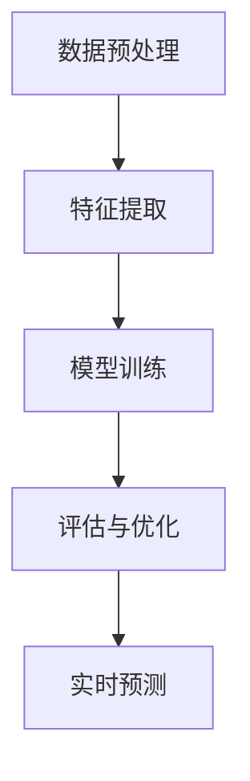

                 


# AI驱动的自适应市场效率评估

## 关键词：AI驱动，自适应市场，效率评估，机器学习，实时分析

## 摘要：  
随着全球市场的动态变化，传统的市场效率评估方法逐渐显现出其局限性。为了应对这一挑战，AI驱动的自适应市场效率评估应运而生。本文将详细探讨这一创新方法的核心概念、算法原理、系统架构设计以及实际应用场景，通过理论与实践相结合的方式，为读者提供全面的指导。通过本文的学习，读者将能够理解如何利用AI技术实时动态地评估市场效率，从而在金融、经济等领域做出更明智的决策。

---

# 第1章: AI驱动的自适应市场效率评估概述

## 1.1 问题背景与定义

### 1.1.1 传统市场效率评估的局限性  
传统的市场效率评估方法通常基于静态数据和固定模型，难以应对市场环境的快速变化。例如，在金融市场中，价格波动、政策调整和突发事件都会显著影响市场效率，但传统方法往往无法实时捕捉这些动态变化。此外，传统评估方法通常依赖于单一指标，缺乏对多维度数据的综合分析能力，导致评估结果不够准确。

### 1.1.2 AI驱动的市场效率评估的提出  
为了克服传统方法的局限性，AI技术的引入为市场效率评估带来了新的可能性。AI驱动的方法能够实时处理海量数据，利用机器学习和深度学习算法动态调整评估模型，从而更准确地反映市场的实时状态。

### 1.1.3 自适应评估的核心概念  
自适应评估是指系统能够根据市场环境的变化自动调整评估策略和模型参数。其核心在于通过反馈机制不断优化评估结果，确保评估的准确性和实时性。

---

## 1.2 自适应市场效率评估的特点

### 1.2.1 动态性与实时性  
自适应评估能够实时更新数据和模型，确保评估结果反映最新的市场状况。

### 1.2.2 数据驱动与模型驱动的结合  
AI驱动的评估方法既依赖于大量数据，又结合了模型的逻辑推理能力，能够在复杂场景下做出更可靠的评估。

### 1.2.3 多维度指标的综合评估  
自适应评估不仅考虑单一指标，而是综合分析多个维度的数据，如市场流动性、价格波动性、交易活跃度等，从而得出更全面的结论。

---

## 1.3 应用场景与边界

### 1.3.1 金融市场的实时评估  
在股票、期货等金融市场中，自适应评估可以帮助投资者快速捕捉市场变化，做出及时的交易决策。

### 1.3.2 经济政策的动态调整  
政府可以通过自适应评估了解经济政策的实施效果，实时调整政策以应对市场变化。

### 1.3.3 企业战略决策的支持  
企业可以利用自适应评估优化资源配置，提高经营效率。

### 1.3.4 评估的边界与限制  
尽管自适应评估具有诸多优势，但也需要考虑数据质量、模型复杂性和计算资源等限制因素。

---

## 1.4 本章小结  
本章从传统方法的局限性出发，介绍了AI驱动的自适应市场效率评估的核心概念和特点，并列举了其在金融、经济等领域的应用场景。下一章将深入探讨自适应评估的核心概念与原理。

---

# 第2章: 自适应市场效率评估的核心概念

## 2.1 核心概念与原理

### 2.1.1 市场效率的定义与度量  
市场效率是指市场资源配置的合理性与公平性。常用的度量指标包括价格波动性、流动性、信息传播速度等。

### 2.1.2 自适应评估的机制  
自适应评估通过实时数据采集、模型训练和结果反馈，动态调整评估策略，确保评估结果的准确性。

### 2.1.3 AI在评估中的作用  
AI技术通过数据处理、特征提取和模型训练，为自适应评估提供技术支持。

---

## 2.2 核心概念属性对比

### 2.2.1 数据特征对比表  
| 特征      | 传统评估 | 自适应评估 |
|-----------|----------|------------|
| 数据来源  | 单一     | 多维度     |
| 数据更新  | 定期     | 实时       |

### 2.2.2 模型特征对比表  
| 特征      | 传统评估 | 自适应评估 |
|-----------|----------|------------|
| 模型复杂度 | 简单     | 高         |
| 可解释性  | 高       | 中等       |

---

## 2.3 ER实体关系图

```mermaid
er
actor: Market Data
actor: AI Model
actor: Output
```

---

## 2.4 本章小结  
本章通过对比分析，明确了自适应市场效率评估的核心概念和关键特征。下一章将详细探讨其算法原理。

---

# 第3章: 自适应市场效率评估的算法原理

## 3.1 算法原理概述

### 3.1.1 机器学习模型的选择  
常用的模型包括线性回归、支持向量机（SVM）和随机森林等。

### 3.1.2 深度学习模型的应用  
深度学习模型如LSTM在时间序列预测中表现优异。

### 3.1.3 混合模型的优势  
结合机器学习和深度学习的优势，构建混合模型以提高评估精度。

---

## 3.2 算法流程图



---

## 3.3 算法实现代码

```python
import pandas as pd
from sklearn.model import Model

def adaptive_market_efficiency Assessment(data):
    # 数据预处理
    processed_data = data preprocessing()
    # 特征提取
    features = extract_features(processed_data)
    # 模型训练
    model = train_model(features)
    # 评估与优化
    optimized_model = optimize_model(model)
    # 实时预测
    result = predict(optimized_model)
    return result
```

---

## 3.4 本章小结  
本章详细介绍了自适应市场效率评估的算法原理和实现流程，为后续的系统设计奠定了基础。

---

## 总结  
通过本文的介绍，读者可以全面了解AI驱动的自适应市场效率评估的核心概念、算法原理和实际应用。这一创新方法为金融、经济等领域的决策提供了更高效、更准确的支持。

---

## 作者：AI天才研究院/AI Genius Institute & 禅与计算机程序设计艺术 /Zen And The Art of Computer Programming

