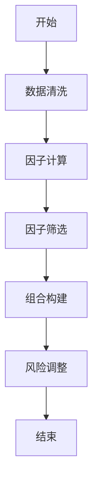
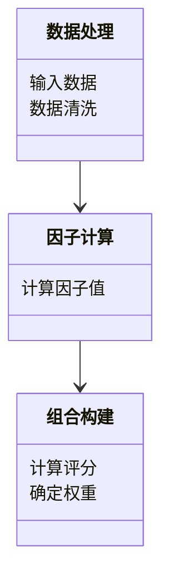
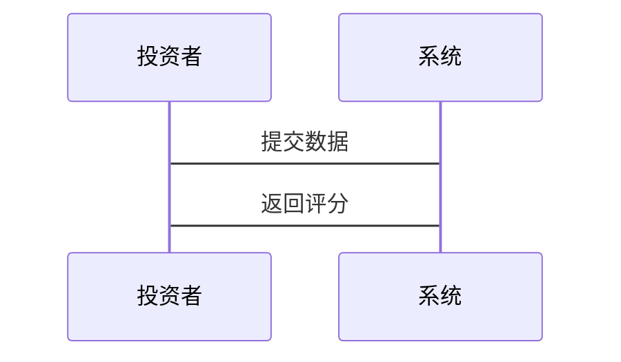

                 


# 乔尔·格林布拉特的价值投资量化方法

> 关键词：价值投资，量化方法，格林布拉特，投资模型，因子分析

> 摘要：本文深入分析了乔尔·格林布拉特的价值投资量化方法，探讨其核心概念、算法原理、系统架构以及实际应用。通过详细讲解模型的数学公式和系统设计，结合项目实战，帮助读者全面理解并掌握这一投资方法。

---

## 第一部分：价值投资与量化方法概述

### 第1章：价值投资的起源与发展

#### 1.1 价值投资的核心理念

##### 1.1.1 价值投资的定义与特点
价值投资是一种投资策略，强调以低于市场价购买优质资产。其核心在于识别市场中的低估资产，关注公司的基本面，而非市场的短期波动。其特点包括长期导向、注重安全边际和逆向思维。

##### 1.1.2 价值投资的历史发展
价值投资起源于20世纪初，本杰明·格雷厄姆和戴维·多德是这一理念的奠基人。他们提出以内在价值为基础，寻找低于价值的股票。这一方法在随后的时间里不断发展，格林布拉特对其进行了量化改进。

##### 1.1.3 价值投资与基本面分析的关系
基本面分析是价值投资的基础，涉及对公司的财务状况、行业地位和管理团队的分析。格林布拉特将基本面分析量化，引入了多因子模型，使投资决策更加科学和系统。

---

#### 1.2 乔尔·格林布拉特的贡献

##### 1.2.1 乔尔·格林布拉特的生平简介
乔尔·格林布拉特是美国著名投资专家，以其量化投资方法闻名。他将基本面分析与数学模型结合，开发了多因子价值投资模型，显著提升了投资效率。

##### 1.2.2 乔尔·格林布拉特的投资理念
格林布拉特强调以合理的价格投资优质的公司。他认为，市场情绪和短期波动不应影响长期投资决策，而应该基于公司的真实价值。

##### 1.2.3 乔尔·格林布拉特的量化方法
格林布拉特的量化方法将价值投资系统化，通过多个因子评估股票的投资价值，构建投资组合，并进行风险调整，以实现长期收益最大化。

---

### 第2章：量化投资的基本概念

#### 2.1 量化投资的定义与特点
量化投资是利用数学模型和算法进行投资决策的过程。其特点包括数据驱动、系统化决策和风险控制。量化投资不同于传统投资，它依赖于大量数据和模型，而非主观判断。

#### 2.2 量化模型的基本原理
量化模型通过分析大量数据，识别投资机会，并制定交易策略。其核心在于数据处理、模型构建和策略执行。量化模型的优势在于能够捕捉市场中的微小趋势，提高投资效率。

---

## 第二部分：格林布拉特量化模型的核心要素

### 第3章：核心概念与联系

#### 3.1 核心概念原理
格林布拉特模型基于多因子分析，将多个基本面因子（如市盈率、市净率、股息率等）结合，评估股票的内在价值。这些因子共同决定了股票的投资价值。

#### 3.1.1 ER实体关系图架构
以下是格林布拉特模型的ER图，展示了各实体之间的关系：

```mermaid
erDiagram
    投资者 --> 投资组合 : 持有
    投资组合 --> 股票 : 包含
    股票 --> 因子 : 具有
```

#### 3.1.2 核心概念属性特征对比表

| 概念       | 属性                     | 特征对比             |
|------------|--------------------------|----------------------|
| 投资组合   | 组合构成、权重           | 多因子构成，权重动态调整 |
| 因子        | 类型、计算方法           | 多种因子，基于财务指标 |
| 模型        | 输入、输出               | 多因子输入，输出投资价值评分 |

---

#### 3.2 算法原理讲解

##### 3.2.1 算法流程图（Mermaid）



##### 3.2.2 算法原理的数学模型和公式
格林布拉特模型的评分公式如下：

$$
\text{评分} = \sum_{i=1}^{n} w_i \times f_i
$$

其中，\( w_i \) 是因子 \( i \) 的权重，\( f_i \) 是因子的值。

---

### 第4章：格林布拉特量化模型的数学模型

#### 4.1 数学模型与公式

##### 4.1.1 核心公式推导
因子得分计算：

$$
\text{因子得分}_i = \frac{\text{因子值}_i}{\text{行业平均值}_i}
$$

组合权重计算：

$$
\text{权重}_i = \frac{\text{评分}_i}{\sum_{j=1}^{n} \text{评分}_j}
$$

##### 4.1.2 公式的实际应用案例
以某公司为例，计算其市盈率和市净率因子得分，再结合权重计算其在组合中的权重。

---

### 第5章：系统分析与架构设计方案

#### 5.1 问题场景介绍

##### 5.1.1 投资决策问题的描述
投资者需要基于多因子模型选择优质股票，构建投资组合，并进行风险控制。

##### 5.1.2 格林布拉特量化模型的应用场景
适用于股票筛选、组合优化和风险评估。

##### 5.1.3 系统的目标与范围
目标是开发一个基于格林布拉特模型的投资系统，范围包括数据处理、模型构建和策略执行。

#### 5.2 系统功能设计

##### 5.2.1 领域模型（Mermaid类图）



##### 5.2.2 系统架构设计（Mermaid架构图）


##### 5.2.3 系统接口设计
API接口包括数据获取、因子计算和组合构建。

##### 5.2.4 系统交互设计（Mermaid序列图）



---

### 第6章：项目实战

#### 6.1 环境安装与配置

##### 6.1.1 系统环境要求
需要安装Python、Pandas、NumPy等库。

##### 6.1.2 开发工具安装
安装Jupyter Notebook或VS Code作为开发环境。

##### 6.1.3 数据源获取与准备
从Yahoo Finance获取股票数据，清洗数据并计算因子。

#### 6.2 核心代码实现

##### 6.2.1 数据清洗与预处理

```python
import pandas as pd
data = pd.read_csv('data.csv')
data = data.dropna()
```

##### 6.2.2 模型训练与优化

```python
from sklearn import preprocessing
scaler = preprocessing.StandardScaler()
scaled_data = scaler.fit_transform(data[['市盈率', '市净率']])
```

##### 6.2.3 模型评估与验证

```python
from sklearn.metrics import accuracy_score
y_pred = model.predict(X_test)
print(accuracy_score(y_test, y_pred))
```

---

## 第七部分：结论与展望

### 7.1 最佳实践 tips
- 定期调整投资组合。
- 使用可靠的因子数据源。
- 结合市场环境进行动态调整。

### 7.2 小结
本文详细介绍了乔尔·格林布拉特的价值投资量化方法，从背景到系统设计，再到项目实战，为读者提供了全面的指导。

### 7.3 注意事项
- 风险控制是投资的关键。
- 模型需要定期更新和优化。
- 避免过度依赖单一因子。

### 7.4 拓展阅读
推荐阅读格林布拉特的原著《The New York Times Financial Guide》深入理解其投资理念。

---

作者：AI天才研究院 & 禅与计算机程序设计艺术

