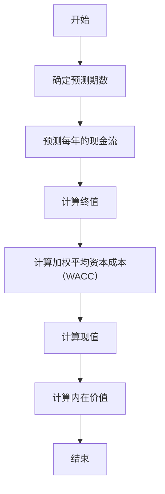
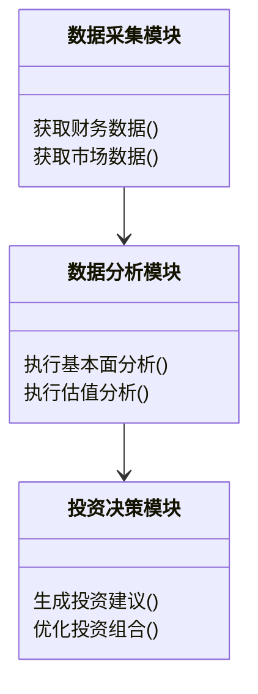
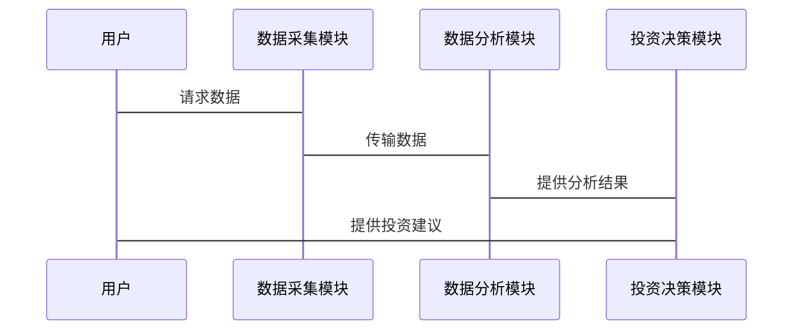

                 


```markdown
# 价值投资在新兴市场的应用

## 关键词：
- 价值投资
- 新兴市场
- 股票分析
- 投资策略
- 数学模型

## 摘要：
本文系统地探讨了价值投资在新兴市场的应用，从理论基础到实际操作，结合数学模型和系统架构设计，详细分析了如何在新兴市场中运用价值投资策略。文章首先介绍了价值投资的核心概念和新兴市场的特点，随后深入分析了基本面分析、安全边际等关键原理，并结合现金流折现模型（DCF）等数学工具，提出了具体的分析框架。通过系统架构设计和实际案例分析，本文为读者提供了在新兴市场中实践价值投资的完整指南。

---

## 第1章：价值投资的基本原理

### 1.1 价值投资的起源与发展
价值投资起源于20世纪初，由本杰明·格雷厄姆和戴维·多德等人提出。其核心理念是寻找被市场低估的股票，通过深入分析企业的财务状况和市场价值，找到安全边际，从而实现长期稳定的收益。现代价值投资在传统理论的基础上，结合了量化分析和大数据技术，进一步拓展了其应用范围。

### 1.2 新兴市场的定义与特点
新兴市场通常指那些经济发展迅速、市场机制尚未完全成熟的国家或地区的金融市场。其特点包括市场流动性较低、公司治理不完善、行业波动较大等。新兴市场往往蕴含着巨大的投资机会，但也伴随着较高的风险。

### 1.3 价值投资在新兴市场的必要性
在新兴市场中，价值投资的优势在于能够通过深入的财务分析发现被低估的公司，尤其是在市场波动剧烈的情况下，价值投资能够帮助投资者规避风险，实现长期收益。然而，新兴市场的复杂性和不确定性也对投资者的能力提出了更高的要求。

---

## 第2章：价值投资的核心原理

### 2.1 基本面分析
基本面分析是价值投资的核心方法之一，主要通过分析公司的财务报表来评估其内在价值。以下是基本面分析的关键指标：

| 指标名称      | 定义与作用                          |
|---------------|------------------------------------|
| 营业收入      | 公司在一定时期内通过销售产品或服务所获得的总收入，反映公司的市场表现。 |
| 净利润        | 公司在扣除所有成本和费用后的最终利润，是衡量公司盈利能力的重要指标。 |
| 资产负债率    | 企业的总负债与总资产的比率，反映公司的财务杠杆和偿债能力。 |
| 现金流        | 公司在一定时期内现金和现金等价物的流入和流出情况，是公司财务健康的重要指标。 |

### 2.2 安全边际
安全边际是指股票的市场价格低于其内在价值的程度。安全边际的存在为投资者提供了风险缓冲，能够在市场波动时保护投资本金。计算安全边际时，通常将市场价格与内在价值进行比较：

$$ \text{安全边际} = \text{内在价值} - \text{市场价格} $$

如果安全边际为正，则意味着股票被低估，具有投资价值。

### 2.3 股票内在价值的评估
股票的内在价值是基于公司未来现金流的现值计算得出的。现金流折现模型（DCF）是评估内在价值的重要工具，其基本公式为：

$$ \text{内在价值} = \sum_{t=1}^{n} \frac{\text{现金流}_t}{(1 + r)^t} + \frac{\text{终值}}{(1 + r)^n} $$

其中，\( r \) 是折现率，\( n \) 是预测期数，\( \text{现金流}_t \) 是第 \( t \) 年的现金流，终值是永续年的现金流。

---

## 第3章：价值投资在新兴市场的应用策略

### 3.1 新兴市场的行业分析
在新兴市场中，行业分析是价值投资的重要步骤。以下是一个新兴市场行业的基本面分析框架：

1. 行业生命周期分析：确定行业所处的阶段（幼稚期、成长期、成熟期、衰退期）。
2. 行业竞争结构分析：使用波特五力模型评估行业竞争程度。
3. 行业财务表现分析：比较行业内公司的财务指标，寻找具有竞争优势的企业。

### 3.2 新兴市场的公司分析
公司分析是价值投资的核心，以下是公司分析的步骤：

1. 财务报表分析：通过资产负债表、利润表和现金流量表评估公司的财务健康状况。
2. 管理团队评估：分析公司管理层的背景、经验和战略决策能力。
3. 竞争优势分析：识别公司在市场中的独特优势，如技术壁垒、品牌优势等。

### 3.3 新兴市场的估值方法
在新兴市场中，常用的估值方法包括：

- **市盈率法**：计算市盈率（P/E）并与行业平均水平进行比较。
- **市净率法**：计算市净率（P/B）并评估其合理性。
- **现金流折现法**：基于未来现金流的现值计算内在价值。

---

## 第4章：价值投资的数学模型与算法

### 4.1 现金流折现模型（DCF）
现金流折现模型是评估股票内在价值的核心工具。以下是DCF模型的流程图：



以下是DCF模型的Python代码实现：

```python
def calculate_intrinsic_value(cash_flows, discount_rate, terminal_value):
    present_value = 0
    for year, cash_flow in enumerate(cash_flows):
        if year == 0:
            present_value += cash_flow
        else:
            present_value += cash_flow / (1 + discount_rate) ** year
    intrinsic_value = present_value + terminal_value / (1 + discount_rate) ** len(cash_flows)
    return intrinsic_value

# 示例
cash_flows = [100, 120, 150]
discount_rate = 0.1
terminal_value = 2000
intrinsic_value = calculate_intrinsic_value(cash_flows, discount_rate, terminal_value)
print(f"内在价值：{intrinsic_value:.2f}")
```

---

## 第5章：价值投资分析系统的构建

### 5.1 系统功能设计
价值投资分析系统主要包含以下功能模块：

1. 数据采集模块：从多个数据源获取公司财务数据、市场数据等。
2. 数据分析模块：基于财务数据和市场数据，进行基本面分析和估值分析。
3. 投资决策模块：根据分析结果生成投资建议和投资组合优化方案。

### 5.2 系统架构设计
以下是系统架构的类图：



### 5.3 系统接口设计
系统接口设计主要包括：

1. 数据输入接口：接收外部数据源提供的财务数据和市场数据。
2. 数据处理接口：对数据进行清洗、转换和分析。
3. 结果输出接口：将分析结果输出为报告或投资建议。

### 5.4 系统交互设计
以下是系统交互的序列图：



---

## 第6章：价值投资在新兴市场的实战案例

### 6.1 案例分析
假设我们选择一家新兴市场的公司进行分析，以下是具体步骤：

1. **公司概况**：公司名称、行业、成立时间等。
2. **财务分析**：分析公司过去几年的财务报表，计算关键指标如净利润、资产负债率等。
3. **估值分析**：使用DCF模型计算公司的内在价值，并与市场价格进行比较。
4. **投资决策**：根据分析结果决定是否投资。

### 6.2 投资组合管理
在新兴市场中，投资组合管理尤为重要。以下是投资组合管理的步骤：

1. **资产配置**：根据市场情况调整股票和债券的配置比例。
2. **风险控制**：设定止损点和止盈点，避免过度亏损。
3. **定期再平衡**：根据市场变化定期调整投资组合，保持最优配置。

---

## 第7章：最佳实践与小结

### 7.1 最佳实践
1. **持续学习**：价值投资需要不断学习市场动态和公司基本面。
2. **风险控制**：在新兴市场中，风险控制是投资成功的关键。
3. **长期视角**：价值投资注重长期收益，避免短期波动的干扰。

### 7.2 小结
价值投资在新兴市场的应用是一个复杂但 rewarding 的过程。通过深入的财务分析、合理的估值方法和有效的系统支持，投资者可以在新兴市场中找到优质的投资标的，实现长期稳定的收益。

---

## 作者：AI天才研究院/AI Genius Institute & 禅与计算机程序设计艺术 /Zen And The Art of Computer Programming
```

