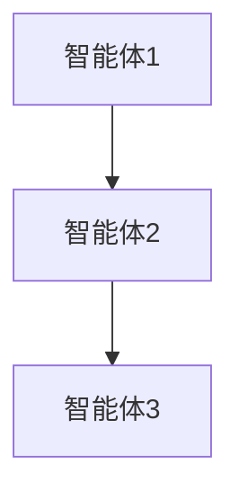
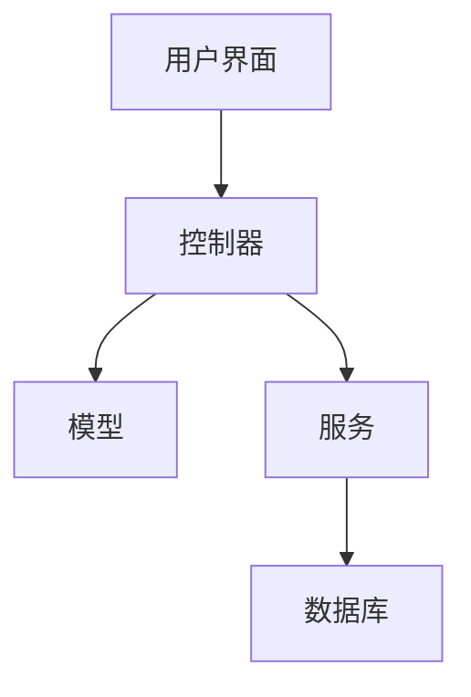
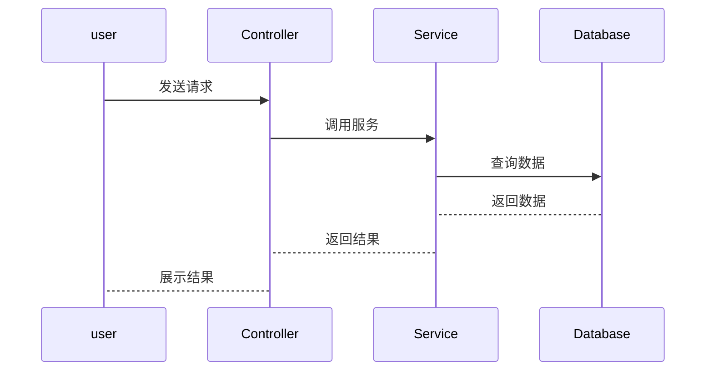

                 


# 多智能体系统分析全球经济联系

> 关键词：多智能体系统，全球经济联系，协作算法，博弈论，系统架构，案例分析

> 摘要：本文探讨多智能体系统在分析全球经济联系中的应用，通过详细阐述多智能体系统的原理、算法、系统架构及实际案例，展示如何利用多智能体系统建模和分析复杂的全球经济体系。

---

# 第一部分: 多智能体系统与全球经济联系的背景介绍

## 第1章: 多智能体系统的定义与特点

### 1.1 多智能体系统的定义

多智能体系统（Multi-Agent Systems, MAS）是由多个智能体（Agent）组成的系统，这些智能体能够通过感知环境、自主决策并进行交互，共同完成复杂的任务。智能体可以是软件程序、机器人或其他具备自主决策能力的实体。

### 1.2 多智能体系统的核心特点

- **分布式性**：智能体分布在网络中的各个节点，独立决策。
- **协作性**：智能体之间通过协作完成共同目标。
- **反应性**：智能体能够实时感知环境并做出反应。
- **自主性**：智能体在没有外部干预的情况下自主运作。

### 1.3 多智能体系统与传统AI的区别

| 特性                | 多智能体系统            | 传统AI                |
|---------------------|------------------------|-----------------------|
| 决策中心化          | 分散决策               | 集中式决策           |
| 交互方式            | 智能体间通信           | 无交互或单向交互     |
| 应用场景            | 组织协调、任务分配     | 问题求解、数据处理   |

---

## 第2章: 全球经济联系的复杂性

### 2.1 全球经济系统的定义

全球经济系统是由各国经济活动、国际贸易、金融市场等组成的复杂网络。其复杂性体现在各国经济相互依赖、资源配置跨国流动等方面。

### 2.2 全球经济联系的复杂性

全球经济系统中存在多层次的经济主体（企业、政府、个人）和复杂的交互关系，例如国际贸易、投资流动、价格波动等。这些关系呈现出非线性、动态变化的特点。

### 2.3 多智能体系统在分析全球经济联系中的作用

多智能体系统能够模拟全球经济系统中各经济主体的行为，分析它们之间的互动关系，从而帮助我们理解全球经济系统的运作机制。

---

# 第二部分: 多智能体系统的核心概念与联系

## 第3章: 多智能体系统的原理

### 3.1 多智能体系统的组成要素

- **智能体**：具备感知、决策和行动能力的实体。
- **环境**：智能体所处的外部世界。
- **通信机制**：智能体之间交换信息的方式。
- **协作机制**：智能体之间协调行动的方式。

### 3.2 智能体的行为模型

智能体的行为模型包括：
1. **反应式模型**：基于当前感知做出反应。
2. **规划式模型**：基于预定义的目标进行规划。
3. **混合式模型**：结合反应式和规划式模型。

### 3.3 多智能体系统的通信机制

通信机制包括：
1. **直接通信**：智能体之间直接交换信息。
2. **间接通信**：通过中介传递信息。



---

## 第4章: 全球经济联系的实体关系分析

### 4.1 全球经济中的主要实体

全球经济系统中的主要实体包括：
- **企业**：参与生产和贸易。
- **政府**：制定经济政策。
- **个人**：参与消费和投资。

### 4.2 实体之间的关系分析

实体之间的关系包括：
- **贸易关系**：企业之间的进出口贸易。
- **投资关系**：企业之间的投资行为。
- **消费关系**：个人对企业的消费行为。

### 4.3 实体关系的ER图展示

```mermaid
erdiagram
    actor 消费者
    actor 企业
    actor 政府
    business 消费行为
    business 贸易行为
    business 投资行为
    消费者 --> 消费行为
    企业 --> 贸易行为
    企业 --> 投资行为
    政府 --> 贸易行为
```

---

# 第三部分: 多智能体系统分析全球经济联系的算法原理

## 第5章: 多智能体协作算法

### 5.1 多智能体协作算法的原理

协作算法的核心是通过智能体之间的信息共享和决策协调，实现共同目标的达成。

### 5.2 协作算法的实现步骤

1. **初始化**：设置各智能体的初始状态。
2. **感知环境**：智能体感知环境信息。
3. **决策制定**：基于感知信息制定决策。
4. **通信协作**：智能体之间共享信息，协调行动。
5. **执行行动**：根据决策和协作结果执行行动。

### 5.3 协作算法的数学模型

协作算法的数学模型可以表示为：

$$
f(x) = \sum_{i=1}^{n} a_i x_i
$$

其中，$a_i$是智能体$i$的权重，$x_i$是智能体$i$的决策变量。

---

## 第6章: 博弈论模型在多智能体系统中的应用

### 6.1 博弈论的基本概念

博弈论研究多个决策者在竞争或合作环境下的策略选择问题。

### 6.2 博弈论在多智能体系统中的应用

在经济系统中，博弈论可以用于分析企业之间的竞争行为，例如价格战、市场进入决策等。

### 6.3 博弈论模型的数学公式

纳什均衡的定义为：

$$
\text{策略组合}(s_1, s_2, ..., s_n) \text{是纳什均衡，当对于每个} i, s_i \text{是最佳反应}
$$

---

# 第四部分: 系统分析与架构设计方案

## 第7章: 系统分析与设计

### 7.1 问题场景介绍

我们以国际贸易分析为例，构建一个多智能体系统，模拟企业在全球贸易中的行为。

### 7.2 系统功能设计

系统功能包括：
1. **数据采集**：采集各国的贸易数据。
2. **智能体建模**：构建企业的行为模型。
3. **协作算法实现**：实现企业之间的协作决策。

### 7.3 系统架构设计



---

## 第8章: 系统接口与交互设计

### 8.1 系统接口设计

系统接口包括：
1. 数据接口：用于数据的输入和输出。
2. 用户接口：用于用户的交互操作。

### 8.2 系统交互流程

1. 用户通过界面输入参数。
2. 控制器接收请求并调用服务。
3. 服务处理请求并返回结果。
4. 结果通过界面展示给用户。

### 8.3 系统交互的序列图展示



---

# 第五部分: 项目实战与案例分析

## 第9章: 项目实战

### 9.1 环境安装与配置

需要安装的环境包括：
1. Python编程语言。
2. 相关的库，例如`numpy`、`pandas`、`networkx`。

### 9.2 系统核心实现代码

以下是协作算法的实现代码：

```python
class Agent:
    def __init__(self, id):
        self.id = id
        self.state = 0

    def感知环境(self, environment):
        # 智能体感知环境
        self.state = environment[self.id]

    def 决策(self):
        # 简单的决策逻辑
        return self.state

    def 通信(self, other_agent):
        # 智能体之间通信
        other_agent.state = self.state
```

### 9.3 代码应用解读与分析

代码中定义了一个`Agent`类，实现了智能体的感知、决策和通信功能。通过通信方法，智能体之间可以共享状态信息。

---

## 第10章: 案例分析

### 10.1 案例分析

我们以国际贸易中的价格竞争为例，分析多智能体系统的应用。

### 10.2 案例分析结果

通过模拟企业的价格决策，我们可以观察价格波动对市场的影响。

### 10.3 项目小结

多智能体系统能够有效地模拟全球经济系统中各主体的行为，为我们理解全球经济联系提供了新的视角。

---

# 第六部分: 最佳实践与总结

## 第11章: 最佳实践

### 11.1 注意事项

在实际应用中，需要注意系统的可扩展性和数据的实时性。

### 11.2 未来研究方向

未来可以进一步研究多智能体系统的优化算法和更复杂的经济模型。

### 11.3 拓展阅读

推荐阅读《多智能体系统》、《博弈论与经济分析》等书籍。

---

# 结语

通过本文的分析，我们深入了解了多智能体系统在分析全球经济联系中的应用。未来，随着技术的不断发展，多智能体系统将在全球经济分析中发挥更重要的作用。

---

作者：AI天才研究院 & 禅与计算机程序设计艺术

