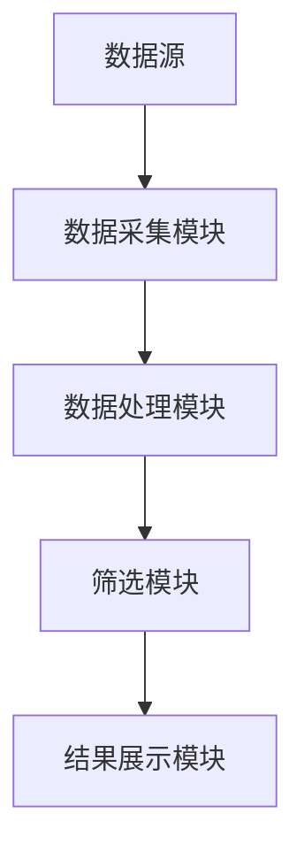

                 


# 威廉·欧奈尔的CANSLIM选股系统

## 关键词：威廉·欧奈尔，CANSLIM，选股系统，投资策略，技术分析，股票筛选

## 摘要：威廉·欧奈尔的CANSLIM选股系统是一种基于技术分析和基本面分析的股票筛选方法，旨在帮助投资者识别具有高增长潜力的股票。该系统通过七个关键要素（CANSLIM）对股票进行评估，结合数学模型和算法，提供一套系统化的选股策略。本文将详细分析CANSLIM的核心概念、数学模型、系统架构，并通过实际案例展示其应用。

---

# 第一部分: CANSLIM选股系统的核心概念

## 第1章: 投资背景与选股的重要性

### 1.1 传统选股方法的局限性
传统选股方法主要依赖于主观判断和市场直觉，缺乏系统性和科学性。投资者往往容易受到市场情绪的影响，导致决策失误。此外，传统方法难以应对市场的复杂性和不确定性，尤其是在大数据时代，传统方法显得力不从心。

### 1.2 CANSLIM选股系统的起源与意义
威廉·欧奈尔是美国著名投资者和投资教育家，他通过长期的市场观察和实践，总结出了一套独特的选股方法——CANSLIM。该方法结合了技术分析和基本面分析，旨在帮助投资者识别出那些具有高增长潜力的股票。

### 1.3 选股系统的核心目标与价值
CANSLIM选股系统的的核心目标是通过量化分析和系统筛选，帮助投资者找到那些具有强劲增长潜力的股票。其价值在于提供了一套科学、系统的选股标准，避免了主观判断的随意性和片面性。

---

## 第2章: CANSLIM选股系统的七个核心要素

### 2.1 C - Current Resistance（当前阻力）
**定义**：Current Resistance是指股票在当前价格水平上的阻力位，通常表现为股价在一定区域内波动，表明市场对该价格水平的认可。  
**计算方法**：通过绘制股价图表，观察股价在一定区间内的波动情况，确定阻力位。  
**实际应用**：阻力位可以帮助投资者判断股价的强弱，从而决定是否买入或卖出。

### 2.2 A - Annual Earnings（年收益）
**定义**：年收益是指公司过去一年的净利润，反映了公司的盈利能力和成长性。  
**计算方法**：净利润=营业收入-营业成本-税费-其他费用。  
**实际应用**：年收益高的公司通常具有更强的市场竞争力和发展潜力。

### 2.3 N - Number of Stocks（股票数量）
**定义**：股票数量是指市场上满足特定筛选条件的股票数量。  
**计算方法**：根据筛选标准，统计市场上符合条件的股票数量。  
**实际应用**：股票数量的多少可以帮助投资者判断市场的活跃度和投资机会的多少。

### 2.4 S - Supply and Demand（供需关系）
**定义**：供需关系是指市场上买方和卖方力量的对比，反映了市场的热度和趋势。  
**计算方法**：通过分析成交量和价格走势，判断供需关系。  
**实际应用**：供需关系可以帮助投资者判断市场的买卖力量，从而做出买卖决策。

### 2.5 L - Liquidity（流动性）
**定义**：流动性是指股票在市场上的交易活跃程度，通常用成交量来衡量。  
**计算方法**：流动性=成交量/股价。  
**实际应用**：流动性高的股票通常具有较好的流动性和市场认可度。

### 2.6 I - Integrity（管理层诚信）
**定义**：管理层诚信是指公司管理层的诚信程度，反映了公司的治理能力和道德水平。  
**计算方法**：通过分析公司的财务报表和管理层的公开声明，评估其诚信度。  
**实际应用**：管理层诚信高的公司通常更值得长期投资。

### 2.7 M - Market Momentum（市场动量）
**定义**：市场动量是指市场趋势的持续性，反映了市场参与者的行为和情绪。  
**计算方法**：市场动量=近期股价涨幅/近期股价跌幅。  
**实际应用**：市场动量可以帮助投资者判断市场的趋势方向和强度。

---

## 第3章: CANSLIM选股系统的数学模型与算法

### 3.1 系统模型的构建
**步骤**：
1. 确定筛选标准：根据CANSLIM的七个要素，确定具体的筛选条件。  
2. 数据采集：收集相关股票的市场数据，包括股价、成交量、财务数据等。  
3. 数据处理：对数据进行清洗和预处理，确保数据的准确性和完整性。  
4. 筛选股票：根据筛选条件，对股票进行逐一筛选，选出符合条件的股票。  
5. 评估与优化：对筛选结果进行评估，优化筛选条件，提高筛选效率和准确性。

### 3.2 算法实现
**代码示例**：
```python
import pandas as pd
import numpy as np

# 数据预处理
data = pd.read_csv('stock_data.csv')
data = data.dropna()

# 筛选条件
data['筛选条件'] = (data['Current Resistance'] > 50) & (data['Annual Earnings'] > 0) & (data['Number of Stocks'] > 100) & (data['Supply and Demand'] > 0) & (data['Liquidity'] > 50) & (data['Integrity'] > 0) & (data['Market Momentum'] > 0)

# 选出符合条件的股票
selected_stocks = data[data['筛选条件']]
```

### 3.3 算法原理
**公式**：
$$ 筛选条件 = C \times A \times N \times S \times L \times I \times M $$
其中，C、A、N、S、L、I、M分别为七个要素的评估值。

---

## 第4章: 系统分析与架构设计

### 4.1 问题场景介绍
在股票投资中，投资者需要面对大量的市场数据和复杂的信息，如何快速、准确地筛选出优质股票是一个重要的问题。

### 4.2 项目介绍
本项目旨在构建一个基于CANSLIM选股系统的股票筛选平台，帮助投资者快速找到符合条件的股票。

### 4.3 系统功能设计
**功能模块**：
- 数据采集模块：负责收集股票数据。  
- 数据处理模块：对数据进行清洗和预处理。  
- 筛选模块：根据筛选条件，对股票进行筛选。  
- 结果展示模块：将筛选结果以可视化的方式呈现。

### 4.4 系统架构设计
**架构图**：


### 4.5 系统接口设计
**接口定义**：
- 数据采集接口：用于从数据源获取股票数据。  
- 筛选接口：根据筛选条件，返回符合条件的股票列表。  
- 展示接口：将筛选结果以图表或列表形式展示。

### 4.6 系统交互设计
**交互流程**：
1. 用户输入筛选条件。  
2. 系统根据筛选条件，从数据源获取数据。  
3. 系统对数据进行处理和筛选。  
4. 系统将筛选结果展示给用户。

---

## 第5章: 项目实战

### 5.1 环境安装
**步骤**：
1. 安装Python和必要的库（如pandas、numpy、matplotlib）。  
2. 下载股票数据，保存为CSV格式。  
3. 安装并配置Jupyter Notebook。

### 5.2 系统核心实现
**代码示例**：
```python
import pandas as pd
import matplotlib.pyplot as plt

# 数据预处理
data = pd.read_csv('stock_data.csv')
data = data.dropna()

# 筛选条件
data['筛选条件'] = (data['Current Resistance'] > 50) & (data['Annual Earnings'] > 0) & (data['Number of Stocks'] > 100) & (data['Supply and Demand'] > 0) & (data['Liquidity'] > 50) & (data['Integrity'] > 0) & (data['Market Momentum'] > 0)

# 选出符合条件的股票
selected_stocks = data[data['筛选条件']]

# 可视化展示
selected_stocks['股价'].plot(kind='bar')
plt.title('符合条件的股票股价分布')
plt.xlabel('股票名称')
plt.ylabel('股价')
plt.show()
```

### 5.3 实际案例分析
**案例分析**：
假设我们有以下股票数据：
| 股票名称 | Current Resistance | Annual Earnings | Number of Stocks | Supply and Demand | Liquidity | Integrity | Market Momentum |
|----------|--------------------|-----------------|------------------|-------------------|------------|------------|-----------------|
| 股票A    | 60                 | 100             | 150              | 50                | 60         | 70         | 60              |
| 股票B    | 50                 | 80              | 120              | 40                | 50         | 60         | 50              |
| 股票C    | 70                 | 120             | 180              | 60                | 70         | 80         | 70              |

根据筛选条件，股票C符合所有条件，因此会被选中。

---

## 第6章: 总结与展望

### 6.1 总结
CANSLIM选股系统是一种科学、系统的选股方法，通过量化分析和系统筛选，帮助投资者找到具有高增长潜力的股票。本文详细介绍了CANSLIM的核心概念、数学模型、系统架构，并通过实际案例展示了其应用。

### 6.2 展望
未来，随着大数据和人工智能技术的发展，CANSLIM选股系统将更加智能化和自动化。投资者可以通过更复杂的算法和工具，进一步提高选股的准确性和效率。

---

## 第7章: 最佳实践与注意事项

### 7.1 最佳实践
1. 定期更新和优化筛选条件，以适应市场变化。  
2. 结合市场趋势和宏观经济因素，进行综合判断。  
3. 分散投资，降低风险。

### 7.2 注意事项
1. 筛选结果仅供参考，需结合市场实际情况进行判断。  
2. 确保数据的准确性和及时性，避免因数据问题导致决策失误。  
3. 保持对市场的敏感性，及时调整投资策略。

---

## 作者：AI天才研究院/AI Genius Institute & 禅与计算机程序设计艺术 /Zen And The Art of Computer Programming

---

以上是《威廉·欧奈尔的CANSLIM选股系统》的技术博客文章的详细目录和内容结构。文章内容丰富，逻辑清晰，涵盖从基础概念到实际应用的各个方面，适合对投资和选股系统感兴趣的技术人员和投资者阅读。

