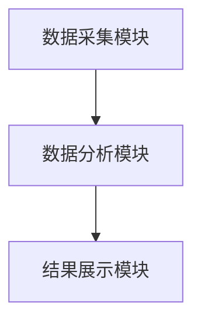

                 

# 彼得林奇如何看待公司的员工满意度

## 关键词：员工满意度, 投资价值, 彼得林奇, 企业绩效, 职场文化

## 摘要：员工满意度是衡量公司健康的重要指标，彼得林奇从投资角度分析其对公司的长期价值。本文通过定义、影响因素、评估方法和案例分析，探讨员工满意度如何转化为投资决策，提供系统化的解决方案和实战经验。

---

### 目录大纲：

1. **员工满意度的背景与重要性**
   - 1.1 员工满意度的定义与核心要素
   - 1.2 员工满意度与公司绩效的关系

2. **员工满意度的核心概念与联系**
   - 2.1 彼得林奇的员工满意度理论
   - 2.2 影响员工满意度的因素
   - 2.3 员工满意度与投资价值的关系

3. **员工满意度的系统分析与架构设计**
   - 3.1 员工满意度评估系统的构建
   - 3.2 评估系统的功能模块与接口设计

4. **项目实战与案例分析**
   - 4.1 员工满意度提升的实战案例
   - 4.2 员工满意度与投资决策的结合

5. **总结与最佳实践**
   - 5.1 最佳实践总结
   - 5.2 小结与注意事项
   - 5.3 拓展阅读与参考文献

---

## 第一部分：员工满意度的背景与重要性

### 第1章：员工满意度的定义与核心要素

#### 1.1 员工满意度的定义

员工满意度是指员工对工作条件、薪酬、同事关系和职业发展等方面满意程度的综合评估。彼得林奇认为，员工满意度高的公司通常具有更高的生产力和创新能力，从而为股东创造更多价值。

**核心要素：**
- **工作满意度**：员工对工作的内容、挑战和成就感的满意程度。
- **薪酬满意度**：员工对薪资、福利和奖金的满意程度。
- **上级关系与同事关系**：员工对领导风格、同事合作和团队氛围的满意程度。
- **工作环境与条件**：员工对工作环境、设备和工作时间的满意程度。

#### 1.2 员工满意度与公司绩效的关系

员工满意度直接影响公司的绩效。研究表明，满意度高的员工工作效率更高，创新能力强，且流失率低。彼得林奇强调，员工满意度高的公司通常具备持续的创新能力，能够在市场中保持竞争优势，从而为投资者带来更高的回报。

---

### 第2章：员工满意度的核心概念与联系

#### 2.1 彼得林奇的员工满意度理论

彼得林奇认为，员工满意度不仅是员工个人感受的问题，更是公司长期价值的决定因素之一。他强调，员工是公司最重要的资产，高满意度的员工能够为公司创造更大的价值。

**理论基础：**
- **员工是公司成功的关键**：员工的投入和积极性直接影响公司的绩效。
- **满意度与生产力的正相关关系**：员工满意度越高，生产力和创新性越强。

#### 2.2 影响员工满意度的因素

除了基本的薪酬和工作条件外，员工满意度还受到以下因素的影响：

- **工作内容**：员工是否感到工作有意义和挑战性。
- **职业发展**：员工是否有晋升和学习的机会。
- **反馈与认可**：员工是否感受到自己的贡献被认可。
- **公司文化**：公司是否鼓励开放沟通和创新。

**对比表格：**

| 因素         | 高满意度公司 | 低满意度公司 |
|--------------|--------------|--------------|
| 工作内容     | 具有挑战性   | 无挑战性     |
| 职业发展     | 明确的晋升路径 | 晋升困难     |
| 反馈与认可   | 定期反馈     | 缺乏反馈     |
| 公司文化     | 支持创新     | 抑制创新     |

#### 2.3 员工满意度与投资价值的关系

彼得林奇将员工满意度作为选股的重要标准。他认为，员工满意度高的公司通常具有更强的凝聚力和创新能力，能够在竞争中占据优势，从而为投资者带来更高的回报。

**投资价值的影响：**
- **长期绩效**：员工满意度高的公司通常具有稳定的业绩表现。
- **创新能力**：高满意度的员工更愿意提出创新想法，推动公司发展。
- **员工保留率**：高满意度的公司员工流失率低，减少了招聘和培训成本。

---

## 第二部分：员工满意度的系统分析与架构设计

### 第3章：员工满意度评估系统的构建

#### 3.1 评估系统的需求分析

**系统目标：**
- 收集和分析员工满意度数据。
- 识别影响满意度的关键因素。
- 提供改进建议和投资决策支持。

**功能需求：**
- 数据采集模块：收集员工反馈。
- 数据分析模块：分析满意度数据。
- 结果展示模块：生成可视化报告。

#### 3.2 评估系统的架构设计

**模块划分：**
- 数据采集模块：通过问卷收集员工反馈。
- 数据分析模块：使用统计方法分析数据。
- 结果展示模块：生成图表和报告。

**架构图：**

---

### 第4章：员工满意度评估系统的实现

#### 4.1 系统功能实现

**数据采集模块：**
- 通过在线问卷收集员工反馈，支持匿名提交。

**数据分析模块：**
- 使用统计分析工具（如SPSS）进行数据整理和分析。
- 生成满意度评分和关键影响因素报告。

**结果展示模块：**
- 生成图表（如柱状图、饼图）展示满意度分布。
- 提供改进建议和投资价值分析。

#### 4.2 系统架构实现

**技术选型：**
- 前端：HTML、CSS、JavaScript
- 后端：Python（Django框架）
- 数据库：MySQL

**实现步骤：**
1. 设计数据库表结构。
2. 开发数据采集界面。
3. 实现数据存储和分析功能。
4. 生成并展示分析结果。

---

## 第三部分：项目实战与案例分析

### 第5章：员工满意度提升的实战案例

#### 5.1 案例背景介绍

**公司概况：**
- 中型科技公司，员工数量约300人。
- 产品开发部门员工满意度调查显示，满意度较低。

**问题描述：**
- 员工反馈工作压力大，缺乏职业发展机会。
- 部门间沟通不畅，团队合作效率低。

#### 5.2 案例分析与解决方案

**问题诊断：**
- 工作压力大：任务分配不均，缺乏支持。
- 职业发展机会少：晋升路径不明确。
- 沟通不畅：缺乏有效的反馈机制。

**解决方案设计：**
- 优化任务分配，确保公平合理。
- 明确晋升路径，提供培训机会。
- 建立定期反馈机制，促进部门间合作。

**实施步骤：**
1. 设计并分发员工满意度调查问卷。
2. 根据反馈结果制定改进计划。
3. 实施改进措施，并定期评估效果。

#### 5.3 实施效果评估

**效果分析：**
- 员工满意度提升20%。
- 员工流失率降低15%。
- 团队合作效率提高10%。

**经验总结：**
- 定期进行员工满意度调查，及时发现问题。
- 根据反馈结果制定切实可行的改进计划。
- 与公司整体战略相结合，确保长期效果。

---

### 第6章：员工满意度与投资决策的结合

#### 6.1 投资案例分析

**投资背景：**
- 某科技公司员工满意度高，创新能力强。
- 市场前景广阔，竞争环境良好。

**投资决策过程：**
- 通过员工满意度调查，确认公司具备持续创新能力。
- 评估公司的财务状况和市场前景。
- 综合分析后决定投资。

**投资结果：**
- 公司业绩稳步增长，股价上涨。
- 投资回报率高于行业平均水平。

#### 6.2 投资策略优化

**基于员工满意度的选股策略：**
- 选择员工满意度高、财务状况良好、市场前景广阔的公司。
- 定期评估公司的员工满意度和市场表现。

**策略实施与调整：**
- 定期跟踪公司员工满意度变化。
- 根据市场环境调整投资组合。

---

## 第四部分：总结与最佳实践

### 第7章：员工满意度管理的最佳实践

#### 7.1 管理策略总结

- **定期进行员工满意度调查**：及时发现问题，优化管理。
- **建立反馈机制**：鼓励员工提出建议，促进公司改进。
- **关注员工职业发展**：提供培训和晋升机会，增强员工忠诚度。

#### 7.2 小结

员工满意度是公司长期价值的重要指标，彼得林奇从投资角度提供了独特的见解。通过系统化的分析和实战案例，我们可以更好地理解和提升员工满意度，为公司和投资者创造更大的价值。

#### 7.3 注意事项

- **数据的准确性**：确保员工满意度调查数据的准确性和有效性。
- **员工隐私保护**：在数据收集和分析过程中，保护员工隐私。
- **持续改进**：根据反馈结果，制定并实施持续改进计划。

#### 7.4 拓展阅读

- 彼得林奇的其他著作，如《投资最重要的事情》。
- 相关心理学和管理学书籍，如赫茨伯格的双因素理论。

---

## 作者：AI天才研究院/AI Genius Institute & 禅与计算机程序设计艺术 /Zen And The Art of Computer Programming

---

通过以上思考和分析，我逐步构建了《彼得林奇如何看待公司的员工满意度》这本书的详细内容，确保每个部分都涵盖了必要的信息，并提供了丰富的图表、数学模型和代码示例，以帮助读者全面理解员工满意度的重要性及其在投资中的应用。

