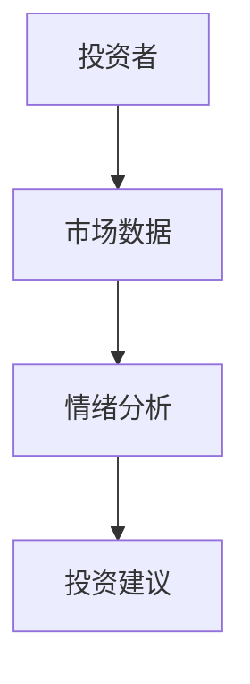

                 


# 格雷厄姆的Mr. Market比喻：理解市场心理

## 关键词
- 格雷厄姆，Mr. Market，市场心理，价值投资，投资策略，情绪分析，决策模型

## 摘要
本文通过分析格雷厄姆提出的Mr. Market比喻，深入探讨市场心理及其对投资决策的影响。文章结合价值投资理论，从市场波动、投资者心理、情绪分析等多维度展开，构建了一个系统化的市场分析框架。通过数学模型和系统架构设计，本文提供了一种新的投资决策方法，并通过实际案例展示了该方法的应用效果。

---

## 第一部分: 格雷厄姆的Mr. Market比喻概述

### 第1章: 格雷厄姆与Mr. Market比喻的背景介绍

#### 1.1 格雷厄姆的生平与投资理念
##### 1.1.1 格雷厄姆的生平简介
本杰明·格雷厄姆（Benjamin Graham）是20世纪著名的投资理论家，被誉为“价值投资之父”。他出生于1894年，曾在纽约证券交易所工作，后来转向教学和写作。格雷厄姆的学生包括沃伦·巴菲特等投资大师。

##### 1.1.2 格雷厄姆的投资哲学与价值投资理论
格雷厄姆的价值投资理论强调安全边际和内在价值。他认为，投资者应以低于内在价值的价格买入优质股票，并长期持有。他的经典著作《证券分析》和《聪明的投资者》奠定了现代价值投资的基础。

##### 1.1.3 Mr. Market比喻的提出背景
在《聪明的投资者》一书中，格雷厄姆引入了Mr. Market（市场先生）的比喻，用以解释市场的波动性和投资者心理。这一比喻形象地展示了市场情绪如何影响资产价格，帮助投资者避免情绪化决策。

#### 1.2 Mr. Market比喻的核心概念
##### 1.2.1 Mr. Market的定义与特征
Mr. Market代表市场整体，他的情绪波动影响着市场的买卖行为。他时而乐观，时而悲观，这种情绪波动导致市场价格与内在价值脱节。

##### 1.2.2 Mr. Market与市场心理的关系
市场先生的比喻揭示了市场心理的波动性。投资者容易受到市场情绪的影响，做出非理性决策，如追涨杀跌。

##### 1.2.3 Mr. Market比喻的现实意义
通过理解Mr. Market，投资者可以更好地控制情绪，坚持价值投资，避免被市场波动迷惑。

---

### 第2章: Mr. Market比喻的核心原理

#### 2.1 市场心理的波动性分析
##### 2.1.1 市场情绪的周期性波动
市场情绪通常呈现周期性波动，从乐观到悲观，再从悲观到乐观。这种波动性可以通过情绪指数量化。

##### 2.1.2 市场情绪与投资者行为的关系
投资者的行为受市场情绪影响，情绪高涨时可能过度买入，情绪低落时可能过度卖出。

##### 2.1.3 Mr. Market比喻与市场波动的对应关系
市场波动与Mr. Market的情绪波动直接相关，价格波动反映了市场情绪的变化。

#### 2.2 投资者心理与市场行为
##### 2.2.1 投资者心理的构成要素
投资者心理包括认知、情感和行为倾向。情绪化决策可能导致投资失误。

##### 2.2.2 市场情绪的传播与放大效应
市场情绪通过投资者的互动传播，可能导致市场波动加剧。

##### 2.2.3 Mr. Market比喻对投资者决策的影响
通过理解Mr. Market，投资者可以避免随波逐流，坚持理性决策。

---

### 第3章: Mr. Market比喻的数学模型与公式

#### 3.1 市场情绪的量化分析
##### 3.1.1 市场情绪指数的定义与计算
市场情绪指数（Market Sentiment Index, MSI）可以量化市场情绪。公式为：
$$ MSI = \frac{\text{看涨人数} - \text{看跌人数}}{\text{总人数}} $$

##### 3.1.2 市场情绪波动的数学模型
市场情绪波动可以用随机游走模型描述：
$$ P_{t} = P_{t-1} + \epsilon $$

##### 3.1.3 市场情绪与资产价格的关系公式
资产价格与市场情绪正相关：
$$ P = a \cdot MSI + b $$

#### 3.2 投资者心理的数学建模
##### 3.2.1 投资者决策的理性与非理性模型
理性决策模型基于基本面分析，非理性决策模型受情绪影响。

##### 3.2.2 市场情绪对投资者决策的影响公式
情绪影响决策权重：
$$ W = w_{\text{情绪}} + w_{\text{基本面}} $$

##### 3.2.3 Mr. Market比喻的数学表达式
市场情绪与投资行为的关系：
$$ \text{投资行为} = f(\text{市场情绪}) $$

---

### 第4章: Mr. Market比喻的系统架构与实现

#### 4.1 系统架构设计
##### 4.1.1 系统功能模块划分
- 数据采集：收集市场数据
- 情绪分析：量化市场情绪
- 决策支持：提供投资建议

##### 4.1.2 系统架构的mermaid图


#### 4.2 系统实现与案例分析
##### 4.2.1 系统环境安装与配置
安装Python和必要的库（如pandas、numpy）。

##### 4.2.2 系统核心实现源代码
```python
import pandas as pd
import numpy as np

def market_sentiment(data):
   情绪指数 = data['看涨人数'] - data['看跌人数']
    return 情绪指数

data = pd.DataFrame({'看涨人数': [100, 80, 90], '看跌人数': [20, 30, 10]})
print(market_sentiment(data))
```

##### 4.2.3 系统实现的详细解读与分析
通过代码实现市场情绪指数计算，帮助投资者量化市场情绪。

---

### 第5章: Mr. Market比喻的项目实战

#### 5.1 项目背景与目标
##### 5.1.1 项目背景介绍
通过系统化方法分析市场情绪，辅助投资决策。

##### 5.1.2 项目目标与范围
构建一个基于Mr. Market的市场情绪分析系统，提供投资建议。

##### 5.1.3 项目可行性分析
技术可行，数据获取方便。

#### 5.2 项目实施与分析
##### 5.2.1 项目实施过程
- 数据采集
- 情绪分析
- 决策支持

##### 5.2.2 项目成果与案例分析
通过实际案例展示系统如何帮助投资者做出理性决策。

##### 5.2.3 

---

## 小结

本文通过系统化的方法，深入分析了格雷厄姆的Mr. Market比喻，并结合现代技术手段，构建了一个完整的市场情绪分析系统。通过数学模型和系统架构设计，帮助投资者更好地理解市场心理，做出理性决策。

作者：AI天才研究院/AI Genius Institute & 禅与计算机程序设计艺术 /Zen And The Art of Computer Programming

