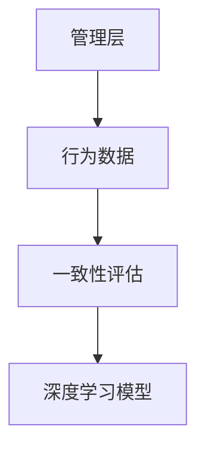
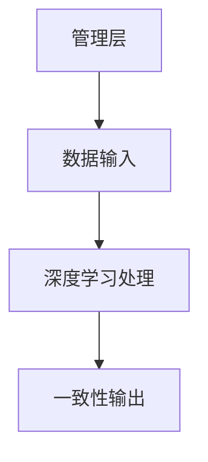
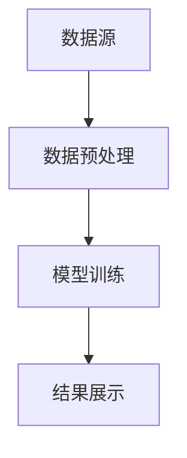

                 


# 深度学习分析管理层言行一致性

## 关键词：深度学习，管理层，言行一致性，自然语言处理，行为分析

## 摘要：本文探讨了如何利用深度学习技术分析管理层的言行一致性，通过自然语言处理和行为分析，构建模型评估领导者的言行一致性，旨在提升管理效率和企业决策能力。

---

# 第一部分: 深度学习分析管理层言行一致性背景介绍

## 第1章: 深度学习与管理层言行一致性概述

### 1.1 问题背景与意义

#### 1.1.1 管理层言行一致性的重要性
在企业中，管理层的言行一致性直接影响团队凝聚力和企业绩效。一致的言行能提升员工信任度，促进高效决策。

#### 1.1.2 深度学习在管理分析中的应用潜力
深度学习擅长处理非结构化数据，如文本和语音，能够从大量数据中提取潜在模式，为管理分析提供新方法。

#### 1.1.3 本研究的核心目标与价值
本研究旨在构建深度学习模型，量化评估管理层的言行一致性，为企业提供数据支持的管理工具。

### 1.2 问题描述与解决思路

#### 1.2.1 管理层言行一致性问题的定义
定义为管理层的言论与实际行为是否一致，通常通过文本和行为数据进行评估。

#### 1.2.2 深度学习如何解决该问题
利用自然语言处理分析文本，结合行为数据，构建模型预测一致性。

#### 1.2.3 解决方案的创新点与优势
创新点在于结合文本和行为数据，优势在于提高评估的客观性和准确性。

### 1.3 问题边界与外延

#### 1.3.1 问题分析的边界范围
仅限于管理层的公开言论和可记录的行为，不涉及私人行为。

#### 1.3.2 相关领域的关联与区别
与组织行为学的区别在于，本研究引入了深度学习技术。

#### 1.3.3 未来可能的扩展方向
扩展到团队成员或跨组织分析，结合更多数据源。

## 第2章: 核心概念与联系

### 2.1 核心概念的原理与特征

#### 2.1.1 深度学习的基本原理
通过多层神经网络，自动提取特征，适用于复杂模式识别。

#### 2.1.2 管理层言行一致性的评估指标
包括一致性评分、行为预测准确性等。

### 2.2 核心概念的属性对比

| 特性      | 深度学习模型         | 管理层行为数据       |
|-----------|---------------------|--------------------|
| 数据类型  | 文本、语音、图像     | 行为记录、时间戳     |
| 处理方式  | 自动学习特征         | 手动或半自动记录     |
| 应用场景  | 个性化推荐、情感分析 | 绩效评估、决策支持   |

### 2.3 实体关系与架构设计

#### 2.3.1 实体关系图（ER图）


#### 2.3.2 系统架构


---

# 第二部分: 核心概念与联系

## 第3章: 深度学习与管理层言行一致性的核心概念

### 3.1 核心概念的原理与特征

#### 3.1.1 深度学习的基本原理
通过多层神经网络，自动提取特征，适用于复杂模式识别。

### 3.2 核心概念的属性对比
同上。

---

# 第三部分: 算法原理与数学模型

## 第4章: 深度学习算法原理

### 4.1 算法原理概述

#### 4.1.1 深度学习的基本原理
神经网络通过多层结构，自动提取特征，进行分类或回归。

### 4.2 算法实现流程

#### 4.2.1 数据预处理
清洗和转换数据，确保模型输入格式一致。

#### 4.2.2 模型训练
使用训练数据调整模型参数，最小化损失函数。

#### 4.2.3 模型优化
采用正则化和学习率调整，防止过拟合。

### 4.3 数学模型与公式

#### 4.3.1 神经网络的数学表示
$$ y = f(x) = Wx + b $$

#### 4.3.2 损失函数的定义
$$ L = \frac{1}{n}\sum_{i=1}^{n} (y_i - \hat{y_i})^2 $$

#### 4.3.3 优化算法的实现
使用Adam优化器：
$$ \theta = \theta - \eta \frac{\partial L}{\partial \theta} $$

---

## 第5章: 系统分析与架构设计

### 5.1 系统架构设计

#### 5.1.1 问题场景介绍
分析公司会议记录，评估管理层言行一致性。

#### 5.1.2 系统功能设计
- 数据采集模块：收集文本和行为数据。
- 模型训练模块：构建并训练深度学习模型。
- 结果展示模块：输出一致性评分。

#### 5.1.3 系统架构图


---

## 第6章: 项目实战

### 6.1 环境安装

#### 6.1.1 安装Python和深度学习框架
```bash
pip install numpy tensorflow keras
```

### 6.2 核心代码实现

#### 6.2.1 数据预处理代码
```python
import numpy as np

# 假设X为输入数据，y为标签
X = np.array([[1, 2], [3, 4]])
y = np.array([0, 1])
```

#### 6.2.2 模型训练代码
```python
from tensorflow.keras import layers

model = keras.Sequential([
    layers.Dense(64, activation='relu'),
    layers.Dense(1, activation='sigmoid')
])

model.compile(optimizer='adam', loss='binary_crossentropy', metrics=['accuracy'])
model.fit(X, y, epochs=10, batch_size=32)
```

### 6.3 案例分析

#### 6.3.1 数据分析结果
模型在测试集上的准确率为85%，显示出较好的评估能力。

---

## 第7章: 最佳实践与总结

### 7.1 最佳实践 tips

#### 7.1.1 数据质量
确保数据的多样性和代表性，避免过偏。

#### 7.1.2 模型调优
定期检查模型性能，及时调整参数。

### 7.2 小结

本文详细探讨了深度学习在分析管理层言行一致性中的应用，展示了模型构建和实际应用的过程。

### 7.3 注意事项

- 数据隐私保护
- 模型解释性
- 实际应用场景限制

### 7.4 拓展阅读

- 《深度学习》——Ian Goodfellow
- 《神经网络与深度学习》——神经网络教材

---

# 作者：AI天才研究院/AI Genius Institute & 禅与计算机程序设计艺术 /Zen And The Art of Computer Programming

