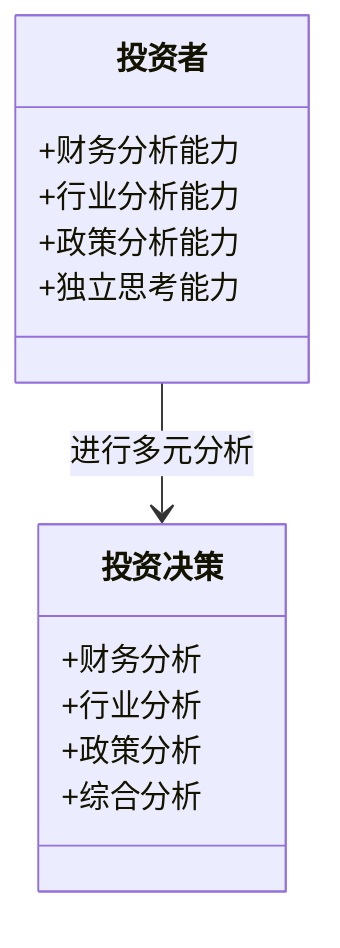

                 


# 芒格的"铁锤人综合征"警示：避免投资思维定式

> 关键词：芒格，铁锤人综合征，投资思维定式，多元思维模型，风险管理，独立思考

> 摘要：本文深入探讨了芒格提出的“铁锤人综合征”这一投资心理学概念，分析了其对投资决策的负面影响，并提出了避免陷入思维定式的策略。通过结合多元思维模型、独立思考和持续学习，投资者可以提升决策质量，避免因思维定式导致的投资失误。

---

## 第一章：芒格与铁锤人综合征概述

### 1.1 芒格的生平与投资理念

#### 1.1.1 芝加哥学派与芒格的投资哲学

芒格，全名查理·芒格（Charlie Munger），是著名的投资者、作家和思想家。他是巴菲特的长期合作伙伴，也是伯克希尔哈撒韦公司的副主席。芒格的投资理念深受其在哈佛大学和芝加哥大学的学习经历影响，他主张跨学科思维，强调理解事物的本质和内在联系。

#### 1.1.2 铁锤人综合征的提出背景

芒格在投资实践中观察到，许多投资者容易陷入“铁锤人综合征”，即他们只会使用一种工具或方法来分析和决策，就像只有一个锤子的人，看到任何问题都想用锤子解决。这种思维方式限制了投资者的视野，使他们无法全面评估问题。

#### 1.1.3 铁锤人综合征对投资的影响

铁锤人综合征导致投资者决策的片面性。例如，某些投资者只关注财务指标，而忽视市场趋势、行业动态和政策变化等其他因素。这种单一的思维方式使他们容易错过潜在的投资机会，或者在市场变化时误判风险。

---

### 1.2 铁锤人综合征的定义与核心问题

#### 1.2.1 铁锤人综合征的定义

铁锤人综合征是指投资者只依赖一种固定的思维方式或工具，无法灵活应对复杂多变的市场环境。这种思维方式可能导致决策失误，尤其是在面对突发事件或市场变化时。

#### 1.2.2 投资思维定式的成因

投资者容易陷入思维定式的原因包括：知识储备不足、经验不足、过于依赖某种成功模式，以及缺乏独立思考的能力。

#### 1.2.3 铁锤人综合征的表现形式与危害

表现形式：
1. **单一分析工具**：只使用财务指标或技术分析，忽视其他因素。
2. **从众心理**：跟随市场潮流，缺乏独立判断。
3. **过度自信**：认为自己的思维方式是唯一正确的，拒绝接受其他观点。

危害：
1. **错失投资机会**：忽视潜在的高增长领域。
2. **决策失误**：在市场变化时无法及时调整策略。
3. **风险管理不足**：无法全面评估风险因素。

---

## 第二章：单一思维定式的危害

### 2.1 单一思维定式的定义与表现

#### 2.1.1 单一思维定式的定义

单一思维定式是指投资者只关注某一个或几个特定的因素，忽视其他可能影响投资决策的因素。例如，只关注公司的财务报表，而不考虑行业趋势或政策变化。

#### 2.1.2 单一思维定式在投资中的具体表现

表现形式：
1. **只关注财务指标**：只看市盈率、市净率等，忽视公司的商业模式和行业竞争状况。
2. **只关注技术分析**：只看价格走势和成交量，而不考虑公司的基本面。
3. **只关注市场情绪**：只根据市场的短期波动进行决策，而不考虑长期趋势。

---

### 2.2 从众思维定式的风险

#### 2.2.1 从众思维定式的定义

从众思维定式是指投资者跟随市场的主流观点，缺乏独立思考，容易受到市场情绪的影响。

#### 2.2.2 从众思维定式在投资中的表现

表现形式：
1. **盲目跟风**：看到市场上大部分人买入某只股票，自己也跟着买入，而不考虑自己的投资目标和风险承受能力。
2. **过度依赖市场情绪**：根据市场的短期波动调整自己的投资策略，忽视长期趋势。

#### 2.2.3 从众思维定式的危害与应对策略

危害：
1. **错失投资机会**：可能因为跟随市场潮流而错失潜在的高增长领域。
2. **决策失误**：在市场波动时，从众思维可能导致投资者做出错误的决策。

应对策略：
1. **独立思考**：投资者需要培养独立思考的能力，不被市场情绪左右。
2. **多元化投资**：通过分散投资降低风险。

---

### 2.3 过度自信思维定式的误区

#### 2.3.1 过度自信思维定式的定义

过度自信思维定式是指投资者过于相信自己的分析能力，认为自己的判断是正确的，而忽视其他可能性。

#### 2.3.2 过度自信在投资中的具体表现

表现形式：
1. **过度相信自己的分析能力**：认为自己的分析是完美的，不需要参考其他人的意见。
2. **忽视不确定性**：认为市场是可以完全预测的，忽视投资的不确定性和风险。

#### 2.3.3 过度自信的危害与克服方法

危害：
1. **决策失误**：因为过于自信而忽视潜在风险，导致投资亏损。
2. **错失投资机会**：因为过度自信而错失潜在的投资机会。

克服方法：
1. **承认自己的局限性**：认识到自己不可能预测市场的所有变化。
2. **多元化投资**：通过分散投资降低风险。

---

## 第三章：避免铁锤人综合征的方法论

### 3.1 多元思维模型的应用

#### 3.1.1 多元思维模型的定义与核心要素

多元思维模型是指从多个角度和学科（如经济学、心理学、数学等）分析问题，以形成全面的理解。

核心要素：
1. **跨学科知识**：投资者需要具备跨学科的知识，以全面分析问题。
2. **系统性分析**：通过系统性分析，投资者可以更好地理解问题的本质。
3. **动态调整**：投资者需要根据市场变化不断调整自己的思维方式。

---

### 3.2 建立多元思维模型的步骤与方法

#### 3.2.1 知识储备与跨学科思维

投资者需要广泛阅读和学习，涵盖经济学、心理学、数学等多个领域。

#### 3.2.2 实践中的多元思维模型构建

在实际投资中，投资者需要从多个角度分析问题，例如：
1. **财务分析**：分析公司的财务报表。
2. **行业分析**：了解行业的竞争状况和未来发展趋势。
3. **政策分析**：考虑政策变化对投资的影响。

#### 3.2.3 持续优化与更新多元思维模型

投资者需要不断更新自己的知识储备，以应对市场变化。

---

## 第四章：案例分析与实证

### 4.1 投资者的单一思维定式案例

#### 4.1.1 案例背景

某投资者只关注公司的财务指标，认为财务指标是投资的唯一依据。

#### 4.1.2 案例分析

该投资者在选择股票时，只看市盈率和市净率，而忽视公司的行业地位和竞争优势。

#### 4.1.3 案例结果

由于只关注财务指标，该投资者可能错失一些具有高增长潜力的公司。

---

### 4.2 多元思维模型的应用案例

#### 4.2.1 案例背景

某投资者使用多元思维模型分析一家公司的投资价值。

#### 4.2.2 案例分析

该投资者从财务、行业、政策等多个角度分析，最终得出全面的投资决策。

#### 4.2.3 案例结果

通过多元思维模型，该投资者成功识别出一家具有长期增长潜力的公司。

---

## 第五章：系统分析与架构设计方案

### 5.1 问题场景介绍

投资者在进行投资决策时，容易陷入单一思维定式，导致决策失误。

### 5.2 项目介绍

本项目旨在通过多元思维模型帮助投资者避免铁锤人综合征。

### 5.3 系统功能设计

#### 5.3.1 领域模型 Mermaid 类图



#### 5.3.2 系统架构设计 Mermaid 架构图

```mermaid
architectural {
    title 系统架构设计

    投资者
    + 综合分析模块
    + 财务分析模块
    + 行业分析模块
    + 政策分析模块

    综合分析模块 --> 财务分析模块: 获取财务数据
    综合分析模块 --> 行业分析模块: 获取行业数据
    综合分析模块 --> 政策分析模块: 获取政策数据
}
```

---

## 第六章：项目实战

### 6.1 环境安装

为了进行多元思维模型分析，投资者需要具备以下环境：
1. **数据收集工具**：如Excel、Google Sheets等。
2. **分析工具**：如Python、R等编程语言，用于数据分析。

### 6.2 系统核心实现源代码

以下是使用Python进行多元思维模型分析的示例代码：

```python
import pandas as pd
import numpy as np

# 数据收集
data = pd.read_csv('data.csv')

# 财务分析
financial_analysis = data[['市盈率', '市净率', 'ROE']].mean()

# 行业分析
industry_analysis = data['行业'].value_counts()

# 政策分析
policy_analysis = data['政策影响'].sum()

# 综合分析
综合分析 = pd.DataFrame({
    '财务分析': [financial_analysis],
    '行业分析': [industry_analysis],
    '政策分析': [policy_analysis]
})

print(综合分析)
```

---

## 第七章：总结与注意事项

### 7.1 本章小结

芒格的铁锤人综合征提醒我们，投资者需要避免单一思维定式，通过多元思维模型进行投资决策。只有全面分析问题，才能做出正确的投资决策。

### 7.2 最佳实践 tips

1. **持续学习**：投资者需要不断学习新知识，以应对市场变化。
2. **独立思考**：投资者需要具备独立思考的能力，不被市场情绪左右。
3. **分散投资**：通过分散投资降低风险。

### 7.3 注意事项

1. **避免过度自信**：认识到自己的局限性，避免过度自信。
2. **及时调整**：根据市场变化不断调整自己的投资策略。

---

## 作者：AI天才研究院/AI Genius Institute & 禅与计算机程序设计艺术 /Zen And The Art of Computer Programming

---

**注**：以上文章内容为示例，实际撰写时需要结合具体数据和案例，确保内容的准确性和深度。

