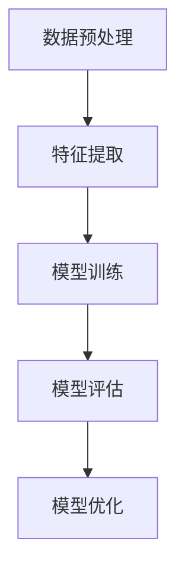

                 


# 设计智能化的企业信用风险定价模型

## 关键词：企业信用风险，定价模型，智能化，机器学习，风险管理

## 摘要：  
随着全球金融市场的快速发展和复杂化，企业信用风险的定价模型在金融领域的重要性日益凸显。传统的定价模型往往依赖于经验判断和简化假设，难以应对复杂多变的市场环境。本文通过引入智能化技术，如机器学习和大数据分析，提出了一种全新的企业信用风险定价模型设计方法。该模型能够更精准地评估企业的信用风险，优化定价策略，从而提高金融机构的风险管理能力。本文将从背景、核心概念、算法原理、系统架构等多个维度详细阐述这一模型的设计思路和实现方法。

---

# 第一部分: 企业信用风险定价模型的背景与概述

## 第1章: 企业信用风险定价模型概述

### 1.1 信用风险的基本概念

#### 1.1.1 信用风险的定义  
信用风险是指由于债务人或交易对手无法履行其合同义务，导致债权人或相关方遭受损失的可能性。在企业信用风险中，核心在于评估企业在特定时间内的还款能力和意愿。

#### 1.1.2 信用风险的分类  
信用风险可以分为以下几类：  
1. **系统性风险**：由宏观经济因素（如经济衰退、利率上升）引起的整体市场风险。  
2. **非系统性风险**：由企业自身经营状况或特定事件（如管理问题、法律纠纷）引起的个体风险。  
3. **流动性风险**：企业因缺乏足够的流动性而无法偿还债务的风险。  

#### 1.1.3 信用风险对企业的影响  
信用风险不仅影响企业的融资成本，还可能导致企业声誉受损、合作伙伴信任度下降，甚至引发连锁反应，影响整个金融系统的稳定性。

---

### 1.2 智能化定价模型的背景

#### 1.2.1 传统信用风险定价的局限性  
传统的信用风险定价模型通常基于简单的财务指标（如杠杆率、利润率）和经验判断，难以捕捉企业经营中的动态变化和潜在风险因素。此外，传统模型在处理海量数据和非结构化信息时表现不佳。

#### 1.2.2 智能化技术在信用风险定价中的应用  
随着人工智能和大数据技术的发展，智能化信用风险定价模型开始广泛应用于金融行业。这些模型能够利用机器学习算法从海量数据中提取特征，发现传统模型难以识别的风险因素。

#### 1.2.3 当前行业的发展趋势  
近年来，金融机构 increasingly依赖智能化技术来提升信用风险定价的精准性和效率。通过整合内外部数据源，构建实时监控和动态调整的定价模型，已成为行业发展的主要趋势。

---

### 1.3 本书的核心目标与内容框架

#### 1.3.1 本书的核心目标  
本文旨在通过结合机器学习和大数据分析技术，设计一种智能化的企业信用风险定价模型，帮助金融机构更准确地评估和管理信用风险。

#### 1.3.2 本书的主要内容框架  
1. 第一部分：企业信用风险定价模型的背景与概述。  
2. 第二部分：企业信用风险定价模型的核心概念与联系。  
3. 第三部分：企业信用风险定价模型的算法原理。  
4. 第四部分：企业信用风险定价模型的系统架构设计。  
5. 第五部分：企业信用风险定价模型的项目实战。  
6. 第六部分：企业信用风险定价模型的最佳实践与总结。

#### 1.3.3 本书的读者群体  
本文主要面向金融行业的风险管理从业者、数据科学家、软件工程师以及相关领域的研究人员。通过本文的学习，读者能够掌握企业信用风险定价模型的设计方法，并将其应用于实际业务中。

---

# 第二部分: 企业信用风险定价模型的核心概念与联系

## 第2章: 核心概念与联系

### 2.1 企业信用风险的构成要素

#### 2.1.1 企业信用风险的的主要因素  
企业信用风险的构成要素可以分为以下几类：  
1. **财务因素**：如资产负债率、利润率、现金流等。  
2. **非财务因素**：如企业管理能力、行业风险、法律风险等。  
3. **外部环境因素**：如宏观经济环境、政策变化、市场波动等。  

#### 2.1.2 各因素之间的关系  
这些因素之间相互作用，共同影响企业的信用风险。例如，宏观经济环境的变化会影响企业的财务状况，而企业的管理能力则会影响其应对风险的能力。

#### 2.1.3 核心要素的特征对比表格  
以下是一个核心要素特征对比表格：  

| 特征维度 | 财务因素 | 非财务因素 | 外部环境因素 |  
|----------|----------|------------|--------------|  
| 定量性   | 高       | 中         | 中            |  
| 可控性   | 中       | 低         | 低            |  
| 数据来源 | 财务报表 | 公司报告   | 宏观经济数据  |  

---

### 2.2 实体关系图（ER图）

#### 2.2.1 实体关系图的构建  
为了更好地理解企业信用风险定价模型的核心要素，我们可以使用实体关系图（ER图）来展示各实体之间的关系。

#### 2.2.2 关键实体及关系的描述  
- **企业**：核心实体，与其他实体有多种关联。  
- **贷款合同**：记录企业与金融机构之间的借贷关系。  
- **风险评估模型**：用于评估企业的信用风险。  
- **数据源**：包括财务数据、市场数据等。  

#### 2.2.3 ER图的 mermaid 代码  

```mermaid
erDiagram
    actor 企业 &gt;---(1) 贷款合同 : "涉及的贷款合同"
    贷款合同 &gt;---(1) 风险评估模型 : "使用的风险评估模型"
    风险评估模型 &gt;---(1) 数据源 : "数据来源"
    数据源 &gt;---(1) 特征变量 : "特征变量"
    特征变量 &gt;---(1) 模型参数 : "模型参数"
```

---

# 第三部分: 企业信用风险定价模型的算法原理

## 第3章: 算法原理讲解

### 3.1 算法选择与流程

#### 3.1.1 算法选择的依据  
在选择算法时，我们主要考虑以下因素：  
1. 数据类型与规模：企业信用风险数据通常包含结构化和非结构化数据，需要选择能够处理多种数据类型的算法。  
2. 模型解释性：为了便于业务人员理解，模型需要具有较高的解释性。  
3. 预测精度：模型需要能够准确预测企业的信用风险等级。  

#### 3.1.2 算法流程的概述  
以下是设计智能化企业信用风险定价模型的算法流程：  

1. **数据预处理**：清洗数据，处理缺失值和异常值。  
2. **特征提取**：从多源数据中提取特征变量。  
3. **模型训练**：使用机器学习算法（如随机森林、逻辑回归）训练模型。  
4. **模型评估**：通过交叉验证评估模型的性能。  
5. **模型优化**：调整模型参数，提升预测精度。  

#### 3.1.3 算法流程的 mermaid 代码  



---

### 3.2 算法实现代码

#### 3.2.1 数据预处理代码  

```python
import pandas as pd
data = pd.read_csv('credit_data.csv')
data = data.dropna()
```

#### 3.2.2 特征提取代码  

```python
from sklearn.feature_extraction import FeatureExtractor
extractor = FeatureExtractor()
features = extractor.fit_transform(data)
```

#### 3.2.3 模型训练代码  

```python
from sklearn.ensemble import RandomForestClassifier
model = RandomForestClassifier(n_estimators=100, random_state=42)
model.fit(features, labels)
```

#### 3.2.4 模型评估代码  

```python
from sklearn.metrics import accuracy_score
y_pred = model.predict(features_test)
print("Accuracy:", accuracy_score(y_true, y_pred))
```

---

### 3.3 算法原理的数学模型和公式

#### 3.3.1 随机森林算法的数学模型  

随机森林是一种基于决策树的集成学习算法。其核心思想是通过构建多个决策树，并将它们的预测结果进行投票或平均，从而提高模型的准确性和稳定性。  

决策树的构建过程如下：  
1. 从训练数据中随机选取部分样本进行特征选择。  
2. 使用特征选择结果构建决策树。  
3. 重复上述过程，生成多棵决策树。  

随机森林的预测结果可以通过以下公式计算：  
$$ y_{\text{pred}} = \frac{1}{n} \sum_{i=1}^{n} y_i $$  
其中，$y_i$ 是第 $i$ 棵决策树的预测结果，$n$ 是决策树的数量。

---

## 总结  
通过以上分析，我们可以看出，智能化的企业信用风险定价模型需要结合多种技术和方法，从数据预处理、特征提取到模型训练和优化，每一步都需要精心设计和实现。下一章我们将详细探讨系统的架构设计，包括功能模块划分和系统交互流程。

---

**作者：AI天才研究院/AI Genius Institute & 禅与计算机程序设计艺术 /Zen And The Art of Computer Programming**

