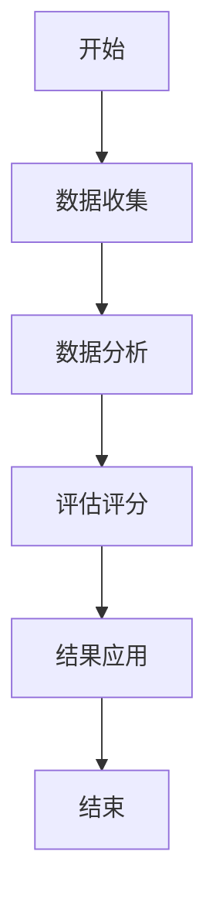
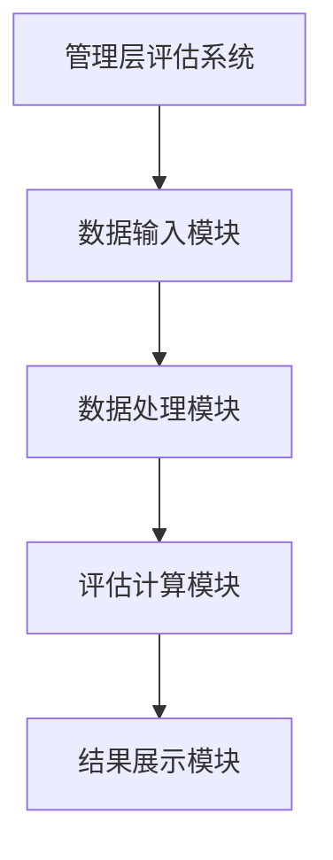
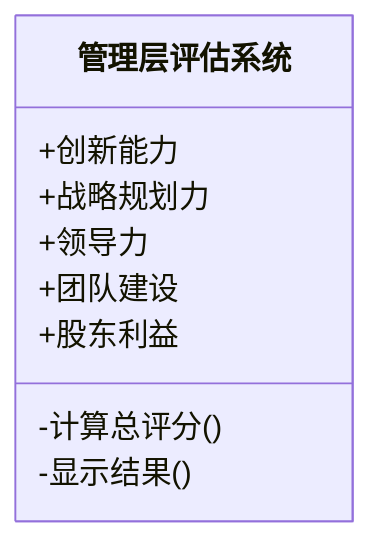

                 


# 费雪的管理层质量评估方法

> 关键词：管理层质量评估，费雪方法，企业价值，投资决策，管理层素质

> 摘要：本文系统地介绍了费雪的管理层质量评估方法，从背景介绍、核心概念、算法原理、系统架构到项目实战，全面解析了该方法在现代企业治理和投资决策中的应用价值。通过详细讲解评估框架、评分机制、系统设计和实际案例，本文为读者提供了从理论到实践的完整指南。

---

# 第1章: 费雪管理层质量评估方法的背景与意义

## 1.1 管理层质量评估的重要性

### 1.1.1 企业价值与管理层质量的关系

企业的价值不仅仅取决于财务数据，更取决于管理层的决策能力和战略眼光。管理层的质量直接影响企业的长期发展和股东价值的实现。通过科学的评估方法，投资者可以更好地识别优秀的企业管理层，从而做出更明智的投资决策。

### 1.1.2 管理层质量评估对企业投资决策的影响

在投资决策中，管理层的质量往往被忽视或低估。然而，管理层的决策能力、战略规划能力和团队建设能力直接影响企业的经营绩效。费雪的管理层质量评估方法为投资者提供了一种系统化的方法，帮助他们识别和评估企业的管理层质量。

### 1.1.3 费雪方法在现代企业中的应用价值

费雪方法作为一种经典的管理层质量评估方法，不仅适用于传统制造业，也适用于现代高科技企业和服务业。其核心思想强调管理层的长期导向和创新能力，这与现代企业治理理念高度契合。

## 1.2 费雪管理层质量评估方法的起源

### 1.2.1 费雪投资理论的形成背景

菲利普·费雪（Philip Fisher）是20世纪著名的投资理论家，他提出了“成长股投资法”。他认为，企业的长期增长潜力取决于管理层的质量和创新能力。费雪方法的核心思想是通过评估管理层的能力和战略，选择具有长期增长潜力的企业。

### 1.2.2 费雪对管理层质量的关注

费雪认为，优秀的管理层具有以下特点：强烈的股东利益导向、长期的战略规划能力、创新能力、团队建设和领导能力。他提出了一套系统的评估方法，用于衡量管理层的质量。

### 1.2.3 费雪方法的核心思想与原则

费雪方法的核心思想是通过分析企业的管理层素质，识别具有长期增长潜力的企业。其原则包括：关注管理层的战略能力、创新能力、团队建设能力以及对股东的长期利益的关注。

## 1.3 费雪方法与其他管理层评估方法的对比

### 1.3.1 费雪方法的独特性

与其他方法相比，费雪方法更注重管理层的战略能力和长期规划能力。它不仅关注财务指标，还关注管理层的软实力，如创新能力、团队建设和领导能力。

### 1.3.2 费雪方法与传统财务分析的差异

传统财务分析主要关注企业的财务数据，如收入、利润和资产负债表。而费雪方法更关注管理层的素质和能力，认为这些因素是企业长期增长的关键。

### 1.3.3 费雪方法与现代企业治理理念的契合

费雪方法的核心思想与现代企业治理理念高度契合。它强调管理层的长期导向和创新能力，这与现代企业治理的可持续发展理念一致。

## 1.4 本章小结

本章介绍了费雪管理层质量评估方法的背景和意义，分析了其与其他评估方法的差异，并总结了其在现代企业治理中的应用价值。

---

# 第2章: 费雪管理层质量评估的核心概念与框架

## 2.1 费雪方法的核心要素

### 2.1.1 管理层的五大关键素质

费雪方法认为，管理层的五大关键素质包括：创新能力、战略规划能力、团队建设能力、领导能力和对股东的长期利益的关注。

### 2.1.2 费雪方法的评估维度

费雪方法的评估维度包括：创新力、战略力、领导力、团队建设和股东利益导向。

### 2.1.3 核心概念的属性特征对比表

以下是一个对比表，展示了费雪方法中各评估维度的属性特征：

| 评估维度   | 属性特征             |
|------------|----------------------|
| 创新能力   | 是否注重创新、是否有创新能力 |
| 战略规划力 | 是否有长期战略规划、是否注重可持续发展 |
| 领导力     | 是否具备领导能力、是否能够激励团队 |
| 团队建设   | 是否注重团队建设、是否有良好的团队管理能力 |
| 股东利益   | 是否注重股东利益、是否具备长期股东价值导向 |

### 2.1.4 评估维度的权重分配

费雪方法的评估维度权重分配如下：

| 评估维度   | 权重比例 |
|------------|----------|
| 创新能力   | 30%      |
| 战略规划力 | 30%      |
| 领导力     | 20%      |
| 团队建设   | 15%      |
| 股东利益   | 5%       |

### 2.1.5 评估维度的权重分配图（使用mermaid）


## 2.2 费雪方法的评估框架

### 2.2.1 评估框架的构成

费雪方法的评估框架包括以下几个部分：数据收集、数据分析、评估评分和结果应用。

### 2.2.2 评估框架的ER实体关系图

以下是一个ER实体关系图，展示了费雪方法评估框架的核心实体关系：

```mermaid
erd
实体: 管理层评估
属性: 创新能力, 战略规划力, 领导力, 团队建设, 股东利益
关系: 评估维度, 评估指标, 评估结果
```

## 2.3 费雪方法的实施步骤

### 2.3.1 数据收集阶段

在数据收集阶段，需要收集企业的财务数据、管理层的简历、企业战略规划、团队结构和股东利益的相关信息。

### 2.3.2 数据分析阶段

在数据分析阶段，需要对收集到的数据进行整理和分析，评估每个维度的得分。

### 2.3.3 评估结果的应用阶段

评估结果的应用阶段包括根据评估结果调整投资策略、优化企业管理层结构和提升企业竞争力。

## 2.4 本章小结

本章详细介绍了费雪方法的核心概念和评估框架，分析了各评估维度的权重分配，并通过图表展示了评估框架的构成。

---

# 第3章: 费雪管理层质量评估的算法原理

## 3.1 费雪方法的评估模型

### 3.1.1 模型的输入变量

费雪方法的评估模型的输入变量包括：创新能力、战略规划力、领导力、团队建设和股东利益。

### 3.1.2 模型的输出结果

模型的输出结果是管理层质量的综合评分，评分范围为1到10分。

### 3.1.3 模型的数学表达式

费雪方法的评分公式如下：

$$
\text{总评分} = \sum (\text{各维度得分} \times \text{权重})
$$

其中，各维度得分的计算公式为：

$$
\text{维度得分} = \frac{\text{该维度的表现} - \text{该维度的最低表现}}{\text{该维度的最高表现} - \text{该维度的最低表现}}
$$

## 3.2 费雪方法的评分机制

### 3.2.1 评分标准的制定

评分标准的制定包括确定各维度的评估指标、设定各指标的评分标准和计算各维度的得分。

### 3.2.2 各维度评分的加权计算

各维度评分的加权计算公式如下：

$$
\text{总评分} = \sum (\text{维度得分} \times \text{权重})
$$

### 3.2.3 总评分的计算公式

总评分的计算公式如下：

$$
\text{总评分} = \sum (\text{维度得分} \times \text{权重})
$$

## 3.3 费雪方法的算法流程图

以下是一个使用mermaid绘制的算法流程图：



## 3.4 本章小结

本章详细介绍了费雪方法的评估模型和评分机制，通过数学公式和流程图展示了算法的实现步骤。

---

# 第4章: 费雪方法的系统分析与架构设计

## 4.1 系统需求分析

### 4.1.1 问题场景描述

在实际应用中，费雪方法需要一个高效的系统来支持数据收集、分析和评估。

### 4.1.2 系统目标与范围

系统的目标是实现费雪方法的自动化评估，范围包括数据收集、数据分析和结果展示。

### 4.1.3 系统功能需求

系统的功能需求包括：数据输入、数据处理、评估计算和结果展示。

## 4.2 系统架构设计

### 4.2.1 系统架构图

以下是一个使用mermaid绘制的系统架构图：



### 4.2.2 系统功能模块划分

系统功能模块包括：数据输入模块、数据处理模块、评估计算模块和结果展示模块。

### 4.2.3 系统功能设计（领域模型类图）

以下是一个使用mermaid绘制的领域模型类图：



## 4.3 本章小结

本章详细介绍了费雪方法的系统架构设计，包括系统架构图和领域模型类图。

---

# 第5章: 费雪方法的项目实战

## 5.1 项目介绍

### 5.1.1 项目背景

本项目旨在通过费雪方法评估某科技公司的管理层质量。

### 5.1.2 项目目标

项目的

