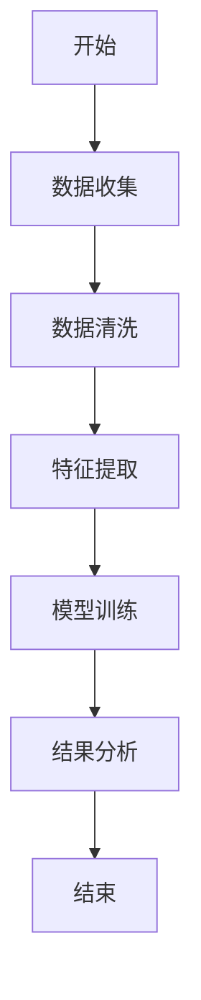
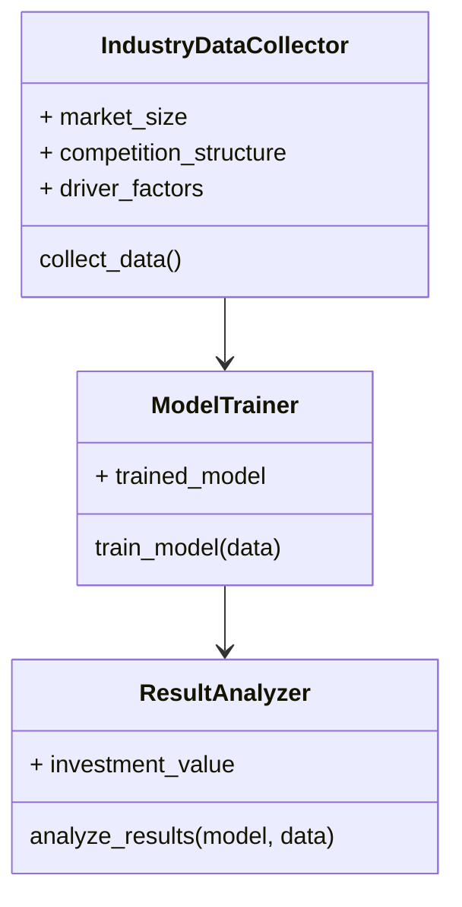

                 


# 费雪的行业趋势分析：把握未来增长机会

## 关键词：行业趋势分析，投资机会，费雪模型，技术博客，数据分析

## 摘要：  
费雪的投资理论为现代行业趋势分析提供了深刻的洞察。本文通过结合现代数据分析技术，深入探讨费雪行业趋势分析的核心概念、算法原理和实战应用，帮助读者把握未来增长机会。从理论到实践，从数据分析到系统架构，本文将为你提供一套完整的行业趋势分析方法论。

---

## 第一部分: 费雪的行业趋势分析基础

### 第1章: 费雪投资理论的背景与核心思想

#### 1.1 费雪投资理论的背景
费雪（Philip Fisher）是20世纪著名的投资专家，他提出的“成长股”投资理念对现代投资理论产生了深远影响。费雪认为，投资成功的关键在于选择那些具有持续增长潜力的企业，而这种潜力与行业趋势密切相关。

#### 1.2 费雪行业趋势分析的核心思想
费雪强调，行业趋势是企业增长的核心驱动力。他提出了以下关键观点：
- 行业生命周期理论：行业的兴衰决定了企业的命运。
- 行业竞争结构分析：竞争优势决定企业的盈利能力。
- 驱动因素识别：行业趋势的核心驱动力往往来自技术创新或市场需求。

#### 1.3 费雪投资理论的现代发展
随着大数据和人工智能技术的发展，费雪的行业趋势分析方法得到了新的扩展。现代分析工具可以帮助投资者更精准地识别行业趋势，优化投资决策。

---

## 第二部分: 行业趋势分析的核心概念与联系

### 第2章: 行业趋势分析的核心概念

#### 2.1 行业趋势的定义与特征
- 行业趋势是指行业在一定时期内表现出的总体发展方向。
- 行业趋势的特征包括周期性、连续性、可预测性和可测量性。

#### 2.2 行业生命周期理论
行业生命周期分为四个阶段：导入期、成长期、成熟期和衰退期。不同阶段的行业趋势对企业的增长潜力有不同影响。

#### 2.3 行业竞争结构分析
根据迈克尔·波特的五力模型，行业竞争结构包括新进入者的威胁、现有竞争者的强度、替代品的威胁、供应商的议价能力和买家的议价能力。

#### 2.4 行业驱动因素识别
行业趋势的核心驱动力包括技术创新、市场需求变化、政策法规、经济周期和全球化等因素。

---

## 第三部分: 费雪行业趋势分析的算法原理

### 第3章: 费雪模型的算法与数学表达

#### 3.1 费雪模型的算法流程


#### 3.2 费雪模型的数学模型
$$
\text{投资价值} = f(\text{市场容量}, \text{竞争结构}, \text{驱动因素})
$$

#### 3.3 费雪模型的实现代码
```python
def calculate_investment_value(market_size, competition_strength, driver_factors):
    # 数据预处理
    normalized_data = normalize_data(market_size, competition_strength, driver_factors)
    # 模型训练
    model = train_model(normalized_data)
    # 预测结果
    investment_value = model.predict(normalized_data)
    return investment_value
```

---

## 第四部分: 行业趋势分析的系统架构与实战

### 第4章: 系统架构与数据流分析

#### 4.1 系统功能设计


#### 4.2 数据流分析


---

## 第五部分: 项目实战与案例分析

### 第5章: 科技行业趋势分析的实战案例

#### 5.1 项目背景
以科技行业为例，分析行业趋势，识别投资机会。

#### 5.2 数据采集与处理
```python
import pandas as pd

# 数据采集
data = pd.read_csv('tech_industry_data.csv')

# 数据清洗
data.dropna(inplace=True)
data = data[~data['market_size'].isnull()]
```

#### 5.3 特征提取与模型训练
```python
from sklearn.preprocessing import StandardScaler

# 特征提取
features = data[['market_size', 'competition_strength', 'driver_factors']]
scaler = StandardScaler()
scaled_features = scaler.fit_transform(features)

# 模型训练
from sklearn.linear_model import LinearRegression
model = LinearRegression()
model.fit(scaled_features, data['investment_value'])
```

#### 5.4 结果分析
```python
# 预测结果
predicted_values = model.predict(scaled_features)
print('预测投资价值:', predicted_values[:5])
print('实际投资价值:', data['investment_value'][:5])
```

---

## 第六部分: 总结与展望

### 6.1 本章总结
费雪的行业趋势分析方法结合现代数据分析技术，为投资者提供了强大的工具。通过系统化的行业趋势分析，投资者可以更精准地识别增长机会，优化投资决策。

### 6.2 未来展望
随着人工智能和大数据技术的进一步发展，行业趋势分析将更加智能化和精准化。未来的研究方向包括动态趋势预测、多模型融合和实时数据分析。

---

## 作者：AI天才研究院/AI Genius Institute & 禅与计算机程序设计艺术 /Zen And The Art of Computer Programming

