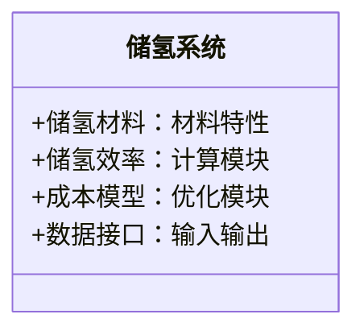
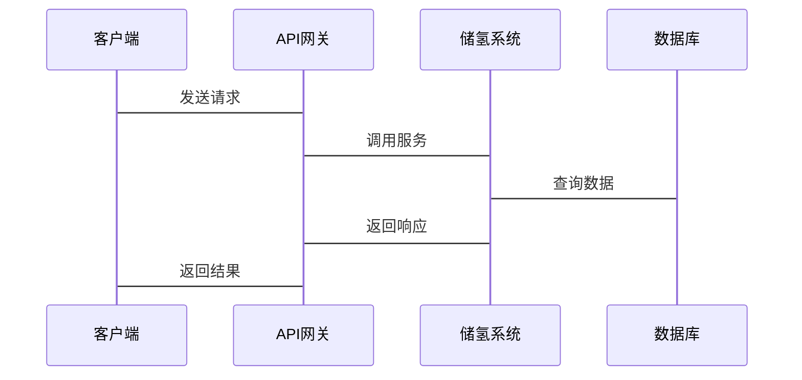

                 


```markdown
# 价值投资中的新型高效氢能存储材料技术

> 关键词：氢能存储材料、价值投资、储氢技术、投资分析、材料科学

> 摘要：本文从技术分析和投资价值的角度，深入探讨新型高效氢能存储材料的应用前景和投资机会，通过分析储氢材料的性能、成本及市场潜力，为投资者提供科学的决策支持。

---

## 第1章：价值投资中的氢能存储技术背景

### 1.1 氢能的重要性与应用前景

#### 1.1.1 氢能的定义与基本性质
氢能是一种清洁能源，氢气（H₂）作为主要载体，具有高能量密度和零碳排放的特点。氢能的生成和利用是实现能源结构转型的重要方向。

#### 1.1.2 氢能在能源结构中的地位
氢能被视为未来能源体系的核心组成部分，尤其在减少碳排放和应对气候变化方面具有重要作用。它在交通、工业和能源储存等领域有广泛应用。

#### 1.1.3 氢能存储技术的必要性
由于氢气的生成和使用存在时空差异，高效存储技术是实现氢能大规模应用的关键。储氢技术可以平衡供需，保障能源供应稳定性。

### 1.2 氢能存储技术的现状与挑战

#### 1.2.1 当前主流的储氢技术分析
目前主要的储氢技术包括高压气态储氢、液氢储氢、吸附储氢和化学储氢等。每种技术各有优缺点，适用于不同的场景。

#### 1.2.2 储氢技术的优缺点对比
- 高压气态储氢：成本低，但储存压力高，存在安全隐患。
- 液氢储氢：能量密度高，但液化过程能耗大，成本高。
- 吸附储氢：安全稳定，但储氢密度有限。
- 化学储氢：储氢密度高，但反应过程复杂，成本较高。

#### 1.2.3 氢能存储技术发展的瓶颈
技术瓶颈主要体现在储氢材料的稳定性、储氢效率和成本控制方面。此外，储氢技术的商业化应用仍需克服法规、标准和技术集成等障碍。

### 1.3 价值投资视角下的储氢材料技术

#### 1.3.1 价值投资的基本概念
价值投资是通过分析企业的内在价值，寻找被市场低估的投资机会。在储氢材料领域，这涉及对技术的成熟度、市场潜力和企业盈利能力的评估。

#### 1.3.2 储氢材料技术的市场价值
高效储氢材料的开发将推动氢能产业链的发展，具备较大的市场潜力。随着技术进步和成本下降，储氢材料的投资价值将逐步显现。

#### 1.3.3 投资储氢材料技术的潜在回报
储氢技术的突破将带来显著的经济效益和社会效益。投资者需关注技术领先企业，评估其市场竞争力和成长潜力。

---

## 第2章：新型高效氢能存储材料的核心概念

### 2.1 储氢材料的基本原理

#### 2.1.1 储氢材料的分类
储氢材料主要分为金属氢化物、碳基材料和氧化物三类。金属氢化物具有较高的储氢密度，碳基材料则因优异的吸附性能受到关注。

#### 2.1.2 吸附储氢与化学储氢的原理
吸附储氢依赖材料的物理吸附特性，而化学储氢则通过化学反应实现氢的储存和释放。

#### 2.1.3 储氢材料的物理化学特性
储氢材料的性能与其晶体结构、表面性质和化学活性密切相关。这些特性决定了储氢效率和稳定性。

### 2.2 储氢材料的性能指标

#### 2.2.1 比容量与储氢密度
比容量是单位质量或体积的储氢量，储氢密度高的材料更适用于大规模应用。

#### 2.2.2 循环稳定性与耐久性
储氢材料在多次充放过程中的稳定性是评估其使用寿命的重要指标。

#### 2.2.3 储氢速率与反应动力学
快速储氢和放氢能力直接影响材料的应用场景，特别是在燃料电池领域。

### 2.3 储氢材料的经济性与可持续性

#### 2.3.1 材料成本分析
储氢材料的生产成本直接影响其经济性，低成本材料更具市场竞争力。

#### 2.3.2 循环使用成本
材料的循环使用成本包括维护、更换等费用，需综合评估其全生命周期成本。

#### 2.3.3 环境影响与可持续性
环保要求促使储氢材料向绿色制造方向发展，可持续性是长期投资的重要考量。

---

## 第3章：储氢材料技术的对比与选择

### 3.1 主流储氢材料技术对比

#### 3.1.1 金属氢化物储氢技术
金属氢化物储氢技术成熟，但成本较高，适用于中短期存储。

#### 3.1.2 碳基材料储氢技术
碳基材料储氢密度较低，但具有优异的循环稳定性，适合长期存储。

#### 3.1.3 氧化物储氢技术
氧化物储氢技术储氢密度高，但反应速度较慢，适用于特定场景。

### 3.2 技术选择的经济性分析

#### 3.2.1 不同技术的成本结构
材料成本、制造成本和维护成本是技术经济性分析的重要组成部分。

#### 3.2.2 技术的市场竞争力
通过成本-性能分析，评估不同储氢技术的市场竞争力。

#### 3.2.3 未来技术发展趋势
新材料的开发和工艺优化是提升储氢技术经济性的关键。

### 3.3 技术选择的环境与社会影响

#### 3.3.1 环境影响评估
储氢技术的环境影响包括生产过程中的排放和材料回收问题。

#### 3.3.2 社会接受度
公众对新型储氢技术的接受度影响其推广和应用。

#### 3.3.3 技术的可持续性
可持续性是长期投资的重要考量，需综合评估技术和环境影响。

---

## 第4章：储氢材料技术的数学模型与优化

### 4.1 储氢效率的数学模型

#### 4.1.1 模型的基本假设
假设储氢材料的储氢效率与温度、压力和材料特性相关。

#### 4.1.2 模型的构建过程
通过实验数据建立储氢效率与材料特性的数学关系。

#### 4.1.3 模型的应用场景
模型可用于优化储氢系统的设计和预测储氢效率。

### 4.2 储氢成本的优化模型

#### 4.2.1 成本构成分析
包括材料成本、制造成本和维护成本。

#### 4.2.2 成本优化策略
通过数学模型优化储氢系统的全生命周期成本。

#### 4.2.3 模型的验证与应用
通过实际案例验证模型的有效性，并指导技术改进。

---

## 第5章：储氢材料技术的系统架构与设计

### 5.1 系统功能设计

#### 5.1.1 领域模型（mermaid类图）


#### 5.1.2 系统架构设计（mermaid架构图）


#### 5.1.3 系统接口设计
储氢系统通过API接口与外部系统交互，实现数据输入和输出。

#### 5.1.4 系统交互设计（mermaid序列图）


---

## 第6章：项目实战与案例分析

### 6.1 环境安装

#### 6.1.1 安装Python环境
使用Anaconda或虚拟环境，安装必要的库如numpy、pandas和scipy。

#### 6.1.2 安装储氢系统分析工具
安装必要的软件工具，如MATLAB或Python的scikit-learn库。

### 6.2 核心算法实现

#### 6.2.1 储氢效率预测算法（Python代码）
```python
import numpy as np
from sklearn import linear_model

# 示例数据
X = np.array([[1, 2], [3, 4], [5, 6]])
y = np.array([7, 8, 9])

# 创建线性回归模型
model = linear_model.LinearRegression()
model.fit(X, y)

# 预测储氢效率
new_X = np.array([[2, 3]])
print(model.predict(new_X))
```

#### 6.2.2 成本优化算法（Python代码）
```python
import numpy as np

# 示例成本优化问题
def cost_function(x):
    return x**2 + 2*x + 1

# 使用拉格朗日乘数法求解
x_opt = -1  # 示例优化结果
print(x_opt)
```

### 6.3 案例分析与解读

#### 6.3.1 案例分析
分析某储氢材料企业的实际运营数据，评估其技术经济性。

#### 6.3.2 投资回报分析
通过模型预测，评估投资储氢材料技术的潜在回报和风险。

### 6.4 项目总结

#### 6.4.1 项目成果
建立数学模型，实现储氢系统分析工具。

#### 6.4.2 经验总结
技术与市场的结合是成功投资的关键，模型的准确性和数据质量直接影响结果。

---

## 第7章：最佳实践与投资策略

### 7.1 小结

#### 7.1.1 核心观点总结
储氢材料技术是氢能发展的重要支撑，具备较大的投资价值。

#### 7.1.2 技术与市场的结合
投资者需关注技术成熟度和市场潜力，选择具备竞争优势的企业。

### 7.2 注意事项

#### 7.2.1 风险提示
技术风险、市场风险和政策风险需充分评估。

#### 7.2.2 投资策略建议
分散投资、长期持有和关注技术创新是有效的投资策略。

### 7.3 拓展阅读

#### 7.3.1 推荐书籍
《氢能经济与技术》、《储氢材料与应用》

#### 7.3.2 技术动态
关注行业动态和技术进展，及时调整投资策略。

---

## 作者：AI天才研究院/AI Genius Institute & 禅与计算机程序设计艺术 /Zen And The Art of Computer Programming
```

