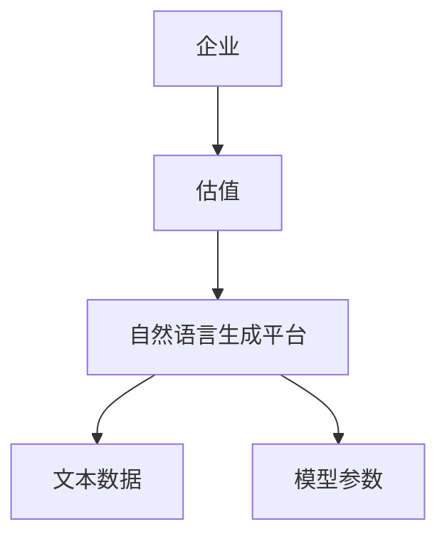
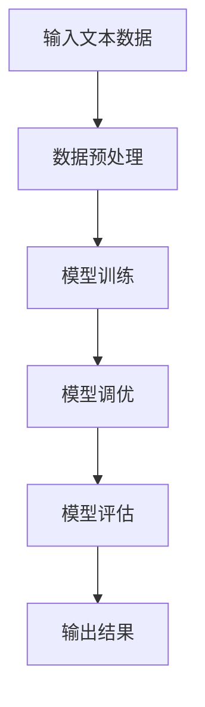

                 


# 企业估值中的AI驱动的自然语言生成平台评估

> **关键词**: 企业估值, 自然语言生成, AI驱动, 技术分析, 文本挖掘, 量化分析

> **摘要**: 本文探讨了AI驱动的自然语言生成技术在企业估值中的应用，通过分析NLP技术的优势，结合实际案例，详细讲解了如何利用这些技术提升企业估值的效率和准确性。文章从问题背景、核心概念、算法原理、系统设计到项目实战，层层深入，为读者提供了一套完整的解决方案。

---

## 正文

### 第一部分: 企业估值与AI驱动的自然语言生成平台概述

#### 第1章: 问题背景与定义

##### 1.1 问题背景

在企业估值领域，传统的估值方法主要依赖于财务数据和市场分析，但这种方法存在数据获取难度大、分析效率低、主观性强等问题。随着AI技术的发展，尤其是自然语言生成（NLP）技术的成熟，为企业估值提供了新的思路。通过分析企业财报、新闻报道等文本数据，AI驱动的NLP平台能够提取关键信息，辅助估值模型的构建。

##### 1.2 核心概念定义

- **企业估值**: 通过对企业的财务状况、市场表现等多方面因素进行分析，确定其市场价值的过程。
- **自然语言生成平台**: 利用AI技术将结构化数据转化为自然语言文本的工具，广泛应用于报告生成、数据分析等领域。
- **AI驱动的自然语言生成平台**: 将AI技术嵌入到NLP平台中，使其能够自动生成高质量的文本内容，并支持复杂的分析任务。

##### 1.3 问题解决与边界

AI驱动的NLP平台在企业估值中的应用，主要解决以下问题：
- **数据获取**: 通过自动化的文本处理，获取企业相关的非结构化数据。
- **信息提取**: 从大量文本中提取关键信息，如财务数据、市场动态等。
- **分析效率**: 提高分析效率，减少人工干预。

边界包括：
- 仅处理公开可用的文本数据，不涉及内部数据。
- 焦点在于生成文本，不涉及直接的数值计算。

#### 第2章: 核心概念与联系

##### 2.1 核心概念原理

- **NLP技术**: 包括文本预处理、关键词提取、情感分析等。
- **企业估值模型**: 依赖于财务指标、市场表现等数据。

##### 2.2 概念属性特征对比

| 概念 | 定义 | 特性 |
|------|------|------|
| NLP技术 | 处理自然语言的AI技术 | 文本理解、生成 |
| 企业估值 | 估算企业价值的过程 | 财务分析、市场分析 |

##### 2.3 ER实体关系图



### 第二部分: 算法原理讲解

#### 第3章: 算法原理概述

##### 3.1 NLP模型的基本结构

NLP模型通常包括以下步骤：
1. **文本预处理**: 分词、去除停用词。
2. **特征提取**: TF-IDF、Word2Vec。
3. **模型训练**: RNN、LSTM。
4. **模型调优**: 超参数优化。

##### 3.2 AI驱动的自然语言生成算法

- **基于规则的生成**: 通过预设规则生成文本。
- **基于统计的生成**: 利用概率模型生成文本。
- **基于深度学习的生成**: 使用Transformer模型生成文本。

#### 第4章: 算法流程图



#### 第5章: 核心算法实现

##### 5.1 代码示例

```python
from sklearn.feature_extraction.text import TfidfVectorizer

vectorizer = TfidfVectorizer()
X = vectorizer.fit_transform(documents)
```

##### 5.2 数学公式

- **TF-IDF公式**: 
  $$ \text{TF}(t, d) = \frac{\text{count}(t, d)}{\text{len}(d)} $$
  $$ \text{IDF}(t) = \log\left(\frac{N}{\text{DF}(t)}\right) $$
  $$ \text{TF-IDF}(t, d) = \text{TF}(t, d) \times \text{IDF}(t) $$

- **余弦相似度公式**:
  $$ \text{similarity} = \frac{\vec{A} \cdot \vec{B}}{|\vec{A}| |\vec{B}|} $$

### 第三部分: 系统分析与架构设计方案

#### 第6章: 系统功能设计

##### 6.1 系统组成模块

- **数据采集模块**: 采集企业财报、新闻等文本数据。
- **模型训练模块**: 训练NLP模型。
- **评估报告生成模块**: 生成估值报告。

##### 6.2 系统架构图


### 第四部分: 项目实战

#### 第7章: 项目实施

##### 7.1 环境安装

```bash
pip install numpy
pip install scikit-learn
pip install transformers
```

##### 7.2 核心代码实现

```python
from transformers import AutoTokenizer, AutoModelForMaskedLM

tokenizer = AutoTokenizer.from_pretrained('bert-base-uncased')
model = AutoModelForMaskedLM.from_pretrained('bert-base-uncased')
```

##### 7.3 实际案例分析

分析某企业财报，提取关键财务指标，生成估值报告。

#### 7.4 项目总结

通过项目实战，验证了AI驱动的NLP平台在企业估值中的有效性，提高了分析效率和准确性。

### 第五部分: 总结与展望

#### 第8章: 总结与展望

##### 8.1 总结

本文详细探讨了AI驱动的自然语言生成技术在企业估值中的应用，通过理论分析和实际案例，展示了该技术的优势和潜力。

##### 8.2 展望

未来，随着AI技术的不断发展，企业估值中的NLP应用将更加智能化和高效化。建议进一步研究多模态数据的整合，以及模型的实时更新能力。

---

**作者：AI天才研究院/AI Genius Institute & 禅与计算机程序设计艺术/Zen And The Art of Computer Programming**

---

**参考资料**:
1. 禅与计算机程序设计艺术系列
2. TF-IDF和Word2Vec相关文献
3. 最新NLP技术综述

