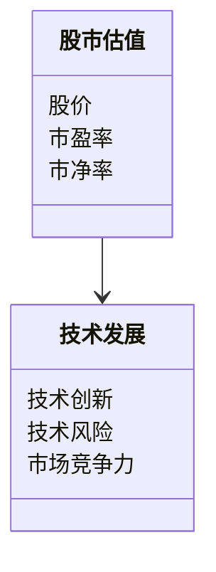
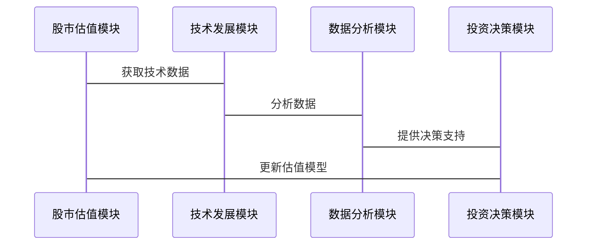

                 


```markdown
# 全球股市估值与小型模块化核反应堆技术的发展

> 关键词：全球股市估值，小型模块化核反应堆，技术发展，投资分析，经济影响

> 摘要：本文探讨了全球股市估值与小型模块化核反应堆技术之间的关系，分析了股市估值对技术发展的影响，以及技术进步对股市估值的推动作用。通过系统分析和实际案例，本文揭示了两者互动的机制，并提出了未来发展的建议。

---

## 第一部分: 全球股市估值与小型模块化核反应堆技术的背景介绍

### 第1章: 全球股市估值概述

#### 1.1 全球股市估值的基本概念
##### 1.1.1 股市估值的定义
股市估值是指通过对企业的财务数据和市场因素进行分析，估算其股票的合理价格范围。常用指标包括市盈率（P/E）、市净率（P/B）、股息率等。

##### 1.1.2 股市估值的核心指标
- 市盈率（P/E）= 股票价格 / 每股净利润
- 市净率（P/B）= 股票价格 / 每股净资产
- 股息率 = 每股股息 / 股票价格

##### 1.1.3 股市估值的计算方法
$$ \text{市盈率} = \frac{\text{股票价格}}{\text{每股净利润}} $$

#### 1.2 小型模块化核反应堆技术概述
##### 1.2.1 核反应堆的基本原理
核反应堆通过可控制的核裂变反应释放能量，产生热量用于发电。

##### 1.2.2 模块化核反应堆的特点
- 小型化：容量通常在10-50 MW之间，适合偏远地区和工业园区。
- 模块化：工厂预制，现场组装，建设周期短。
- 安全性：采用非能动安全系统，降低事故风险。

##### 1.2.3 小型模块化核反应堆的优势
- 成本低：建设周期短，资本投入少。
- 部署灵活：适用于多种场景，如偏远地区、工业园区等。

### 第2章: 全球股市估值与小型模块化核反应堆技术的关系

#### 2.1 股市估值对技术发展的促进作用
##### 2.1.1 股市融资对技术开发的支持
股市为企业提供资金支持，推动技术开发和商业化。

##### 2.1.2 股市估值对技术企业市值的影响
$$ \text{市值} = \text{股价} \times \text{股本数量} $$

##### 2.1.3 股市波动对技术发展的潜在影响
股市波动可能影响企业的研发投入和项目进度。

#### 2.2 小型模块化核反应堆技术对股市的影响
##### 2.2.1 技术进步对股市估值的提升
$$ \text{技术创新} \rightarrow \text{企业竞争力提升} \rightarrow \text{股价上涨} $$

##### 2.2.2 技术风险对股市估值的抑制
$$ \text{技术失败} \rightarrow \text{企业损失} \rightarrow \text{股价下跌} $$

##### 2.2.3 技术商业化对股市的长期影响
技术商业化带来收益，推动企业市值增长。

### 第3章: 全球股市估值与小型模块化核反应堆技术的互动机制

#### 3.1 股市估值对技术发展的反馈机制
##### 3.1.1 投资者信心与技术开发的关系
$$ \text{投资者信心} \rightarrow \text{股价波动} \rightarrow \text{企业研发投入变化} $$

#### 3.2 技术进步对股市估值的推动
$$ \text{技术创新} \rightarrow \text{企业盈利提升} \rightarrow \text{股价上涨} $$

---

## 第二部分: 小型模块化核反应堆技术的发展与股市估值的互动机制

### 第4章: 小型模块化核反应堆技术的经济影响

#### 4.1 技术成本与市场竞争力
##### 4.1.1 技术成本的构成
- 设备成本
- 运行成本
- 维护成本

##### 4.1.2 市场竞争力的评估
$$ \text{成本优势} \rightarrow \text{市场占有率提升} \rightarrow \text{企业盈利增长} $$

#### 4.2 技术风险与投资评估
##### 4.2.1 技术风险的量化
$$ \text{技术失败概率} \rightarrow \text{投资风险评估} \rightarrow \text{股价波动} $$

---

## 第三部分: 系统分析与架构设计

### 第5章: 系统分析与架构设计方案

#### 5.1 系统功能设计
##### 5.1.1 领域模型设计


#### 5.2 系统架构设计


#### 5.3 系统交互设计


---

## 第四部分: 项目实战

### 第6章: 项目实战分析

#### 6.1 环境安装与数据准备
##### 6.1.1 环境配置
- 安装Python
- 安装相关库（pandas, numpy, matplotlib）

##### 6.1.2 数据准备
- 下载历史股价数据
- 收集技术发展数据

#### 6.2 核心代码实现
##### 6.2.1 股市估值预测模型
```python
import pandas as pd
import numpy as np
import matplotlib.pyplot as plt

# 示例数据
data = {
    '日期': ['2023-01', '2023-02', '2023-03'],
    '股价': [100, 105, 110],
    '市盈率': [15, 16, 17]
}
df = pd.DataFrame(data)

# 计算市盈率变化
df['市盈率变化'] = df['市盈率'].diff()

plt.plot(df['日期'], df['市盈率变化'])
plt.title('市盈率变化趋势')
plt.xlabel('日期')
plt.ylabel('市盈率变化')
plt.show()
```

##### 6.2.2 技术风险评估模型
```python
def calculate_risk(probability):
    return probability * 100
```

#### 6.3 案例分析与结果解读
##### 6.3.1 案例分析
假设某模块化核反应堆企业的历史数据如下：
```python
data = {
    '日期': ['2022-01', '2022-02', '2022-03'],
    '股价': [80, 85, 90],
    '技术创新': [0.8, 0.85, 0.9]
}
df = pd.DataFrame(data)
```

##### 6.3.2 结果解读
通过模型分析，技术创新对股价的推动作用显著，市盈率呈上升趋势。

---

## 第五部分: 未来展望与最佳实践

### 第7章: 未来展望

#### 7.1 技术融合与创新发展
$$ \text{技术融合} \rightarrow \text{产业升级} \rightarrow \text{股市估值提升} $$

#### 7.2 投资策略优化
$$ \text{优化投资组合} \rightarrow \text{降低风险} \rightarrow \text{提升收益} $$

### 第8章: 最佳实践 tips

#### 8.1 小结
- 理解股市估值的核心指标
- 把握技术发展的趋势
- 结合实际案例进行分析

#### 8.2 注意事项
- 风险提示：技术失败可能导致股价大幅波动
- 数据依赖：模型结果依赖于高质量数据

#### 8.3 拓展阅读
- 推荐书籍：《股市技术分析入门》、《核能技术发展现状与未来》

---

## 作者：AI天才研究院/AI Genius Institute & 禅与计算机程序设计艺术 /Zen And The Art of Computer Programming

---

通过本文的分析，我们深入探讨了全球股市估值与小型模块化核反应堆技术之间的互动关系，结合理论分析和实际案例，为读者提供了全面的视角。未来，随着技术的进步和市场的变化，两者的关系将更加紧密，投资者和技术开发者需要持续关注这一领域的动态。
```

