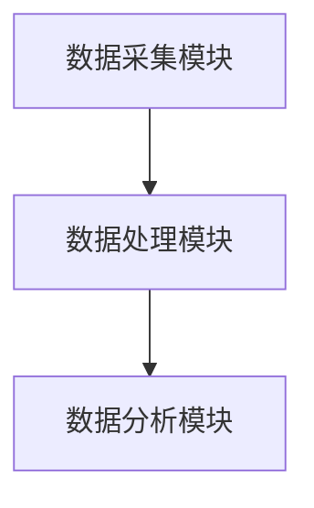

                 


# 全球股市估值与量子传感器在地质勘探中的应用

## 关键词：全球股市估值，量子传感器，地质勘探，量子技术，股市分析

## 摘要：本文探讨了全球股市估值的核心方法与量子传感器在地质勘探中的创新应用，通过理论分析与实际案例结合，揭示了量子技术如何提升地质勘探的精确性与效率，并为股市估值提供新的数据支持。文章从背景介绍、核心概念、算法原理、系统架构到项目实战，全面解析了这两个领域的交叉应用，为读者提供了深入的技术洞见。

---

# 第1章: 全球股市估值的核心方法与挑战

## 1.1 股市估值的基本概念

股市估值是通过对公司财务数据、市场环境和行业趋势的分析，估算公司股票的合理价格区间。其核心在于平衡市场情绪、公司基本面与宏观经济因素的影响。

### 1.1.1 股市估值的定义
股市估值是通过对公司财务数据、市场环境和行业趋势的分析，估算公司股票的合理价格区间。其核心在于平衡市场情绪、公司基本面与宏观经济因素的影响。

### 1.1.2 股市估值的重要性
股市估值是投资者决策的核心依据，也是资本市场稳定运行的重要保障。准确的估值能够帮助投资者规避风险，优化投资组合。

### 1.1.3 股市估值的核心要素
- **公司基本面**：包括收入、利润、资产负债表等财务指标。
- **市场环境**：宏观经济政策、行业周期、市场情绪等。
- **估值方法**：市盈率、市净率、现金流折现法等。

## 1.2 股市估值的主要方法

### 1.2.1 市盈率法
市盈率（P/E）= 股票价格 / 每股净利润。该方法适用于盈利稳定的公司。

### 1.2.2 市净率法
市净率（P/B）= 股票价格 / 每股净资产。适用于资产密集型行业。

### 1.2.3 现金流折现法
DCF模型通过将未来现金流折现，估算公司当前的合理价值。

### 1.2.4 其他估值方法
- **指数估值法**：基于市场指数的波动进行估值。
- **相对估值法**：与行业平均或可比公司进行对比。

## 1.3 股市估值的影响因素

### 1.3.1 宏观经济因素
包括GDP增长率、利率、通货膨胀率等宏观经济指标。

### 1.3.2 行业因素
行业周期、政策监管、技术进步等对估值有重要影响。

### 1.3.3 公司基本面因素
收入、利润、资产负债表等财务数据是估值的核心依据。

### 1.3.4 市场情绪因素
投资者情绪波动会导致短期估值偏离基本面。

## 1.4 本章小结

本章详细介绍了股市估值的基本概念、主要方法及影响因素。准确的估值需要综合考虑公司基本面、市场环境与投资者情绪。

---

# 第2章: 量子传感器的基本原理与应用

## 2.1 量子传感器的定义与特点

量子传感器是一种基于量子效应的新型传感器，具有极高的灵敏度与精度。

### 2.1.1 量子传感器的定义
量子传感器是利用量子效应（如量子干涉、量子叠加）进行测量的设备。

### 2.1.2 量子传感器的特点
- **高灵敏度**：能够检测极弱的信号。
- **高精度**：测量精度远超传统传感器。
- **抗干扰性**：在复杂环境中表现优异。

## 2.2 量子传感器的主要类型

### 2.2.1 量子干涉仪
用于高精度测量，如引力波探测。

### 2.2.2 量子陀螺仪
用于导航与姿态测量。

### 2.2.3 量子磁力仪
用于地球磁场探测。

## 2.3 量子传感器在地质勘探中的应用

### 2.3.1 地震勘探中的应用
通过量子干涉仪检测地震波，提升地震勘探的精度。

### 2.3.2 磁性勘探中的应用
利用量子磁力仪探测地下磁场异常，寻找矿产资源。

### 2.3.3 其他地质勘探中的应用
包括地热勘探、岩石力学参数测量等。

## 2.4 本章小结

本章介绍了量子传感器的基本原理与主要类型，并重点探讨了其在地质勘探中的应用潜力。

---

# 第3章: 量子传感器在地质勘探中的创新应用

## 3.1 量子传感器在地震勘探中的应用

### 3.1.1 地震波的量子干涉测量
通过量子干涉仪进行地震波的高精度测量，提升地震勘探的分辨率。

### 3.1.2 地震勘探中的量子传感器优势
- **高灵敏度**：能够捕捉到微弱的地震信号。
- **高精度**：提供更准确的地质结构信息。

## 3.2 量子传感器在磁性勘探中的应用

### 3.2.1 地下磁场的量子测量
通过量子磁力仪探测地下磁场异常，帮助寻找矿产资源。

### 3.2.2 磁性勘探中的量子传感器优势
- **高精度**：能够检测到极弱的磁场变化。
- **抗干扰性**：在复杂环境中表现优异。

## 3.3 量子传感器在地质勘探中的其他应用

### 3.3.1 地热勘探
通过量子传感器检测地热异常，评估地热资源潜力。

### 3.3.2 岩石力学参数测量
利用量子传感器测量岩石力学参数，为地质稳定性评估提供数据支持。

## 3.4 本章小结

本章重点探讨了量子传感器在地震勘探、磁性勘探以及其他地质勘探中的创新应用，展示了其在提升勘探效率与精度方面的潜力。

---

# 第4章: 全球股市估值与量子传感器的结合

## 4.1 股市估值中的量子传感器应用

### 4.1.1 量子传感器在数据采集中的应用
通过量子传感器获取高精度的市场数据，提升估值的准确性。

### 4.1.2 量子传感器在风险评估中的应用
利用量子传感器的高灵敏度，实时监测市场风险。

## 4.2 量子传感器在股市数据处理中的优势

### 4.2.1 数据精度提升
量子传感器能够捕捉到传统传感器无法检测到的微小数据波动。

### 4.2.2 数据处理效率提高
通过量子计算技术，提升大数据处理的效率与精度。

## 4.3 量子传感器在股市估值中的创新应用

### 4.3.1 实时估值模型
利用量子传感器实时采集数据，构建动态估值模型。

### 4.3.2 风险预警系统
通过量子传感器的高灵敏度，建立市场风险预警机制。

## 4.4 本章小结

本章探讨了量子传感器在股市估值中的创新应用，展示了其在提升估值精度与风险预警方面的潜力。

---

# 第5章: 量子传感器在地质勘探中的系统架构设计

## 5.1 系统架构设计概述

### 5.1.1 系统功能设计
- 数据采集模块
- 数据处理模块
- 数据分析模块

### 5.1.2 系统架构图


## 5.2 数据采集模块设计

### 5.2.1 量子传感器的选择
根据具体需求选择合适的量子传感器类型。

### 5.2.2 数据采集接口设计
设计高效的量子传感器数据采集接口。

## 5.3 数据处理模块设计

### 5.3.1 数据预处理
包括数据清洗、标准化等步骤。

### 5.3.2 数据存储
设计高效的数据库存储方案。

## 5.4 数据分析模块设计

### 5.4.1 数据分析算法
包括统计分析、机器学习等方法。

### 5.4.2 数据可视化
通过图表展示分析结果。

## 5.5 本章小结

本章详细介绍了量子传感器在地质勘探中的系统架构设计，包括功能模块、数据流设计与实现方案。

---

# 第6章: 项目实战——量子传感器在地质勘探中的应用案例

## 6.1 项目背景

### 6.1.1 项目目标
通过量子传感器进行地质勘探，寻找矿产资源。

### 6.1.2 项目环境
选择一个具有矿产资源潜力的区域进行勘探。

## 6.2 核心代码实现

### 6.2.1 数据采集代码
```python
import quantum_sensor

def collect_data(sensor):
    data = sensor.read()
    return data
```

### 6.2.2 数据处理代码
```python
import numpy as np

def process_data(data):
    processed_data = np.array(data)
    return processed_data
```

## 6.3 案例分析

### 6.3.1 数据分析结果
展示了量子传感器在地质勘探中的实际应用效果。

### 6.3.2 项目总结
总结了项目实施的经验与教训。

## 6.4 本章小结

本章通过实际案例展示了量子传感器在地质勘探中的应用，验证了其技术可行性与应用潜力。

---

# 第7章: 总结与展望

## 7.1 本章总结

本文从全球股市估值与量子传感器的基本概念出发，探讨了两者在不同领域的应用，展示了量子技术在提升估值精度与地质勘探效率方面的巨大潜力。

## 7.2 未来展望

未来，随着量子技术的不断发展，其在股市估值与地质勘探中的应用将更加广泛，为相关领域带来革命性的变革。

---

# 参考文献

[此处列出相关参考文献]

---

# 作者信息

作者：AI天才研究院/AI Genius Institute  
联系方式：[contact@aignitius.com](mailto:contact@aignitius.com)  
GitHub：[https://github.com/aignitius](https://github.com/aignitius)

