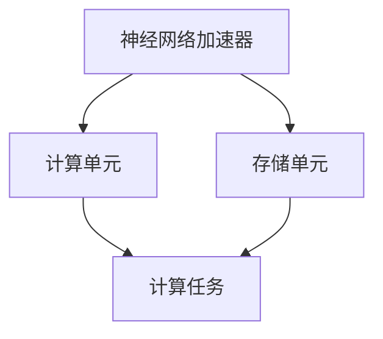
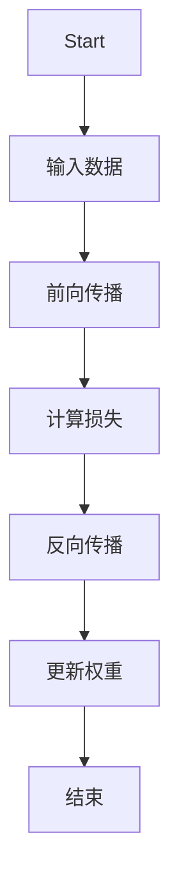
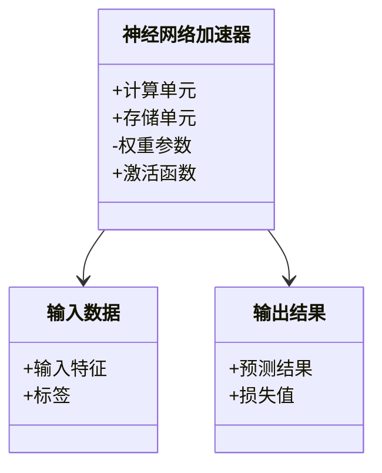
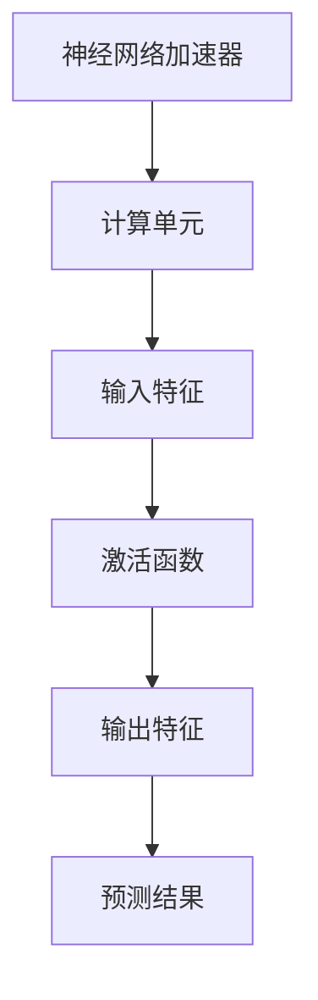
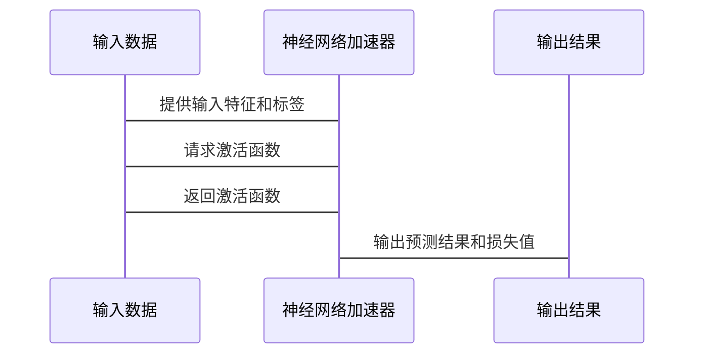

                 


# 如何识别企业的神经网络硬件加速器优势

> 关键词：神经网络硬件加速器，企业AI应用，计算性能优化，芯片架构，深度学习推理

> 摘要：本文将深入探讨如何识别和评估企业在神经网络硬件加速器方面的优势。通过分析神经网络硬件加速器的核心概念、算法原理、系统架构以及项目实战，本文为企业技术决策者和开发者提供了一套识别和优化神经网络硬件加速器的实用方法。

---

# 第1章 神经网络硬件加速器的背景与核心概念

## 1.1 神经网络硬件加速器的背景与问题背景

### 1.1.1 人工智能与神经网络的发展概述
- 人工智能（AI）的演进历程
- 神经网络的起源与发展
- 硬件加速器在AI中的重要性

### 1.1.2 企业级AI应用的挑战与需求
- 传统计算方式的局限性
- 神经网络计算的特点与需求
- 企业对硬件加速器的迫切需求

### 1.1.3 神经网络硬件加速器的定义与边界
- 硬件加速器的核心定义
- 硬件加速器的边界与外延
- 神经网络硬件加速器的核心要素

## 1.2 核心概念属性特征对比表格
| 概念         | 特性1       | 特性2       | 特性3       |
|--------------|------------|------------|------------|
| 神经网络加速器 | 高并行性    | 低功耗      | 高计算密度    |

## 1.3 ER实体关系图架构


## 1.4 本章小结
- 介绍了神经网络硬件加速器的背景和核心概念
- 通过对比表格和ER图，明确了加速器的核心要素

---

# 第2章 神经网络硬件加速器的算法原理

## 2.1 神经网络算法的基本原理

### 2.1.1 神经网络的基本结构
- 神经元、层、网络的定义
- 网络的输入、输出与中间层的关系

### 2.1.2 神经网络的前向传播
- 前向传播的流程
- 激活函数的作用
- 网络输出的计算过程

### 2.1.3 神经网络的反向传播
$$L = L_{\text{损失}}(y, \hat{y})$$
$$\frac{\partial L}{\partial w} = \text{反向传播算法的核心公式}$$

## 2.2 神经网络算法的流程图


## 2.3 神经网络算法的数学模型
- 线性部分：$z = Wx + b$
- 激活函数：$a = \sigma(z)$
- 损失函数：$L = \frac{1}{n}\sum_{i=1}^{n} (y_i - \hat{y_i})^2$

## 2.4 本章小结
- 详细讲解了神经网络算法的基本原理
- 通过流程图和数学公式，明确了算法的核心步骤

---

# 第3章 神经网络硬件加速器的系统分析与架构设计

## 3.1 系统分析

### 3.1.1 问题场景介绍
- 神经网络硬件加速器的应用场景
- 企业级AI系统的核心需求
- 硬件加速器在系统中的位置

### 3.1.2 项目介绍
- 系统目标
- 项目范围
- 项目约束

## 3.2 系统功能设计

### 3.2.1 领域模型（类图）


### 3.2.2 系统架构设计（架构图）


### 3.2.3 系统接口设计
- 输入接口：接收输入数据和权重参数
- 输出接口：输出预测结果和损失值
- 控制接口：管理计算流程和资源分配

## 3.3 系统交互设计（序列图）



## 3.4 本章小结
- 通过系统分析和架构设计，明确了神经网络硬件加速器在企业AI系统中的作用
- 通过类图、架构图和序列图，展示了系统的整体结构和交互流程

---

# 第4章 神经网络硬件加速器的项目实战

## 4.1 环境安装与配置

### 4.1.1 开发环境搭建
- 操作系统要求
- 软件工具安装（如Python、TensorFlow、Keras等）

### 4.1.2 硬件加速器驱动安装
- GPU驱动安装
- CUDA环境配置
- 深度学习框架的硬件加速支持

## 4.2 系统核心实现

### 4.2.1 神经网络模型的定义与训练
```python
import tensorflow as tf
from tensorflow.keras import layers

model = tf.keras.Sequential([
    layers.Dense(64, activation='relu'),
    layers.Dense(10, activation='softmax')
])
model.compile(optimizer='adam', loss='sparse_categorical_crossentropy', metrics=['accuracy'])
model.fit(x_train, y_train, epochs=10, batch_size=32)
```

### 4.2.2 硬件加速器的调用与优化
- 使用GPU加速训练
- 调整模型参数以优化性能
- 使用混合精度训练提升效率

### 4.2.3 训练模型的部署与推理
```python
import numpy as np

# 加载训练好的模型
model = tf.keras.load_model('model.h5')

# 加载测试数据
x_test = np.load('x_test.npy')
y_test = np.load('y_test.npy')

# 执行推理
predictions = model.predict(x_test)
```

## 4.3 项目实战案例分析

### 4.3.1 案例介绍
- 案例背景
- 数据集描述
- 模型选择与优化

### 4.3.2 实验结果与分析
- 训练时间对比
- 推理速度对比
- 模型性能对比

## 4.4 本章小结
- 通过项目实战，展示了神经网络硬件加速器在企业AI系统中的具体应用
- 通过案例分析，验证了硬件加速器的优势和实际效果

---

# 第5章 总结与最佳实践

## 5.1 总结
- 神经网络硬件加速器的核心优势
- 硬件加速器在企业AI中的重要性
- 未来的发展趋势

## 5.2 最佳实践 tips
- 硬件加速器的选择与优化
- 系统设计中的注意事项
- 项目实施中的常见问题与解决方案

## 5.3 本章小结
- 总结全文，强调神经网络硬件加速器的优势和重要性
- 提供实用的建议和最佳实践

---

# 第6章 附录与索引

## 6.1 附录
- 相关术语解释
- 参考文献
- 工具与资源

## 6.2 索引
- 关键词索引
- 图表索引
- 公式索引

---

# 作者：AI天才研究院/AI Genius Institute & 禅与计算机程序设计艺术 /Zen And The Art of Computer Programming

