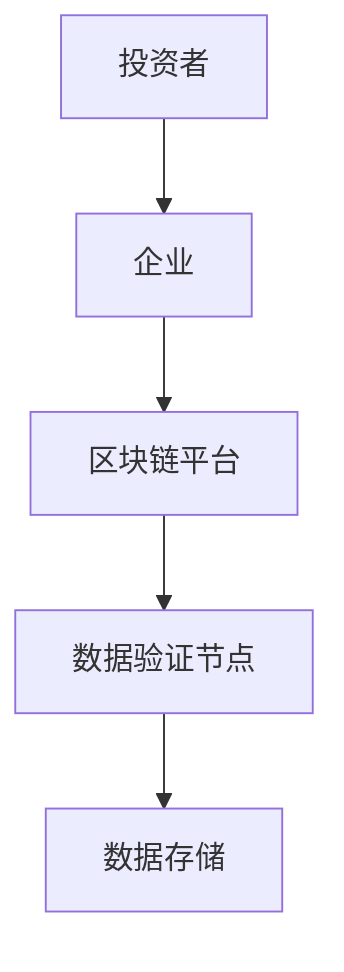
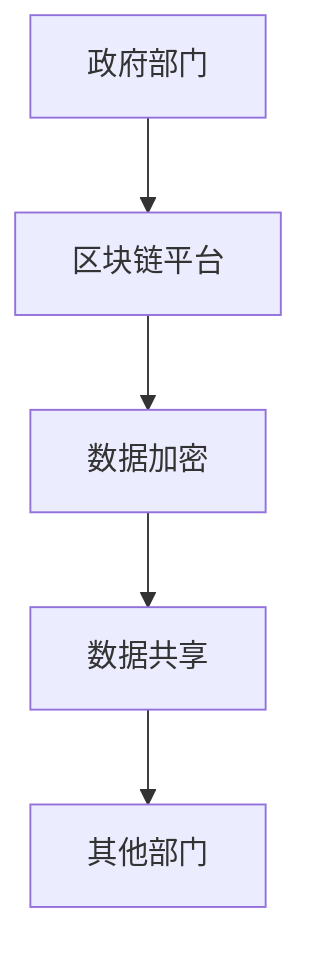

                 


# 新兴市场股市估值与智慧政务区块链应用的互动

> 关键词：新兴市场，股市估值，区块链，智慧政务，互动

> 摘要：本文探讨了新兴市场股市估值与智慧政务之间的互动关系，并分析了区块链技术在其中的关键作用。通过详细的技术分析和案例研究，本文揭示了如何利用区块链技术提高股市估值的准确性和智慧政务的透明度，同时探讨了两者互动对经济社会发展的潜在影响。

---

# 第一部分：背景介绍

## 第1章：新兴市场股市估值与智慧政务的背景

### 1.1 新兴市场的发展与挑战

#### 1.1.1 新兴市场的定义与特点
新兴市场是指那些经济快速发展但尚未完全工业化的国家或地区，如中国、印度、巴西等。这些市场具有以下特点：
- 经济快速增长
- 市场规模逐渐扩大
- 金融市场逐步成熟

#### 1.1.2 新兴市场的经济与金融环境
新兴市场的经济环境复杂多变，通常伴随着高通胀率、外汇波动和政策不确定性。这些因素对股市估值提出了更高的要求。

#### 1.1.3 新兴市场股市的独特性
新兴市场股市具有波动性高、信息不对称严重、市场参与度低等特点。这些特点使得传统的股市估值方法在新兴市场中效果有限。

### 1.2 股市估值的定义与重要性

#### 1.2.1 股市估值的基本概念
股市估值是指通过对公司财务数据、市场趋势和宏观经济指标的分析，对股票的内在价值进行评估。常见的估值方法包括市盈率（P/E）、市净率（P/B）和股息率等。

#### 1.2.2 股市估值在投资决策中的作用
股市估值是投资者进行投资决策的重要依据。准确的估值可以帮助投资者识别被低估或高估的股票，从而制定合理的投资策略。

#### 1.2.3 新兴市场股市估值的特殊性
在新兴市场，由于信息不对称和市场波动性高，传统的估值方法往往难以适用。因此，需要结合新兴市场的特点，开发更适合的估值模型。

### 1.3 智慧政务的概念与目标

#### 1.3.1 智慧政务的定义
智慧政务是指利用大数据、人工智能和区块链等技术，优化政府服务流程，提高政务服务的效率和透明度。

#### 1.3.2 智慧政务的核心目标
智慧政务的核心目标是实现政务服务的智能化、数据化和透明化，从而提升政府服务的质量和效率。

#### 1.3.3 智慧政务与传统政务的区别
与传统政务相比，智慧政务更加注重数据的共享和利用，强调技术驱动的服务创新。

### 1.4 区块链技术的定义与特点

#### 1.4.1 区块链的基本概念
区块链是一种分布式账本技术，通过去中心化的方式记录和验证数据，确保数据的安全性和不可篡改性。

#### 1.4.2 区块链的核心特点
- 去中心化
- 不可篡改
- 可追溯
- 高效透明

#### 1.4.3 区块链的优势与劣势
区块链的优势在于其安全性和透明性，劣势在于其技术复杂性和去中心化带来的治理挑战。

---

## 第2章：新兴市场股市估值与智慧政务的互动关系

### 2.1 股市估值与智慧政务的互动背景

#### 2.1.1 新兴市场股市估值的波动性
新兴市场股市的波动性较高，受政策、经济和市场情绪等多种因素影响。这种波动性为智慧政务的实施带来了挑战和机遇。

#### 2.1.2 智慧政务在新兴市场的应用
随着新兴市场国家对数字化转型的重视，智慧政务的应用逐渐普及。区块链技术在智慧政务中的应用，为股市估值提供了新的数据来源和技术支持。

#### 2.1.3 两者互动的潜在影响
股市估值与智慧政务的互动可能影响市场的稳定性和政府的决策效率。例如，政府可以通过智慧政务平台实时获取市场数据，从而制定更精准的政策。

### 2.2 区块链技术在股市估值与智慧政务中的作用

#### 2.2.1 区块链在股市估值中的应用
区块链技术可以用于实时记录和追踪企业的财务数据，确保数据的真实性和准确性。这为股市估值提供了更可靠的基础。

#### 2.2.2 区块链在智慧政务中的应用
区块链技术可以用于政务数据的共享和管理，提高政府服务的透明度和效率。例如，政府可以通过区块链技术实现电子身份认证和数据共享。

#### 2.2.3 区块链技术对两者互动的促进作用
区块链技术通过提供安全的数据共享和实时数据分析，促进了股市估值与智慧政务的互动。例如，政府可以通过区块链平台实时获取企业的财务数据，从而更精准地制定相关政策。

### 2.3 互动关系的核心概念与联系

#### 2.3.1 核心概念的原理
- 区块链技术通过去中心化和不可篡改的特性，确保了数据的安全性和真实性。
- 智慧政务通过区块链技术实现数据的高效共享和利用，提高了政务服务的效率和透明度。

#### 2.3.2 核心概念的属性特征对比表格

| 属性 | 股市估值 | 智慧政务 | 区块链技术 |
|------|---------|----------|------------|
| 目标 | 评估股票价值 | 提高政务服务效率 | 提供安全的数据存储和共享 |
| 数据来源 | 企业财务数据、市场数据 | 政府数据、企业数据 | 分布式账本、智能合约 |
| 技术支持 | 传统估值模型 | 大数据、人工智能 | 区块链、智能合约 |

#### 2.3.3 ER实体关系图架构的 Mermaid 流程图

```mermaid
erDiagram
    actor 投资者 {
        string 投资者ID
        string 账户余额
    }
    actor 政府机构 {
        string 政府ID
        string 政策数据
    }
    actor 企业 {
        string 企业ID
        string 财务数据
    }
    database 区块链账本 {
        string 区块哈希
        string 交易记录
    }
    投资者 --> 区块链账本 : 提交交易
    政府机构 --> 区块链账本 : 提交政策数据
    企业 --> 区块链账本 : 提交财务数据
```

---

## 第3章：区块链技术的基本原理

### 3.1 区块链的定义与核心组件

#### 3.1.1 区块链的基本概念
区块链是一种分布式账本技术，通过去中心化的方式记录和验证数据，确保数据的安全性和不可篡改性。

#### 3.1.2 区块链的核心组件
- 分布式网络：节点通过点对点网络连接，确保数据的分散存储和传输。
- 区块：数据以区块的形式存储，每个区块包含交易记录和时间戳。
- 共识机制：通过共识机制（如工作量证明、权益证明）确保所有节点达成一致。
- 智能合约：通过智能合约实现自动化的数据处理和交易。

#### 3.1.3 区块链的共识机制
共识机制是区块链的核心，确保所有节点达成一致。常见的共识机制包括工作量证明（PoW）、权益证明（PoS）和实用拜占庭容错（PBFT）等。

---

### 3.2 区块链的共识机制

#### 3.2.1 工作量证明机制
工作量证明机制通过计算哈希值来验证区块的有效性，确保网络的安全性。然而，这种方式需要大量的计算资源，且容易受到“算力攻击”。

#### 3.2.2 权益证明机制
权益证明机制通过持有代币的数量来决定节点的权重，减少对计算资源的需求。这种方式更加节能，但也面临“富者愈富”的问题。

#### 3.2.3 其他共识机制
其他共识机制包括实用拜占庭容错（PBFT）和 delegated proof-of-stake（DPoS）等。这些机制在不同的场景下有不同的表现。

---

### 3.3 区块链的智能合约

#### 3.3.1 智能合约的定义
智能合约是区块链上的自动化程序，可以根据预设的条件自动执行交易和数据处理。

#### 3.3.2 智能合约的工作原理
智能合约通过区块链平台编译和部署，运行在虚拟机中，响应外部事件并执行相应的逻辑。

#### 3.3.3 智能合约的应用场景
智能合约在金融、供应链管理和政务服务等领域有广泛应用。例如，智能合约可以自动执行股票交易的条件，确保交易的透明性和安全性。

---

## 第4章：区块链在股市估值中的应用

### 4.1 区块链在股市数据采集中的应用

#### 4.1.1 数据采集的挑战
传统的数据采集方式容易受到信息不对称和数据造假的影响，导致估值结果的偏差。

#### 4.1.2 区块链在数据采集中的优势
区块链通过分布式账本和智能合约技术，确保数据的实时性和真实性。例如，企业可以将财务数据实时上传到区块链平台，确保数据的透明和不可篡改。

#### 4.1.3 数据采集的流程图



---

## 第5章：区块链在智慧政务中的应用

### 5.1 区块链在政务数据共享中的应用

#### 5.1.1 政务数据共享的挑战
传统的政务数据共享方式容易受到信息孤岛和数据隐私的限制，导致数据利用率低。

#### 5.1.2 区块链在数据共享中的优势
区块链通过分布式账本和加密技术，确保数据的安全共享和利用。例如，政府可以通过区块链平台实现不同部门之间的数据共享，提高政务服务的效率。

#### 5.1.3 数据共享的流程图



---

## 第6章：互动关系中的技术与实践

### 6.1 区块链在互动中的技术挑战

#### 6.1.1 数据安全与隐私保护
在互动中，如何保护数据的安全和隐私是一个重要的挑战。需要通过同态加密和零知识证明等技术来实现数据的安全共享。

#### 6.1.2 智能合约的可编程性
智能合约的可编程性是实现互动的关键。需要通过优化智能合约的代码和增加更多的功能模块，来提高智能合约的可编程性。

#### 6.1.3 区块链的可扩展性
随着互动规模的扩大，区块链的可扩展性问题将更加突出。需要通过优化共识机制和采用分片技术来提高区块链的处理能力。

---

## 第7章：总结与展望

### 7.1 总结

通过本文的分析，我们可以看到区块链技术在新兴市场股市估值与智慧政务中的重要作用。区块链技术通过提供安全的数据共享和高效的数据处理，促进了两者之间的互动，提高了市场的稳定性和政府的决策效率。

### 7.2 未来展望

未来，随着区块链技术的不断发展，新兴市场股市估值与智慧政务的互动将更加紧密。例如，通过链上治理和人工智能的结合，可以实现更加智能化的政务服务和股市估值。同时，区块链技术在数据隐私和安全性方面的突破，将为互动关系的发展提供更多可能性。

---

# 第八章：最佳实践与未来研究方向

## 8.1 最佳实践

- **数据安全**：在互动中，应优先考虑数据的安全和隐私保护，采用同态加密和零知识证明等技术。
- **智能合约的优化**：通过优化智能合约的代码和增加更多的功能模块，提高智能合约的可编程性。
- **链上治理**：建立链上治理体系，确保区块链网络的安全和稳定。

## 8.2 未来研究方向

- **区块链的可扩展性**：研究如何通过分片技术和优化共识机制，提高区块链的处理能力。
- **人工智能与区块链的结合**：探索人工智能在区块链中的应用，例如智能合约的自动化优化和数据的智能分析。
- **链上治理**：研究链上治理的实现方式和应用场景，为区块链网络的长期稳定提供保障。

---

# 作者：AI天才研究院 & 禅与计算机程序设计艺术

本文由AI天才研究院（AI Genius Institute）与“禅与计算机程序设计艺术”（Zen And The Art of Computer Programming）联合撰写，转载请注明出处。

